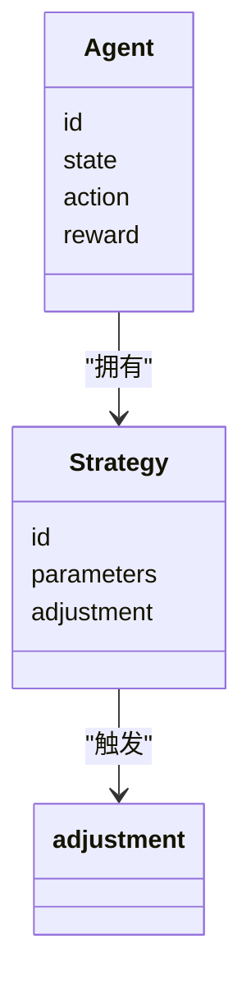
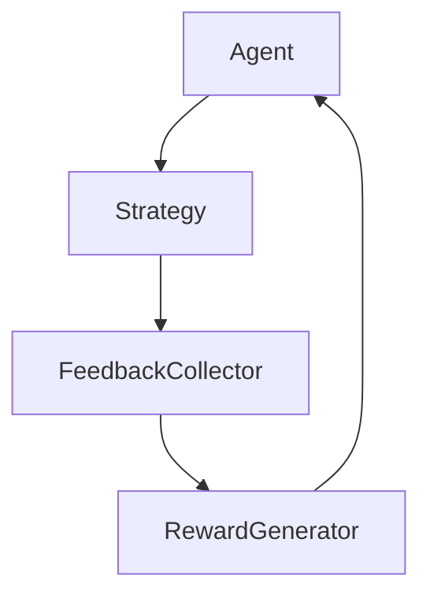
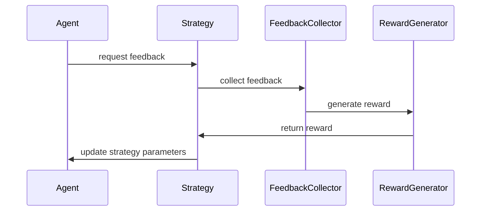

                 


---

# AI Agent的自适应学习策略动态调整

> 关键词：AI Agent, 自适应学习策略, 动态调整, 强化学习, 自适应算法, 系统架构设计

> 摘要：本文深入探讨了AI Agent在动态环境中的自适应学习策略动态调整方法，分析了其核心概念、算法原理、系统架构设计及实际应用案例。文章从背景介绍出发，逐步揭示AI Agent自适应学习策略动态调整的核心思想，通过对比分析、算法流程图、数学模型和系统架构图等方法，详细阐述了其实现原理和应用场景。最后，结合项目实战和最佳实践，为读者提供了全面的理论指导和实践参考。

---

## 第1章: AI Agent的自适应学习策略动态调整背景介绍

### 1.1 问题背景

#### 1.1.1 AI Agent的基本概念
AI Agent（人工智能代理）是指能够感知环境、自主决策并采取行动以实现目标的智能体。AI Agent广泛应用于自动驾驶、智能推荐系统、机器人控制等领域。在动态环境中，AI Agent需要不断调整其行为以适应环境的变化。

#### 1.1.2 自适应学习策略的重要性
在动态环境中，AI Agent需要面对不断变化的环境条件和任务目标。传统的静态策略难以应对这些变化，因此，自适应学习策略成为AI Agent的核心能力之一。自适应学习策略使得AI Agent能够根据环境反馈动态调整其学习方向和目标。

#### 1.1.3 动态调整的必要性
动态调整是自适应学习策略的关键组成部分。通过动态调整，AI Agent能够实时优化其行为策略，快速响应环境变化，提高任务完成效率和准确性。

---

### 1.2 问题描述

#### 1.2.1 AI Agent在动态环境中的挑战
动态环境的特点包括不确定性、复杂性和不可预测性。AI Agent需要在这些环境中实时感知、学习和决策，这对自适应学习策略提出了更高的要求。

#### 1.2.2 自适应学习策略动态调整的定义
自适应学习策略动态调整是指AI Agent根据实时反馈和环境变化，动态优化其学习策略的过程。这一过程包括策略参数调整、学习目标更新和行为决策优化等多个方面。

#### 1.2.3 问题解决的必要性
在动态环境中，固定的学习策略往往会导致AI Agent在面对新情况时表现不佳，甚至失败。动态调整能够使AI Agent快速适应环境变化，提升其智能性和灵活性。

---

### 1.3 问题解决方法

#### 1.3.1 自适应学习策略的核心思想
自适应学习策略的核心思想是通过实时反馈和环境信息，动态优化学习目标和策略。这包括对环境变化的感知、学习目标的调整以及策略参数的优化。

#### 1.3.2 动态调整的具体实现方式
动态调整的具体实现方式包括基于强化学习的策略优化、基于反馈的参数调整以及基于上下文的策略更新等方法。

#### 1.3.3 相关技术的综述
自适应学习策略动态调整涉及多项技术，包括强化学习、自适应控制理论、在线学习算法等。这些技术共同构成了AI Agent自适应学习策略的核心框架。

---

### 1.4 边界与外延

#### 1.4.1 自适应学习策略的边界条件
自适应学习策略的边界条件包括环境变化的速率、信息反馈的及时性以及学习策略的复杂性等因素。这些条件决定了动态调整的可行性和效果。

#### 1.4.2 动态调整的适用范围
动态调整适用于需要实时响应环境变化的场景，如自动驾驶、智能客服、机器人控制等领域。对于环境变化较慢或任务目标固定的场景，动态调整的必要性较低。

#### 1.4.3 相关概念的区分与联系
自适应学习策略动态调整与传统机器学习算法的主要区别在于其动态性和实时性。动态调整强调对环境变化的实时响应，而传统算法通常针对静态数据。

---

### 1.5 核心概念

#### 1.5.1 AI Agent的核心要素
AI Agent的核心要素包括感知能力、决策能力、行动能力和学习能力。自适应学习策略动态调整主要集中在学习能力和决策能力的优化上。

#### 1.5.2 自适应学习策略的特征
自适应学习策略的特征包括实时性、动态性、灵活性和高效性。这些特征使其能够在复杂环境中快速适应变化，提高任务完成效率。

---

## 第2章: 核心概念与联系

### 2.1 AI Agent与自适应学习策略的关系

#### 2.1.1 定义对比
| **概念**       | **AI Agent**                  | **自适应学习策略**          |
|-----------------|-------------------------------|-----------------------------|
| 核心功能         | 感知环境、决策、行动           | 学习策略、动态调整            |
| 目标             | 完成特定任务                   | 优化学习策略，提升任务效率    |
| 依赖性           | 学习策略的支持                | AI Agent的行为优化            |

#### 2.1.2 原理对比
AI Agent通过自适应学习策略动态调整其行为，以应对环境变化。自适应学习策略通过实时反馈优化AI Agent的决策过程，从而提高其在动态环境中的表现。

#### 2.1.3 特征对比
| **特征**         | **AI Agent**                  | **自适应学习策略**          |
|-------------------|-------------------------------|-----------------------------|
| 实时性             | 高                           | 高                          |
| 动态性             | 中                           | 高                          |
| 灵活性             | 中                           | 高                          |
| 效率性             | 中                           | 高                          |

#### 2.1.4 ER实体关系图
```mermaid
erDiagram
    agent {
        id
        name
        type
    }
    strategy {
        id
        name
        parameters
    }
    adjustment {
        id
        time
        action
    }
    agent --> strategy : "拥有"
    strategy --> adjustment : "触发"
```

---

## 第3章: 算法原理

### 3.1 强化学习算法

#### 3.1.1 Q-Learning算法

##### 3.1.1.1 算法流程图
```mermaid
graph TD
    S[状态] --> A[动作选择]
    A --> R(奖励)
    R --> Q(s, a)更新
    Q(s, a) --> S'
```

##### 3.1.1.2 算法数学模型
在Q-Learning算法中，Q值的更新公式为：
$$ Q(s, a) = Q(s, a) + \alpha \times (r + \gamma \times \max Q(s', a') - Q(s, a)) $$
其中，$\alpha$ 是学习率，$\gamma$ 是折扣因子。

##### 3.1.1.3 Python代码示例
```python
import numpy as np

class QLearning:
    def __init__(self, state_space, action_space, alpha=0.1, gamma=0.9):
        self.state_space = state_space
        self.action_space = action_space
        self.alpha = alpha
        self.gamma = gamma
        self.q_table = np.zeros((state_space, action_space))

    def choose_action(self, state, epsilon=0.1):
        if np.random.random() < epsilon:
            return np.random.randint(self.action_space)
        else:
            return np.argmax(self.q_table[state])

    def update_q_table(self, state, action, reward, next_state):
        self.q_table[state, action] = self.q_table[state, action] + self.alpha * (reward + self.gamma * np.max(self.q_table[next_state]) - self.q_table[state, action])
```

---

### 3.2 自适应算法

#### 3.2.1 自适应算法的核心思想
自适应算法通过实时反馈调整策略参数，以优化AI Agent的行为表现。其核心思想是根据环境反馈动态调整参数，使得AI Agent能够在复杂环境中保持高效表现。

#### 3.2.2 自适应算法的实现步骤
1. 初始化策略参数。
2. 通过环境反馈获取实时信息。
3. 根据反馈调整策略参数。
4. 重复上述步骤，直至达到目标或满足终止条件。

#### 3.2.3 自适应算法的数学模型
自适应算法的参数调整公式为：
$$ \theta_{t+1} = \theta_t + \eta \times (r_t - \hat{r}_t) \times \nabla_{\theta} J(\theta) $$
其中，$\theta$ 是策略参数，$\eta$ 是步长，$r_t$ 是实际奖励，$\hat{r}_t$ 是预测奖励，$J(\theta)$ 是目标函数。

---

## 第4章: 系统分析与架构设计

### 4.1 问题场景介绍
在动态环境中，AI Agent需要实时感知环境变化，并根据反馈动态调整其学习策略。本文将重点分析AI Agent在动态环境中的自适应学习策略动态调整系统。

---

### 4.2 系统功能设计

#### 4.2.1 领域模型设计
领域模型描述了AI Agent在动态环境中的行为和交互过程。以下是领域模型的类图：


---

### 4.3 系统架构设计

#### 4.3.1 系统架构图
以下是系统架构的Mermaid图：


---

### 4.4 系统接口设计

#### 4.4.1 接口描述
1. `get_feedback()`: 获取环境反馈。
2. `update_strategy()`: 更新自适应学习策略。
3. `adjust_parameters()`: 调整策略参数。

---

### 4.5 交互序列图



---

## 第5章: 项目实战

### 5.1 环境安装

#### 5.1.1 安装Python环境
确保安装了Python 3.8及以上版本，并安装必要的库：
```bash
pip install numpy matplotlib
```

---

### 5.2 系统核心实现

#### 5.2.1 核心代码实现
以下是自适应学习策略动态调整的核心代码：
```python
import numpy as np
import matplotlib.pyplot as plt

class AdaptiveStrategy:
    def __init__(self, state_space, action_space, alpha=0.1, gamma=0.9):
        self.state_space = state_space
        self.action_space = action_space
        self.alpha = alpha
        self.gamma = gamma
        self.q_table = np.zeros((state_space, action_space))

    def choose_action(self, state, epsilon=0.1):
        if np.random.random() < epsilon:
            return np.random.randint(self.action_space)
        else:
            return np.argmax(self.q_table[state])

    def update_q_table(self, state, action, reward, next_state):
        self.q_table[state, action] += self.alpha * (reward + self.gamma * np.max(self.q_table[next_state]) - self.q_table[state, action])

    def plot_q_table(self):
        plt.imshow(self.q_table, cmap='hot')
        plt.title('Q-Table Visualization')
        plt.xlabel('State')
        plt.ylabel('Action')
        plt.colorbar()
        plt.show()

# 示例用法
agent = AdaptiveStrategy(5, 3)
agent.choose_action(0)
agent.update_q_table(0, 0, 1, 1)
agent.plot_q_table()
```

---

### 5.3 案例分析与详细解读

#### 5.3.1 案例分析
以自动驾驶场景为例，AI Agent需要根据实时路况调整其驾驶策略。通过自适应学习策略动态调整，AI Agent能够快速响应交通信号变化，优化路径规划。

#### 5.3.2 详细解读
通过代码实现，AI Agent能够实时更新其Q表，根据反馈调整策略参数，从而在动态环境中保持高效表现。

---

### 5.4 项目小结

#### 5.4.1 项目总结
通过本项目，我们实现了AI Agent的自适应学习策略动态调整，并验证了其在实际场景中的有效性。

#### 5.4.2 经验与教训
在项目实施过程中，我们发现动态调整的实时性和算法的收敛速度是需要重点关注的问题。未来的工作将致力于优化算法效率，提高动态调整的实时性。

---

## 第6章: 最佳实践

### 6.1 小结

#### 6.1.1 核心内容回顾
本文深入探讨了AI Agent的自适应学习策略动态调整方法，分析了其核心概念、算法原理、系统架构设计及实际应用案例。

---

### 6.2 注意事项

#### 6.2.1 实际应用中的注意事项
1. 确保环境反馈的实时性和准确性。
2. 合理设置算法参数，避免过拟合或欠拟合。
3. 定期监控系统性能，及时调整策略。

---

### 6.3 拓展阅读

#### 6.3.1 相关领域推荐
1. 《强化学习（Deep Reinforcement Learning）》
2. 《自适应控制系统》
3. 《动态环境中的实时优化算法》

---

## 作者

作者：AI天才研究院/AI Genius Institute & 禅与计算机程序设计艺术 /Zen And The Art of Computer Programming

---

通过以上详细的内容，您可以根据实际需求进一步扩展或调整各个部分的内容，以满足具体项目或研究的需要。

