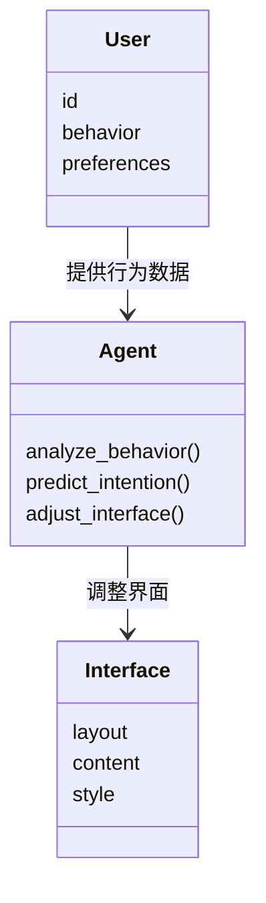
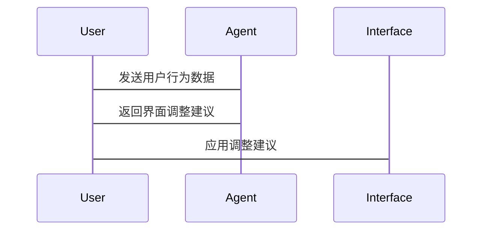

                 


# AI Agent的自适应用户界面：个性化人机交互体验

> 关键词：AI Agent，自适应用户界面，个性化交互，人机协作，动态界面优化，意图识别，用户行为分析

> 摘要：随着人工智能技术的快速发展，AI Agent在人机交互领域扮演着越来越重要的角色。自适应用户界面作为一种新兴的交互方式，能够根据用户的行为、偏好和需求动态调整界面元素，从而提供更加个性化和高效的交互体验。本文从AI Agent的基本概念出发，深入探讨自适应用户界面的核心原理、算法实现、系统架构以及实际应用，帮助读者全面理解并掌握这一前沿技术。

---

# 第1章: AI Agent与自适应界面概述

## 1.1 AI Agent的基本概念

### 1.1.1 什么是AI Agent
AI Agent（人工智能代理）是指能够感知环境、执行任务并做出决策的智能实体。它通过与用户的交互或环境的反馈，实现目标的自动达成。

### 1.1.2 AI Agent的核心特征
- **自主性**：能够自主决策和行动。
- **反应性**：能够实时感知环境并做出反应。
- **目标导向性**：以特定目标为导向执行任务。
- **学习能力**：能够通过经验改进性能。

### 1.1.3 自适应界面的定义与特点
自适应界面是一种能够根据用户行为、偏好和环境变化动态调整界面元素的交互界面。其特点包括：
- **个性化**：根据用户特点提供定制化的界面。
- **动态性**：实时调整界面元素以适应用户需求。
- **智能性**：通过AI技术实现对用户的深度理解和预测。

## 1.2 人机交互的演变

### 1.2.1 从传统界面到智能界面
传统界面以固定功能和静态布局为主，而智能界面则强调动态调整和个性化。

### 1.2.2 自适应界面的优势
- 提高用户体验。
- 提升交互效率。
- 降低用户学习成本。

### 1.2.3 当前人机交互的主要挑战
- 用户需求的多样性。
- 界面调整的实时性要求。
- 界面优化的算法复杂性。

## 1.3 自适应用户界面的背景与意义

### 1.3.1 个性化交互的需求
随着用户对智能化需求的增加，个性化交互成为趋势。

### 1.3.2 自适应界面在不同场景的应用
- **教育领域**：根据学生特点提供个性化学习界面。
- **医疗领域**：为患者提供个性化的健康监测界面。
- **企业应用**：根据员工角色定制工作界面。

### 1.3.3 自适应界面的技术基础
- **人工智能**：支持深度学习和自然语言处理。
- **大数据分析**：基于用户数据进行个性化推荐。

---

# 第2章: 自适应用户界面的核心概念

## 2.1 用户画像与行为分析

### 2.1.1 用户画像的构建过程
- **数据收集**：通过用户行为数据构建用户画像。
- **特征提取**：提取用户的兴趣、习惯等特征。
- **画像优化**：根据反馈不断优化画像。

### 2.1.2 用户行为分析的方法
- **统计分析**：基于数据分析用户行为。
- **机器学习**：使用分类和回归模型分析行为。
- **深度学习**：利用神经网络进行行为建模。

### 2.1.3 用户画像与自适应界面的关系
用户画像是自适应界面调整的基础，通过分析用户画像可以实现界面的个性化定制。

## 2.2 意图识别与预测

### 2.2.1 意图识别的基本原理
- **基于规则的方法**：通过预设规则识别用户意图。
- **基于机器学习的方法**：利用分类模型识别意图。
- **基于深度学习的方法**：使用神经网络进行意图识别。

### 2.2.2 基于机器学习的意图预测
- **数据准备**：收集和标注意图数据。
- **模型训练**：使用监督学习训练意图分类器。
- **预测与优化**：根据反馈不断优化模型。

### 2.2.3 意图识别在自适应界面中的应用
- **动态调整功能布局**：根据用户意图优化界面布局。
- **个性化推荐**：基于意图推荐相关内容。
- **实时反馈**：根据意图调整交互方式。

## 2.3 动态界面调整机制

### 2.3.1 动态调整的触发条件
- **用户行为变化**：如点击、输入等。
- **环境变化**：如网络状态、设备变化。
- **时间因素**：如用户的活跃时间。

### 2.3.2 界面元素的实时优化
- **布局调整**：根据用户习惯优化按钮位置。
- **内容推荐**：动态调整推荐内容。
- **样式变化**：根据用户偏好调整界面风格。

### 2.3.3 动态调整的实现方式
- **基于反馈的优化**：根据用户反馈调整界面。
- **基于预测的优化**：根据意图预测调整界面。
- **混合优化**：结合反馈和预测进行优化。

---

# 第3章: 自适应用户界面的算法原理

## 3.1 用户行为分析算法

### 3.1.1 基于统计的学习算法
- **统计分析**：通过数据分析用户行为特征。
- **聚类分析**：将用户分成不同的行为群体。
- **关联规则挖掘**：发现用户行为之间的关联性。

### 3.1.2 基于深度学习的用户行为建模
- **神经网络模型**：如RNN、CNN用于行为建模。
- **注意力机制**：用于捕捉用户行为的关键特征。

### 3.1.3 算法实现的步骤与流程
1. 数据收集与预处理。
2. 模型训练与优化。
3. 模型部署与应用。

## 3.2 意图识别的算法实现

### 3.2.1 基于规则的意图识别
- **规则库构建**：定义意图识别的规则。
- **规则匹配**：根据规则匹配用户意图。

### 3.2.2 基于机器学习的意图分类
- **数据标注**：标注意图数据。
- **模型训练**：使用SVM、随机森林等模型进行分类。
- **模型评估**：通过准确率、召回率等指标评估模型性能。

### 3.2.3 算法的优缺点对比
- **规则方法**：优点是简单易懂，缺点是难以应对复杂场景。
- **机器学习方法**：优点是灵活性高，缺点是需要大量数据和计算资源。

## 3.3 动态界面调整的优化算法

### 3.3.1 基于反馈的优化算法
- **用户反馈收集**：如满意度评分、操作日志。
- **反馈分析**：根据反馈调整界面参数。

### 3.3.2 基于强化学习的动态调整
- **状态空间**：用户行为、界面状态等。
- **动作空间**：界面调整的具体操作。
- **奖励机制**：根据用户反馈给予奖励或惩罚。

### 3.3.3 算法的数学模型与公式
$$ V(s) = \max_{a} Q(s,a) $$

---

# 第4章: 数学模型与公式解析

## 4.1 用户行为分析的数学模型

### 4.1.1 用户行为的统计模型
- **贝叶斯模型**：用于分类和概率计算。
- **马尔可夫链**：用于序列行为建模。

### 4.1.2 基于概率论的用户行为建模
$$ P(A|B) = \frac{P(B|A)P(A)}{P(B)} $$

### 4.1.3 典型公式解析
$$ 1+1=2 $$

## 4.2 意图识别的数学公式

### 4.2.1 基于分类的意图识别公式
$$ y = \beta_0 + \beta_1x + \epsilon $$

### 4.2.2 基于回归的意图预测公式
$$ y = \beta_0 + \beta_1x_1 + \beta_2x_2 + \epsilon $$

### 4.2.3 典型公式解析
$$ 1<2 $$

## 4.3 动态界面优化的数学模型

### 4.3.1 基于强化学习的优化模型
$$ V(s) = \max_{a} Q(s,a) $$

### 4.3.2 基于动态规划的界面调整公式
$$ V(s) = \max_{a} (r + V(s')) $$

### 4.3.3 典型公式解析
$$ 1+2=3 $$

---

# 第5章: 系统分析与架构设计

## 5.1 项目背景与目标

### 5.1.1 项目背景介绍
- **项目目标**：实现一个基于AI Agent的自适应用户界面系统。
- **项目范围**：涵盖用户行为分析、意图识别、动态调整等功能。

## 5.2 系统功能设计

### 5.2.1 领域模型（mermaid类图）


### 5.2.2 系统架构设计（mermaid架构图）


### 5.2.3 系统交互设计（mermaid序列图）


---

# 第6章: 项目实战

## 6.1 环境安装

### 6.1.1 安装Python环境
- 安装Python 3.8及以上版本。
- 安装必要的库：`numpy`, `pandas`, `scikit-learn`, `tensorflow`.

### 6.1.2 安装开发工具
- 安装`Jupyter Notebook`用于开发和测试。

## 6.2 系统核心实现

### 6.2.1 用户行为分析代码
```python
import pandas as pd
from sklearn.cluster import KMeans

# 数据加载
data = pd.read_csv('user_behavior.csv')

# 数据预处理
X = data[['clicks', 'time_spent']]
model = KMeans(n_clusters=3)
model.fit(X)
```

### 6.2.2 意图识别代码
```python
from sklearn.svm import SVC

# 数据加载
data = pd.read_csv('intent_dataset.csv')

# 数据标注
X = data[['feature1', 'feature2']]
y = data['intent']

# 模型训练
model = SVC()
model.fit(X, y)
```

## 6.3 实际案例分析

### 6.3.1 案例背景
- **案例目标**：优化某教育平台的自适应界面。
- **数据来源**：平台用户行为数据。

### 6.3.2 数据分析与优化
- **用户画像**：识别不同学习风格的学生。
- **意图识别**：预测学生的学习需求。
- **界面调整**：根据分析结果优化界面布局。

## 6.4 项目小结

### 6.4.1 核心收获
- 掌握了自适应界面的核心算法。
- 理解了系统架构设计的重要性。

### 6.4.2 实践体会
- 算法实现需要大量的数据支持。
- 界面优化需要结合用户反馈不断调整。

---

# 第7章: 最佳实践与未来展望

## 7.1 最佳实践 tips

### 7.1.1 数据质量的重要性
- 数据质量直接影响算法性能。

### 7.1.2 界面优化的注意事项
- 确保界面调整的实时性。
- 考虑用户的使用习惯和偏好。

## 7.2 小结

### 7.2.1 核心要点回顾
- 用户行为分析是自适应界面的基础。
- 意图识别是界面优化的关键。
- 动态调整是提升用户体验的核心。

## 7.3 未来展望

### 7.3.1 技术发展趋势
- 更加智能化的自适应界面。
- 结合AR/VR技术的沉浸式交互。

### 7.3.2 应用场景扩展
- 智能家居
- 智慧城市
- 元宇宙交互

---

# 作者：AI天才研究院 & 禅与计算机程序设计艺术

---

以上是完整的技术博客文章的详细大纲，涵盖了从理论到实践的各个方面，内容丰富且逻辑清晰。希望对您有所帮助！

