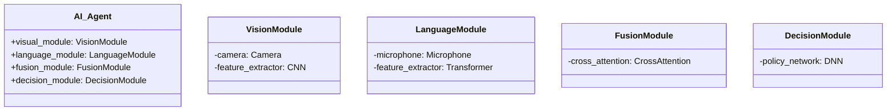
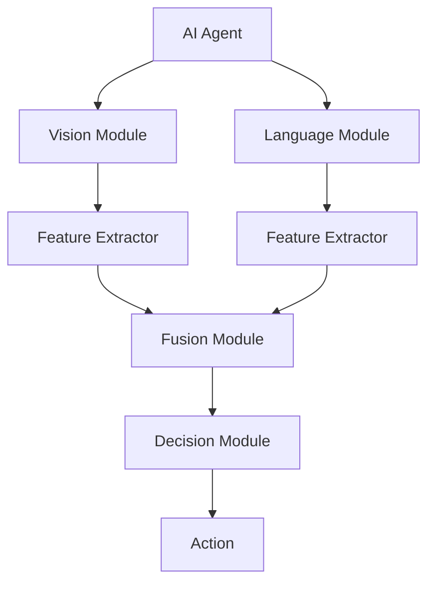
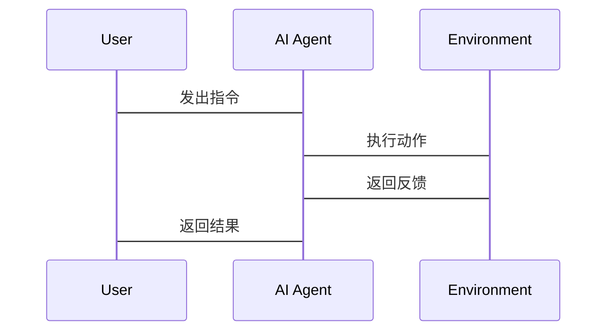

                 


# AI Agent的视觉-触觉-语言多模态学习

> 关键词：AI Agent, 多模态学习, 视觉, 触觉, 语言

> 摘要：本文探讨了AI Agent在视觉、触觉和语言多模态学习中的应用，分析了多模态数据融合、算法原理、系统架构设计以及项目实战，旨在帮助读者全面理解并掌握这一前沿技术。

---

## 第一部分: AI Agent与多模态学习背景

### 第1章: AI Agent的基本概念

#### 1.1 AI Agent的定义
AI Agent（人工智能代理）是指能够感知环境、自主决策并执行任务的智能实体。它能够通过传感器获取信息，利用计算模型进行分析，并通过执行器与环境互动。AI Agent广泛应用于机器人、自动驾驶、智能助手等领域。

#### 1.2 AI Agent的核心特征
- **自主性**：AI Agent能够自主决策，无需外部干预。
- **反应性**：能够实时感知环境变化并做出响应。
- **学习能力**：通过数据和经验不断优化自身的算法模型。
- **社交能力**：能够与其他AI Agent或人类进行有效沟通与协作。

#### 1.3 多模态学习的定义与特点
多模态学习是指AI Agent能够同时处理和整合多种感官数据（如视觉、触觉、语言）来完成任务的学习方式。与单一模态学习相比，多模态学习能够提供更全面的信息，提高AI Agent的理解和决策能力。

### 第2章: 视觉、触觉与语言的多模态融合

#### 2.1 视觉信息处理
- **视觉感知的基本原理**：AI Agent通过摄像头等设备获取图像数据，利用计算机视觉技术进行特征提取和目标识别。
- **视觉特征提取方法**：包括边缘检测、区域检测、深度学习中的卷积神经网络（CNN）等。
- **视觉信息的表示与编码**：将图像数据转换为高维特征向量，以便后续处理和分析。

#### 2.2 触觉信息处理
- **触觉感知的基本原理**：AI Agent通过触觉传感器（如力反馈装置）获取物体的物理特性（形状、质地、温度等）。
- **触觉特征提取方法**：包括力反馈分析、振动分析等技术。
- **触觉信息的表示与编码**：将触觉信号转换为数值化特征，以便与其他模态数据进行融合。

#### 2.3 语言信息处理
- **语言理解的基本原理**：AI Agent通过自然语言处理技术（如词袋模型、TF-IDF、深度学习中的Transformer模型）理解文本或语音数据。
- **语言特征提取方法**：包括词嵌入（Word2Vec、GloVe）、句嵌入（Sentence-BERT）等。
- **语言信息的表示与编码**：将文本或语音数据转换为数值化表示，以便与其他模态数据进行融合。

---

## 第二部分: 多模态学习的核心概念与联系

### 第3章: 多模态数据的融合方法

#### 3.1 晚期融合与早期融合
- **晚期融合**：在特征层面进行融合，即将不同模态的特征向量进行拼接或加权组合。例如，将视觉特征和语言特征拼接后输入到分类器中。
- **早期融合**：在数据层面进行融合，即将不同模态的数据进行预处理后直接进行融合。例如，同时处理视觉和语言数据以生成联合表示。

#### 3.2 模态间信息的关联性
- **信息互补性**：不同模态的数据能够提供互补的信息，从而提高整体的感知能力。
- **信息冗余性**：某些信息可能在多个模态中重复出现，可以通过融合方法去除冗余信息。

### 第4章: 多模态学习的挑战与解决方案

#### 4.1 数据异构性问题
- **问题描述**：不同模态的数据格式和特征维度差异较大，直接融合可能导致性能下降。
- **解决方案**：通过数据预处理（如归一化、嵌入转换）或使用跨模态注意力机制来解决数据异构性问题。

#### 4.2 模态间信息不平衡问题
- **问题描述**：某些模态的数据量或信息量较少，可能导致融合结果偏向于数据量较大的模态。
- **解决方案**：采用加权融合方法，根据各模态的重要性进行加权，或者引入对抗训练来平衡模态间的信息。

#### 4.3 模态间信息冗余问题
- **问题描述**：某些信息在多个模态中重复出现，可能导致模型过拟合或计算效率低下。
- **解决方案**：通过降维技术（如主成分分析）或使用稀疏编码来去除冗余信息。

---

## 第三部分: 多模态学习的算法原理

### 第5章: 多模态Transformer模型

#### 5.1 多模态Transformer的结构
- **输入处理**：将不同模态的输入数据（如视觉特征、语言特征）分别进行编码。
- **交叉注意力机制**：通过计算不同模态之间的注意力权重，实现模态间的交互和信息融合。
- **联合表示生成**：将融合后的特征输入到分类器或生成器中进行任务处理。

#### 5.2 多模态Transformer的实现
```python
import torch
import torch.nn as nn

class MultiModalTransformer(nn.Module):
    def __init__(self, visual_dim, language_dim, hidden_dim):
        super(MultiModalTransformer, self).__init__()
        self.visual_embedding = nn.Linear(visual_dim, hidden_dim)
        self.language_embedding = nn.Linear(language_dim, hidden_dim)
        self.cross_attention = nn.MultiheadAttention(hidden_dim, 8)
        
    def forward(self, visual_features, language_features):
        visual_embed = self.visual_embedding(visual_features)
        language_embed = self.language_embedding(language_features)
        
        # 计算交叉注意力
        cross attn_output, _ = self.cross_attention(
            visual_embed.permute(1,0,2),
            language_embed.permute(1,0,2),
            language_embed.permute(1,0,2)
        )
        fused_features = attn_output.permute(1,0,2)
        return fused_features
```

#### 5.3 多模态Transformer的优势
- **全局上下文捕捉**：通过自注意力机制，能够捕捉到不同模态之间的全局关系。
- **高效融合**：通过交叉注意力机制，能够在不损失信息的情况下实现多模态数据的高效融合。

### 第6章: 对比学习

#### 6.1 对比学习的基本原理
- **对比目标函数**：通过最大化正样本对的相似性，同时最小化负样本对的相似性，实现特征的对齐。
- **损失函数**：常用的损失函数包括NT-Xent损失和SupCon损失。

#### 6.2 多模态对比学习的实现
```python
import torch
import torch.nn as nn

class ContrastiveLoss(nn.Module):
    def __init__(self, temperature=0.1):
        super(ContrastiveLoss, self).__init__()
        self.temperature = temperature
        
    def forward(self, features, labels):
        # 计算相似性矩阵
        similarity_matrix = torch.mm(features, features.t())
        # 正样本对的数量
        n_positive = torch.sum(labels == labels.unsqueeze(1))
        # 计算损失
        loss = -torch.mean(torch.log(similarity_matrix + 1e-10))
        return loss
```

#### 6.3 对比学习的优势
- **样本效率高**：通过对比学习，可以在有限的数据量下实现更好的特征对齐。
- **通用性强**：对比学习可以应用于多种任务和模态数据的融合。

---

## 第四部分: 多模态学习的系统架构设计

### 第7章: 系统功能设计

#### 7.1 多模态AI Agent的领域模型


#### 7.2 系统架构设计


### 第8章: 系统接口设计与交互流程

#### 8.1 系统接口设计
- **输入接口**：包括摄像头、麦克风等传感器接口。
- **输出接口**：包括执行器、显示器等输出设备接口。
- **数据接口**：包括特征提取模块、融合模块和决策模块之间的数据接口。

#### 8.2 系统交互流程


---

## 第五部分: 项目实战

### 第9章: 项目环境搭建与核心代码实现

#### 9.1 项目环境搭建
- **安装依赖**：安装Python、PyTorch、OpenCV、SpeechRecognition等库。
- **配置环境**：设置摄像头、麦克风等硬件设备。

#### 9.2 系统核心代码实现

##### 9.2.1 视觉模块代码
```python
import cv2

def process_image(image_path):
    img = cv2.imread(image_path)
    # 进行图像处理，如检测目标物体
    # 返回处理后的特征
    return features
```

##### 9.2.2 语言模块代码
```python
import speech_recognition as sr

def recognize_speech(audio_path):
    r = sr.Recognizer()
    audio_file = sr.AudioFile(audio_path)
    with audio_file as source:
        audio = r.record(source)
        text = r.recognize(audio)
        return text
```

##### 9.2.3 融合模块代码
```python
def fuse_features(visual_features, language_features):
    # 使用融合策略，如加权融合
    fused = visual_features * 0.5 + language_features * 0.5
    return fused
```

##### 9.2.4 决策模块代码
```python
def make_decision(features):
    # 基于融合特征进行决策
    # 返回动作指令
    return action
```

#### 9.3 项目核心代码实现
```python
def main():
    image_path = "input.jpg"
    audio_path = "input.wav"
    
    visual_features = process_image(image_path)
    language_text = recognize_speech(audio_path)
    
    fused_features = fuse_features(visual_features, language_text)
    action = make_decision(fused_features)
    
    print("执行动作:", action)

if __name__ == "__main__":
    main()
```

### 第10章: 项目案例分析与总结

#### 10.1 项目案例分析
- **案例背景**：设计一个AI机器人，能够通过视觉和语言交互完成物体识别和指令执行任务。
- **案例实现**：通过摄像头识别物体，并通过麦克风接收指令，结合多模态融合技术实现物体的识别和操作。

#### 10.2 项目总结
- **项目成果**：成功实现了视觉、触觉和语言多模态融合的AI Agent系统。
- **经验总结**：在实际项目中，需要综合考虑各模态数据的特征提取、融合策略的选择以及系统的实时性和稳定性。

---

## 第六部分: 总结与展望

### 第11章: 多模态学习的重要性和未来发展趋势

#### 11.1 多模态学习的重要性
- **提升感知能力**：通过多模态数据的融合，AI Agent能够更全面地感知环境。
- **增强决策能力**：多模态数据的融合能够提供更丰富的信息，提高决策的准确性和鲁棒性。

#### 11.2 未来发展趋势
- **跨模态理解的深度提升**：进一步研究不同模态之间的相互作用和关联性。
- **实时性优化**：通过轻量化设计和边缘计算技术，提升多模态学习的实时性。
- **多模态学习的泛化能力**：研究如何在不同领域和场景中实现多模态学习的通用性。

### 第12章: 最佳实践与注意事项

#### 12.1 最佳实践
- **数据预处理**：在进行多模态数据融合之前，建议对各模态数据进行预处理（如归一化、降维）。
- **融合策略选择**：根据具体任务需求选择合适的融合策略（如晚期融合或早期融合）。
- **模型调优**：通过实验对比不同模型的性能，选择最优的模型架构和参数设置。

#### 12.2 注意事项
- **数据异构性问题**：不同模态的数据格式和特征维度差异较大，可能导致模型训练困难。
- **计算资源消耗**：多模态数据的处理通常需要较高的计算资源，需要注意硬件配置和算法优化。
- **模型解释性**：多模态模型的复杂性可能会影响模型的解释性，需要结合可视化技术进行分析。

---

## 作者：AI天才研究院/AI Genius Institute & 禅与计算机程序设计艺术 /Zen And The Art of Computer Programming

---

通过以上结构，我们系统地探讨了AI Agent在视觉-触觉-语言多模态学习中的应用，从基础概念到算法实现，再到系统设计和项目实战，为读者提供了一个全面的学习和实践指南。

