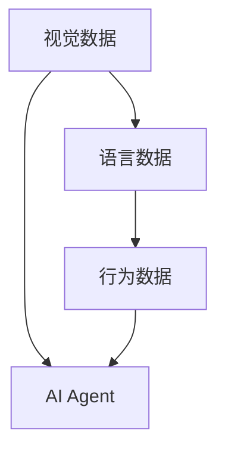
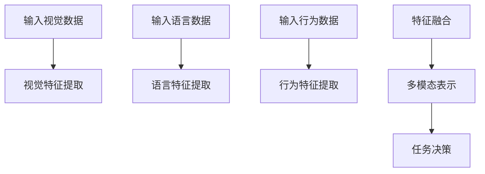
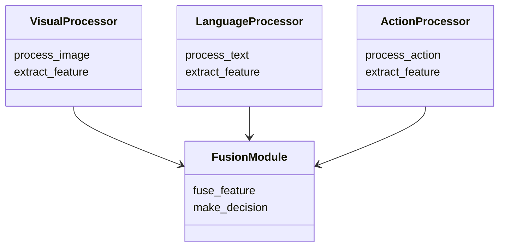
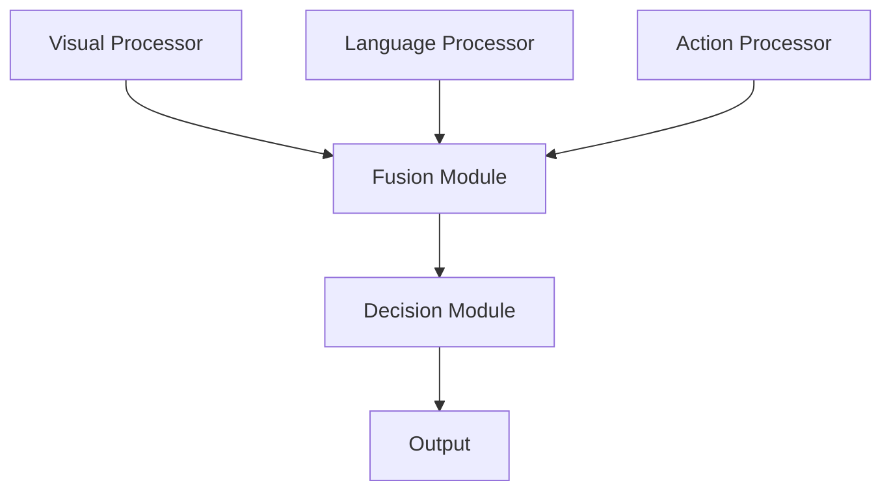
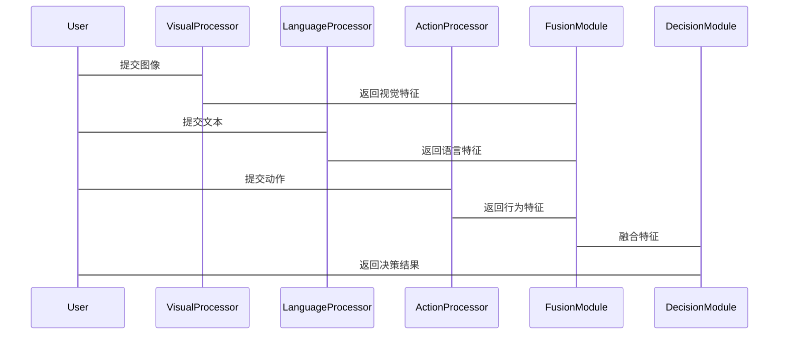

                 


# AI Agent的视觉-语言-行为三模态融合

---

## 关键词  
AI Agent, 多模态融合, 视觉, 语言, 行为, 三模态交互, 跨模态学习

---

## 摘要  
本文深入探讨了AI Agent在视觉、语言和行为三模态数据融合方面的技术原理与实现方法。文章从背景介绍、核心概念、算法原理、系统架构设计到项目实战，全面解析了AI Agent如何通过多模态数据的协同工作实现更强大的智能交互能力。通过详细的理论分析、算法实现和案例解读，本文为读者提供了一个系统化、结构化的知识框架，帮助读者全面理解AI Agent的三模态融合技术。

---

## 第一部分: 背景介绍

### 第1章: 问题背景

#### 1.1 多模态数据的重要性  
在现实世界中，信息往往以多种形式存在：视觉数据（如图像、视频）、语言数据（如文本、语音）以及行为数据（如动作、交互记录）。单一模态的数据往往无法充分表达复杂的场景信息，因此，如何将这些模态数据进行有效融合，成为了实现更智能AI Agent的核心挑战。

#### 1.2 AI Agent在现实场景中的挑战  
AI Agent需要在真实场景中处理复杂的任务，例如智能助手、服务机器人、自动驾驶等。这些任务通常涉及多模态数据的处理和决策，例如通过视觉识别物体、通过语言理解用户意图、通过行为预测用户的下一步操作。然而，不同模态的数据具有不同的特性，如何将它们统一起来进行处理，是AI Agent面临的主要技术难点。

#### 1.3 视觉-语言-行为融合的必要性  
通过三模态数据的融合，AI Agent可以更全面地理解环境和用户的需求。例如，在智能客服场景中，AI Agent可以通过视觉数据识别用户的情绪（通过面部表情），通过语言数据理解用户的意图，并通过行为数据预测用户的下一步操作。这种三模态的协同工作，能够显著提升AI Agent的智能水平和用户体验。

---

### 第2章: 问题描述

#### 2.1 AI Agent的三模态数据处理需求  
AI Agent需要处理以下三类数据：
1. **视觉数据**：图像、视频等视觉信息。
2. **语言数据**：文本、语音等语言信息。
3. **行为数据**：动作、交互记录等行为信息。

#### 2.2 多模态数据融合的难点  
1. **模态差异**：不同模态的数据具有不同的特征和表示方式，难以直接进行融合。
2. **信息冗余**：不同模态的数据可能包含重复的信息，如何去冗余是一个挑战。
3. **实时性要求**：在实时交互场景中，三模态数据的处理需要高效、低延迟。

#### 2.3 当前技术的局限性  
1. **模态间关联性弱**：现有技术往往单独处理不同模态的数据，缺乏跨模态的关联性分析。
2. **融合方法单一**：主流的融合方法（如特征拼接、注意力机制）在复杂场景中的表现有限。
3. **计算资源消耗大**：三模态数据的处理需要较高的计算资源，如何在资源受限的场景中实现高效融合是一个挑战。

---

### 第3章: 问题解决

#### 3.1 多模态融合的基本思路  
1. **模态对齐**：通过模态对齐技术，将不同模态的数据映射到同一个特征空间。
2. **特征融合**：将不同模态的特征进行融合，例如通过加权融合、注意力机制等方式。
3. **联合学习**：通过多任务学习框架，同时优化多个模态的特征表示。

#### 3.2 AI Agent的核心能力构建  
1. **视觉理解能力**：通过深度学习模型（如CNN、Transformer）提取视觉数据的特征。
2. **语言理解能力**：通过NLP技术（如BERT、GPT）处理语言数据。
3. **行为预测能力**：通过强化学习或行为识别模型预测用户的下一步行为。

#### 3.3 三模态融合的实现路径  
1. **数据预处理**：对视觉、语言、行为数据进行清洗、归一化等预处理。
2. **特征提取**：分别提取三模态数据的特征表示。
3. **特征融合**：通过模态对齐、注意力机制等方式，将三模态特征融合为一个统一的表示。
4. **任务决策**：基于融合后的特征，进行具体的任务决策，例如语义理解、行为预测等。

---

### 第4章: 边界与外延

#### 4.1 多模态融合的边界条件  
1. **数据质量**：不同模态的数据可能存在噪声、缺失等问题，影响融合效果。
2. **任务目标**：不同的任务对模态融合的需求不同，例如视觉-语言融合在图像描述生成任务中更为重要。
3. **计算资源**：三模态数据的处理需要较高的计算资源，如何在资源受限的场景中实现高效融合是一个挑战。

#### 4.2 AI Agent能力的适用范围  
1. **适用场景**：智能助手、服务机器人、自动驾驶等需要处理多模态数据的场景。
2. **不适用场景**：在仅需处理单一模态数据的场景中，三模态融合可能显得过于复杂。

#### 4.3 三模态融合的未来发展  
1. **模态扩展**：未来可能会引入更多模态的数据，例如嗅觉、触觉等。
2. **跨模态交互**：三模态数据的协同工作将更加复杂，需要更先进的融合方法。
3. **实时性优化**：如何在实时交互场景中实现高效的三模态数据处理是一个重要研究方向。

---

### 第5章: 核心要素组成

#### 5.1 视觉模态的核心要素  
1. **图像特征**：通过CNN等模型提取图像的特征表示。
2. **视频特征**：通过3D CNN或Transformer提取视频的特征表示。
3. **视觉对齐**：通过模态对齐技术将视觉特征与语言、行为特征对齐。

#### 5.2 语言模态的核心要素  
1. **文本特征**：通过词嵌入（如Word2Vec、BERT）提取文本的特征表示。
2. **语音特征**：通过MFCC等方法提取语音的特征表示。
3. **语言对齐**：通过模态对齐技术将语言特征与视觉、行为特征对齐。

#### 5.3 行为模态的核心要素  
1. **动作特征**：通过行为识别模型（如骨架网络）提取动作的特征表示。
2. **交互记录**：通过日志分析提取用户的行为模式。
3. **行为预测**：通过强化学习或行为识别模型预测用户的下一步行为。

---

## 第二部分: 核心概念与联系

### 第6章: 核心概念原理

#### 6.1 多模态数据的表示方法  
1. **模态对齐**：通过将不同模态的数据映射到同一个特征空间，实现模态之间的对齐。
2. **跨模态注意力机制**：通过注意力机制，将不同模态的特征进行加权融合，突出重要的模态信息。
3. **多模态表示学习**：通过自监督学习、对比学习等方法，学习三模态数据的共同表示。

#### 6.2 AI Agent的三模态融合机制  
1. **特征融合**：将视觉、语言、行为特征进行融合，得到一个统一的表示。
2. **联合推理**：基于融合后的特征，进行语义理解、行为预测等任务。
3. **反馈优化**：通过用户反馈不断优化三模态融合的模型。

#### 6.3 跨模态交互的基本原理  
1. **信息共享**：不同模态的数据通过共享特征空间实现信息共享。
2. **信息互补**：不同模态的数据相互补充，提升模型的表达能力。
3. **协同学习**：通过联合学习框架，同时优化多个模态的特征表示。

---

### 第7章: 概念属性特征对比表格

| 模态类型 | 特征属性 | 描述 |
|----------|----------|------|
| 视觉     | 数据形式 | 图像/视频 |
| 语言     | 数据形式 | 文本/语音 |
| 行为     | 数据形式 | 动作/交互记录 |

---

### 第8章: ER实体关系图



---

## 第三部分: 算法原理讲解

### 第9章: 多模态融合算法概述

#### 9.1 多模态表示学习  
1. **模态对齐**：通过将不同模态的数据映射到同一个特征空间，实现模态之间的对齐。
2. **跨模态注意力机制**：通过注意力机制，将不同模态的特征进行加权融合，突出重要的模态信息。
3. **多模态表示学习**：通过自监督学习、对比学习等方法，学习三模态数据的共同表示。

#### 9.2 跨模态注意力机制  
1. **模态间注意力**：通过注意力机制，将不同模态的特征进行加权融合。
2. **模态内注意力**：在单一模态内部，通过注意力机制提取重要的特征。

#### 9.3 多模态推理模型  
1. **多模态Transformer**：通过多模态的Transformer模型，同时处理视觉、语言、行为数据。
2. **跨模态交互网络**：通过网络结构实现不同模态之间的交互和信息共享。

---

### 第10章: 多模态融合算法流程图



---

### 第11章: 多模态融合算法实现代码

```python
import torch
import torch.nn as nn

class MultiModalFusion(nn.Module):
    def __init__(self, visual_dim, language_dim, action_dim):
        super().__init__()
        self.visual_proj = nn.Linear(visual_dim, 128)
        self.language_proj = nn.Linear(language_dim, 128)
        self.action_proj = nn.Linear(action_dim, 128)
        self.fusion = nn.Linear(128 * 3, 64)
        self.relu = nn.ReLU()

    def forward(self, visual_features, language_features, action_features):
        visual = self.visual_proj(visual_features)
        language = self.language_proj(language_features)
        action = self.action_proj(action_features)
        fused = torch.cat([visual, language, action], dim=-1)
        fused = self.fusion(fused)
        fused = self.relu(fused)
        return fused
```

---

### 第12章: 算法原理的数学模型和公式

1. **模态对齐公式**：  
   $$ z_i = \sigma(W_i x_i + b_i) $$  
   其中，$x_i$ 是第$i$个模态的输入特征，$W_i$ 和 $b_i$ 是参数，$\sigma$ 是激活函数。

2. **跨模态注意力机制**：  
   $$ \alpha_i = \text{softmax}(W_a z_i) $$  
   $$ f_i = \sum_{j} \alpha_{ij} z_j $$  

3. **多模态融合公式**：  
   $$ h = \text{Fusion}(z_1, z_2, z_3) $$  

---

## 第四部分: 系统分析与架构设计方案

### 第13章: 问题场景介绍

#### 13.1 问题场景  
本文针对AI Agent在视觉、语言、行为三模态数据融合中的技术挑战，提出了一种基于深度学习的多模态融合方法，旨在提升AI Agent的智能交互能力。

#### 13.2 项目介绍  
本项目旨在实现一个能够处理视觉、语言、行为三模态数据的AI Agent系统，通过多模态数据的协同工作，实现更智能的交互体验。

---

### 第14章: 系统功能设计

#### 14.1 领域模型Mermaid类图  


#### 14.2 系统架构设计Mermaid架构图  


#### 14.3 系统接口设计  
1. **输入接口**：接收视觉、语言、行为数据。
2. **输出接口**：输出决策结果。
3. **数据接口**：提供特征提取、融合等功能的接口。

#### 14.4 系统交互Mermaid序列图  


---

### 第15章: 项目实战

#### 15.1 环境安装  
1. **安装Python**：建议使用Python 3.8或更高版本。
2. **安装深度学习框架**：例如TensorFlow、PyTorch。
3. **安装NLP库**：例如NLTK、spaCy。
4. **安装可视化工具**：例如Matplotlib、Seaborn。

#### 15.2 系统核心实现源代码  
```python
import torch
import torch.nn as nn

class AI-Agent(nn.Module):
    def __init__(self):
        super().__init__()
        self.visual_processor = VisualProcessor()
        self.language_processor = LanguageProcessor()
        self.action_processor = ActionProcessor()
        self.fusion_module = FusionModule()

    def forward(self, visual_input, language_input, action_input):
        visual_feature = self.visual_processor(visual_input)
        language_feature = self.language_processor(language_input)
        action_feature = self.action_processor(action_input)
        fused_feature = self.fusion_module(visual_feature, language_feature, action_feature)
        decision = self.make_decision(fused_feature)
        return decision
```

#### 15.3 代码应用解读与分析  
1. **视觉处理器**：负责处理视觉数据，提取视觉特征。
2. **语言处理器**：负责处理语言数据，提取语言特征。
3. **行为处理器**：负责处理行为数据，提取行为特征。
4. **融合模块**：将三模态特征进行融合，得到统一的表示。
5. **决策模块**：基于融合后的特征，进行任务决策。

#### 15.4 实际案例分析和详细讲解剖析  
1. **案例背景**：以智能客服场景为例，AI Agent需要通过视觉、语言、行为数据理解用户需求。
2. **数据输入**：用户提交一张图像（视觉数据）、一段文本（语言数据）、一个动作（行为数据）。
3. **特征提取**：分别提取视觉、语言、行为特征。
4. **特征融合**：将三模态特征融合为一个统一的表示。
5. **任务决策**：基于融合后的特征，AI Agent理解用户需求，并做出相应的回应。

#### 15.5 项目小结  
通过本项目的实战，读者可以深入了解AI Agent的三模态融合技术，掌握从数据处理到特征融合再到任务决策的完整流程。

---

## 第五部分: 总结与展望

### 第16章: 最佳实践 Tips

1. **数据预处理**：在进行三模态数据融合之前，需要对数据进行清洗、归一化等预处理。
2. **模态对齐**：不同模态的数据具有不同的特征空间，需要通过模态对齐技术将它们映射到同一个空间。
3. **特征融合**：通过注意力机制、加权融合等方式，将不同模态的特征进行融合。
4. **模型优化**：通过数据增强、模型调参等方式，优化三模态融合模型的性能。
5. **实时性优化**：在实时交互场景中，需要优化模型的计算效率，降低延迟。

---

### 第17章: 小结

本文全面解析了AI Agent的视觉-语言-行为三模态融合技术，从背景介绍、核心概念、算法原理到系统设计和项目实战，为读者提供了一个系统化、结构化的知识框架。通过本文的阅读，读者可以深入理解三模态数据融合的技术原理，并掌握实际应用中的实现方法。

---

### 第18章: 注意事项

1. **数据隐私**：在处理用户数据时，需要严格遵守数据隐私保护法规。
2. **模型泛化能力**：三模态融合模型的泛化能力可能较弱，需要通过数据增强、模型优化等方式提升。
3. **计算资源**：三模态数据的处理需要较高的计算资源，如何在资源受限的场景中实现高效融合是一个挑战。
4. **用户体验**：在实际应用中，需要关注用户体验，避免因模型性能不足导致用户体验下降。

---

### 第19章: 拓展阅读

1. **相关论文**：
   - "Visual-linguistic Pre-training for Generalizable Visual Recognition and Generative Natural Language Understanding"（视觉-语言预训练）
   - "Multimodal Transformer for Unsupervised Audio-Visual Alignment"（多模态Transformer）
2. **技术博客**：
   - 探讨多模态数据融合的最新技术进展。
   - 分析三模态数据融合在具体场景中的应用案例。
3. **书籍推荐**：
   - 《Deep Learning》（Ian Goodfellow）
   - 《Natural Language Processing with PyTorch》（Soujanya Poria）

---

## 作者信息

作者：AI天才研究院/AI Genius Institute & 禅与计算机程序设计艺术 /Zen And The Art of Computer Programming

---

**本文为系统化、结构化的技术博客文章，转载请注明出处。**

