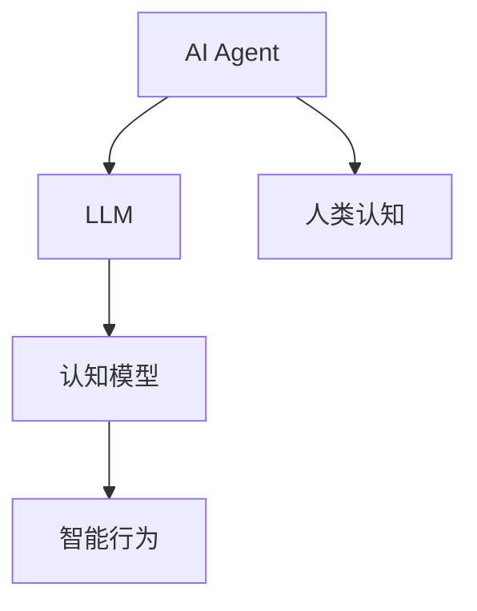
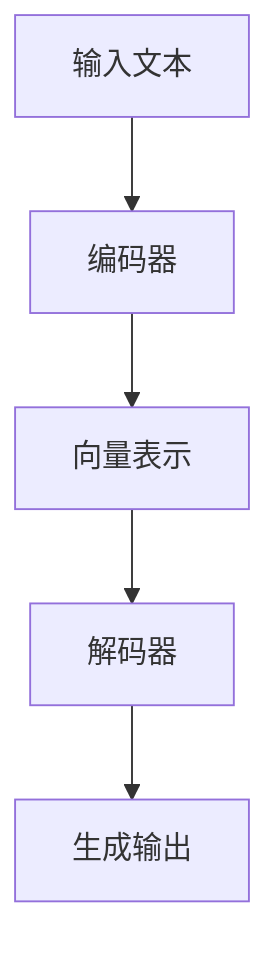
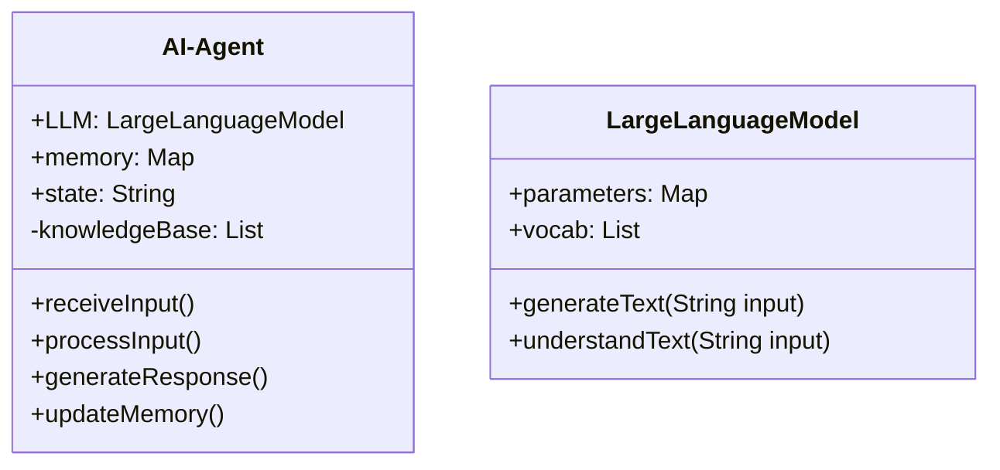
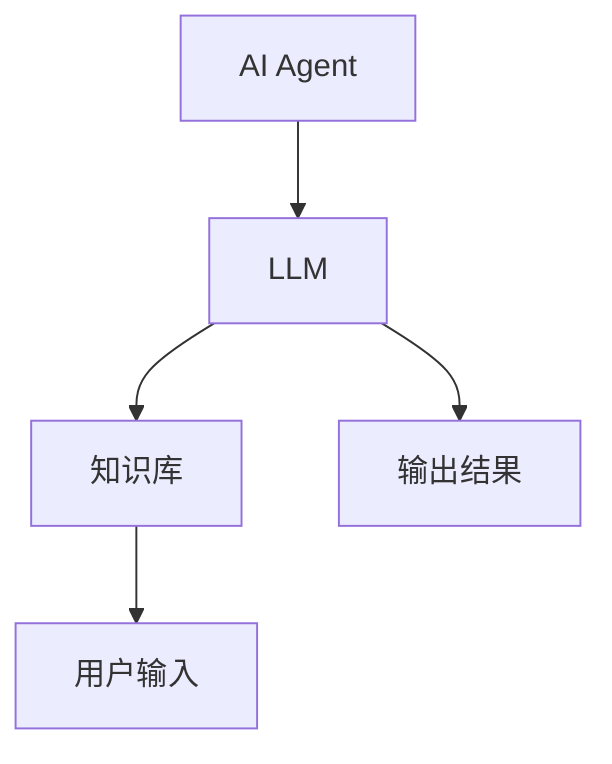
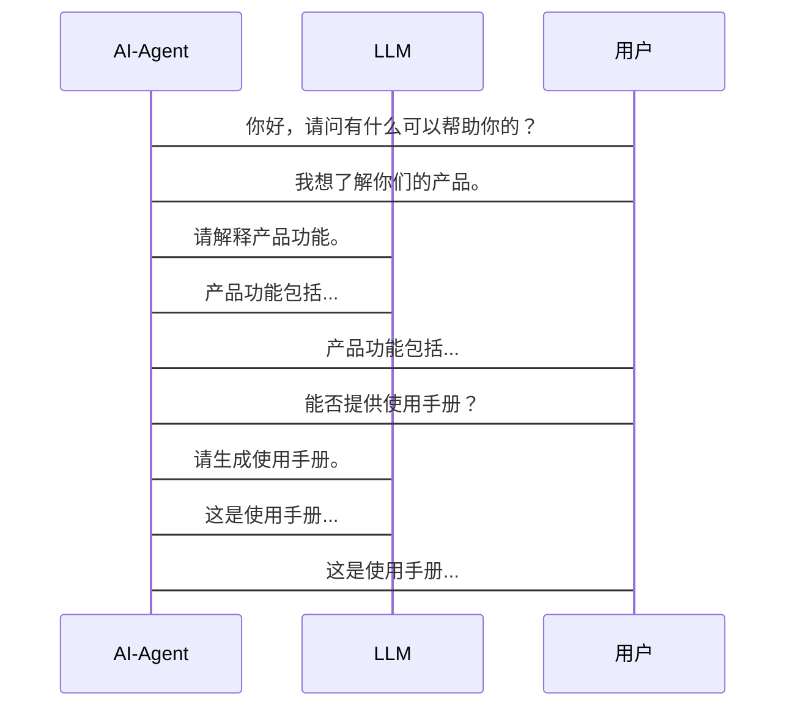

                 


# AI Agent的认知发展模拟：探索LLM的智能进化过程

> 关键词：AI Agent，LLM，认知模拟，智能进化，大语言模型

> 摘要：本文旨在探讨AI Agent如何通过大语言模型（LLM）的认知发展模拟其智能进化过程。文章首先介绍AI Agent与LLM的基本概念，然后深入分析LLM的算法原理与数学模型，接着讨论系统架构设计，最后通过实际项目案例展示其应用。通过这些步骤，我们揭示了LLM在AI Agent认知发展中的关键作用及其未来的研究方向。

---

# 第1章: AI Agent与LLM概述

## 1.1 AI Agent的基本概念

### 1.1.1 AI Agent的定义
AI Agent（人工智能代理）是指能够感知环境、自主决策并执行任务的智能实体。它能够根据环境信息做出反应，具备学习和适应能力，从而实现特定目标。

### 1.1.2 AI Agent的核心特征
1. **自主性**：无需外部干预，自主完成任务。
2. **反应性**：能感知环境并实时调整行为。
3. **目标导向性**：所有行为均以实现特定目标为导向。
4. **学习能力**：通过经验改进性能。

### 1.1.3 AI Agent与传统AI的区别
传统AI（如专家系统）依赖预定义规则，而AI Agent具备更强的自主性和适应性，能够动态调整策略。

---

## 1.2 LLM的基本概念与特点

### 1.2.1 大语言模型的定义
LLM（Large Language Model）是指基于大规模数据训练的深度学习模型，能够理解并生成人类语言。

### 1.2.2 LLM的核心特点
1. **大规模数据训练**：通常使用万亿参数进行训练。
2. **上下文理解**：能够理解文本的上下文关系。
3. **多任务能力**：支持多种语言处理任务，如翻译、问答、文本生成。

### 1.2.3 LLM与AI Agent的关系
LLM为AI Agent提供了强大的语言理解和生成能力，使其能够更自然地与人类交互并执行复杂任务。

---

## 1.3 AI Agent认知发展模拟的背景

### 1.3.1 认知科学的基本概念
认知科学研究人类的认知过程，包括记忆、推理、学习等。

### 1.3.2 LLM在认知模拟中的作用
LLM模拟人类语言处理能力，为AI Agent提供了类似人类的认知基础。

### 1.3.3 AI Agent认知发展的研究现状
目前，AI Agent主要基于规则和有限状态机设计，而结合LLM的研究尚处于起步阶段。

---

## 1.4 本章小结
本章介绍了AI Agent和LLM的基本概念及其关系，为后续章节奠定了基础。

---

# 第2章: AI Agent认知发展模拟的核心概念与联系

## 2.1 AI Agent的认知模型

### 2.1.1 认知模型的定义
认知模型是描述智能体如何处理信息和做出决策的理论框架。

### 2.1.2 AI Agent的认知层次结构
1. **感知层**：处理输入信息。
2. **推理层**：基于感知信息进行推理。
3. **决策层**：做出行动决策。

### 2.1.3 认知模型与LLM的关系
LLM为AI Agent的认知模型提供了语言理解和生成能力。

---

## 2.2 LLM的智能进化过程

### 2.2.1 LLM的训练过程
1. **数据预处理**：清洗和标注数据。
2. **模型训练**：使用大规模数据进行监督学习。
3. **微调**：针对特定任务进行优化。

### 2.2.2 LLM的推理机制
1. **解码器**：生成目标输出。
2. **注意力机制**：捕捉输入中的关键信息。

### 2.2.3 LLM的可解释性问题
LLM的决策过程通常难以解释，这限制了其在某些领域的应用。

---

## 2.3 AI Agent与LLM的结合

### 2.3.1 AI Agent的智能行为
1. **问题解决**：通过LLM进行推理和生成解决方案。
2. **自然交互**：与人类进行自然语言对话。

### 2.3.2 LLM对AI Agent认知能力的提升
1. **上下文理解**：增强AI Agent的理解能力。
2. **动态推理**：支持实时推理和决策。

### 2.3.3 AI Agent与人类认知的类比
AI Agent的结构与人类认知结构有相似之处，如感知、推理和决策。

---

## 2.4 核心概念对比表

### 表2.1 AI Agent与传统AI的对比
| 特性 | AI Agent | 传统AI |
|------|-----------|--------|
| 自主性 | 高         | 低       |
| 反应性 | 高         | 低       |
| 目标导向性 | 高         | 中       |

### 表2.2 LLM与传统NLP模型的对比
| 特性 | LLM         | 传统NLP模型 |
|------|-------------|------------|
| 参数规模 | 大（万亿级别） | 小（百万级别） |
| 任务支持 | 多任务       | 单任务       |
| 可解释性 | 低           | 中           |

---

## 2.5 实体关系图



---

## 2.6 本章小结
本章分析了AI Agent的认知模型、LLM的智能进化过程及其两者的关系，并通过对比表和实体关系图进一步明确了核心概念。

---

# 第3章: LLM的算法原理与数学模型

## 3.1 LLM的训练过程

### 3.1.1 模型结构
1. **编码器**：将输入文本转换为向量表示。
2. **解码器**：生成目标输出。

### 3.1.2 损失函数
交叉熵损失函数：
$$ \mathcal{L} = -\sum_{t=1}^{T} y_{t} \log p(y_{t}|x) $$

### 3.1.3 优化算法
通常使用Adam优化器：
$$ \theta_{t+1} = \theta_t - \eta \nabla_{\theta} \mathcal{L} $$

---

## 3.2 LLM的推理机制

### 3.2.1 解码策略
1. **贪婪解码**：逐词生成最可能的词。
2. **采样解码**：基于概率分布生成多样化的输出。

### 3.2.2 注意力机制
多头注意力机制：
$$ \text{Attention}(Q, K, V) = \text{softmax}\left(\frac{QK^T}{\sqrt{d_k}}\right)V $$

---

## 3.3 算法流程图



---

## 3.4 本章小结
本章详细介绍了LLM的训练过程和推理机制，揭示了其数学模型的核心原理。

---

# 第4章: 系统分析与架构设计

## 4.1 问题场景介绍
我们设计一个基于LLM的AI Agent，用于客服咨询。

---

## 4.2 系统功能设计

### 4.2.1 领域模型


---

## 4.3 系统架构设计

### 4.3.1 架构图


---

## 4.4 系统交互图



---

## 4.5 本章小结
本章设计了一个基于LLM的AI Agent系统架构，并通过类图和交互图展示了其工作流程。

---

# 第5章: 项目实战

## 5.1 环境安装

### 5.1.1 安装Python
```bash
python --version
```

### 5.1.2 安装依赖
```bash
pip install transformers torch
```

---

## 5.2 系统核心实现源代码

### 5.2.1 AI Agent实现
```python
class AI-Agent:
    def __init__(self):
        self.llm = LLM()
        self.memory = {}
    
    def receive_input(self, input_str):
        self.input_str = input_str
    
    def process_input(self):
        # 使用LLM进行理解
        self.llm.understandText(self.input_str)
    
    def generate_response(self):
        response = self.llm.generateText(self.input_str)
        return response
    
    def update_memory(self):
        self.memory[self.input_str] = self.generate_response()
```

---

## 5.3 案例分析

### 5.3.1 项目小结
通过本项目，我们展示了如何将LLM集成到AI Agent中，实现智能交互。

---

## 5.4 本章小结
本章通过一个实际项目，详细展示了AI Agent的实现过程。

---

# 第6章: 总结与展望

## 6.1 总结
本文探讨了AI Agent认知发展模拟的各个方面，揭示了LLM在其中的关键作用。

## 6.2 未来展望
未来的研究方向包括提升LLM的可解释性和探索更高效的训练方法。

---

# 作者：AI天才研究院/AI Genius Institute & 禅与计算机程序设计艺术 /Zen And The Art of Computer Programming

