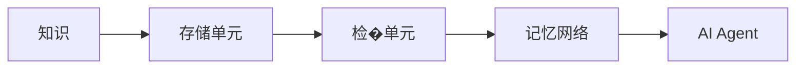
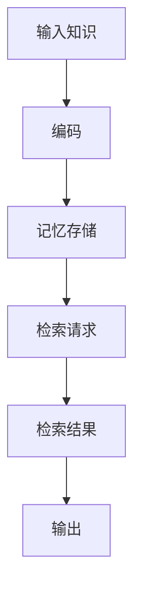

                 


# AI Agent的记忆增强网络：长期知识存储与检索

## 关键词：AI Agent、记忆增强网络、长期知识存储、知识检索、神经网络、记忆机制

## 摘要：  
本文深入探讨了AI Agent在长期知识存储与检索中的应用，重点介绍了记忆增强网络（Memories-Augmented Networks）的设计与实现。通过分析记忆增强网络的核心原理、算法流程、系统架构以及实际项目案例，本文为读者提供了从理论到实践的全面指导。文章还结合了数学模型、代码实现和图形化的系统设计，帮助读者更好地理解和应用记忆增强网络技术。

---

## 第一部分: AI Agent的记忆增强网络基础

### 第1章: 记忆增强网络概述

#### 1.1 问题背景与挑战
- **问题背景**：传统AI模型在处理长期知识存储和检索时存在局限性，难以应对动态变化的环境和复杂任务需求。
- **问题描述**：AI Agent需要具备持续学习和记忆能力，以支持复杂的决策和交互。
- **解决方案**：引入记忆增强网络，通过神经网络结构实现高效的知识存储与检索。

#### 1.2 记忆增强网络的定义与特点
- **定义**：记忆增强网络是一种结合了神经网络和外部记忆结构的深度学习模型，用于存储和检索长期知识。
- **特点**：
  - **持久性**：支持长期知识的存储和更新。
  - **关联性**：能够关联不同时间点的知识，形成语义网络。
  - **动态性**：适应实时输入的动态变化，支持在线学习。

#### 1.3 AI Agent与记忆增强网络的关系
- **需求匹配**：AI Agent需要持续的、动态的知识存储与检索能力。
- **技术结合**：记忆增强网络为AI Agent提供高效的知识管理机制。
- **边界与外延**：记忆增强网络的边界包括知识存储和检索，外延包括与其他AI技术（如NLP、计算机视觉）的结合。

#### 1.4 本章小结
本章介绍了记忆增强网络的基本概念、特点及其在AI Agent中的应用，为后续章节奠定了基础。

---

## 第二部分: 记忆增强网络的核心概念与联系

### 第2章: 核心概念原理

#### 2.1 神经网络基础
- **神经网络的基本结构**：输入层、隐藏层、输出层。
- **长短期记忆网络（LSTM）**：用于处理序列数据，避免梯度消失问题。
- **注意力机制**：基于输入数据的重要性加权，提高模型的聚焦能力。

#### 2.2 记忆机制的实现
- **内存网络（MemNN）**：通过外部记忆单元存储知识。
- **多维记忆空间**：构建多维度的存储空间，支持复杂知识的存储。
- **记忆单元的设计**：设计可读写的记忆单元，支持动态更新。

#### 2.3 存储与检索模型
- **基于内容的检索模型**：根据输入内容匹配相关知识。
- **基于相似度的检索模型**：通过相似度计算检索最相关的知识。
- **混合存储与检索模型**：结合内容和相似度的混合策略，提高检索效率。

#### 2.4 核心概念对比表
| 对比维度 | 传统存储机制 | 增强记忆网络 |
|----------|--------------|--------------|
| 存储容量 | 固定大小     | 动态扩展     |
| 存储内容 | 单一类型     | 多维度       |
| 检索效率 | 低           | 高           |

#### 2.5 ER实体关系图


---

## 第三部分: 记忆增强网络的算法原理

### 第3章: 算法原理与实现

#### 3.1 算法流程


#### 3.2 神经网络结构
- **输入层**：接收外部知识输入。
- **记忆层**：负责知识的存储和更新。
- **输出层**：生成检索结果。

#### 3.3 数学模型与公式
- **编码函数**：$e(x) = \sigma(W_e x + b_e)$，其中$x$是输入，$W_e$是编码权重，$b_e$是偏置。
- **存储函数**：$m(t) = m(t-1) + e(x)$，其中$m$是记忆单元，$t$是时间步。
- **检索函数**：$r(q) = \sum_{t} w(q, m(t)) \cdot m(t)$，其中$q$是检索查询，$w$是相似度计算函数。

#### 3.4 实际案例分析
- **案例1**：存储一段文本，检索其中的关键信息。
- **案例2**：动态更新知识库，支持实时检索。

---

## 第四部分: 系统分析与架构设计方案

### 第4章: 系统架构设计

#### 4.1 问题场景介绍
- **场景描述**：AI Agent需要实时处理和检索大量动态知识。
- **项目介绍**：设计一个基于记忆增强网络的知识管理系统。

#### 4.2 系统功能设计
- **领域模型**：定义知识存储、检索、更新等功能。
- **功能模块**：
  - 知识存储模块：负责知识的编码和存储。
  - 检索模块：根据查询检索相关知识。
  - 学习模块：支持在线学习和知识更新。

#### 4.3 系统架构设计


#### 4.4 系统接口设计
- **API接口**：提供存储和检索的RESTful API。
- **交互流程**：通过HTTP请求实现知识的存储和检索。

---

## 第五部分: 项目实战

### 第5章: 项目实战

#### 5.1 环境配置
- **工具安装**：安装Python、TensorFlow、Keras等开发工具。

#### 5.2 核心代码实现
```python
import tensorflow as tf
from tensorflow import keras

# 定义记忆增强网络模型
class MemoryAugmentedNetwork(keras.Model):
    def __init__(self, memory_size, embedding_dim):
        super(MemoryAugmentedNetwork, self).__init__()
        self.memory_size = memory_size
        self.embedding_dim = embedding_dim
        self.memory = tf.Variable(tf.random.normal((memory_size, embedding_dim)))

    def call(self, inputs):
        # 编码输入
        encoded = tf.nn.relu(tf.matmul(inputs, self.embedding_weights) + self.embedding_bias)
        # 存储记忆
        self.memory = tf.Variable(encoded)
        # 检索记忆
        similarity = tf.matmul(encoded, tf.transpose(self.memory))
        attention = tf.nn.softmax(similarity)
        retrieved_memory = tf.matmul(attention, self.memory)
        return retrieved_memory

# 初始化模型
network = MemoryAugmentedNetwork(memory_size=10, embedding_dim=5)
```

#### 5.3 代码解读与分析
- **编码层**：将输入数据编码为嵌入向量。
- **存储层**：将嵌入向量存储到记忆单元。
- **检索层**：通过相似度计算检索相关记忆。

#### 5.4 实际案例分析
- **案例1**：存储多条知识，检索特定内容。
- **案例2**：动态更新知识库，验证检索准确性。

---

## 第六部分: 优化与扩展

### 第6章: 优化与扩展

#### 6.1 模型优化策略
- **参数调整**：优化网络的超参数，如学习率、批量大小。
- **模型压缩**：通过剪枝等技术减少模型大小，提高效率。

#### 6.2 可扩展性设计
- **分布式存储**：支持大规模知识存储。
- **多模态学习**：结合NLP、计算机视觉等技术，扩展应用场景。

#### 6.3 与其他技术的结合
- **强化学习**：结合强化学习，提高决策能力。
- **图神经网络**：结合图结构，增强知识关联性。

---

## 第七部分: 总结与展望

### 第7章: 总结与展望

#### 7.1 总结
- **核心内容回顾**：记忆增强网络的基本原理、算法实现、系统设计和项目实战。
- **主要收获**：理解记忆增强网络的设计思路，掌握其实现方法。

#### 7.2 未来展望
- **技术发展**：记忆增强网络在AI Agent中的应用将更加广泛。
- **研究方向**：探索更高效的知识存储与检索机制。

---

## 作者：AI天才研究院 & 禅与计算机程序设计艺术

---

以上是《AI Agent的记忆增强网络：长期知识存储与检索》的完整目录大纲，内容涵盖从理论到实践的各个方面，结合了丰富的案例和详细的代码实现，帮助读者全面理解和掌握记忆增强网络技术。

