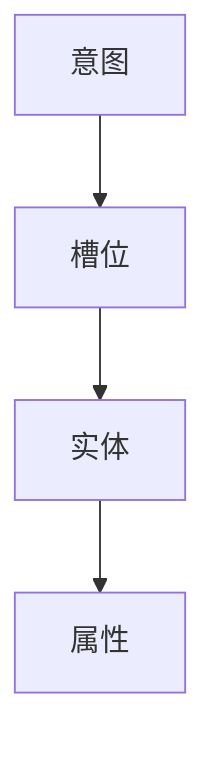
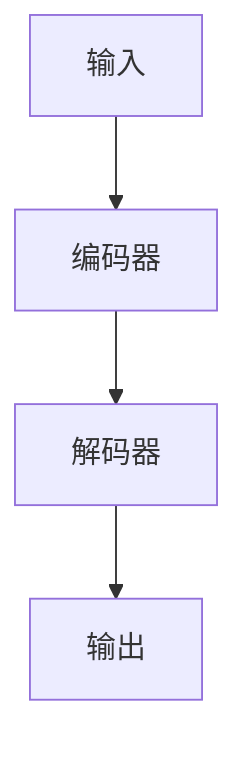
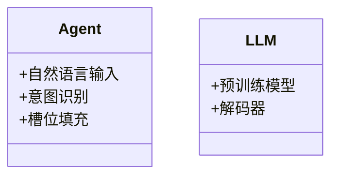
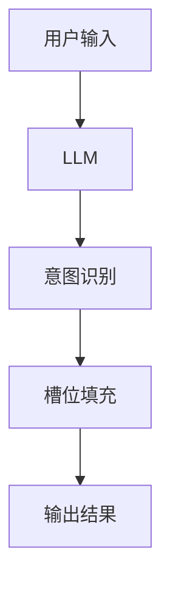
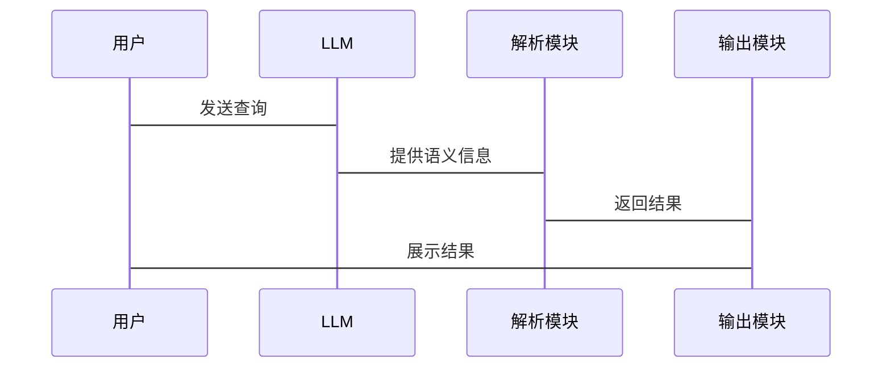

                 


# AI Agent的语言理解：提升LLM的语义解析能力

## 关键词：
AI Agent, 大语言模型, 语义解析, 意图识别, 槽位填充, LLM, 语义理解

## 摘要：
AI Agent的语言理解能力是实现智能交互的核心，而大语言模型（LLM）在其中扮演了关键角色。本文系统地探讨了如何提升LLM的语义解析能力，从基础概念到算法原理，再到系统设计和项目实战，全面解析了AI Agent语言理解的关键技术。通过详细讲解意图识别、槽位填充等核心概念，分析了LLM的语义解析算法，并通过系统架构设计和实际案例展示了如何在实践中提升语义解析能力。最后，本文还提供了代码示例和数学公式，帮助读者深入理解技术细节。

---

## 第1章: AI Agent与语言理解概述

### 1.1 问题背景与描述
#### 1.1.1 语言理解的重要性
语言理解是AI Agent与人类交互的核心能力。人类通过自然语言表达需求，AI Agent需要准确解析这些语言中的语义信息，才能有效地执行任务。

#### 1.1.2 AI Agent的核心问题
AI Agent需要解决的关键问题包括：
1. 如何理解用户的语言意图。
2. 如何从语言中提取有用的信息（如实体、时间、地点等）。
3. 如何将语言解析结果转化为具体行动。

#### 1.1.3 当前技术的局限性
当前的LLM虽然在语言理解上取得了显著进展，但仍面临以下挑战：
1. 对上下文的理解不够深入。
2. 在特定领域中的泛化能力有限。
3. 对多语言和文化差异的适应性不足。

### 1.2 核心概念与边界
#### 1.2.1 AI Agent的定义
AI Agent是一种能够感知环境、自主决策并执行任务的智能实体。它依赖语言理解能力与用户交互。

#### 1.2.2 大语言模型（LLM）的语义解析能力
LLM通过预训练和微调，能够理解上下文、推理意图，并从语言中提取语义信息。

#### 1.2.3 语义理解的边界与外延
语义理解的边界包括：
1. 输入的语言类型（如自然语言、代码等）。
2. 理解的深度（如浅层信息提取、深层推理）。
3. 应用场景的限制（如特定领域任务）。

### 1.3 概念结构与核心要素
#### 1.3.1 AI Agent的组成要素
AI Agent的组成要素包括：
1. 感知模块：负责接收输入并解析语义。
2. 决策模块：根据语义信息做出决策。
3. 执行模块：执行具体任务。

#### 1.3.2 语义解析的关键环节
语义解析的关键环节包括：
1. 语言输入的接收与预处理。
2. 意图识别。
3. 槽位填充。

#### 1.3.3 核心概念的关联性分析
语义解析与AI Agent的其他模块高度关联，是实现智能交互的基础。

### 1.4 本章小结
本章介绍了AI Agent与语言理解的关系，分析了语义解析的核心概念和边界，为后续章节奠定了基础。

---

## 第2章: 语义解析的核心概念与联系

### 2.1 核心概念原理
#### 2.1.1 语义解析的基本原理
语义解析通过分析语言的语法结构、语义信息和上下文，提取意图和实体。

#### 2.1.2 意图识别的机制
意图识别通过分类算法，将用户输入映射到预定义的意图类别。

#### 2.1.3 槽位填充的原理
槽位填充通过序列标注技术，从语言中提取实体信息。

### 2.2 概念属性特征对比
#### 2.2.1 意图识别与槽位填充的对比
| 特性 | 意图识别 | 槽位填充 |
|------|----------|----------|
| 目标 | 确定用户意图 | 提取实体信息 |
| 方法 | 分类 | 序列标注 |

#### 2.2.2 不同语义解析方法的优缺点
- 意图识别：优点是快速分类，缺点是缺乏细粒度信息。
- 槽位填充：优点是信息提取精细，缺点是需要上下文支持。

#### 2.2.3 语义理解的性能指标
性能指标包括准确率、召回率、F1值等。

### 2.3 ER实体关系图


### 2.4 本章小结
本章详细讲解了语义解析的核心概念，分析了意图识别和槽位填充的原理及对比。

---

## 第3章: 大语言模型（LLM）的语义解析算法原理

### 3.1 预训练语言模型概述
#### 3.1.1 LLM的基本结构
LLM通常采用Transformer架构，包括编码器和解码器。

#### 3.1.2 预训练任务的设计
预训练任务包括掩码语言模型、下一个词预测等。

#### 3.1.3 模型的训练过程
模型通过大量数据的预训练，学习语言的语法和语义信息。

### 3.2 解码器的结构与工作原理


### 3.3 概率分布与损失函数
#### 3.3.1 语言模型的概率分布
$$ P(w_1, w_2, ..., w_n) = \prod_{i=1}^{n} P(w_i | w_{i-1}, ..., w_1) $$

#### 3.3.2 损失函数的定义
$$ \text{损失} = -\sum_{i=1}^{n} \log P(w_i | w_{i-1}, ..., w_1) $$

### 3.4 本章小结
本章详细讲解了LLM的算法原理，分析了其在语义解析中的应用。

---

## 第4章: 系统分析与架构设计方案

### 4.1 问题场景介绍
#### 4.1.1 AI Agent的应用场景
AI Agent广泛应用于智能助手、对话系统等领域。

#### 4.1.2 语义解析的典型问题
语义解析需要解决意图识别、槽位填充等问题。

#### 4.1.3 系统设计的目标
设计目标包括准确率高、响应速度快、适应性强。

### 4.2 系统功能设计
#### 4.2.1 领域模型设计


### 4.3 系统架构设计


### 4.4 系统接口设计
#### 4.4.1 输入接口
- 接收自然语言输入。
- 提供API接口。

#### 4.4.2 输出接口
- 返回解析结果。
- 支持JSON格式输出。

#### 4.4.3 API设计
- 输入：用户查询。
- 输出：解析后的意图和槽位信息。

### 4.5 系统交互流程


### 4.6 本章小结
本章通过系统架构设计，展示了如何实现高效的语义解析系统。

---

## 第5章: 项目实战与代码实现

### 5.1 环境安装
安装必要的库：
```bash
pip install transformers torch
```

### 5.2 核心代码实现
```python
from transformers import AutoTokenizer, AutoModelForMaskedLM

tokenizer = AutoTokenizer.from_pretrained('bert-base-uncased')
model = AutoModelForMaskedLM.from_pretrained('bert-base-uncased')
```

### 5.3 案例分析
案例：解析用户查询“我需要预订明天北京的酒店”。

### 5.4 性能优化技巧
- 使用预训练模型。
- 优化解码器的参数。

### 5.5 本章小结
本章通过实际案例，展示了如何实现高效的语义解析系统。

---

## 第6章: 总结与扩展阅读

### 6.1 本章总结
本文系统地探讨了AI Agent的语义解析能力，从理论到实践，全面分析了提升LLM语义解析能力的关键技术。

### 6.2 扩展阅读
建议阅读相关论文和书籍，深入研究语义解析的前沿技术。

### 6.3 最佳实践Tips
- 在实际应用中，结合领域知识优化模型。
- 定期更新模型，保持其性能。

### 6.4 本章小结
本章总结了全文内容，并提供了进一步学习的方向。

---

## 作者：AI天才研究院 & 禅与计算机程序设计艺术

---

希望这篇文章能为您提供深入的理论和实践指导，帮助您更好地理解和提升AI Agent的语义解析能力。

