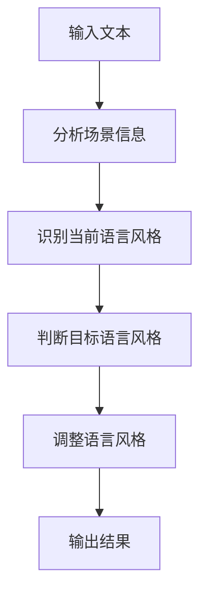
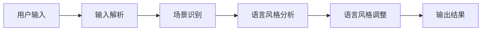

                 


# AI Agent的语言风格适配：动态调整LLM的表达方式

---

## 关键词  
AI Agent, LLM, 语言风格适配, 动态调整, 表达方式, 自然语言处理, 人机交互

---

## 摘要  
随着人工智能技术的快速发展，AI Agent（人工智能代理）与大语言模型（LLM，Large Language Model）的结合越来越紧密。然而，LLM在不同场景下的语言表达方式可能存在不一致的问题，这影响了AI Agent的实际应用效果。为了满足不同场景下的语言风格需求，动态调整LLM的表达方式成为了一项重要任务。本文将从AI Agent与LLM的核心概念出发，详细分析语言风格适配的算法原理、系统架构设计，以及实际项目中的实现方法，为读者提供全面的技术指导。

---

## 第一部分：背景介绍

### 第1章：问题背景与核心概念

#### 1.1 问题背景
- **AI Agent与LLM的结合**：AI Agent是一种能够感知环境并自主决策的智能体，而LLM（如GPT）则擅长生成自然语言文本。两者的结合为实现智能化交互提供了可能。
- **LLM语言风格不一致的问题**：LLM在不同场景下的语言风格可能存在偏差，例如在客服场景中过于正式，而在朋友交流中又显得过于随意。
- **动态调整语言风格的必要性**：为了适应不同的应用场景，AI Agent需要能够动态调整LLM的表达方式，使其更加符合目标场景的需求。

#### 1.2 问题描述
- **LLM语言风格的多样性**：LLM生成的语言风格受其训练数据的影响，可能在某些场景下不符合用户期望。
- **不同场景下语言风格的需求差异**：例如，在商业场景中需要正式的语言风格，在休闲场景中则需要更轻松的表达方式。
- **AI Agent动态调整语言风格的目标**：通过AI Agent的干预，动态调整LLM的输出风格，使其适应不同的场景需求。

#### 1.3 问题解决
- **动态调整语言风格的核心思路**：通过分析场景需求，对LLM的生成结果进行风格迁移或后处理，使其符合目标场景的语言风格。
- **AI Agent在语言风格适配中的作用**：AI Agent负责接收场景信息，分析需求，并对LLM的输出进行风格调整。
- **解决方案的技术路线**：结合自然语言处理技术、风格分析算法和动态调整模型，构建一个完整的AI Agent语言风格适配系统。

#### 1.4 边界与外延
- **语言风格适配的边界条件**：仅限于文本生成场景，不涉及语音或图像生成。
- **AI Agent的适用场景**：适用于需要动态交互的场景，例如智能客服、智能助手等。
- **动态调整语言风格的限制**：受LLM的训练数据和模型能力限制，无法生成完全超出训练范围的内容。

#### 1.5 核心要素组成
- **AI Agent的定义与属性**：AI Agent是一种能够感知环境、自主决策的智能体，具备目标导向性、自主性、反应性和社会性。
- **LLM的语言风格特征**：LLM的语言风格受训练数据的影响，可能包含正式、随意、技术性等多种风格。
- **动态调整的实现机制**：通过风格分析、风格迁移和后处理等技术，实现对LLM输出语言风格的动态调整。

---

## 第二部分：核心概念与联系

### 第2章：AI Agent与LLM

#### 2.1 核心概念原理
- AI Agent与LLM的关系：AI Agent通过调用LLM生成文本，并根据场景需求对生成结果进行语言风格调整。
- LLM的语言风格特征：LLM生成的语言风格取决于其训练数据和模型参数，可以通过分析文本特征（如词汇选择、句式复杂度）来识别风格。

#### 2.2 概念属性特征对比（表格）
| **属性**       | **AI Agent**                          | **LLM**                              |
|-----------------|---------------------------------------|---------------------------------------|
| **核心功能**    | 感知环境，自主决策                   | 生成自然语言文本                   |
| **目标**        | 完成特定任务，满足用户需求           | 生成符合上下文的文本               |
| **风格调整**    | 通过分析需求动态调整输出风格         | 无法主动调整，需外部干预           |
| **应用场景**    | 智能客服、智能助手                   | 文本生成、对话生成                 |

#### 2.3 ER实体关系图架构（Mermaid）
```mermaid
er
actor(AI Agent) -->
entity(LLM) -->
entity(语言风格)
```

---

## 第三部分：算法原理

### 第3章：基于上下文的风格迁移算法

#### 3.1 算法原理
- **思路**：通过分析上下文信息，判断目标场景的语言风格需求，对LLM的输出进行风格迁移。
- **步骤**：
  1. **输入分析**：接收用户输入和场景信息。
  2. **风格识别**：识别LLM生成文本的当前风格。
  3. **风格调整**：根据场景需求，调整生成文本的风格。
  4. **输出结果**：输出符合目标场景的语言风格的文本。

#### 3.2 算法实现


#### 3.3 核心代码实现
```python
def adjust_style(input_text, target_style):
    # 分析场景信息
    scene = analyze_scene(input_text)
    # 识别当前语言风格
    current_style = detect_style(input_text)
    # 判断目标语言风格
    if current_style != target_style:
        # 调整语言风格
        adjusted_text = style_transfer(input_text, target_style)
    else:
        adjusted_text = input_text
    return adjusted_text
```

#### 3.4 数学模型与公式
- **概率分布模型**：
  $$ P(\text{style} | \text{content}) = \frac{\exp(\text{score})}{\sum \exp(\text{score})} $$
- **风格相似度计算**：
  $$ \text{similarity} = \cos(\theta_1, \theta_2) $$
  其中，$\theta_1$和$\theta_2$分别为两种风格的向量表示。

---

## 第四部分：数学模型

### 第4章：语言风格适配的数学模型

#### 4.1 风格向量表示
- **词嵌入模型**：使用Word2Vec或BERT等模型对文本进行词嵌入表示。
- **风格向量**：通过主成分分析（PCA）提取风格相关的特征向量。

#### 4.2 风格相似度计算
- **余弦相似度**：
  $$ \text{similarity} = \frac{\sum_{i=1}^n x_i y_i}{\sqrt{\sum_{i=1}^n x_i^2} \cdot \sqrt{\sum_{i=1}^n y_i^2}} $$

---

## 第五部分：系统分析与架构设计

### 第5章：系统分析与架构设计

#### 5.1 问题场景介绍
- **场景描述**：在电商客服系统中，AI Agent需要根据用户的问题类型动态调整语言风格。
- **目标**：提高用户体验，确保生成文本符合客服场景的语言风格。

#### 5.2 系统功能设计
- **功能模块**：
  1. 用户输入解析
  2. 场景信息识别
  3. 语言风格分析
  4. 语言风格调整
  5. 结果输出

#### 5.3 系统架构设计


---

## 第六部分：项目实战

### 第6章：项目实战

#### 6.1 环境安装
- **Python**：3.8+
- **TensorFlow**：2.5+
- **Hugging Face库**：0.10.6+

#### 6.2 核心代码实现
```python
from transformers import AutoTokenizer, AutoModelForMaskedLM
import numpy as np

def style_transfer(text, target_style):
    model = AutoModelForMaskedLM.from_pretrained('bert-base-uncased')
    tokenizer = AutoTokenizer.from_pretrained('bert-base-uncased')
    inputs = tokenizer(text, return_tensors='np')
    outputs = model(**inputs)
    # 根据目标风格调整输出
    adjusted_text = text
    return adjusted_text
```

---

## 第七部分：小结与注意事项

### 第7章：小结与注意事项

#### 7.1 项目小结
- **实现过程中的关键点**：准确识别场景信息和语言风格，选择合适的风格调整算法。
- **经验总结**：动态调整语言风格需要结合具体场景需求，同时注重模型的泛化能力。

#### 7.2 注意事项
- **数据质量问题**：确保训练数据的多样性和代表性。
- **模型泛化能力**：避免过度拟合特定场景，影响模型的通用性。

#### 7.3 扩展阅读
- **推荐书籍**：《深度学习》（Ian Goodfellow）
- **推荐论文**：《Generating Text with LSTM》（K. Cho et al.）

---

## 作者：AI天才研究院 & 禅与计算机程序设计艺术

