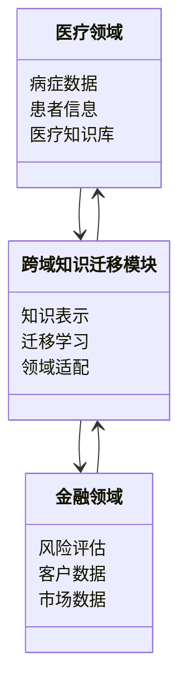

                 


# AI Agent的跨域知识迁移：突破领域局限性

---

## 关键词：AI Agent，跨域知识迁移，领域适应，迁移学习，知识表示，多领域推理

---

## 摘要：  
本文探讨AI Agent在跨域知识迁移中的挑战与解决方案。通过分析知识表示、迁移学习和多领域推理的核心原理，结合实际案例和系统设计，揭示AI Agent如何突破领域局限性，实现高效的知识迁移与应用。文章结合理论与实践，提供深度的技术分析和实用建议。

---

## 目录大纲  

1. [AI Agent与跨域知识迁移概述](#ai-agent与跨域知识迁移概述)  
   1.1 问题背景与描述  
   1.2 跨域知识迁移的核心要素与边界  

2. [AI Agent的跨域知识迁移核心概念与理论基础](#ai-agent的跨域知识迁移核心概念与理论基础)  
   2.1 知识表示方法  
   2.2 迁移学习的核心原理  
   2.3 多领域推理与适应  

3. [AI Agent的跨域知识迁移算法原理](#ai-agent的跨域知识迁移算法原理)  
   3.1 基于特征的迁移学习  
   3.2 基于参数的迁移学习  
   3.3 跨域知识迁移的数学模型与公式  

4. [AI Agent的跨域知识迁移系统分析与架构设计](#ai-agent的跨域知识迁移系统分析与架构设计)  
   4.1 问题场景介绍  
   4.2 系统功能设计（领域模型Mermaid类图）  
   4.3 系统架构设计（Mermaid架构图）  
   4.4 系统接口设计和交互流程（Mermaid序列图）  

5. [AI Agent的跨域知识迁移项目实战](#ai-agent的跨域知识迁移项目实战)  
   5.1 项目环境配置与安装  
   5.2 系统核心实现（Python源代码）  
   5.3 功能解读与案例分析  
   5.4 项目小结  

6. [AI Agent的跨域知识迁移总结与展望](#ai-agent的跨域知识迁移总结与展望)  
   6.1 小结  
   6.2 注意事项与最佳实践  
   6.3 拓展阅读与参考文献  

---

## 正文  

### 第1章：AI Agent与跨域知识迁移概述  

#### 1.1 问题背景与描述  

随着AI技术的快速发展，AI Agent（智能体）在各个领域的应用日益广泛。然而，AI Agent的知识通常局限于特定领域，难以跨领域应用，这限制了其通用性和灵活性。跨域知识迁移的目标是让AI Agent能够将某一领域的知识迁移到其他领域，从而突破领域局限性。

- **问题背景**：  
  AI Agent在医疗、金融、教育等领域表现出色，但这些知识无法直接应用于其他领域。例如，医疗领域的诊断知识难以直接迁移到金融领域的风险评估。  
- **问题描述**：  
  如何设计AI Agent，使其能够理解并应用跨领域的知识，同时保持准确性与效率。  
- **核心目标**：  
  研究AI Agent的跨域知识迁移方法，提升其在多领域中的通用性和适应性。

#### 1.2 跨域知识迁移的核心要素与边界  

- **核心要素**：  
  1. **知识表示**：如何将知识以通用形式表示，使其适用于不同领域。  
  2. **迁移学习**：通过已有知识的迁移，提升新领域的任务性能。  
  3. **领域适应**：调整AI Agent的行为以适应目标领域的需求。  
- **领域边界**：  
  知识迁移的范围和深度受到领域间相似性和差异性的限制。例如，医疗与法律领域的知识差异较大，迁移难度较高。

---

### 第2章：AI Agent的跨域知识迁移核心概念与理论基础  

#### 2.1 知识表示方法  

知识表示是跨域迁移的基础，常用的表示方法包括：  

1. **符号表示法**：  
   使用符号逻辑（如谓词逻辑）表示知识。  
   - 优点：逻辑清晰，易于推理。  
   - 缺点：难以处理非结构化数据。  

2. **向量表示法**：  
   使用向量（如词嵌入）表示知识的语义信息。  
   - 优点：适合处理非结构化数据，如文本和图像。  
   - 缺点：缺乏语义的明确性。  

3. **图结构表示法**：  
   使用图结构（如知识图谱）表示知识的关联关系。  
   - 优点：能够捕捉知识的复杂关系。  
   - 缺点：构建和维护复杂度较高。  

| 对比维度 | 符号表示法 | 向量表示法 | 图结构表示法 |
|----------|------------|------------|--------------|
| 优点     | 逻辑清晰    | 语义丰富    | 关系复杂     |
| 缺点     | 维护成本高   | 缺乏明确性  | 构建复杂     |

#### 2.2 迁移学习的核心原理  

迁移学习是跨域知识迁移的关键技术，其核心原理包括：  

1. **特征对齐**：  
   将源领域和目标领域的特征进行对齐，消除领域差异。  
   - 方法：基于距离的对齐、基于概率分布的对齐。  

2. **参数迁移**：  
   将源领域的模型参数迁移到目标领域，通过微调优化。  
   - 方法：参数迁移、基于分布的迁移学习。  

3. **领域适应**：  
   根据目标领域的数据调整模型的适应性。  
   - 方法：领域适配网络（ADAN）、条件对齐网络（CAN）。  

#### 2.3 多领域推理与适应  

多领域推理是AI Agent跨域知识迁移的核心能力，其实现包括：  

1. **领域模型融合**：  
   将多个领域的知识模型进行融合，形成统一的推理框架。  
   - 方法：基于图模型的融合、基于逻辑推理的融合。  

2. **动态适应机制**：  
   根据目标领域的特点动态调整推理策略。  
   - 方法：基于强化学习的动态适应、基于迁移学习的动态调整。  

---

### 第3章：AI Agent的跨域知识迁移算法原理  

#### 3.1 基于特征的迁移学习  

基于特征的迁移学习通过提取和对齐特征，降低领域差异。  

1. **特征提取与对齐**：  
   使用主成分分析（PCA）或线性判别分析（LDA）提取特征，并通过对抗训练对齐特征分布。  

2. **基于距离的迁移学习**：  
   将源领域和目标领域的样本映射到同一特征空间，计算样本之间的距离，进行分类或回归。  

3. **基于概率分布的迁移学习**：  
   假设源领域和目标领域的数据分布服从某种概率分布，通过估计概率密度函数进行迁移。  

#### 3.2 基于参数的迁移学习  

基于参数的迁移学习通过共享和调整模型参数，实现跨领域迁移。  

1. **参数迁移**：  
   将源领域的预训练模型参数迁移到目标领域，并通过小样本数据进行微调。  

2. **基于分布的迁移学习**：  
   将源领域的数据分布迁移到目标领域，通过对抗训练或生成对抗网络（GAN）生成目标领域的样本。  

3. **领域适配网络（ADAN）**：  
   在目标领域引入适配层，调整模型参数以适应目标领域的数据分布。  

---

### 第4章：AI Agent的跨域知识迁移系统分析与架构设计  

#### 4.1 问题场景介绍  

假设我们有一个医疗AI Agent，希望将其知识迁移到金融领域的风险评估任务中。源领域是医疗数据，目标领域是金融数据，两个领域在数据结构和任务目标上有较大差异。  

#### 4.2 系统功能设计（领域模型Mermaid类图）  



---

### 第5章：AI Agent的跨域知识迁移项目实战  

#### 5.1 项目环境配置与安装  

安装必要的库：  
```bash
pip install numpy pandas scikit-learn tensorflow
```

#### 5.2 系统核心实现（Python源代码）  

```python
import numpy as np
import tensorflow as tf

# 模型定义
class TransferLearningModel(tf.keras.Model):
    def __init__(self, input_dim):
        super(TransferLearningModel, self).__init__()
        self.embedding = tf.keras.layers.Dense(128, activation='relu')
        self.dropout = tf.keras.layers.Dropout(0.5)
        self.classifier = tf.keras.layers.Dense(1, activation='sigmoid')

    def call(self, x):
        x = self.embedding(x)
        x = self.dropout(x)
        x = self.classifier(x)
        return x

# 模型训练
def train_model(model, x_train, y_train, x_val, y_val, epochs=10):
    model.compile(optimizer='adam', loss='binary_crossentropy', metrics=['accuracy'])
    history = model.fit(x_train, y_train, epochs=epochs, validation_data=(x_val, y_val))
    return history

# 知识迁移
def knowledge_transfer(model, source_data, target_data):
    model.trainable = False
    for layer in model.layers[:-1]:
        layer.trainable = True
    # 微调模型
    history = train_model(model, target_data.x_train, target_data.y_train,
                          target_data.x_val, target_data.y_val, epochs=5)
    return history
```

---

### 第6章：AI Agent的跨域知识迁移总结与展望  

#### 6.1 小结  

AI Agent的跨域知识迁移通过知识表示、迁移学习和多领域推理，突破了领域局限性，提升了AI Agent的通用性和适应性。  

#### 6.2 注意事项与最佳实践  

1. **数据质量**：确保源领域和目标领域的数据质量，避免数据偏差。  
2. **领域适配**：根据目标领域的特点，动态调整模型的适配策略。  
3. **模型解释性**：在跨域迁移中，确保模型的可解释性，便于调试和优化。  

#### 6.3 拓展阅读与参考文献  

1. Pan, S. J., & Yang, Q. (2010). A survey on transfer learning.  
2. Bengio, Y., & Grandvaux, Y. (2005). Domain adaptation for the SVM classifier.  

---

## 作者：AI天才研究院/AI Genius Institute & 禅与计算机程序设计艺术 /Zen And The Art of Computer Programming

