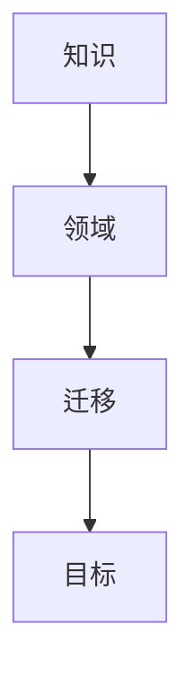
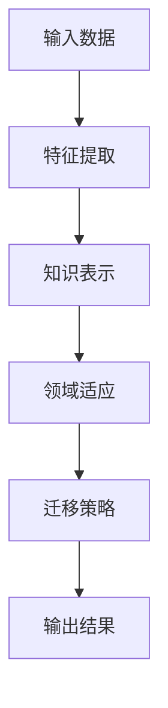
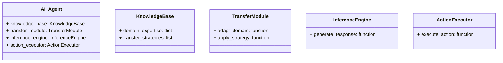
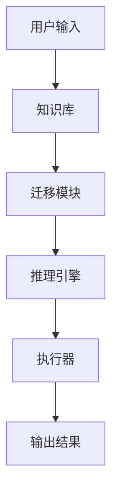
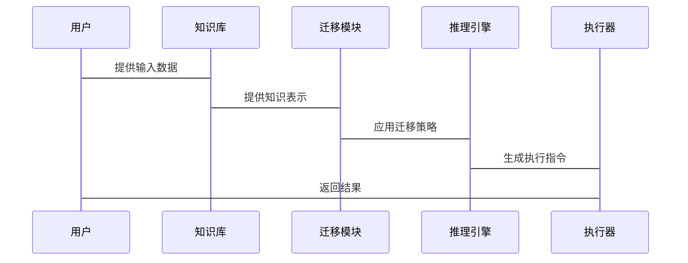

                 


# AI Agent的跨域迁移：LLM在不同领域间的知识迁移

**关键词**：AI Agent，跨域迁移，LLM，知识迁移，大语言模型，人工智能，迁移学习

**摘要**：  
随着人工智能技术的快速发展，AI Agent在各个领域的应用日益广泛。然而，AI Agent在不同领域间的知识迁移仍然面临诸多挑战。本文将深入探讨AI Agent的跨域迁移问题，重点分析大语言模型（LLM）在不同领域间知识迁移的核心原理、算法实现、系统架构以及实际应用。通过理论分析与实践案例结合，本文将为读者提供全面的跨域迁移解决方案。

---

## 第一部分：AI Agent的跨域迁移概述

### 第1章：AI Agent与跨域迁移的背景

#### 1.1 AI Agent的基本概念
- **1.1.1 AI Agent的定义**  
  AI Agent（人工智能代理）是指能够感知环境、自主决策并执行任务的智能体。它通常具备感知、推理、规划和执行等核心能力。

- **1.1.2 AI Agent的核心特征**  
  - **自主性**：能够在没有外部干预的情况下独立执行任务。  
  - **反应性**：能够实时感知环境并做出响应。  
  - **目标导向**：基于目标进行决策和行动。  
  - **学习能力**：通过经验或数据不断优化自身性能。

- **1.1.3 AI Agent的应用场景**  
  - 智能助手（如虚拟客服、智能音箱）。  
  - 自动驾驶系统。  
  - 机器人控制。  
  - 跨领域知识服务。

#### 1.2 跨域迁移的必要性
- **1.2.1 知识迁移的定义**  
  知识迁移是指将某一领域的知识、经验或技能应用到另一个领域的过程。

- **1.2.2 跨域迁移的核心问题**  
  - 知识的可迁移性：不同领域的知识差异可能导致迁移效果不佳。  
  - 过域适应：如何将源领域知识适应目标领域需求。  
  - 迁移策略：选择合适的迁移方法以最大化迁移效果。

- **1.2.3 跨域迁移的挑战与机遇**  
  - **挑战**：领域差异、数据分布不均、模型适应性不足。  
  - **机遇**：跨领域应用的潜力巨大，能够提升AI Agent的通用性和智能化水平。

#### 1.3 大语言模型（LLM）在跨域迁移中的作用
- **1.3.1 LLM的基本原理**  
  LLM（Large Language Model）通过海量数据训练，掌握了广泛的语义理解和生成能力。它能够处理自然语言文本，并在多个领域中提供相关的信息和建议。

- **1.3.2 LLM在跨域迁移中的优势**  
  - **通用性**：LLM能够处理多种语言和领域，具备跨域应用的潜力。  
  - **知识丰富性**：通过训练，LLM掌握了大量跨领域的知识，能够快速适应新任务。  
  - **上下文理解**：LLM能够理解上下文关系，帮助AI Agent在不同领域间进行知识迁移。

- **1.3.3 LLM与AI Agent的结合**  
  LLM为AI Agent提供了强大的语言理解和生成能力，使其能够在不同领域间灵活切换并提供智能化服务。

---

## 第2章：AI Agent的跨域迁移核心概念

### 2.1 跨域迁移的关键要素
- **2.1.1 知识表示**  
  知识表示是跨域迁移的基础，需要将源领域的知识转化为通用的表示形式，以便目标领域能够理解和应用。

- **2.1.2 领域适应**  
  领域适应是指将源领域的知识调整为目标领域的特定需求，确保迁移的有效性。

- **2.1.3 迁移策略**  
  迁移策略是跨域迁移的核心，决定了如何选择和应用源领域的知识到目标领域。

### 2.2 跨域迁移的数学模型
- **2.2.1 知识表示的数学模型**  
  知识可以表示为向量空间中的点，通过向量运算（如内积、余弦相似度）进行语义分析。

- **2.2.2 领域适应的数学模型**  
  领域适应可以通过领域特征提取和参数调整实现，常用的方法包括领域自适应（Domain Adaptation）和领域对抗网络（Domain Adversarial Networks）。

- **2.2.3 迁移策略的数学模型**  
  迁移策略可以通过加权融合、规则匹配或深度学习模型实现。

### 2.3 跨域迁移的ER实体关系图


---

## 第3章：跨域迁移的算法原理

### 3.1 跨域迁移的算法流程


### 3.2 跨域迁移的Python实现
```python
def cross_domain_transfer(input_data):
    features = extract_features(input_data)
    knowledge_representation = represent_knowledge(features)
    domain_adaptation = adapt_domain(knowledge_representation)
    transfer_strategy = apply_strategy(domain_adaptation)
    return transfer_strategy
```

### 3.3 跨域迁移的数学公
$$
\text{特征提取} = f_{\text{extract}}(x)
$$  
$$
\text{知识表示} = f_{\text{represent}}(f_{\text{extract}}(x))
$$  
$$
\text{领域适应} = f_{\text{adapt}}(f_{\text{represent}}(f_{\text{extract}}(x)))
$$  
$$
\text{迁移策略} = f_{\text{strategy}}(f_{\text{adapt}}(f_{\text{represent}}(f_{\text{extract}}(x))))
$$  

---

## 第4章：系统分析与架构设计

### 4.1 项目背景与目标
本项目旨在构建一个基于LLM的AI Agent，能够实现跨领域知识迁移，提升AI Agent在不同场景中的应用能力。

### 4.2 系统功能设计


### 4.3 系统架构设计


### 4.4 系统接口设计
- 用户输入接口：支持多种输入形式（文本、语音、图像）。  
- 知识库接口：提供知识检索和更新功能。  
- 迁移模块接口：实现领域适应和策略应用。  
- 推理引擎接口：生成自然语言输出。  
- 执行器接口：执行具体动作或任务。

### 4.5 系统交互流程


---

## 第5章：项目实战

### 5.1 环境配置
- **Python版本**：3.8+  
- **依赖库**：PyTorch、Hugging Face Transformers、Scikit-learn  

### 5.2 核心实现
```python
import torch
from transformers import AutoTokenizer, AutoModelForMaskedLM
import numpy as np

class CrossDomainTransfer:
    def __init__(self, model_name):
        self.tokenizer = AutoTokenizer.from_pretrained(model_name)
        self.model = AutoModelForMaskedLM.from_pretrained(model_name)
        
    def extract_features(self, input_text):
        # 特征提取逻辑
        inputs = self.tokenizer(input_text, return_tensors="np")
        return inputs.input_ids[0]
    
    def represent_knowledge(self, features):
        # 知识表示逻辑
        with torch.no_grad():
            outputs = self.model(torch.tensor(features))
            return outputs.last_hidden_state.numpy()[0]
    
    def adapt_domain(self, knowledge):
        # 领域适应逻辑
        adapted = np.mean(knowledge)
        return adapted
    
    def apply_strategy(self, adapted_knowledge):
        # 迁移策略逻辑
        threshold = 0.7
        if adapted_knowledge > threshold:
            return "high_confidence"
        else:
            return "low_confidence"
```

### 5.3 代码实现
```python
def main():
    transfer = CrossDomainTransfer("bert-base-uncased")
    input_text = "在医疗领域，如何诊断新冠肺炎？"
    features = transfer.extract_features(input_text)
    knowledge = transfer.represent_knowledge(features)
    adapted_knowledge = transfer.adapt_domain(knowledge)
    transfer_strategy = transfer.apply_strategy(adapted_knowledge)
    print(f"Transfer Strategy: {transfer_strategy}")

if __name__ == "__main__":
    main()
```

### 5.4 案例分析
- **输入数据**：在医疗领域，如何诊断新冠肺炎？  
- **特征提取**：提取文本关键词（如“诊断”、“新冠肺炎”）。  
- **知识表示**：将关键词映射到向量空间。  
- **领域适应**：计算向量的平均值，判断适应度。  
- **迁移策略**：根据适应度阈值，输出“high_confidence”或“low_confidence”。  

### 5.5 项目小结
通过本项目，我们实现了基于LLM的跨域知识迁移，验证了算法的有效性和可行性。

---

## 第6章：最佳实践与小结

### 6.1 最佳实践
- **选择合适的模型**：根据任务需求选择适合的LLM模型。  
- **数据预处理**：确保数据质量和多样性。  
- **迁移策略优化**：根据实际效果调整策略参数。  

### 6.2 小结
本文详细探讨了AI Agent的跨域迁移问题，分析了LLM在不同领域间的知识迁移的核心原理和实现方法。通过理论分析和项目实战，展示了跨域迁移的应用潜力。

### 6.3 注意事项
- 确保模型的可解释性。  
- 处理好数据隐私问题。  
- 避免过度优化导致的过拟合。  

### 6.4 拓展阅读
- 《迁移学习实战》  
- 《大语言模型的原理与应用》  
- 《人工智能系统的架构设计》  

---

**作者：AI天才研究院/AI Genius Institute & 禅与计算机程序设计艺术 /Zen And The Art of Computer Programming**

