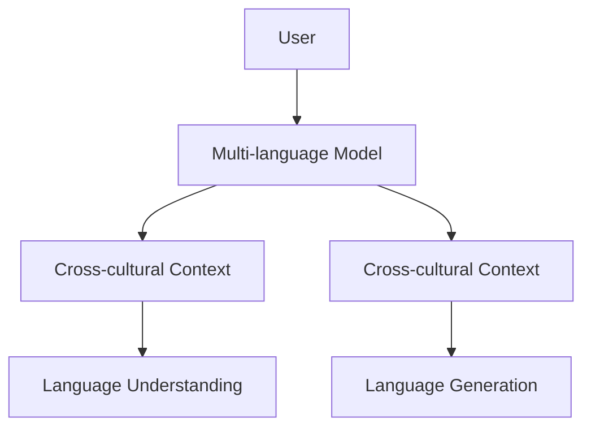
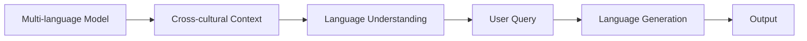
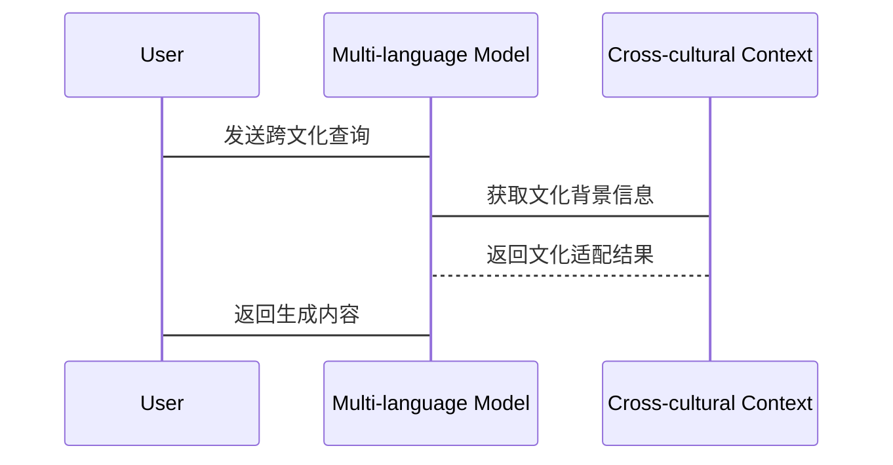

                 

# AI Agent的跨文化语言理解与生成

## 关键词：AI Agent，跨文化语言，多语言模型，语义理解，生成模型

## 摘要：  
AI Agent的跨文化语言理解与生成是一个结合人工智能、自然语言处理和跨文化研究的前沿领域。随着全球化的发展，AI Agent需要能够理解并生成多种语言，同时适应不同文化背景下的语境和语义。本文从AI Agent的基本概念出发，深入分析跨文化语言理解与生成的核心原理，探讨多语言模型的构建与优化，结合实际案例，展示如何通过系统设计和项目实践实现跨文化语言处理。文章还总结了跨文化语言处理的最佳实践和未来发展方向。

---

# 目录

## 第一部分：AI Agent与跨文化语言理解的背景

### 第1章：AI Agent的基本概念与跨文化语言处理的必要性

#### 1.1 AI Agent的定义与特征
- 1.1.1 AI Agent的概念
- 1.1.2 跨文化语言理解的重要性
- 1.1.3 跨文化语言生成的挑战

#### 1.2 跨文化语言理解与生成的背景
- 1.2.1 当前AI Agent的发展现状
- 1.2.2 跨文化语言处理的现实需求
- 1.2.3 跨文化语言理解与生成的技术挑战

#### 1.3 跨文化语言理解与生成的核心问题
- 1.3.1 问题背景与问题描述
- 1.3.2 跨文化语言理解与生成的边界与外延
- 1.3.3 核心概念与核心要素组成

## 第二部分：跨文化语言理解与生成的核心概念与联系

### 第2章：跨文化语言理解的核心原理

#### 2.1 多语言模型的构建原理
- 2.1.1 多语言模型的训练目标
- 2.1.2 跨文化语境下的语义理解
- 2.1.3 跨文化语言理解的特征对比

#### 2.2 跨文化语言生成的原理
- 2.2.1 多语言生成模型的工作原理
- 2.2.2 跨文化语境下的语言生成策略
- 2.2.3 跨文化语言生成的特征对比

#### 2.3 跨文化语言理解与生成的ER实体关系图

## 第三部分：跨文化语言理解与生成的算法原理

### 第3章：多语言模型的训练与优化

#### 3.1 多语言模型的预训练
- 3.1.1 预训练目标与损失函数
- 3.1.2 跨文化语料库的构建与特点
- 3.1.3 预训练过程中的文化适应策略

#### 3.2 多语言模型的微调
- 3.2.1 微调的目标与方法
- 3.2.2 跨文化数据的平衡与分布
- 3.2.3 微调过程中的文化适配优化

#### 3.3 跨文化语言生成的数学模型
- 3.3.1 生成模型的数学表达
- 3.3.2 跨文化语境下的条件概率建模
- 3.3.3 跨文化语言生成的损失函数
$$\text{Loss} = -\sum_{i=1}^{n} \log P(y_i|x_i, c_i)$$

## 第四部分：跨文化语言理解与生成的系统分析与架构设计

### 第4章：系统分析与架构设计方案

#### 4.1 项目介绍
- 4.1.1 跨文化AI Agent的项目目标
- 4.1.2 项目需求与范围
- 4.1.3 项目的关键技术点

#### 4.2 系统功能设计
- 4.2.1 多语言处理模块
- 4.2.2 跨文化适配模块
- 4.2.3 语言生成模块

#### 4.3 系统架构设计

#### 4.4 系统接口设计
- 4.4.1 输入接口设计
- 4.4.2 输出接口设计
- 4.4.3 API设计与调用流程

#### 4.5 系统交互流程

## 第五部分：跨文化语言理解与生成的项目实战

### 第5章：项目实战与代码实现

#### 5.1 环境安装与配置
- 5.1.1 安装Python与相关库
- 5.1.2 安装深度学习框架（如TensorFlow、PyTorch）
- 5.1.3 安装NLP处理库（如spaCy、NLTK）

#### 5.2 多语言模型的加载与使用
- 5.2.1 加载预训练模型
- 5.2.2 跨文化数据的处理与输入
- 5.2.3 模型的调用与结果输出

#### 5.3 跨文化语言生成的代码实现
- 5.3.1 生成模型的训练代码
- 5.3.2 跨文化数据的微调代码
- 5.3.3 生成结果的评估与优化

#### 5.4 实际案例分析
- 5.4.1 跨文化对话场景分析
- 5.4.2 生成结果的案例解读
- 5.4.3 案例分析与经验总结

## 第六部分：总结与展望

### 第6章：总结与最佳实践

#### 6.1 核心总结
- 6.1.1 跨文化语言理解与生成的核心要点
- 6.1.2 多语言模型的构建与优化经验
- 6.1.3 系统设计与实现的关键环节

#### 6.2 最佳实践
- 6.2.1 跨文化数据处理的注意事项
- 6.2.2 多语言模型训练的优化建议
- 6.2.3 系统部署与维护的实践心得

#### 6.3 未来展望
- 6.3.1 跨文化语言处理的未来发展方向
- 6.3.2 多语言模型的前沿技术探索
- 6.3.3 跨文化AI Agent的潜在应用场景

---

# 作者：AI天才研究院/AI Genius Institute & 禅与计算机程序设计艺术 /Zen And The Art of Computer Programming

