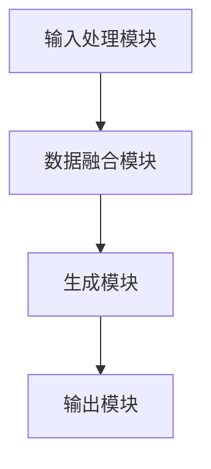
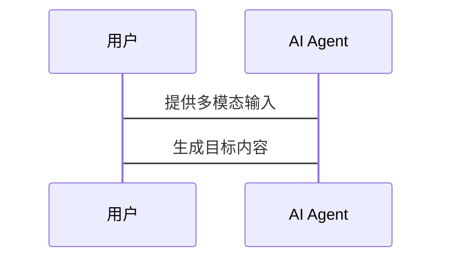

                 


# AI Agent的跨模态内容理解与生成

> 关键词：AI Agent, 跨模态内容理解, 跨模态生成, 多模态数据, Transformer模型, 生成模型

> 摘要：AI Agent通过跨模态技术能够理解并生成多种类型的内容，这不仅提升了其智能水平，还拓展了其应用场景。本文从AI Agent的基本概念出发，详细探讨了跨模态内容理解与生成的核心技术，包括数据处理、模型构建、算法设计等，并通过实际案例展示了这些技术的应用。最后，本文总结了AI Agent在跨模态领域的最佳实践与未来研究方向。

---

# 第一部分: AI Agent的跨模态内容理解与生成引言

## 第1章: AI Agent的基本概念与背景

### 1.1 AI Agent的定义与特点

AI Agent（人工智能代理）是指能够感知环境、执行任务并做出决策的智能实体。它具备以下特点：
- **自主性**：能够在没有外部干预的情况下自主运作。
- **反应性**：能够实时感知环境并做出响应。
- **学习性**：能够通过经验或数据不断优化自身的行为。
- **交互性**：能够与人类或其他系统进行交互。

AI Agent的核心目标是通过智能化的方式解决实际问题，例如信息检索、任务执行、决策支持等。

### 1.2 跨模态技术的背景与重要性

跨模态技术是指在多种数据类型（如文本、图像、语音、视频等）之间进行信息理解和生成的技术。随着AI技术的发展，跨模态技术在AI Agent中的应用越来越重要。例如，AI Agent可以通过理解图像和文本的关联，提供更精准的信息检索服务。

跨模态技术的重要性体现在以下几个方面：
1. **提升信息理解能力**：通过融合多模态数据，AI Agent能够更全面地理解输入信息。
2. **增强生成能力**：跨模态生成能够生成多种形式的内容，例如根据文本生成图像，或根据图像生成描述。
3. **拓展应用场景**：跨模态技术使得AI Agent能够应用于更多领域，例如智能客服、图像描述生成、多模态对话系统等。

### 1.3 AI Agent在跨模态内容理解与生成中的应用

AI Agent在跨模态内容理解与生成中的应用场景广泛，以下是一些典型场景：
1. **多模态对话系统**：AI Agent能够理解用户的语音、文本，并生成相应的多模态响应。
2. **图像描述生成**：AI Agent可以根据输入的图像生成对应的文本描述。
3. **视频内容理解**：AI Agent能够理解视频中的视觉和听觉信息，并生成相应的摘要或标签。
4. **智能客服**：AI Agent可以通过理解用户的文本或语音请求，生成相应的回复或操作。

### 1.4 本章小结

本章介绍了AI Agent的基本概念和特点，并重点探讨了跨模态技术在AI Agent中的重要性和应用场景。跨模态技术使得AI Agent能够更智能地理解并生成多模态内容，从而在更多领域中发挥重要作用。

---

# 第二部分: 跨模态内容理解与生成的核心技术

## 第2章: 跨模态数据处理与模型基础

### 2.1 跨模态数据的表示与融合

跨模态数据的表示与融合是跨模态理解的核心技术之一。常见的跨模态数据表示方法包括：
1. **模态对齐**：将不同模态的数据对齐到同一空间，例如将文本和图像映射到相同的向量空间。
2. **模态融合**：将不同模态的数据进行融合，例如通过加权的方式结合文本和图像特征。

### 2.2 多模态模型的基本原理

多模态模型的核心目标是通过多个模态的数据进行联合建模，从而提升模型的表达能力和理解能力。常见的多模态模型包括：
1. **多模态Transformer模型**：基于Transformer结构，同时处理多个模态的数据。
2. **模态特定模型+融合层**：分别对每个模态数据进行建模，然后通过融合层进行信息整合。

### 2.3 跨模态学习的挑战与解决方案

跨模态学习面临以下挑战：
1. **数据异构性**：不同模态的数据具有不同的特征维度和分布。
2. **模态间关联性**：不同模态之间的关联性可能较弱，导致跨模态学习效果不佳。

针对上述挑战，提出了以下解决方案：
1. **跨模态对齐**：通过学习模态间的对齐关系，增强模态间的关联性。
2. **模态特定注意力机制**：根据不同模态的重要性动态调整注意力权重。

---

## 第3章: AI Agent中的生成模型

### 3.1 生成模型的基本原理

生成模型的核心目标是通过数据生成新的内容。常见的生成模型包括：
1. **基于规则的生成模型**：通过预定义的规则生成内容。
2. **基于统计的生成模型**：基于概率分布生成内容。
3. **基于深度学习的生成模型**：通过神经网络生成内容，例如GPT系列模型。

### 3.2 基于Transformer的生成模型

Transformer模型在生成任务中表现出色。其核心思想是通过自注意力机制捕捉输入序列中的全局关系，并通过解码器生成目标序列。

### 3.3 跨模态生成模型的创新与挑战

跨模态生成模型的创新在于能够生成多种形式的内容，例如根据文本生成图像或根据图像生成文本。然而，跨模态生成模型也面临以下挑战：
1. **跨模态一致性**：生成的内容需要与输入内容一致。
2. **生成多样性**：生成的内容需要多样化，以满足不同的需求。

---

# 第三部分: 系统架构与设计

## 第4章: AI Agent的系统架构设计

### 4.1 系统功能设计

AI Agent的系统功能设计包括：
1. **输入处理模块**：接收多模态输入数据。
2. **数据融合模块**：对多模态数据进行融合处理。
3. **生成模块**：根据融合后的数据生成目标内容。
4. **输出模块**：将生成的内容输出给用户。

### 4.2 系统架构图



### 4.3 系统交互流程



---

# 第四部分: 项目实战

## 第5章: 跨模态内容生成的项目实战

### 5.1 环境搭建

需要安装以下工具和库：
1. Python 3.8+
2. PyTorch
3. Transformers库
4. Mermaid图生成工具

### 5.2 核心实现代码

以下是一个基于Transformer的跨模态生成模型的代码示例：

```python
import torch
from torch import nn
from transformers import AutoTokenizer, AutoModel

class MultiModalGenerator(nn.Module):
    def __init__(self, vocab_size):
        super().__init__()
        self.text_encoder = AutoModel.from_pretrained("bert-base-uncased")
        self.image_encoder = nn.Linear(2048, 512)  # 假设图像特征维度为2048
        self.decoder = AutoModelForCausalLM.from_pretrained("gpt2")
        self.cross_attention = nn.MultiheadAttention(embed_dim=512, num_heads=8)
        
    def forward(self, text_input, image_input):
        # 处理文本输入
        text_features = self.text_encoder(text_input).last_hidden_state
        # 处理图像输入
        image_features = self.image_encoder(image_input)
        # 跨模态注意力
        cross_features = self.cross_attention(text_features.unsqueeze(0), image_features.unsqueeze(0))[0]
        # 解码器输入
        decoder_input = cross_features[:, 0, :]
        outputs = self.decoder(decoder_input)
        return outputs
```

### 5.3 案例分析

通过一个具体的案例分析，展示了如何利用上述模型实现跨模态内容生成。例如，给定一张图像和一段文本描述，生成一段相关的文本描述。

---

# 第五部分: 最佳实践与未来展望

## 第6章: 最佳实践与未来展望

### 6.1 最佳实践

1. **数据预处理**：在跨模态任务中，数据预处理非常重要，包括数据对齐、特征提取等。
2. **模型调优**：通过交叉验证和超参数调优，提升模型的性能。
3. **多模态融合**：探索不同的模态融合方法，以获得更好的效果。

### 6.2 未来展望

随着AI技术的不断发展，跨模态内容理解与生成将更加智能化和多样化。未来的研究方向包括：
1. **更强大的多模态模型**：开发更高效的多模态模型，例如基于视觉-语言模型的改进。
2. **跨模态交互**：探索更自然的跨模态交互方式，例如实时语音-图像交互。
3. **跨模态推理**：研究如何在跨模态数据上进行推理，例如基于图像和文本进行推理。

---

# 结语

AI Agent的跨模态内容理解与生成是一项具有挑战性和前沿性的技术。通过本文的介绍，读者可以深入了解跨模态技术的核心原理、系统架构以及实际应用。未来，随着技术的不断发展，AI Agent将在更多领域发挥重要作用。

---

作者：AI天才研究院/AI Genius Institute & 禅与计算机程序设计艺术 /Zen And The Art of Computer Programming

