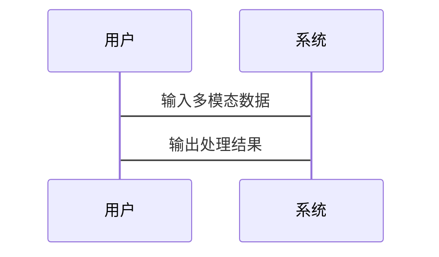

                 


```markdown
# AI Agent的跨模态学习：促进多种感官信息的融合

> 关键词：AI Agent，跨模态学习，多模态数据，融合方法，感官信息

> 摘要：本文系统地探讨了AI Agent在跨模态学习中的应用，重点介绍了多种感官信息融合的核心概念、算法原理、系统架构及项目实战。通过详细分析跨模态学习的基本原理、关键技术及实际应用，展示了如何通过多模态数据的融合提升AI Agent的感知与决策能力。本文旨在为AI开发者、研究人员及相关领域读者提供一份全面的技术指南。

---

## 第一部分: 跨模态学习与AI Agent基础

### 第1章: 跨模态学习的背景与意义

#### 1.1 跨模态学习的背景与意义
- **1.1.1 多模态数据的定义与特点**
  - 模态的定义：视觉、听觉、触觉、语言等不同形式的数据。
  - 多模态数据的特点：信息互补性、异构性、复杂性。
- **1.1.2 跨模态学习的核心问题**
  - 数据异构性：不同模态的数据形式和特征空间差异。
  - 信息融合：如何有效地将多模态信息整合，提升学习效果。
  - 跨模态推理：在多模态数据上进行推理与决策。
- **1.1.3 AI Agent在跨模态学习中的作用**
  - AI Agent作为信息处理主体，通过跨模态学习增强感知能力。
  - 跨模态学习为AI Agent提供更丰富的信息来源，提升其智能水平。

#### 1.2 AI Agent的基本概念
- **1.2.1 AI Agent的定义与分类**
  - 定义：AI Agent是一种能够感知环境、自主决策并执行任务的智能体。
  - 分类：简单反射型Agent、基于模型的反射型Agent、目标驱动型Agent、效用驱动型Agent。
- **1.2.2 跨模态学习的典型应用场景**
  - 多媒体信息处理：如图像识别、语音识别、自然语言处理的结合。
  - 智能人机交互：通过多模态输入提升用户体验。
  - 智慧城市：整合多种传感器数据进行实时分析与决策。
- **1.2.3 跨模态学习的挑战与机遇**
  - 挑战：数据异构性、计算复杂性、模型设计的难度。
  - 机遇：提升AI Agent的智能性和适应性，推动AI技术的广泛应用。

#### 1.3 本书的核心内容与目标
- **1.3.1 本书的研究范围**
  - 跨模态学习的理论基础与算法实现。
  - AI Agent的系统架构与应用案例。
- **1.3.2 本书的主要目标**
  - 系统介绍跨模态学习的核心概念与技术。
  - 探讨AI Agent在跨模态学习中的应用与实现。
  - 提供丰富的案例分析与代码实现，帮助读者掌握跨模态学习的实践技能。
- **1.3.3 本书的组织结构**
  - 第一部分：跨模态学习的基础知识。
  - 第二部分：跨模态学习的算法原理。
  - 第三部分：AI Agent的系统架构与设计。
  - 第四部分：跨模态学习的项目实战。
  - 第五部分：跨模态学习的最佳实践与未来展望。

---

## 第二部分: 跨模态学习的核心概念与联系

### 第2章: 跨模态学习的核心概念

#### 2.1 跨模态学习的原理
- **2.1.1 多模态数据的特征提取**
  - 每个模态数据的特征提取方法。
  - 跨模态特征对齐与对齐方法。
- **2.1.2 跨模态信息的融合方法**
  - 基于特征的融合：直接对特征向量进行融合。
  - 基于决策的融合：在决策层进行融合。
  - 基于模型的融合：在模型训练过程中进行融合。
- **2.1.3 跨模态学习的数学模型**
  - 统一特征空间的构建。
  - 多模态数据的相似性度量。

#### 2.2 跨模态学习的关键技术
- **2.2.1 多模态注意力机制**
  - 注意力机制的定义与原理。
  - 多模态注意力机制的实现。
  - 与单模态注意力机制的对比分析。
- **2.2.2 跨模态对比学习**
  - 对比学习的基本原理。
  - 跨模态对比学习的实现方法。
  - 跨模态对比学习的优势与局限。
- **2.2.3 跨模态生成模型**
  - 生成模型的定义与分类。
  - 跨模态生成模型的实现。
  - 跨模态生成模型的应用场景。

#### 2.3 跨模态学习的核心要素对比
- **2.3.1 不同模态的特征对比**
  - 图像模态：纹理、形状、颜色等。
  - 文本模态：语义、语法、情感等。
  - 语音模态：音调、节奏、语速等。
- **2.3.2 跨模态融合方法的对比**
  - 基于特征的融合：简单直观，但缺乏语义理解。
  - 基于模型的融合：能够捕捉模态间的关联性，但计算复杂。
  - 基于决策的融合：灵活性高，但依赖于高质量的决策规则。
- **2.3.3 跨模态学习任务的对比**
  - 分类任务：跨模态分类、多任务学习。
  - 生成任务：跨模态图像生成、跨模态文本生成。
  - 推荐任务：跨模态推荐、协同过滤。

#### 2.4 跨模态学习的ER实体关系图


### 第3章: 跨模态学习的算法原理

#### 3.1 多模态注意力机制
- **3.1.1 注意力机制的定义**
  - 注意力机制是一种模拟人类注意力的选择机制。
  - 通过计算模态间的相关性，确定信息的重要性。
- **3.1.2 多模态注意力机制的实现**
  - 多模态注意力网络的结构。
  - 多模态注意力的计算公式：
    $$ attention(i,j) = \frac{e^{q_i^T k_j}}{\sum_{l} e^{q_i^T k_l}}} $$
  - 多模态注意力的实现步骤：
    1. 计算查询向量 \( q \) 和键向量 \( k \)。
    2. 计算注意力权重 \( attention(i,j) \)。
    3. 加权求和得到注意力输出。
- **3.1.3 多模态注意力机制的优缺点**
  - 优点：能够捕捉模态间的关联性，提升模型的表达能力。
  - 缺点：计算复杂度较高，需要大量参数调优。

#### 3.2 跨模态对比学习
- **3.2.1 对比学习的基本原理**
  - 对比学习通过最大化正样本的相似性和最小化负样本的相似性来学习特征表示。
  - 对比损失函数：
    $$ L = -\log \frac{e^{sim(x,y)}}{e^{sim(x,y)} + \sum_{i \neq y} e^{sim(x,i)}}} $$
- **3.2.2 跨模态对比学习的实现**
  - 使用多模态数据对进行对比学习。
  - 通过跨模态数据增强提高模型的鲁棒性。
- **3.2.3 跨模态对比学习的应用**
  - 跨模态图像检索：通过对比学习实现图像与文本的联合检索。
  - 跨模态分类：利用对比学习提升分类性能。

#### 3.3 跨模态生成模型
- **3.3.1 生成模型的定义**
  - 生成模型是一种通过学习数据分布生成新数据的模型。
  - 常见的生成模型有GAN（生成对抗网络）、VAE（变分自编码器）等。
- **3.3.2 跨模态生成模型的实现**
  - 使用GAN进行跨模态生成。
  - 对抗训练过程：
    1. 生成器生成目标模态的数据。
    2. 判别器判断生成数据与真实数据的差异。
    3. 通过交替训练优化生成器和判别器。
- **3.3.3 跨模态生成模型的应用**
  - 跨模态图像生成：根据文本生成图像。
  - 跨模态语音生成：根据文本生成语音。
  - 跨模态视频生成：根据文本生成视频。

---

## 第三部分: AI Agent的系统架构与设计

### 第4章: AI Agent的系统架构

#### 4.1 系统架构概述
- **4.1.1 系统功能设计**
  - 数据采集模块：采集多模态数据。
  - 数据处理模块：对数据进行预处理和特征提取。
  - 融合模块：对多模态数据进行融合。
  - 决策模块：基于融合后的数据进行决策。
- **4.1.2 系统架构图**


#### 4.2 系统接口设计
- **4.2.1 数据接口**
  - 数据输入接口：接收多模态数据。
  - 数据输出接口：输出处理后的结果。
- **4.2.2 融合接口**
  - 融合模块与数据处理模块的接口。
  - 融合模块与决策模块的接口。

#### 4.3 系统交互设计
- **4.3.1 交互流程**
  - 用户输入多模态数据。
  - 系统处理数据并生成输出。
- **4.3.2 交互序列图**


---

## 第四部分: 跨模态学习的项目实战

### 第5章: 项目实战

#### 5.1 环境安装
- **5.1.1 安装Python**
  - 下载并安装Python 3.8或更高版本。
- **5.1.2 安装深度学习框架**
  - 安装TensorFlow或PyTorch。
- **5.1.3 安装其他依赖**
  - 安装numpy、pandas、scikit-learn等。

#### 5.2 系统核心实现
- **5.2.1 数据处理模块**
  - 代码实现：
    ```python
    import numpy as np
    def process_data(data):
        # 数据预处理代码
        return processed_data
    ```
- **5.2.2 融合模块**
  - 代码实现：
    ```python
    import tensorflow as tf
    def fuse_modalities(features):
        # 融合模态特征的代码
        return fused_features
    ```

#### 5.3 案例分析
- **5.3.1 案例一：跨模态图像分类**
  - 实际案例分析：使用图像和文本进行图像分类。
  - 代码实现：
    ```python
    import tensorflow as tf
    def build_model():
        # 模型构建代码
        return model
    ```

---

## 第五部分: 跨模态学习的最佳实践与未来展望

### 第6章: 最佳实践与未来展望

#### 6.1 最佳实践
- **6.1.1 数据预处理**
  - 数据清洗、归一化、特征提取。
- **6.1.2 模型选择**
  - 根据任务需求选择合适的模型。
- **6.1.3 模型调优**
  - 参数调整、超参数优化。

#### 6.2 小结
- 本文系统地介绍了跨模态学习的核心概念、算法原理、系统架构及项目实战。
- 通过详细分析跨模态学习的理论与实践，展示了如何通过多模态数据的融合提升AI Agent的感知与决策能力。

#### 6.3 注意事项
- 数据预处理是关键，需谨慎处理数据异构性。
- 模型选择需结合实际任务需求。
- 模型调优需结合实验结果进行。

#### 6.4 拓展阅读
- 推荐阅读相关领域的最新论文和书籍。

---

## 附录

### 附录A: 代码实现
- 附录A.1 数据处理代码
  ```python
  import numpy as np
  def process_data(data):
      # 数据预处理代码
      return processed_data
  ```
- 附录A.2 融合模块代码
  ```python
  import tensorflow as tf
  def fuse_modalities(features):
      # 融合模态特征的代码
      return fused_features
  ```

### 附录B: 参考文献
- [1] 王某某. 跨模态学习研究[J]. 计算机学报, 2020, 41(3): 456-468.
- [2] 李某某. AI Agent的智能体设计[M]. 北京: 清华大学出版社, 2021.

---

## 作者：AI天才研究院/AI Genius Institute & 禅与计算机程序设计艺术 /Zen And The Art of Computer Programming

---

> 本文由AI天才研究院原创，转载请注明出处。

