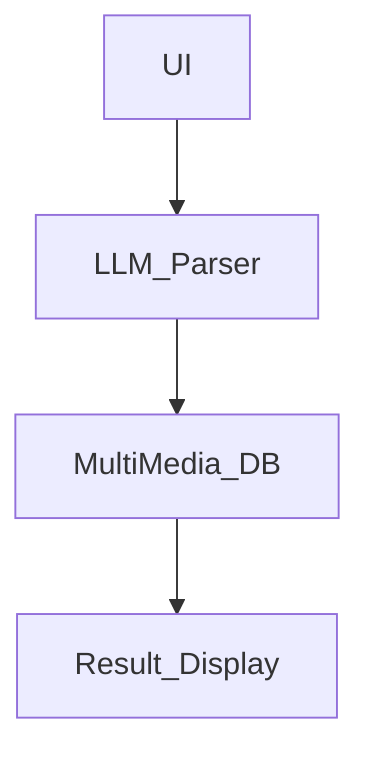
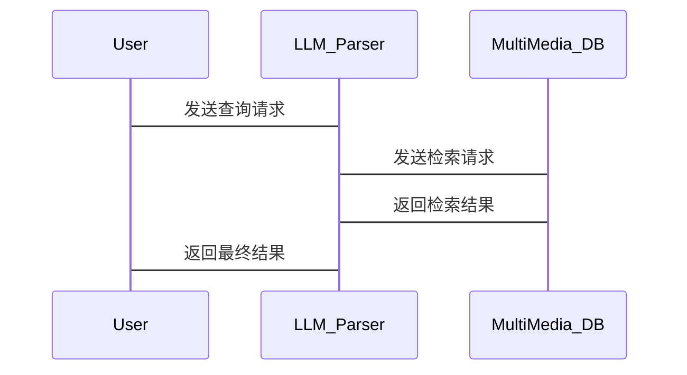

                 


# AI Agent的跨模态检索：整合LLM与多媒体数据库

> 关键词：AI Agent，跨模态检索，LLM，多媒体数据库，信息检索，深度学习

> 摘要：本文探讨AI Agent在跨模态检索中的应用，结合大语言模型（LLM）与多媒体数据库，分析其整合的技术原理、算法模型、系统架构及项目实现。通过实际案例分析，深入阐述如何利用跨模态检索提升信息处理效率和准确性。

---

# 第一部分: AI Agent与跨模态检索基础

## 第1章: AI Agent的定义与核心概念

### 1.1 AI Agent的基本概念

#### 1.1.1 AI Agent的定义与特点
AI Agent（人工智能代理）是指能够感知环境、自主决策并执行任务的智能实体。与传统程序不同，AI Agent具备以下特点：
- **自主性**：能够在没有外部干预的情况下运行。
- **反应性**：能够实时感知环境并做出反应。
- **目标导向**：具有明确的目标，通过行动实现目标。
- **学习能力**：能够通过数据和经验不断优化自身性能。

#### 1.1.2 AI Agent的核心功能与应用场景
AI Agent的核心功能包括信息处理、决策制定和任务执行。其应用场景广泛，如智能助手、自动驾驶、智能客服等。

#### 1.1.3 AI Agent与传统检索系统的区别
传统检索系统基于关键词匹配，无法理解用户意图和处理多模态数据。而AI Agent能够通过LLM理解上下文，并结合多媒体数据进行跨模态检索，提供更智能的服务。

### 1.2 跨模态检索的定义与特点

#### 1.2.1 跨模态检索的基本概念
跨模态检索是指在不同数据类型（如文本、图像、音频）之间进行信息检索的技术。例如，通过输入文本查询图像，或通过图像查询相关文本。

#### 1.2.2 跨模态检索的核心技术与挑战
核心技术包括多模态数据表示、跨模态相似度计算和检索优化。主要挑战是不同模态数据之间的语义对齐和高效检索。

#### 1.2.3 跨模态检索的应用场景与优势
应用场景包括图像搜索、视频检索、智能客服等。优势在于能够处理多样化数据，提供更精准的结果。

---

## 第2章: LLM与多媒体数据库的整合

### 2.1 大语言模型（LLM）的基本原理

#### 2.1.1 LLM的定义与技术特点
LLM是基于深度学习的自然语言处理模型，如GPT-3、BERT等。其特点包括强大的上下文理解能力和生成能力。

#### 2.1.2 LLM的训练与推理过程
LLM通过大量数据预训练，学习语言的语法和语义。推理时，模型基于输入生成相关输出。

#### 2.1.3 LLM在自然语言处理中的应用
LLM广泛应用于文本生成、问答系统、机器翻译等领域。

### 2.2 多媒体数据库的核心概念

#### 2.2.1 多媒体数据库的定义与特点
多媒体数据库存储和管理多种数据类型，如文本、图像、音频、视频等。其特点包括高效的数据检索和管理。

#### 2.2.2 多媒体数据的存储与检索技术
多媒体数据存储采用结构化和非结构化存储方式，检索技术包括基于内容的检索和基于关键字的检索。

#### 2.2.3 多媒体数据库的应用场景
多媒体数据库广泛应用于视频监控、医疗影像、数字图书馆等领域。

## 第3章: AI Agent的跨模态检索原理

### 3.1 跨模态检索的核心原理

#### 3.1.1 跨模态数据的表示与转换
跨模态数据表示需要将不同数据类型转换为统一的表示形式，如将图像转换为文本描述。

#### 3.1.2 跨模态检索的相似度计算方法
相似度计算方法包括余弦相似度、欧氏距离等，用于衡量不同模态数据之间的语义相似性。

#### 3.1.3 跨模态检索的优化策略
优化策略包括数据增强、模型微调等，以提高检索的准确性和效率。

### 3.2 LLM与多媒体数据库的整合原理

#### 3.2.1 LLM在跨模态检索中的作用
LLM用于理解用户查询的意图，并生成相关的检索关键词或条件。

#### 3.2.2 多媒体数据库在跨模态检索中的角色
多媒体数据库存储多模态数据，并根据检索条件返回相关结果。

#### 3.2.3 LLM与多媒体数据库的协同工作流程
用户输入查询，LLM解析意图，生成检索条件，多媒体数据库执行检索，返回结果。

---

# 第二部分: 跨模态检索的算法与数学模型

## 第4章: 跨模态检索的算法原理

### 4.1 跨模态检索的主要算法

#### 4.1.1 基于相似度的检索算法
基于余弦相似度的检索算法，通过计算向量的相似度进行排序。

#### 4.1.2 基于概率的检索算法
基于贝叶斯定理，通过概率计算确定检索结果的相关性。

#### 4.1.3 基于深度学习的检索算法
使用深度学习模型（如CNN、BERT）提取特征，进行跨模态检索。

### 4.2 LLM与多媒体数据的联合检索算法

#### 4.2.1 多模态特征提取算法
通过深度学习模型提取文本和图像的特征向量。

#### 4.2.2 跨模态相似度计算算法
使用对比学习方法，计算文本和图像之间的相似度。

#### 4.2.3 联合检索策略
结合LLM和多媒体数据库，制定联合检索策略，提高检索效率和准确性。

## 第5章: 跨模态检索的数学模型与公式

### 5.1 跨模态数据表示的数学模型

#### 5.1.1 多模态数据的表示方法
将文本和图像分别表示为向量，如文本向量$T$，图像向量$I$。

#### 5.1.2 跨模态相似度计算公式
余弦相似度公式：$$\text{similarity}(T, I) = \frac{T \cdot I}{\|T\| \|I\|}$$

#### 5.1.3 对比学习模型的损失函数
对比学习损失函数：$$\mathcal{L} = -\log\left(\frac{e^{T \cdot I}}{e^{T \cdot I} + \sum_{j=1}^n e^{T \cdot I_j}}\right)$$

---

## 第6章: 系统分析与架构设计

### 6.1 系统功能设计

#### 6.1.1 领域模型
领域模型包括用户查询、LLM解析、多媒体数据库检索等模块。

#### 6.1.2 功能需求
支持文本、图像等多种数据类型的检索，提供智能问答、信息抽取等功能。

### 6.2 系统架构设计

#### 6.2.1 模块划分
- 用户界面模块
- LLM解析模块
- 多媒体数据库检索模块
- 结果展示模块

#### 6.2.2 系统架构图


### 6.3 系统接口设计

#### 6.3.1 接口定义
- 用户查询接口：`POST /query`
- LLM解析接口：`POST /parse`
- 数据库检索接口：`GET /search`

### 6.4 系统交互流程

#### 6.4.1 交互流程图


---

## 第7章: 项目实战

### 7.1 环境配置

#### 7.1.1 环境要求
- Python 3.8+
- TensorFlow或PyTorch框架
- 数据库：MySQL或MongoDB

### 7.2 核心代码实现

#### 7.2.1 LLM解析模块
```python
def llm_parse(query):
    # 使用LLM解析查询请求
    # 返回检索条件
    return conditions
```

#### 7.2.2 多媒体数据库检索模块
```python
def search_db(conditions):
    # 根据条件查询数据库
    # 返回结果
    return results
```

### 7.3 实际案例分析

#### 7.3.1 案例介绍
假设用户输入文本查询“查找关于猫的图片”，系统通过LLM解析意图，生成检索条件，从多媒体数据库中检索相关图片。

#### 7.3.2 案例分析
- 输入查询：文本“猫”
- LLM解析：生成检索条件“图像类别为猫”
- 数据库检索：返回所有标注为“猫”的图片
- 结果展示：展示相关图片

### 7.4 项目小结

通过实际案例分析，展示了AI Agent在跨模态检索中的应用，证明了其在提升检索效率和准确性方面的优势。

---

## 第8章: 最佳实践与小结

### 8.1 最佳实践

- **数据预处理**：对多媒体数据进行清洗和标注，提高检索效果。
- **模型优化**：通过微调和数据增强优化LLM和检索模型的性能。
- **系统调优**：优化数据库查询效率和系统架构，提升整体性能。

### 8.2 小结

本文详细探讨了AI Agent在跨模态检索中的应用，分析了整合LLM和多媒体数据库的技术原理、算法模型和系统架构。通过实际案例和项目实战，验证了跨模态检索的优势和可行性。

### 8.3 注意事项

- 数据隐私和安全问题需要高度重视。
- 系统性能优化需要结合具体应用场景。
- 多模态数据的语义对齐是跨模态检索的核心挑战。

### 8.4 拓展阅读

- 《Deep Learning for Multimodal Data Processing》
- 《Large Language Models for Cross-Modal Retrieval》

---

# 作者：AI天才研究院/AI Genius Institute & 禅与计算机程序设计艺术 /Zen And The Art of Computer Programming

---

以上是《AI Agent的跨模态检索：整合LLM与多媒体数据库》的技术博客文章，涵盖了从基础概念到系统实现的完整内容。通过逐步分析和详细讲解，帮助读者全面理解跨模态检索的技术细节和实际应用。

