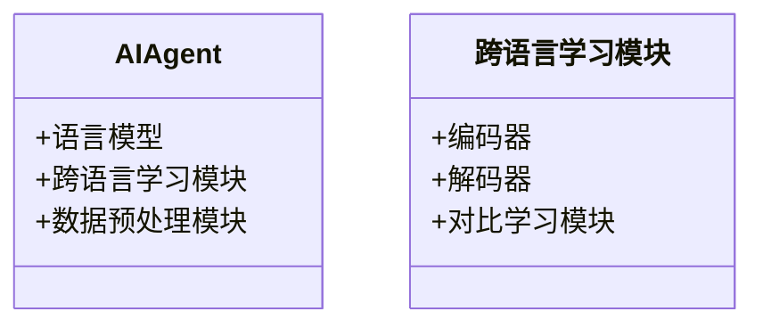
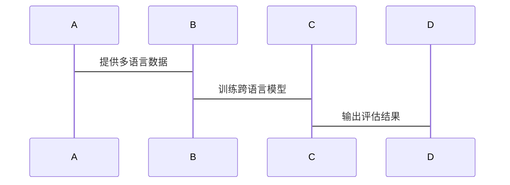

                 


# AI Agent的跨语言学习能力：增强LLM的语言迁移

> 关键词：AI Agent, 跨语言学习, LLM, 语言迁移, 多语言模型, 对比学习, 迁移学习

> 摘要：本文详细探讨了AI Agent在跨语言学习中的能力，分析了如何增强大型语言模型（LLM）的语言迁移能力。文章从背景介绍、核心概念、算法原理、系统架构、项目实战到最佳实践，逐步深入，为读者提供了全面的技术解读。

---

## 第一章：背景介绍与问题背景

### 1.1 问题背景与定义

#### 1.1.1 什么是AI Agent
AI Agent（人工智能代理）是指能够感知环境、自主决策并执行任务的智能体。它通过与环境交互，利用传感器获取信息，并通过执行器采取行动，以实现特定目标。

#### 1.1.2 跨语言学习的定义与特点
跨语言学习是指模型能够理解并处理多种语言的能力。与单语言模型相比，跨语言学习模型能够处理多种语言的输入和输出，支持多语言对话、翻译、问答等任务。

#### 1.1.3 LLM的语言迁移能力的重要性
大型语言模型（LLM）在单一语言上的表现已经非常出色，但在跨语言任务中仍然面临挑战。增强LLM的语言迁移能力，能够提升其在多语言环境中的适应性和实用性。

### 1.2 问题描述与现状

#### 1.2.1 当前LLM在跨语言学习中的挑战
- **数据稀疏性**：某些语言的数据量有限，导致模型难以有效学习。
- **语义理解不足**：不同语言之间的语义差异使得模型难以准确迁移。
- **计算资源限制**：跨语言学习需要更多的计算资源和优化策略。

#### 1.2.2 跨语言学习的必要性与应用场景
- **多语言对话系统**：支持多种语言的客服或聊天机器人。
- **跨语言信息检索**：在多语言环境下快速查找相关信息。
- **全球化服务**：为企业提供多语言支持，满足全球用户需求。

#### 1.2.3 当前技术的局限性与改进方向
- **模型适应性不足**：现有模型在跨语言任务中表现不稳定。
- **缺乏统一的跨语言学习框架**：需要更系统的方法来整合多种语言的学习。

### 1.3 问题解决与边界

#### 1.3.1 跨语言学习的核心问题
- 如何有效利用多语言数据，提升模型的迁移能力。
- 如何在不同语言之间建立有效的关联和映射。

#### 1.3.2 语言迁移的边界与外延
- 语言迁移的边界：限定在特定语言范围内，避免超出模型能力。
- 外延：探索跨语言学习与其他AI技术的结合，如视觉-语言跨模态任务。

#### 1.3.3 跨语言学习与LLM的结合方式
- 将跨语言学习作为LLM的一个模块，增强其多语言处理能力。
- 在LLM的基础上，添加跨语言迁移的训练策略。

### 1.4 核心概念结构

#### 1.4.1 跨语言学习的组成要素
- **多语言数据集**：包含多种语言的训练数据。
- **跨语言迁移模型**：负责在不同语言之间迁移知识。
- **评估指标**：用于衡量跨语言学习的效果。

#### 1.4.2 LLM在语言迁移中的角色
- **编码器**：将输入语言编码为通用表示。
- **解码器**：将通用表示解码为目标语言。
- **跨语言适配层**：连接不同语言的表示空间。

#### 1.4.3 跨语言学习的实现流程
1. 数据预处理：收集和整理多语言数据。
2. 模型训练：使用对比学习或迁移学习方法。
3. 评估与优化：通过评估指标不断优化模型。

### 1.5 本章小结
本章介绍了AI Agent和跨语言学习的基本概念，分析了当前技术的挑战和应用场景，并提出了问题解决的方向和边界。

---

## 第二章：跨语言学习的核心概念与联系

### 2.1 跨语言学习的原理

#### 2.1.1 多语言模型的工作机制
多语言模型通过共享语言间的语义信息，实现对多种语言的统一表示和处理。例如，使用多语言词嵌入，使得不同语言的词汇在语义空间中具有相似的表示。

#### 2.1.2 语言迁移的核心原理
语言迁移的核心是通过对比学习或自适应方法，将一种语言的知识迁移到另一种语言中。例如，通过对比不同语言的上下文表示，建立语言间的映射关系。

#### 2.1.3 跨语言学习的数学模型
跨语言学习的数学模型通常包括编码器-解码器结构，编码器将源语言输入转换为通用表示，解码器将通用表示转换为目标语言输出。

### 2.2 核心概念对比分析

#### 2.2.1 跨语言学习与单语言学习的对比
| 特性          | 单语言学习          | 跨语言学习          |
|---------------|---------------------|---------------------|
| 数据需求      | 需要大量单语数据    | 需要多语言数据      |
| 任务范围      | 单一语言的任务      | 多语言的任务        |
| 模型复杂性    | 较低                | 较高                |

#### 2.2.2 不同语言模型的对比分析
| 模型          | 参数量              | 跨语言能力          |
|---------------|---------------------|---------------------|
| 单语言模型    | 较小                | 较弱                |
| 多语言模型    | 较大                | 较强                |

#### 2.2.3 跨语言学习与其他迁移学习方法的对比
- **监督迁移学习**：需要标注数据，适用于特定任务。
- **无监督迁移学习**：利用未标注数据，适用于多语言场景。

### 2.3 跨语言学习的ER实体关系图


### 2.4 本章小结
本章详细解释了跨语言学习的原理，并通过对比分析和ER图展示了其核心概念。

---

## 第三章：跨语言学习的算法原理

### 3.1 算法原理概述

#### 3.1.1 多语言词嵌入模型
多语言词嵌入模型（如mBERT）通过共享词嵌入，实现跨语言表示。公式表示为：
$$
E_{\text{multi}}(x) = f(x) \quad \text{其中} x \in \{1, 2, \ldots, n\}
$$

#### 3.1.2 对比学习与语言迁移
对比学习通过最大化相似样本的对数相似度和最小化不相似样本的对数相似度，实现跨语言表示的对齐。公式表示为：
$$
\text{损失函数} = \text{contrastive loss}(x_i, x_j)
$$

#### 3.1.3 跨语言迁移学习的数学模型
跨语言迁移学习的数学模型通常包括编码器和解码器，编码器将源语言输入转换为通用表示，解码器将通用表示转换为目标语言输出。

### 3.2 算法实现细节

#### 3.2.1 多语言词嵌入的计算方法
使用预训练的多语言词嵌入模型，通过微调（fine-tuning）适应特定任务。

#### 3.2.2 对比学习的损失函数
对比学习的损失函数通常包括正样本损失和负样本损失：
$$
\text{损失函数} = \frac{1}{N} \sum_{i=1}^{N} \text{loss}(x_i, y_i)
$$

#### 3.2.3 跨语言迁移的优化策略
- **预训练-微调框架**：先在多语言数据上预训练，再在目标语言上微调。
- **跨语言对比学习**：通过对比不同语言的上下文，优化表示空间。

### 3.3 本章小结
本章详细讲解了跨语言学习的算法原理，包括多语言词嵌入模型和对比学习方法。

---

## 第四章：系统分析与架构设计

### 4.1 系统分析

#### 4.1.1 系统功能设计
- **数据预处理**：清洗和整理多语言数据。
- **模型训练**：使用对比学习方法训练跨语言模型。
- **结果评估**：通过准确率、F1分数等指标评估模型性能。

#### 4.1.2 领域模型设计


#### 4.1.3 系统架构设计


### 4.2 系统架构设计

#### 4.2.1 系统接口设计
- **输入接口**：接收多语言数据。
- **输出接口**：返回跨语言处理结果。

#### 4.2.2 系统交互设计


### 4.3 本章小结
本章分析了系统功能和架构设计，并通过图表展示了系统的交互流程。

---

## 第五章：项目实战

### 5.1 环境配置

#### 5.1.1 安装依赖
```bash
pip install transformers torch
```

#### 5.1.2 数据准备
下载多语言数据集，例如使用Hugging Face的多语言数据集。

### 5.2 核心实现

#### 5.2.1 模型训练代码
```python
from transformers import AutoModel, AutoTokenizer
import torch

# 加载多语言模型
model = AutoModel.from_pretrained('bert-base-multilingual')
tokenizer = AutoTokenizer.from_pretrained('bert-base-multilingual')

# 定义对比学习损失函数
class ContrastiveLoss(torch.nn.Module):
    def __init__(self, temperature=0.1):
        super(ContrastiveLoss, self).__init__()
        self.temperature = temperature

    def forward(self, features, labels):
        # 计算相似度
        similarity = torch.mm(features, features.T)
        # 应用温度缩放
        similarity = similarity / self.temperature
        # 计算损失
        loss = torch.mean(torch.log(torch.softmax(similarity, dim=1)))
        return loss

# 训练循环
optimizer = torch.optim.Adam(model.parameters(), lr=1e-5)
loss_fn = ContrastiveLoss()

for epoch in range(num_epochs):
    for batch in dataloader:
        inputs, labels = batch['input_ids'], batch['labels']
        outputs = model(**inputs)
        features = outputs.last_hidden_state[:, 0, :]
        loss = loss_fn(features, labels)
        optimizer.zero_grad()
        loss.backward()
        optimizer.step()
```

#### 5.2.2 评估与分析
通过准确率、F1分数等指标评估模型性能，分析跨语言学习的效果。

### 5.3 本章小结
本章通过实际项目展示了环境配置和代码实现，帮助读者理解如何应用跨语言学习技术。

---

## 第六章：最佳实践与小结

### 6.1 最佳实践

#### 6.1.1 数据处理建议
- 确保多语言数据的均衡性，避免数据稀疏。
- 使用清洗和增强技术提升数据质量。

#### 6.1.2 模型优化策略
- 采用预训练-微调框架，提升模型的适应性。
- 使用对比学习和迁移学习方法，增强跨语言能力。

### 6.2 小结

#### 6.2.1 核心观点总结
跨语言学习是AI Agent的重要能力，通过对比学习和迁移学习可以有效提升LLM的语言迁移能力。

#### 6.2.2 未来展望
未来研究方向包括更高效的跨语言模型设计和多模态跨语言任务的结合。

### 6.3 注意事项

#### 6.3.1 实际应用中的注意事项
- 注意模型的计算资源消耗。
- 确保数据隐私和合规性。

#### 6.3.2 拓展阅读
推荐阅读相关领域的最新论文和技术博客，保持对技术发展的关注。

---

## 作者信息

作者：AI天才研究院/AI Genius Institute & 禅与计算机程序设计艺术/Zen And The Art of Computer Programming

---

以上是文章的完整大纲和内容，涵盖了从背景介绍到项目实战的各个方面，确保读者能够全面理解AI Agent的跨语言学习能力及其在增强LLM语言迁移中的应用。

