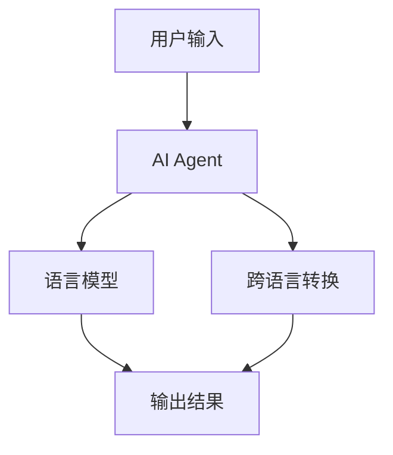
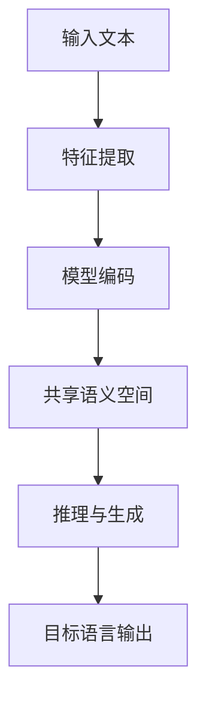
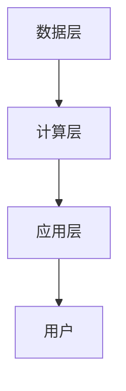

                 


# AI Agent的跨语言学习：增强LLM的多语言能力

> **关键词**：AI Agent, 多语言学习, 大语言模型, 跨语言学习, 语言模型, AI-Agent

> **摘要**：  
> 随着大语言模型（LLM）的快速发展，AI Agent的多语言能力成为实现更广泛应用场景的关键。本文详细探讨了AI Agent在跨语言学习中的核心原理、算法设计、系统架构以及实际应用，通过理论分析与实践案例相结合的方式，深入剖析了如何增强LLM的多语言能力，为AI Agent的跨语言学习提供了系统性的解决方案。

---

# 第1章: 背景介绍与问题背景

## 1.1 问题背景与挑战

### 1.1.1 大语言模型（LLM）的局限性
大语言模型（LLM）在单语言任务中表现出色，但在跨语言场景下存在以下问题：
- **语义理解不足**：模型难以准确理解不同语言之间的语义差异。
- **多语言数据稀疏性**：某些语言的数据量有限，导致模型难以有效学习。
- **跨语言推理能力有限**：模型难以在不同语言之间进行有效的信息推理和知识迁移。

### 1.1.2 多语言能力的重要性
多语言能力是AI Agent实现通用人工智能（AGI）的重要基础：
- **支持更广泛的应用场景**：例如跨语言对话系统、多语言内容生成等。
- **提升用户体验**：能够为全球用户提供本地化服务。
- **增强AI Agent的智能性**：通过多语言能力，AI Agent可以更好地理解复杂场景中的信息。

### 1.1.3 AI Agent在跨语言学习中的作用
AI Agent作为连接模型与用户的桥梁，承担以下关键角色：
- **语言转换与适配**：将用户输入转换为模型可理解的形式。
- **跨语言推理**：在不同语言之间进行信息整合与推理。
- **多语言输出**：根据用户需求生成目标语言的输出。

## 1.2 跨语言学习的核心问题

### 1.2.1 多语言模型的定义与目标
- **定义**：多语言模型是指能够在多种语言上执行任务的模型。
- **目标**：通过共享语言间的语义信息，实现跨语言任务的高效处理。

### 1.2.2 跨语言学习的挑战与难点
- **语言多样性**：不同语言的语法、语义差异大。
- **数据不平衡**：某些语言的数据量远小于主流语言。
- **模型适应性**：如何在不同语言之间共享信息并保持准确性。

### 1.2.3 AI Agent在跨语言学习中的角色
- **数据预处理**：将多语言数据整合并进行格式化处理。
- **模型调优**：对多语言模型进行优化，提升其跨语言能力。
- **结果后处理**：将模型输出转换为目标语言的自然语言。

## 1.3 跨语言学习的应用场景

### 1.3.1 跨语言对话系统
- **场景**：用户使用一种语言输入，AI Agent将其转换为另一种语言进行处理，并生成目标语言的输出。
- **挑战**：需要同时支持多种语言的对话理解和生成。

### 1.3.2 跨语言文本生成
- **场景**：AI Agent根据用户提供的多语言输入生成目标语言的文本。
- **挑战**：需要处理不同语言之间的语义转换和语法差异。

### 1.3.3 跨语言信息检索
- **场景**：AI Agent在多语言文档中检索信息并返回目标语言的摘要或结果。
- **挑战**：需要在不同语言之间进行信息匹配和语义理解。

## 1.4 本章小结
本章介绍了AI Agent在跨语言学习中的背景、核心问题以及应用场景，为后续章节的深入分析奠定了基础。

---

# 第2章: 跨语言学习的核心概念与联系

## 2.1 跨语言学习的核心原理

### 2.1.1 多语言模型的训练方法
- **多任务学习**：同时在多种语言上进行监督学习。
- **预训练与微调**：利用多语言预训练模型进行微调，适应特定任务。
- **零样本学习**：通过跨语言知识迁移，直接在目标语言上进行推理。

### 2.1.2 跨语言迁移学习
- **概念**：利用一种或多种语言的特征表示，提升目标语言的任务性能。
- **实现方式**：通过共享语言间的语义特征，减少对目标语言数据的依赖。

### 2.1.3 跨语言表示学习
- **概念**：将不同语言的文本映射到共享的语义空间中。
- **实现方式**：利用多语言嵌入模型（如mBert）进行跨语言表示。

## 2.2 語言模型与AI Agent的关系

### 2.2.1 语言模型作为AI Agent的核心模块
- **输入处理**：AI Agent接收用户输入并将其转化为模型可处理的形式。
- **模型调用**：AI Agent调用语言模型进行文本生成或推理。
- **输出处理**：AI Agent将模型输出转换为目标语言的自然语言。

### 2.2.2 跨语言能力对AI Agent的影响
- **增强用户体验**：支持多语言交互。
- **提升智能性**：通过跨语言推理，提高AI Agent的理解能力。
- **扩展应用场景**：支持更多跨语言任务。

### 2.2.3 語言模型的多语言扩展
- **多语言预训练模型**：如mBert、XLM-R。
- **微调策略**：针对特定任务对多语言模型进行微调。

## 2.3 跨语言学习的实体关系图

### 2.3.1 实体关系图的构建


### 2.3.2 实体关系图的分析
- **用户输入**：输入可以是任意语言的文本。
- **AI Agent**：负责接收输入并调用语言模型。
- **语言模型**：负责处理输入并生成输出。
- **跨语言转换**：用于处理多语言之间的转换与适配。

### 2.3.3 实体关系图与AI Agent的结合
- **输入处理**：AI Agent将多语言输入转换为模型可理解的形式。
- **输出处理**：AI Agent将模型输出转换为目标语言的自然语言。

## 2.4 本章小结
本章详细介绍了跨语言学习的核心原理以及与AI Agent的关系，为后续章节的算法设计奠定了理论基础。

---

# 第3章: 跨语言学习的算法原理

## 3.1 跨语言模型的训练流程

### 3.1.1 数据预处理与特征提取
- **数据清洗**：去除噪声数据，确保数据质量。
- **特征提取**：提取文本中的关键特征，如词向量、句向量。

### 3.1.2 模型训练与优化
- **模型选择**：选择适合的多语言模型（如mBert）。
- **训练策略**：采用多任务学习或预训练+微调策略。

### 3.1.3 跨语言推理与生成
- **推理过程**：在共享语义空间中进行推理。
- **生成过程**：根据推理结果生成目标语言的文本。

## 3.2 跨语言学习的数学模型

### 3.2.1 語言模型的数学表示
- **概率模型**：语言模型的目标是最大化输入序列的概率。
  $$ P(x_1, x_2, ..., x_n) = \prod_{i=1}^{n} P(x_i | x_{i-1}) $$

### 3.2.2 跨语言表示学习的数学模型
- **嵌入层**：将输入文本映射为向量表示。
  $$ x_i = \text{Embedding}(x_i) $$
- **编码层**：对嵌入后的向量进行编码。
  $$ h_i = \text{Encoder}(x_i) $$
- **共享语义空间**：将不同语言的编码向量映射到共享空间。
  $$ z_i = \text{SharedSpace}(h_i) $$

### 3.2.3 跨语言推理的数学公式
- **相似度计算**：通过余弦相似度计算不同语言向量的相似性。
  $$ \text{Similarity}(z_i, z_j) = \frac{z_i \cdot z_j}{\|z_i\| \|z_j\|} $$

## 3.3 跨语言学习的算法流程图



## 3.4 本章小结
本章从数学和算法的角度详细阐述了跨语言学习的原理，为后续章节的系统设计提供了理论支持。

---

# 第4章: 跨语言学习的系统分析与架构设计

## 4.1 系统功能设计

### 4.1.1 多语言模型训练模块
- **功能**：训练多语言模型，支持跨语言推理。
- **输入**：多语言训练数据。
- **输出**：训练好的多语言模型。

### 4.1.2 跨语言推理模块
- **功能**：根据输入文本生成目标语言的输出。
- **输入**：用户输入文本。
- **输出**：目标语言的生成文本。

### 4.1.3 語言模型管理模块
- **功能**：管理多语言模型的加载与切换。
- **输入**：用户选择的目标语言。
- **输出**：对应语言的模型。

## 4.2 系统架构设计

### 4.2.1 分层架构设计
- **数据层**：负责数据的存储与管理。
- **计算层**：负责模型的训练与推理。
- **应用层**：负责与用户交互及结果展示。

### 4.2.2 模块之间的交互关系


### 4.2.3 系统的可扩展性设计
- **模块化设计**：各模块独立，便于扩展。
- **接口标准化**：模块之间通过标准化接口进行交互。

## 4.3 系统接口设计

### 4.3.1 API接口定义
- **输入接口**：接收用户输入文本。
- **输出接口**：返回目标语言的生成文本。

### 4.3.2 接口的调用流程
1. 用户调用输入接口，发送多语言文本。
2. 系统通过API将输入传递给模型。
3. 模型生成目标语言的文本并返回。

### 4.3.3 接口的安全性设计
- **身份验证**：通过API密钥进行身份验证。
- **访问控制**：限制API的调用次数和频率。

## 4.4 本章小结
本章从系统架构的角度详细分析了跨语言学习的实现方式，为后续章节的项目实战奠定了基础。

---

# 第5章: 跨语言学习的项目实战

## 5.1 环境安装与配置

### 5.1.1 开发环境的选择
- **推荐环境**：Python 3.8及以上版本。
- **依赖库安装**：
  ```bash
  pip install transformers torch
  ```

### 5.1.2 依赖库的安装
- **库选择**：使用`transformers`库中的多语言模型。
- **安装命令**：
  ```bash
  pip install -r requirements.txt
  ```

### 5.1.3 环境的配置与测试
- **配置文件**：设置模型路径和训练参数。
- **测试脚本**：运行测试脚本，验证环境是否配置正确。

## 5.2 系统核心实现

### 5.2.1 多语言模型的训练代码
```python
from transformers import AutoTokenizer, AutoModelForMaskedLM
import torch

# 加载预训练模型
model_name = "facebook/mBert"
tokenizer = AutoTokenizer.from_pretrained(model_name)
model = AutoModelForMaskedLM.from_pretrained(model_name)

# 定义训练函数
def train_step(batch):
    inputs = tokenizer(batch['input'], return_tensors='pt')
    outputs = model(**inputs)
    loss = outputs.loss
    return loss

# 开始训练
optimizer = torch.optim.Adam(model.parameters(), lr=1e-5)
for epoch in range(num_epochs):
    for batch in train_loader:
        optimizer.zero_grad()
        loss = train_step(batch)
        loss.backward()
        optimizer.step()
```

### 5.2.2 跨语言推理的实现代码
```python
def generate_response(input_text, target_lang):
    inputs = tokenizer(input_text, return_tensors='pt')
    outputs = model.generate(**inputs, max_length=50)
    response = tokenizer.decode(outputs[0], skip_special_tokens=True)
    return response
```

### 5.2.3 系统功能的集成与测试
- **集成流程**：将训练好的模型与AI Agent进行集成。
- **测试流程**：通过测试用例验证系统的多语言能力。

## 5.3 实际案例分析

### 5.3.1 案例背景与需求分析
- **案例背景**：构建一个支持中英文对话的AI Agent。
- **需求分析**：支持用户输入中文，生成英文输出。

### 5.3.2 案例的实现过程
1. **环境配置**：安装必要的库和依赖。
2. **模型训练**：使用多语言预训练模型进行微调。
3. **系统集成**：将训练好的模型与AI Agent进行集成。
4. **测试验证**：通过测试用例验证系统的多语言能力。

### 5.3.3 案例分析与总结
- **案例成功的关键因素**：模型选择、训练策略、系统架构设计。
- **经验总结**：跨语言学习需要结合理论与实践。

## 5.4 本章小结
本章通过实际案例详细讲解了跨语言学习的项目实现过程，为读者提供了实践指导。

---

# 第6章: 跨语言学习的最佳实践与注意事项

## 6.1 最佳实践

### 6.1.1 数据预处理的注意事项
- **数据清洗**：确保数据质量，去除噪声。
- **数据增强**：通过数据增强技术提升模型的泛化能力。

### 6.1.2 模型选择的建议
- **选择适合的多语言模型**：根据任务需求选择合适的模型。
- **考虑模型的训练效率**：选择训练效率高的模型。

### 6.1.3 系统设计的建议
- **模块化设计**：便于后续的扩展和维护。
- **接口标准化**：便于不同模块之间的交互。

## 6.2 注意事项

### 6.2.1 数据隐私问题
- **数据加密**：确保数据在传输和存储过程中的安全性。
- **合规性检查**：确保数据处理符合相关法律法规。

### 6.2.2 模型性能问题
- **模型优化**：通过剪枝、量化等技术优化模型性能。
- **资源分配**：合理分配计算资源，确保系统的高效运行。

### 6.2.3 用户体验问题
- **界面设计**：提供友好的用户界面，提升用户体验。
- **反馈机制**：提供及时的用户反馈，增强用户信任。

## 6.3 本章小结
本章总结了跨语言学习的最佳实践和注意事项，为读者提供了宝贵的实践经验。

---

# 作者：AI天才研究院/AI Genius Institute & 禅与计算机程序设计艺术 /Zen And The Art of Computer Programming

---

**本文内容仅为个人观点，不代表任何机构或组织的官方立场。转载请注明出处，如有侵权请联系作者删除。**

