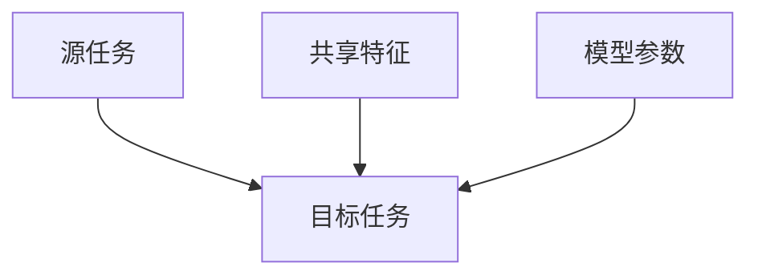
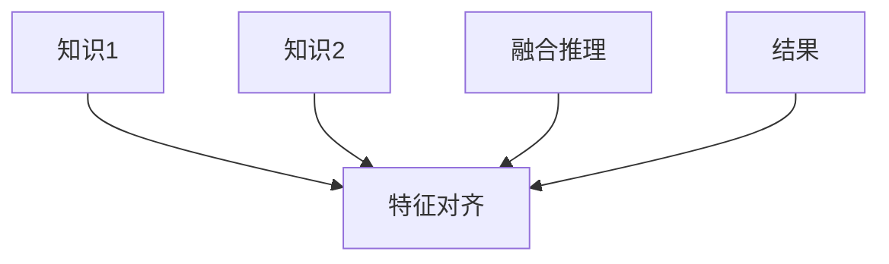
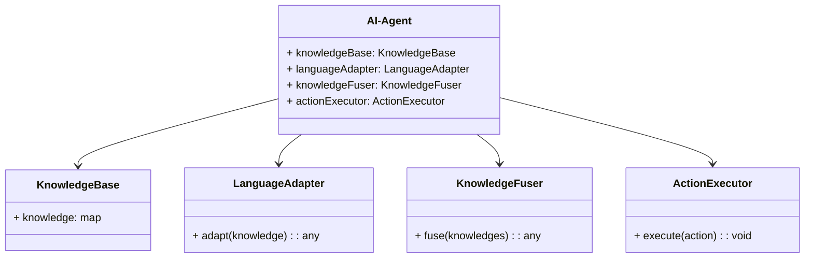
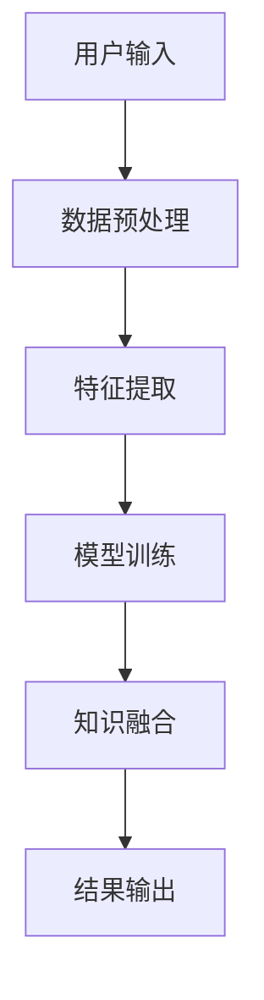
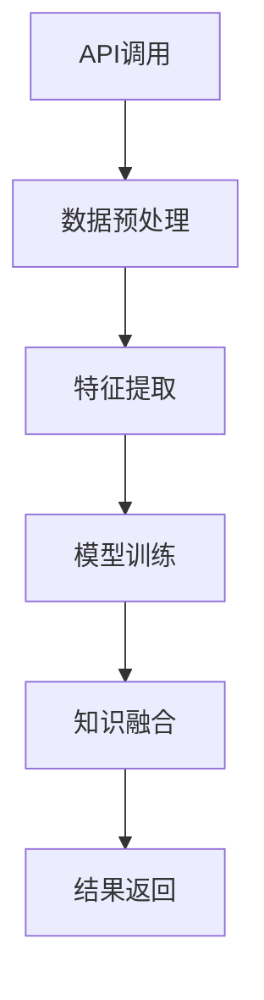

                 


# AI Agent的跨语言知识迁移与融合

## 关键词：AI Agent，跨语言知识迁移，知识融合，迁移学习，多语言模型

## 摘要：  
本文探讨了AI Agent在跨语言知识迁移与融合中的应用，分析了其核心概念、算法原理、系统架构及实际案例。通过详细的技术分析，本文揭示了如何实现跨语言知识的有效迁移与融合，为AI Agent在多语言环境下的应用提供了理论与实践指导。

---

# 第一部分: AI Agent的跨语言知识迁移与融合概述

## 第1章: AI Agent的基本概念与背景

### 1.1 AI Agent的定义与特点

AI Agent（人工智能代理）是指能够感知环境、自主决策并执行任务的智能实体。它具备以下核心特点：

- **自主性**：AI Agent能够在没有外部干预的情况下自主运作。
- **反应性**：能够实时感知环境变化并做出相应反应。
- **学习能力**：通过数据和经验不断优化自身的知识和行为。
- **协作性**：能够与其他AI Agent或人类进行有效协作。

### 1.2 跨语言知识迁移的背景与意义

#### 1.2.1 知识迁移的基本概念

知识迁移是指将某一领域的知识或经验应用到另一个领域的过程。在AI领域，跨语言知识迁移是指将一种语言中的知识迁移到另一种语言中，以提高AI Agent在多语言环境下的理解和应用能力。

#### 1.2.2 跨语言知识迁移的挑战

跨语言知识迁移面临以下主要挑战：

- **语言差异**：不同语言的语法、语义和表达习惯存在差异，导致直接迁移的困难。
- **数据稀疏性**：某些语言的数据量较少，难以支持有效的迁移学习。
- **文化差异**：不同语言背后的文化背景可能影响知识的适用性。

#### 1.2.3 跨语言知识迁移的应用场景

跨语言知识迁移在以下场景中具有重要应用：

- **多语言NLP任务**：如机器翻译、跨语言问答系统。
- **跨语言知识图谱构建**：将不同语言的知识资源整合到统一的知识图谱中。
- **全球化AI应用**：如跨国企业的智能客服系统。

---

## 第2章: 跨语言知识迁移的核心技术

### 2.1 知识表示与编码

#### 2.1.1 知识表示的基本方法

知识表示是跨语言迁移的基础。常见的知识表示方法包括：

- **符号表示**：使用符号（如关键词、标签）表示知识。
- **向量表示**：通过向量空间模型（如Word2Vec）将知识表示为低维向量。

#### 2.1.2 知识编码的技术对比

以下表格对比了符号表示和向量表示的特点：

| 特性                | 符号表示          | 向量表示          |
|---------------------|-------------------|-------------------|
| 表达方式            | 符号化            | 向量化            |
| 适用场景            | 离散知识          | 连续空间           |
| 可迁移性            | 较低             | 较高             |

### 2.2 知识迁移的实现方式

#### 2.2.1 基于特征的迁移学习

基于特征的迁移学习通过提取数据的特征进行迁移。例如，在机器翻译任务中，可以提取源语言和目标语言的句法特征进行迁移。

#### 2.2.2 基于模型的迁移学习

基于模型的迁移学习通过共享模型参数实现迁移。例如，使用预训练的多语言模型（如Marian）进行跨语言迁移。

#### 2.2.3 跨语言迁移的特殊性

跨语言迁移的特殊性主要体现在语言间的差异性上。为了克服这一问题，可以采用以下方法：

- **语言适应层**：在模型中添加语言适应层，用于调整不同语言的特征。
- **跨语言对比学习**：通过对比不同语言的特征，减少语言差异的影响。

### 2.3 知识融合的技术挑战

#### 2.3.1 知识冲突的处理方法

知识冲突是跨语言融合中的常见问题。解决方法包括：

- **冲突检测**：通过相似度计算检测知识冲突。
- **冲突消解**：通过投票、加权平均等方法解决冲突。

#### 2.3.2 知识融合的评估指标

以下表格列出了常见的知识融合评估指标：

| 指标               | 描述                |
|--------------------|---------------------|
| 精确率             | 正确识别的知识比例  |
| 召回率             | 检测到的知识总数比例 |
| F1分数             | 精确率和召回率的调和平均值 |

---

# 第二部分: 跨语言知识迁移的算法原理

## 第3章: 知识迁移的算法原理

### 3.1 迁移学习的基本原理

迁移学习的核心思想是通过共享特征或参数实现跨任务的知识迁移。以下是一个简单的迁移学习流程图：



### 3.2 跨语言迁移学习的算法改进

为应对跨语言迁移的特殊性，可以采用以下改进算法：

- **多语言预训练模型**：如Marian、XLM-R，通过多语言预训练减少语言差异。
- **跨语言对比学习**：通过对比不同语言的特征，增强模型的跨语言能力。

### 3.3 知识融合的算法实现

知识融合可以通过以下步骤实现：

1. **知识抽取**：从不同语言中提取知识。
2. **特征对齐**：对齐不同语言的特征。
3. **融合推理**：基于对齐的特征进行融合推理。

以下是一个简单的知识融合流程图：



---

## 第4章: 跨语言知识迁移的数学模型

### 4.1 基于概率的迁移模型

基于概率的迁移模型通过概率分布描述知识迁移的过程。以下是一个简单的概率模型公式：

$$ P(y|x) = \frac{P(x|y)P(y)}{P(x)} $$

其中，$P(y|x)$ 表示在给定$x$的情况下，$y$的概率。

### 4.2 跨语言迁移学习的数学模型

跨语言迁移学习的数学模型可以通过以下公式表示：

$$ f_{\text{source}}(x) = f_{\text{target}}(g(x)) $$

其中，$g(x)$ 表示语言转换函数。

---

# 第三部分: 跨语言知识迁移的系统架构

## 第5章: 系统功能设计

### 5.1 领域模型设计

以下是一个简单的领域模型类图：



### 5.2 系统架构设计

以下是一个系统的整体架构图：



### 5.3 系统接口设计

以下是系统接口设计：



---

## 第6章: 项目实战

### 6.1 环境安装

以下是一个Python环境的安装步骤：

1. 安装Python 3.8及以上版本。
2. 安装必要的库：`pip install numpy pandas scikit-learn`

### 6.2 核心代码实现

以下是一个简单的知识迁移代码示例：

```python
import numpy as np
from sklearn.linear_model import LogisticRegression

# 源语言数据
X_source = np.array([[1, 2], [3, 4]])
y_source = np.array([0, 1])

# 目标语言数据
X_target = np.array([[5, 6], [7, 8]])

# 训练源语言模型
model = LogisticRegression().fit(X_source, y_source)

# 迁移学习
# 假设X_target是源语言数据的变换
# 这里可以采用特征对齐或其他方法
# 这里简化为直接训练
model.fit(X_target, y_target)

# 预测
print(model.predict([[9, 10]]))
```

### 6.3 案例分析

以下是一个跨语言问答系统的案例分析：

1. 数据收集：收集多种语言的问答数据。
2. 数据预处理：清洗和标注数据。
3. 模型训练：使用迁移学习方法训练模型。
4. 知识融合：融合不同语言的知识，提升模型的准确性。

---

## 第四部分: 最佳实践与总结

## 第7章: 最佳实践

### 7.1 小结

跨语言知识迁移与融合是实现AI Agent多语言能力的关键技术。通过本文的分析，我们可以看到，跨语言迁移需要结合知识表示、迁移学习和知识融合等多种技术。

### 7.2 注意事项

- 数据质量：确保数据的多样性和代表性。
- 模型选择：根据具体任务选择合适的模型。
- 跨语言适应：在实际应用中，需要不断优化语言适应层。

### 7.3 拓展阅读

- 《Multi-language Pre-training of Neural Networks》
- 《Cross-language Transfer Learning in NLP》

---

## 结语

AI Agent的跨语言知识迁移与融合是一个复杂但充满潜力的领域。通过不断的研究和实践，我们可以进一步提升AI Agent在多语言环境下的智能水平，为实际应用提供更强大的支持。

---

## 作者：AI天才研究院/AI Genius Institute & 禅与计算机程序设计艺术 /Zen And The Art of Computer Programming

