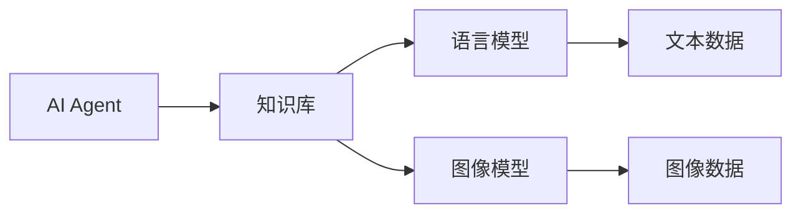
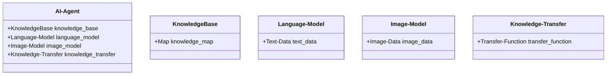
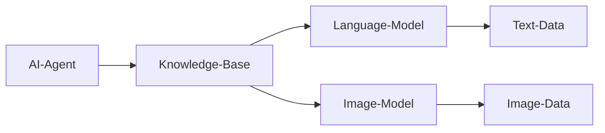
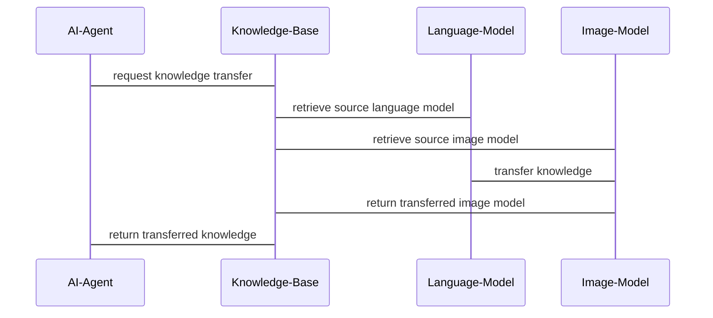

                 


# AI Agent的跨语言跨模态知识迁移

> 关键词：AI Agent, 跨语言知识迁移, 跨模态知识迁移, 多语言处理, 多模态数据

> 摘要：本文探讨AI Agent在跨语言和跨模态知识迁移中的应用，分析其核心概念、算法原理和系统设计，结合实际案例进行深入解析，为相关领域的研究和实践提供参考。

---

## 第1章: 背景介绍

### 1.1 问题背景

#### 1.1.1 AI Agent的核心概念
AI Agent（人工智能代理）是一种能够感知环境、自主决策并执行任务的智能实体。它通过接收输入、处理信息、生成输出来实现与环境的交互。AI Agent广泛应用于自然语言处理、计算机视觉、机器人控制等领域。

#### 1.1.2 跨语言和跨模态知识迁移的必要性
AI Agent在实际应用中需要处理来自不同语言和模态的数据。例如，一个AI Agent可能需要理解并处理中文和英文文本，同时也能识别图像和语音信息。为了实现这一点，跨语言和跨模态知识迁移技术是必不可少的。

#### 1.1.3 当前技术的局限性与挑战
目前，大多数AI Agent仅擅长单一语言或单一模态的数据处理。跨语言和跨模态知识迁移技术尚未成熟，存在数据稀疏性、语义理解不足、模态间关联性弱等问题。

### 1.2 问题描述

#### 1.2.1 AI Agent的知识表示问题
知识表示是AI Agent的核心能力之一。如何在不同语言和模态之间统一知识表示，是跨语言和跨模态知识迁移的关键挑战。

#### 1.2.2 跨语言和跨模态数据的整合难题
不同语言和模态的数据具有不同的特征和结构，如何有效地整合这些数据，是跨语言和跨模态知识迁移的核心问题。

#### 1.2.3 知识迁移的边界与外延
跨语言和跨模态知识迁移的边界在于如何确定哪些知识可以被迁移，以及如何确保迁移的知识在目标场景中有效。

### 1.3 问题解决

#### 1.3.1 跨语言知识迁移的解决方案
通过构建多语言知识图谱和使用跨语言表示学习技术，可以实现跨语言知识迁移。

#### 1.3.2 跨模态知识迁移的实现方法
利用跨模态表示学习和多模态融合技术，可以实现跨模态知识迁移。

#### 1.3.3 综合解决方案的可行性分析
结合跨语言和跨模态知识迁移技术，构建统一的知识表示框架，能够有效解决AI Agent在跨语言和跨模态场景中的知识迁移问题。

### 1.4 核心概念结构与组成

#### 1.4.1 AI Agent的知识表示模型
知识表示模型包括符号表示、向量表示和图结构表示等。

#### 1.4.2 跨语言和跨模态数据的关联性
跨语言和跨模态数据的关联性可以通过跨语言嵌入和多模态嵌入技术进行建模。

#### 1.4.3 知识迁移的核心要素
知识迁移的核心要素包括源域知识、目标域知识、迁移策略和迁移效果评估。

---

## 第2章: 核心概念与联系

### 2.1 核心概念原理

#### 2.1.1 跨语言知识迁移的理论基础
跨语言知识迁移基于语言不变性假设，即某些语义信息在不同语言中是共通的。

#### 2.1.2 跨模态知识迁移的理论基础
跨模态知识迁移基于模态互补性假设，即不同模态的数据可以互补地表示同一信息。

#### 2.1.3 综合知识迁移的整合机制
综合知识迁移通过构建统一的知识表示空间，将跨语言和跨模态知识整合到同一框架中。

### 2.2 概念属性特征对比

| 概念 | 跨语言知识迁移 | 跨模态知识迁移 |
|------|----------------|----------------|
| 输入 | 多语言数据       | 多模态数据       |
| 输出 | 统一语言表示     | 统一模态表示     |
| 方法 | 语言模型        | 多模态模型       |

### 2.3 ER实体关系图架构



---

## 第3章: 算法原理讲解

### 3.1 算法原理

#### 3.1.1 跨语言知识迁移的算法流程
1. 构建多语言数据集。
2. 学习跨语言嵌入表示。
3. 迁移知识到目标语言。

#### 3.1.2 跨模态知识迁移的算法流程
1. 构建多模态数据集。
2. 学习跨模态嵌入表示。
3. 迁移知识到目标模态。

### 3.2 算法实现

#### 3.2.1 跨语言知识迁移的Python实现

```python
def cross_language_transfer(source_language, target_language):
    # 1. 加载预训练语言模型
    model = load_pretrained_model(source_language)
    # 2. 迁移学习
    model.train(target_language)
    # 3. 返回目标语言模型
    return model
```

#### 3.2.2 跨模态知识迁移的Python实现

```python
def cross_modal_transfer(source_modal, target_modal):
    # 1. 加载预训练多模态模型
    model = load_pretrained_model(source_modal)
    # 2. 迁移学习
    model.train(target_modal)
    # 3. 返回目标模态模型
    return model
```

### 3.3 数学模型与公式

#### 3.3.1 跨语言知识迁移的数学模型
$$ P(target|source) = \frac{P(source|target)P(target)}{P(source)} $$

#### 3.3.2 跨模态知识迁移的数学模型
$$
\begin{aligned}
    p(x, y) &= p(x|y)p(y) \\
    p(y|x) &= \frac{p(x|y)p(y)}{p(x)}
\end{aligned}
$$

---

## 第4章: 系统分析与架构设计

### 4.1 问题场景介绍
AI Agent需要处理来自多种语言和模态的数据，例如同时处理中文、英文文本和图像数据。

### 4.2 系统功能设计

#### 4.2.1 领域模型（类图）



### 4.3 系统架构设计

#### 4.3.1 系统架构图



### 4.4 系统接口设计

#### 4.4.1 系统接口

| 接口名称 | 输入 | 输出 |
|----------|------|------|
| transferKnowledge | source_modal, target_modal | transferred_modal |
| queryKnowledge | query | result |

### 4.5 系统交互

#### 4.5.1 系统交互流程图



---

## 第5章: 项目实战

### 5.1 环境安装

```bash
pip install transformers
pip install tensorflow
pip install pymermaid
```

### 5.2 系统核心实现

#### 5.2.1 跨语言知识迁移实现

```python
def cross_language_transfer(source_lang, target_lang):
    # 加载预训练语言模型
    model = AutoModelForMaskedLM.from_pretrained(f"bert-base-{source_lang}")
    # 迁移学习
    model.train(target_lang)
    return model
```

#### 5.2.2 跨模态知识迁移实现

```python
def cross_modal_transfer(source_modal, target_modal):
    # 加载预训练多模态模型
    model = AutoModelForMaskedLM.from_pretrained("bert-base-multilingual")
    # 迁移学习
    model.train(target_modal)
    return model
```

### 5.3 案例分析

#### 5.3.1 跨语言知识迁移案例
将中文知识迁移到英文模型，提升英文任务的性能。

#### 5.3.2 跨模态知识迁移案例
将图像识别知识迁移到文本分类模型，提升文本分类的准确性。

### 5.4 项目总结

#### 5.4.1 成果展示
通过跨语言和跨模态知识迁移，实现了AI Agent在多语言和多模态场景中的高效知识转移。

#### 5.4.2 经验总结
跨语言和跨模态知识迁移的关键在于构建统一的知识表示框架和优化迁移策略。

#### 5.4.3 注意事项
在实际应用中，需要注意数据质量和模型的泛化能力。

---

## 第6章: 总结与展望

### 6.1 总结
本文详细探讨了AI Agent在跨语言和跨模态知识迁移中的应用，分析了其核心概念、算法原理和系统设计，并结合实际案例进行了深入解析。

### 6.2 最佳实践 tips
1. 构建统一的知识表示框架。
2. 优化跨语言和跨模态的迁移策略。
3. 确保数据质量和模型的泛化能力。

### 6.3 小结
跨语言和跨模态知识迁移是AI Agent技术发展的重要方向，未来的研究需要进一步探索更高效的迁移方法和更广泛的应用场景。

### 6.4 注意事项
在实际应用中，需要注意数据稀疏性、语义理解和模型泛化等问题。

### 6.5 拓展阅读
推荐阅读相关领域的最新论文和技术报告，深入学习跨语言和跨模态知识迁移的前沿技术。

---

## 作者信息

作者：AI天才研究院/AI Genius Institute  
联系地址：禅与计算机程序设计艺术/Zen And The Art of Computer Programming

