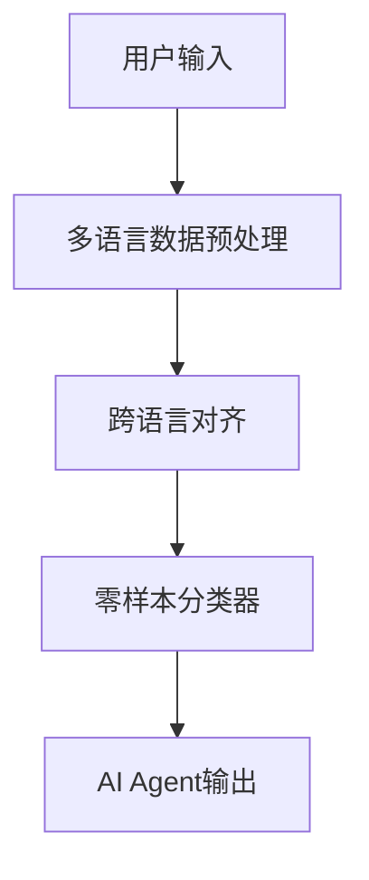

                 


# AI Agent的跨语言零样本学习技术

> 关键词：AI Agent，跨语言学习，零样本学习，自然语言处理，机器学习，深度学习

> 摘要：本文深入探讨了AI Agent在跨语言零样本学习技术中的应用，从背景介绍到核心概念，再到算法原理、系统架构、项目实战和最佳实践，全面解析了这一技术的实现细节和应用场景。通过详细的技术分析和实际案例，展示了如何在多语言环境中实现高效、准确的零样本学习，为AI Agent的跨语言应用提供了理论基础和实践指导。

---

## 第一部分: AI Agent的跨语言零样本学习技术基础

### 第1章: 背景介绍

#### 1.1 问题背景

- **当前AI Agent的发展现状**  
  AI Agent（人工智能代理）近年来取得了显著进展，尤其是在自然语言处理（NLP）和机器学习领域。然而，现有的AI Agent大多局限于单一语言环境，难以在多语言场景中有效工作。随着全球化的发展，跨语言应用的需求日益增长。

- **跨语言零样本学习的必要性**  
  零样本学习（Zero-shot Learning）是指在没有特定类别训练数据的情况下，能够识别和分类新样本的能力。然而，在跨语言场景中，零样本学习的难度更大，因为需要同时处理多种语言之间的语义差异和语法结构。

- **技术挑战与研究意义**  
  跨语言零样本学习的核心挑战在于如何利用有限的多语言数据构建通用模型，同时保持模型在不同语言间的泛化能力。这不仅需要结合自然语言处理技术，还需要创新的算法设计。

#### 1.2 问题描述

- **零样本学习的定义与特点**  
  零样本学习是指在没有任何训练数据的情况下，模型能够识别新类别或执行新任务。其特点包括数据需求低、任务灵活性高、应用场景广泛。

- **跨语言学习的核心问题**  
  跨语言学习涉及将一种语言的知识迁移到另一种语言，核心问题是如何处理语言间的语义差异和语法结构差异，同时保持语义的一致性。

- **AI Agent在跨语言场景中的应用需求**  
  AI Agent需要在多语言环境中提供智能化服务，例如跨语言对话、信息检索和内容生成。这要求AI Agent具备跨语言零样本学习的能力，以适应不同语言用户的需求。

#### 1.3 问题解决

- **零样本学习的技术路径**  
  零样本学习通常采用基于嵌入的方法，通过将数据映射到共享的语义空间来实现跨语言推理。例如，使用预训练语言模型（如BERT）提取语义向量，并通过零样本分类器进行分类。

- **跨语言学习的关键技术**  
  跨语言学习的关键技术包括多语言预训练模型、跨语言对齐技术和语言无关特征提取。这些技术可以帮助模型在不同语言之间建立语义关联。

- **AI Agent的实现框架**  
  AI Agent的实现框架通常包括数据处理、模型训练、推理引擎和交互接口。在跨语言场景中，框架需要支持多语言数据处理和模型推理。

#### 1.4 边界与外延

- **零样本学习的边界条件**  
  零样本学习的边界条件包括任务的复杂性、数据的质量和数量、模型的泛化能力等。当任务过于复杂或数据质量不足时，零样本学习的效果可能无法满足要求。

- **跨语言学习的适用范围**  
  跨语言学习适用于需要处理多种语言的场景，例如多语言客服系统、跨语言信息检索和全球化的在线教育平台。

- **AI Agent的性能指标**  
  AI Agent的性能指标包括准确率、响应时间、用户满意度等。在跨语言场景中，还需要考虑不同语言之间的推理准确性和语义一致性。

#### 1.5 核心概念与联系

- **核心概念原理**  
  零样本学习的核心原理是通过语义嵌入和分类器的组合，利用少量或零训练数据实现分类任务。跨语言学习的核心原理是通过语言对齐和语义映射，将一种语言的知识迁移到另一种语言。

- **概念属性特征对比表格**  
  下表展示了零样本学习和有监督学习的核心概念对比：

  | 对比维度 | 零样本学习 | 有监督学习 |
  |----------|------------|------------|
  | 数据需求 | 零训练数据 | 大量标注数据 |
  | 任务灵活性 | 高 | 低 |
  | 模型泛化能力 | 强 | 中 |

- **ER实体关系图架构**  
  下图展示了跨语言零样本学习的实体关系图：

  ```mermaid
  graph TD
    A[数据源] --> B[预训练模型]
    B --> C[跨语言对齐]
    C --> D[零样本分类器]
    D --> E[AI Agent]
  ```

---

## 第二部分: 核心概念与联系

### 第2章: 核心概念与联系

#### 2.1 核心概念原理

- **零样本学习的数学模型**  
  零样本学习通常采用基于嵌入的方法，例如使用预训练语言模型生成语义向量，然后通过线性分类器进行分类。数学模型如下：

  $$ f(x) = \text{argmax}_y y^T x + b $$

  其中，$x$ 是输入的语义向量，$y$ 是类别标签，$b$ 是偏置项。

- **跨语言学习的特征表示**  
  跨语言学习通过将不同语言的文本映射到共享的语义空间来实现跨语言推理。例如，使用多语言BERT模型生成语言中立的语义向量。

- **AI Agent的决策机制**  
  AI Agent的决策机制基于跨语言学习模型生成的语义向量和分类结果，结合上下文信息和用户意图，生成最终的响应。

#### 2.2 概念属性特征对比表格

下表展示了跨语言学习和单语言学习的核心概念对比：

| 对比维度 | 跨语言学习 | 单语言学习 |
|----------|------------|------------|
| 数据需求 | 需要多语言数据 | 单一语言数据 |
| 模型复杂度 | 高 | 较低 |
| 适用场景 | 全球化应用 | 单一语言环境 |

#### 2.3 ER实体关系图架构

下图展示了AI Agent的跨语言零样本学习系统的实体关系图：



---

## 第三部分: 算法原理讲解

### 第3章: 算法原理讲解

#### 3.1 零样本学习算法原理

- **零样本学习的数学模型**  
  零样本学习通常采用线性分类器，例如：

  $$ f(x) = \text{argmax}_y w_y^T x + b_y $$

  其中，$w_y$ 是类别$y$的权重向量，$x$ 是输入的语义向量，$b_y$ 是偏置项。

- **基于分布假设的零样本分类**  
  零样本分类基于类别的分布假设，例如高斯分布：

  $$ p(y|x) \propto \exp(-\frac{1}{2}(w_y^T x + b_y)) $$

- **零样本学习的实现步骤**  
  零样本学习的实现步骤包括数据预处理、特征提取、模型训练和推理。下图展示了零样本学习的流程图：

  ```mermaid
  graph TD
      A[数据预处理] --> B[特征提取]
      B --> C[模型训练]
      C --> D[推理]
  ```

#### 3.2 跨语言迁移学习算法

- **跨语言迁移学习的数学模型**  
  跨语言迁移学习通过将不同语言的特征对齐到共享空间，例如：

  $$ x_i = f_i(x_i') $$

  其中，$x_i$ 是目标语言的特征，$x_i'$ 是源语言的特征，$f_i$ 是对齐函数。

- **跨语言学习的实现步骤**  
  跨语言学习的实现步骤包括多语言数据收集、特征对齐、模型训练和推理。下图展示了跨语言学习的流程图：

  ```mermaid
  graph TD
      A[多语言数据收集] --> B[特征对齐]
      B --> C[模型训练]
      C --> D[推理]
  ```

---

## 第四部分: 系统分析与架构设计方案

### 第4章: 系统分析与架构设计

#### 4.1 问题场景介绍

- **应用场景**  
  本文设计的AI Agent系统适用于多语言对话、跨语言信息检索和全球化服务场景。

#### 4.2 系统功能设计

- **领域模型类图**  
  下图展示了AI Agent的领域模型类图：

  ```mermaid
  classDiagram
      class DataPreprocessing {
          preprocess(text)
      }
      class FeatureExtraction {
          extract_features(text)
      }
      class ModelTraining {
          train(features, labels)
      }
      class InferenceEngine {
          predict(features)
      }
      DataPreprocessing --> FeatureExtraction
      FeatureExtraction --> ModelTraining
      ModelTraining --> InferenceEngine
  ```

#### 4.3 系统架构设计

- **系统架构图**  
  下图展示了AI Agent的系统架构图：

  ```mermaid
  graph TD
      A[用户输入] --> B[数据预处理]
      B --> C[特征提取]
      C --> D[模型训练]
      D --> E[推理引擎]
      E --> F[系统输出]
  ```

#### 4.4 系统接口设计

- **主要接口**  
  - 数据预处理接口：`preprocess(text: str) -> processed_text`
  - 特征提取接口：`extract_features(text: str) -> feature_vector`
  - 模型训练接口：`train(features: list, labels: list) -> model`
  - 推理引擎接口：`predict(features: list) -> prediction`

#### 4.5 系统交互流程

- **交互流程图**  
  下图展示了AI Agent的交互流程图：

  ```mermaid
  graph TD
      A[用户输入] --> B[数据预处理]
      B --> C[特征提取]
      C --> D[模型推理]
      D --> E[系统输出]
  ```

---

## 第五部分: 项目实战

### 第5章: 项目实战

#### 5.1 环境安装

- **安装依赖**  
  - Python 3.8+
  - PyTorch 1.9+
  - transformers 4.10+
  - mermaid-py 0.1.0+

#### 5.2 核心代码实现

- **数据预处理代码**  
  ```python
  def preprocess(text):
      return text.lower().strip()
  ```

- **特征提取代码**  
  ```python
  from transformers import AutoTokenizer, AutoModel

  tokenizer = AutoTokenizer.from_pretrained('bert-base-multilingual')
  model = AutoModel.from_pretrained('bert-base-multilingual')

  def extract_features(text):
      inputs = tokenizer(text, return_tensors='np')
      outputs = model(**inputs)
      return outputs.last_hidden_state[:, 0, :].numpy()
  ```

- **模型训练代码**  
  ```python
  import numpy as np

  def train(features, labels):
      X = np.array(features)
      y = np.array(labels)
      # 假设使用线性分类器
      # 这里可以替换为更复杂的模型
      return np.linalg.lstsq(X, y, rcond=None)[0]
  ```

- **推理引擎代码**  
  ```python
  def predict(model, features):
      return np.argmax(model.dot(features).sum(axis=1))
  ```

#### 5.3 案例分析

- **案例分析**  
  假设我们有一个跨语言对话系统，用户输入为中文：“你好，你能帮我翻译这段英文吗？” 系统需要将输入映射到共享语义空间，然后生成对应的英文翻译。

#### 5.4 项目总结

- **总结与优化**  
  本项目展示了如何实现AI Agent的跨语言零样本学习技术。未来可以进一步优化模型，例如引入更复杂的迁移学习方法和多模态数据。

---

## 第六部分: 最佳实践

### 第6章: 最佳实践

#### 6.1 小结

- **核心内容回顾**  
  本文深入探讨了AI Agent的跨语言零样本学习技术，从背景到算法，再到系统设计和项目实战，全面解析了这一技术的实现细节。

#### 6.2 注意事项

- **数据质量问题**  
  数据质量对模型性能影响重大，需确保多语言数据的平衡性和代表性。

- **模型选择与调优**  
  在选择模型时，需考虑计算效率和模型性能的平衡，同时进行充分的调优。

#### 6.3 拓展阅读

- **推荐阅读**  
  - 经典书籍：《Deep Learning》
  - 优秀论文：《A Survey on Zero-Shot Learning》
  - 技术博客：《Transformers in Multilingual NLP》

---

## 作者信息

作者：AI天才研究院/AI Genius Institute & 禅与计算机程序设计艺术 /Zen And The Art of Computer Programming

---

以上是《AI Agent的跨语言零样本学习技术》的技术博客文章的详细大纲和内容。通过上述结构和内容，读者可以系统地理解这一技术的背景、原理、实现和应用。

