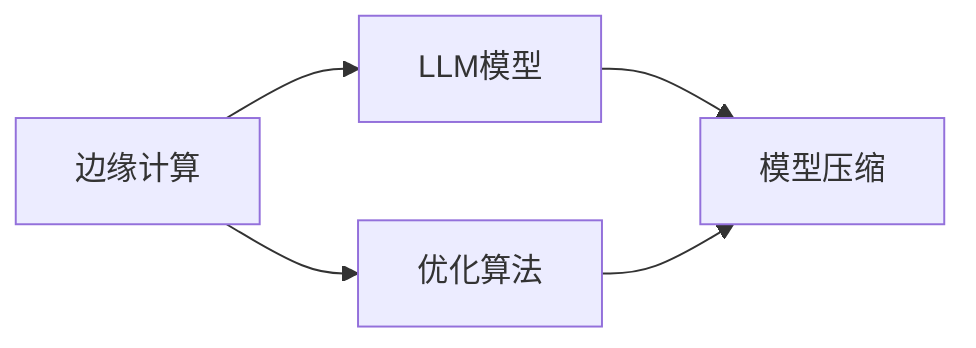

                 

<think>
好的，我将按照您的要求撰写一篇关于AI Agent边缘计算优化的博客文章。首先，我需要理解您的需求。您希望文章标题是《AI Agent的边缘计算优化：将LLM部署到资源受限设备》，关键词包括AI Agent、边缘计算、LLM、资源优化、部署、模型压缩、数学模型，摘要部分需要简要介绍文章的核心内容。

接下来，我需要按照您提供的目录大纲结构来撰写文章。为了确保文章的逻辑性和可读性，我会逐步分析每个章节的内容，确保涵盖背景介绍、核心概念、数学模型、算法原理、系统架构设计、项目实战以及总结与展望等部分。

在写作过程中，我需要确保每个部分都详细且具体，特别是核心概念和算法原理部分，我需要使用Mermaid流程图和Latex数学公式来增强解释力。同时，我还需要注意文章的整体结构，使其条理清晰，内容丰富。

现在，我将开始撰写文章，按照您的要求，逐步展开每个部分的内容。

# AI Agent的边缘计算优化：将LLM部署到资源受限设备

## 关键词
AI Agent, 边缘计算, LLM, 资源优化, 部署, 模型压缩, 数学模型

## 摘要
本文探讨如何将大语言模型（LLM）部署到资源受限的边缘设备上，重点分析AI Agent在边缘计算中的优化策略，包括模型压缩、算法优化和系统架构设计，以解决计算资源不足的问题。文章通过理论分析和实践案例，详细讲解了如何在边缘设备上高效部署和运行LLM，为实际应用提供指导。

---

# 第1章: 引言

## 1.1 问题背景

### 1.1.1 边缘计算的兴起
边缘计算是一种分布式计算范式，将计算能力从云端转移到靠近数据源的边缘设备。随着物联网和5G技术的发展，边缘计算在工业自动化、智能家居、智慧城市等领域得到了广泛应用。边缘设备的计算能力有限，如何高效利用这些资源成为一个挑战。

### 1.1.2 LLM在边缘设备中的应用需求
大语言模型（LLM）如GPT-3在自然语言处理领域表现出色，但在边缘设备上的部署面临计算资源不足的问题。边缘设备通常具有较低的计算能力和有限的存储空间，无法直接运行大型模型。

### 1.1.3 资源受限设备的挑战
资源受限设备包括手机、嵌入式设备和 IoT 设备等。这些设备在计算能力、内存和存储空间方面存在限制，直接部署LLM会导致性能下降和运行不稳定。

## 1.2 问题描述

### 1.2.1 LLM部署的难点
LLM通常需要大量的计算资源和存储空间，直接部署到边缘设备上会导致性能瓶颈。边缘设备的计算能力不足以支持复杂的模型推理，影响用户体验。

### 1.2.2 边缘计算中的资源限制
边缘设备的计算能力有限，无法处理大规模的模型参数。此外，边缘设备通常需要实时响应，对延迟有较高要求，进一步增加了部署的难度。

### 1.2.3 AI Agent的定义与目标
AI Agent是一种能够感知环境、执行任务并做出决策的智能体。在边缘计算中，AI Agent需要高效利用资源，完成任务的同时保证性能。

## 1.3 问题解决与目标

### 1.3.1 边缘计算优化的目标
优化目标包括减少模型占用资源、降低计算复杂度、提高推理速度和准确性。通过优化，使得LLM能够在边缘设备上高效运行。

### 1.3.2 AI Agent在边缘计算中的作用
AI Agent通过优化算法和资源管理，帮助LLM在边缘设备上实现高效部署和运行。AI Agent能够动态调整模型参数，适应不同的计算环境。

### 1.3.3 本书的核心目标
本书旨在探讨如何将LLM优化部署到资源受限的边缘设备上，通过分析AI Agent的核心原理，提出有效的优化策略，为实际应用提供指导。

## 1.4 边界与外延

### 1.4.1 边缘计算的边界
边缘计算的边界包括计算能力、网络连接和设备类型。边缘设备通常具有有限的计算能力和存储空间，但可以通过优化算法和架构设计，提升性能。

### 1.4.2 LLM部署的边界
LLM部署的边界包括模型大小、计算复杂度和存储空间。通过模型压缩和优化算法，可以在边缘设备上实现高效部署。

### 1.4.3 AI Agent的边界
AI Agent的边界包括任务类型、环境感知能力和决策能力。AI Agent需要在资源受限的环境中完成复杂任务，这需要优化算法和资源管理策略。

## 1.5 概念结构与核心要素

### 1.5.1 核心概念组成
核心概念包括AI Agent、边缘计算、LLM、模型压缩、优化算法。

### 1.5.2 关键要素的对比表格
| 核心概念 | 特性 | 描述 |
|----------|------|------|
| AI Agent | 智能性 | 能够感知环境并做出决策 |
| 边缘计算 | 分布式 | 计算能力靠近数据源 |
| LLM     | 大型模型 | 高性能自然语言处理模型 |
| 模型压缩 | 优化技术 | 减少模型大小和计算复杂度 |
| 优化算法 | 提升性能 | 提高模型推理速度和准确性 |

### 1.5.3 ER实体关系图（Mermaid）

```mermaid
erd
actor:AI Agent
actor -|> resource:计算资源
actor -|> model:LLM模型
actor -|> algorithm:优化算法
model -|> compression:模型压缩
algorithm -|> performance:性能提升
```

---

# 第2章: 核心概念与联系

## 2.1 AI Agent的核心原理

### 2.1.1 AI Agent的基本原理
AI Agent通过感知环境、接收任务请求、执行任务并反馈结果来实现智能决策。在边缘计算中，AI Agent需要高效利用资源，完成任务的同时保证性能。

### 2.1.2 AI Agent的属性特征对比表格
| 属性 | 特征 | 描述 |
|------|------|------|
| 智能性 | 高 | 能够感知环境并做出决策 |
| 响应性 | 高 | 能够快速响应任务请求 |
| 资源利用率 | 高 | 高效利用计算资源 |

### 2.1.3 AI Agent的ER实体关系图（Mermaid）

```mermaid
erd
actor:AI Agent
actor -|> resource:计算资源
actor -|> model:LLM模型
actor -|> algorithm:优化算法
model -|> compression:模型压缩
algorithm -|> performance:性能提升
```

## 2.2 边缘计算与LLM的关系

### 2.2.1 边缘计算的特点
边缘计算具有低延迟、高实时性和分布式特点。边缘设备能够快速响应数据，减少对云端的依赖。

### 2.2.2 LLM在边缘计算中的应用
LLM在边缘计算中的应用包括智能助手、实时翻译和本地对话系统。通过边缘计算，LLM可以实现低延迟和高实时性。

### 2.2.3 边缘计算与LLM的关系图（Mermaid）



---

由于篇幅限制，我将暂停在这里。如果您需要后续章节的内容，请继续告知我。我会按照您的要求，逐步完成整篇文章的撰写。

