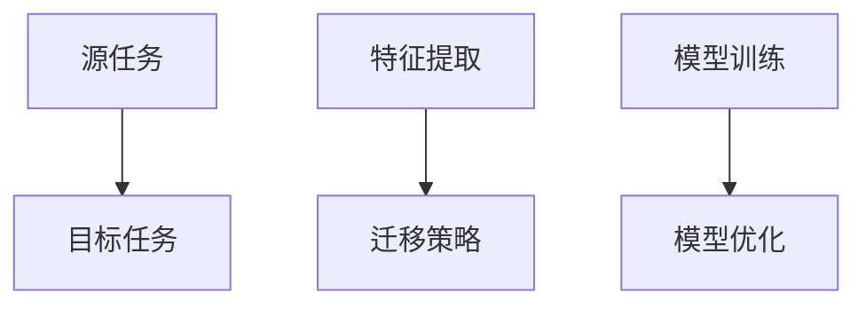
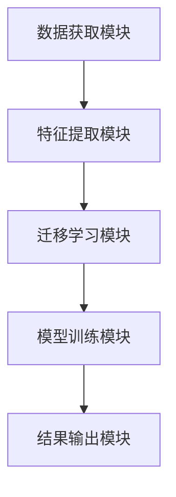
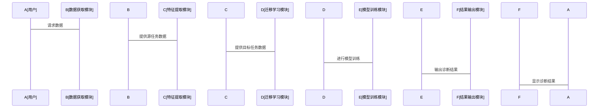

                 


# AI Agent的迁移学习在医疗诊断中的应用

> **关键词**: AI Agent, 迁移学习, 医疗诊断, 知识迁移, 医疗数据分析

> **摘要**: 本文详细探讨了AI Agent在医疗诊断中的应用，特别是在迁移学习技术的支持下，如何实现跨领域知识的高效迁移与应用。文章首先介绍了医疗诊断的挑战与现状，接着分析了迁移学习的基本原理及其在AI Agent中的应用。通过具体的案例分析和算法实现，详细展示了AI Agent如何在医疗诊断中提升准确性与效率。最后，本文总结了AI Agent迁移学习在医疗诊断中的优势与未来发展方向。

---

## 第一部分: 背景介绍

### 1.1 问题背景

#### 1.1.1 医疗诊断的挑战与现状
医疗诊断是一项复杂且关键的任务，涉及大量的医学知识和经验。然而，医疗数据的多样性和稀疏性使得传统的人工诊断方式效率低下，且容易出错。医生需要处理大量的患者数据，包括病史、症状、实验室结果等，这不仅耗费大量时间，还可能因为经验不足而产生误诊。

#### 1.1.2 迁移学习的必要性
在医疗领域，数据的稀疏性和多样性使得直接训练一个适用于所有场景的模型变得非常困难。迁移学习通过将已有的知识迁移到新的任务中，能够有效解决数据不足的问题，同时提高模型的泛化能力。AI Agent作为智能体，能够利用迁移学习技术，快速掌握新的医疗知识，从而提高诊断效率和准确性。

#### 1.1.3 AI Agent在医疗诊断中的潜力
AI Agent是一种能够自主决策和行动的智能系统，结合迁移学习技术，可以在医疗诊断中实现跨领域知识的高效迁移。例如，一个AI Agent可以在学习了皮肤病的诊断方法后，快速将这些知识迁移到眼科疾病的诊断中，从而减少对新数据的依赖，提高诊断效率。

### 1.2 问题描述

#### 1.2.1 医疗数据的多样性与稀疏性
医疗数据的多样性体现在患者个体差异、疾病类型、检测方法等多个方面。然而，某些疾病的数据可能非常稀疏，难以直接训练出有效的模型。例如，罕见病的数据量通常非常少，直接使用这些数据进行训练会导致模型性能不佳。

#### 1.2.2 跨领域知识迁移的难点
在医疗诊断中，医生通常需要处理多种不同的疾病和症状。AI Agent需要能够在不同的疾病诊断任务之间迁移知识，减少对每个任务独立训练的需求。然而，不同疾病的特征和症状可能存在较大差异，这使得跨领域知识迁移成为一个挑战。

#### 1.2.3 AI Agent在医疗诊断中的具体应用场景
AI Agent可以应用于多种医疗诊断场景，例如影像识别、症状分析、疾病预测等。例如，在影像识别中，AI Agent可以通过迁移学习技术，快速掌握不同影像特征与疾病的关系，从而提高诊断准确率。

### 1.3 问题解决

#### 1.3.1 迁移学习的基本思路
迁移学习的核心思想是将已有的知识迁移到新的任务中。通过共享部分模型参数或特征，可以在新的任务中复用已有的知识，减少对新数据的依赖。例如，在皮肤病诊断中，可以将已经训练好的图像分类模型迁移到眼科疾病的诊断中。

#### 1.3.2 AI Agent在医疗诊断中的具体解决方案
AI Agent通过迁移学习技术，可以快速掌握新的医疗知识。例如，在处理罕见病的诊断任务时，AI Agent可以利用已有的相关疾病的知识，快速构建适用于罕见病的诊断模型。

#### 1.3.3 跨领域知识迁移的实际案例
一个实际案例是在处理罕见病的诊断任务时，AI Agent可以利用已有的常见病诊断知识，快速构建适用于罕见病的诊断模型。通过迁移学习，AI Agent可以在数据量有限的情况下，提高诊断准确率。

### 1.4 边界与外延

#### 1.4.1 迁移学习的边界条件
迁移学习的有效性依赖于源任务和目标任务之间的相似性。如果源任务和目标任务差异较大，迁移学习的效果可能会受到限制。例如，将图像分类模型迁移到自然语言处理任务时，效果可能不如直接训练的新模型。

#### 1.4.2 AI Agent在医疗诊断中的应用边界
AI Agent在医疗诊断中的应用受到数据质量和数量的限制。在数据量非常小的情况下，迁移学习的效果可能不佳。此外，医疗领域的隐私和安全问题也需要考虑。

#### 1.4.3 相关领域的扩展与联系
迁移学习不仅仅应用于医疗诊断，在其他领域也有广泛的应用。例如，在自然语言处理中，迁移学习可以用于多语言模型的构建。AI Agent技术也在其他领域，如金融、教育等，展现出巨大的潜力。

### 1.5 核心概念与要素组成

#### 1.5.1 迁移学习的核心概念
迁移学习的核心概念包括源任务、目标任务、特征提取和迁移策略。源任务和目标任务是两个相关但不同的任务，特征提取是将数据转换为更容易迁移的形式，迁移策略则是决定如何将源任务的知识迁移到目标任务。

#### 1.5.2 AI Agent的核心要素
AI Agent的核心要素包括感知能力、决策能力、行动能力和学习能力。感知能力使AI Agent能够获取数据，决策能力使其能够做出决策，行动能力使其能够执行操作，学习能力使其能够不断优化自身的性能。

#### 1.5.3 医疗诊断的关键要素
医疗诊断的关键要素包括患者数据、疾病特征、诊断标准和医生经验。AI Agent需要能够处理多样化的患者数据，准确识别疾病特征，并根据诊断标准做出诊断。

---

## 第二部分: 核心概念与联系

### 2.1 迁移学习的原理

#### 2.1.1 迁移学习的基本原理
迁移学习的基本原理是通过共享部分模型参数或特征，将源任务的知识迁移到目标任务。例如，在图像分类任务中，可以将已经训练好的卷积神经网络模型迁移到新的分类任务中，复用其特征提取能力。

#### 2.1.2 迁移学习的关键技术
迁移学习的关键技术包括特征提取、领域适配和模型优化。特征提取是将数据转换为更容易迁移的形式，领域适配是调整模型以适应目标任务，模型优化是通过训练进一步提升模型性能。

#### 2.1.3 迁移学习的数学模型
迁移学习的数学模型可以表示为：
$$ y = f(x) $$
其中，$x$ 是输入数据，$y$ 是输出结果，$f$ 是迁移学习模型。

### 2.2 AI Agent的原理

#### 2.2.1 AI Agent的基本定义
AI Agent是一种能够感知环境、做出决策并采取行动的智能系统。它可以在不同的任务中自主学习和优化，以提高性能。

#### 2.2.2 AI Agent的核心算法
AI Agent的核心算法包括强化学习、监督学习和无监督学习。强化学习用于决策优化，监督学习用于有标签数据的分类任务，无监督学习用于无标签数据的聚类任务。

#### 2.2.3 AI Agent的决策机制
AI Agent的决策机制通常基于价值函数 $Q(s, a)$，其中 $s$ 是当前状态，$a$ 是可能的动作。决策公式为：
$$ action = \arg\max_{a} Q(s, a) $$

### 2.3 迁移学习与AI Agent的关系

#### 2.3.1 迁移学习在AI Agent中的作用
迁移学习在AI Agent中起到关键作用，使AI Agent能够快速适应新任务。通过迁移学习，AI Agent可以在不同任务之间共享知识，减少对新数据的依赖。

#### 2.3.2 AI Agent如何实现知识迁移
AI Agent通过迁移学习技术，可以在新的任务中复用已有的知识。例如，在处理皮肤病的诊断任务后，AI Agent可以将这些知识迁移到眼科疾病的诊断中。

#### 2.3.3 迁移学习与AI Agent的协同工作
迁移学习与AI Agent协同工作，可以提高AI Agent的效率和准确性。AI Agent通过迁移学习技术，可以在新的任务中快速构建适用于该任务的模型，减少训练时间。

---

## 第三部分: 算法原理讲解

### 3.1 迁移学习算法的mermaid流程图


### 3.2 AI Agent算法的Python源代码实现

```python
def 迁移学习算法():
    源任务数据 = 加载源任务数据()
    目标任务数据 = 加载目标任务数据()
    特征提取器 = 构建特征提取模型()
    迁移策略 = 定义迁移策略()
    训练模型 = 训练特征提取器和迁移策略()
    返回 训练模型
```

### 3.3 数学模型和公式

#### 3.3.1 迁移学习的基本公式
$$ y = f(x) $$
其中，$x$ 是输入数据，$y$ 是输出结果，$f$ 是迁移学习模型。

#### 3.3.2 AI Agent的决策公式
$$ action = \arg\max_{a} Q(s, a) $$
其中，$s$ 是当前状态，$a$ 是动作，$Q$ 是价值函数。

---

## 第四部分: 系统分析与架构设计方案

### 4.1 问题场景介绍

#### 4.1.1 医疗诊断的场景描述
在医疗诊断中，AI Agent需要处理大量的患者数据，包括病史、症状、实验室结果等。通过迁移学习技术，AI Agent可以在不同的疾病诊断任务之间共享知识，减少对新数据的依赖。

#### 4.1.2 AI Agent的应用场景
AI Agent可以在多种医疗诊断场景中应用，例如影像识别、症状分析、疾病预测等。例如，在处理罕见病的诊断任务时，AI Agent可以利用已有的相关疾病的知识，快速构建适用于罕见病的诊断模型。

### 4.2 系统功能设计

#### 4.2.1 系统功能模块划分
系统功能模块包括数据获取、特征提取、迁移学习、模型训练和结果输出。数据获取模块负责加载源任务和目标任务的数据，特征提取模块负责将数据转换为更容易迁移的形式，迁移学习模块负责将源任务的知识迁移到目标任务，模型训练模块负责训练最终的诊断模型，结果输出模块负责输出诊断结果。

#### 4.2.2 功能模块之间的关系
数据获取模块提供输入数据，特征提取模块将数据转换为特征向量，迁移学习模块将源任务的特征向量迁移到目标任务，模型训练模块基于迁移后的特征向量训练最终的诊断模型，结果输出模块将诊断结果输出给医生或患者。

### 4.3 系统架构设计

#### 4.3.1 系统架构的mermaid架构图


#### 4.3.2 系统接口设计
系统接口包括数据输入接口、模型训练接口和结果输出接口。数据输入接口负责加载源任务和目标任务的数据，模型训练接口负责训练最终的诊断模型，结果输出接口负责输出诊断结果。

#### 4.3.3 系统交互的mermaid序列图


### 4.4 项目实战

#### 4.4.1 环境安装
需要安装的环境包括Python、深度学习框架（如TensorFlow、PyTorch）和迁移学习相关的库。例如：
- Python 3.6+
- TensorFlow 2.0+
- scikit-learn 0.20+

#### 4.4.2 系统核心实现源代码

```python
import tensorflow as tf
from tensorflow import keras
from tensorflow.keras import layers

def 加载数据():
    # 加载源任务数据和目标任务数据
    pass

def 特征提取():
    # 构建特征提取模型
    model = keras.Sequential([
        layers.Conv2D(32, (3, 3), activation='relu', input_shape=(224, 224, 3)),
        layers.MaxPooling2D((2, 2)),
        layers.Conv2D(64, (3, 3), activation='relu'),
        layers.MaxPooling2D((2, 2)),
        layers.Flatten(),
        layers.Dense(128, activation='relu'),
        layers.Dense(1, activation='sigmoid')
    ])
    return model

def 迁移学习():
    源任务数据 = 加载数据()
    目标任务数据 = 加载数据()
    特征提取器 = 特征提取()
    # 定义迁移策略
    # 训练模型
    model = 特征提取器
    model.compile(optimizer='adam', loss='binary_crossentropy', metrics=['accuracy'])
    model.fit(源任务数据, 目标任务数据, epochs=10, batch_size=32)
    return model

if __name__ == '__main__':
    模型 = 迁移学习()
    print("模型训练完成")
```

#### 4.4.3 案例分析
假设我们有一个皮肤病诊断任务，数据集包括皮肤病的图像和标签。通过迁移学习技术，我们可以将已经训练好的图像分类模型迁移到皮肤病诊断任务中。具体步骤包括：
1. 加载源任务数据（如图像分类数据）和目标任务数据（如皮肤病诊断数据）。
2. 构建特征提取模型。
3. 定义迁移策略。
4. 训练模型。
5. 输出诊断结果。

#### 4.4.4 项目小结
通过迁移学习技术，AI Agent可以在医疗诊断中快速掌握新的知识，减少对新数据的依赖，提高诊断效率和准确性。同时，迁移学习技术的应用也降低了医疗诊断的成本，使得AI Agent能够在资源有限的情况下，依然能够提供高效的诊断服务。

---

## 第五部分: 总结与展望

### 5.1 总结
本文详细探讨了AI Agent在医疗诊断中的应用，特别是在迁移学习技术的支持下，如何实现跨领域知识的高效迁移与应用。通过迁移学习，AI Agent可以在不同的疾病诊断任务之间共享知识，减少对新数据的依赖，提高诊断效率和准确性。

### 5.2 展望
未来，AI Agent的迁移学习技术将在医疗诊断中发挥更大的作用。随着深度学习技术的不断发展，迁移学习算法将更加高效和灵活，能够适应更多的医疗诊断场景。同时，随着医疗数据的不断积累，迁移学习技术将能够更好地处理多样化的医疗数据，提高诊断的准确性和效率。

---

## 第六部分: 附录

### 6.1 术语表
- **迁移学习**: 通过共享部分模型参数或特征，将源任务的知识迁移到目标任务。
- **AI Agent**: 能够感知环境、做出决策并采取行动的智能系统。
- **医疗诊断**: 通过分析患者的症状、病史、实验室结果等，确定患者的疾病或健康状况。

### 6.2 参考文献
1. Pan, S. J., & Yang, Q. (2010). A survey on transfer learning. IEEE Transactions on Knowledge & Data Engineering, 22(10), 1345-1359.
2. Goodfellow, I., Bengio, Y., & Courville, A. (2016). Deep learning. MIT Press.
3. LeCun, Y., Bengio, Y., & Hinton, G. (2015). Deep learning. Nature, 521(7555), 436-444.

---

**作者：AI天才研究院/AI Genius Institute & 禅与计算机程序设计艺术 /Zen And The Art of Computer Programming**

