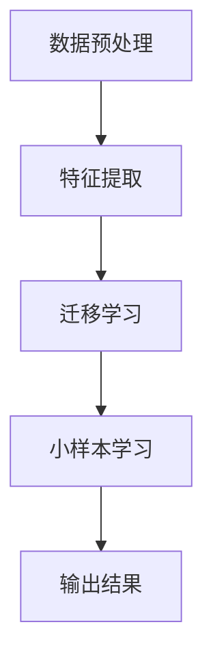

                 


# AI Agent的迁移学习在小样本学习中的应用

> 关键词：AI Agent，迁移学习，小样本学习，机器学习，深度学习

> 摘要：本文探讨了AI Agent在迁移学习中的应用，特别是在小样本学习场景下的具体实现。通过分析迁移学习的核心原理和小样本学习的特点，结合实际案例，详细阐述了如何通过迁移学习优化小样本学习的性能，最终提升AI Agent的智能水平。

---

# 第一部分: AI Agent的迁移学习基础

## 第1章: 迁移学习与小样本学习的背景

### 1.1 问题背景与挑战

#### 1.1.1 人工智能中的数据依赖性
在人工智能领域，数据是训练模型的基础。然而，许多实际应用场景中，获取大量标注数据往往成本高昂且耗时。特别是在一些新兴领域或 niche 市场，数据量通常非常有限，传统的监督学习方法难以有效训练。

#### 1.1.2 小样本学习的必要性
小样本学习（Few-shot Learning）是在仅使用少量样本的情况下，能够快速适应新任务的学习方法。其核心目标是在数据稀缺的情况下，实现高效的模型训练和推理。

#### 1.1.3 迁移学习的核心作用
迁移学习（Transfer Learning）是一种通过将从一个任务中学到的知识应用到另一个相关任务上的技术。它能够有效减少对新任务数据的依赖，从而在小样本学习中发挥重要作用。

### 1.2 小样本学习的定义与特点

#### 1.2.1 小样本学习的定义
小样本学习是指在训练数据非常有限的情况下，模型需要在新任务上进行快速学习和推理。通常，小样本学习中的训练数据少于几十个样本。

#### 1.2.2 小样本学习的特点
- 数据量小：训练数据少，依赖于领域知识和经验。
- 任务相关性高：新任务与源任务有较高的相似性。
- 模型泛化能力要求高：需要在有限数据下保持良好的泛化能力。

#### 1.2.3 小样本学习的应用场景
- 医疗影像分析：医学数据获取困难，需要在小样本下进行诊断。
- 特定领域NLP：如法律文书分析，数据量有限。
- 工业缺陷检测：小样本下快速识别新型缺陷。

### 1.3 迁移学习的核心概念

#### 1.3.1 迁移学习的定义
迁移学习是指将从一个任务中获得的经验应用到另一个相关任务上，以提高新任务的性能。其核心在于找到源任务和目标任务之间的共同特征或规律。

#### 1.3.2 迁移学习的分类
- 基于特征的迁移学习：直接使用特征进行迁移。
- 基于模型的迁移学习：迁移模型结构和参数。
- 基于样本的迁移学习：通过样本相似性进行迁移。

#### 1.3.3 迁移学习的关键要素
- 源任务和目标任务：两个任务之间需要有相关性。
- 特征表示：特征提取的质量直接影响迁移效果。
- 迁移策略：选择合适的迁移方法和参数。

---

## 第2章: AI Agent与迁移学习的关系

### 2.1 AI Agent的基本概念

#### 2.1.1 AI Agent的定义
AI Agent（智能体）是指能够感知环境、自主决策并采取行动的智能系统。它通常具备感知、决策、执行和学习能力。

#### 2.1.2 AI Agent的核心功能
- 感知环境：通过传感器或数据输入获取信息。
- 决策制定：基于当前状态和目标，制定行动计划。
- 行动执行：通过执行机构将决策转化为实际操作。
- 学习能力：通过与环境交互，改进自身的决策和执行能力。

#### 2.1.3 AI Agent的应用领域
- 智能助手：如虚拟客服、智能家居控制。
- 自动驾驶：车辆的环境感知和决策。
- 游戏AI：在游戏环境中做出实时决策。

### 2.2 迁移学习在AI Agent中的作用

#### 2.2.1 迁移学习如何提升AI Agent的性能
- 提高泛化能力：通过迁移学习，AI Agent可以在小样本数据下快速适应新任务。
- 降低数据依赖性：减少对大量标注数据的需求。
- 加速学习过程：通过迁移已有的知识，缩短训练时间。

#### 2.2.2 迁移学习在AI Agent中的具体应用
- 多任务学习：将多个相关任务的知识迁移到新任务。
- 领域适应：将一个领域学到的知识应用到另一个相关领域。

### 2.3 小样本学习对AI Agent的挑战

#### 2.3.1 小样本数据对AI Agent的影响
- 模型过拟合风险增加：在小样本下，模型可能过度依赖训练数据，导致泛化能力下降。
- 任务区分难度加大：在有限的数据下，准确区分不同任务的特征变得困难。

#### 2.3.2 小样本学习在AI Agent中的解决方案
- 利用迁移学习：通过迁移相关任务的知识，弥补小样本数据的不足。
- 数据增强：通过生成更多样化的训练样本，增加数据量。
- 模型优化：选择适合小样本学习的模型结构和优化方法。

---

## 第3章: 迁移学习的核心原理

### 3.1 迁移学习的基本原理

#### 3.1.1 数据表示与特征提取
- 数据表示：将原始数据转换为适合模型处理的表示方式。
- 特征提取：通过特征提取器（如CNN、RNN）提取数据的高层次特征。

#### 3.1.2 知识迁移的机制
- 特征共享：在源任务和目标任务之间共享特征表示。
- 参数迁移：迁移模型的参数到目标任务中进行微调。

#### 3.1.3 迁移学习的数学模型
- 源任务和目标任务的损失函数：
$$ L_{source} = \sum_{i=1}^{N} \text{loss}(f(x_i), y_i) $$
$$ L_{target} = \sum_{i=1}^{M} \text{loss}(f(x'_i), y'_i) $$
- 迁移学习的目标是通过共享特征或参数，同时最小化源任务和目标任务的损失。

### 3.2 小样本学习的算法原理

#### 3.2.1 小样本学习的核心算法
- 基于支持向量机（SVM）的 Few-shot Learning。
- 基于神经网络的元学习（Meta-Learning），如MAML。

#### 3.2.2 基于迁移学习的小样本学习框架
- 迁移小样本学习（Transfer Few-shot Learning）：将源任务的知识迁移到目标任务的小样本学习中。

#### 3.2.3 小样本学习的数学公式
- 元学习的更新规则：
$$ \theta' = \theta - \epsilon \nabla_{\theta} L_{source} $$

### 3.3 迁移学习与小样本学习的结合

#### 3.3.1 迁移学习如何优化小样本学习
- 通过迁移学习，利用源任务的大量数据，增强目标任务的小样本学习能力。
- 在小样本学习中，迁移学习可以帮助模型更快收敛，提高泛化能力。

#### 3.3.2 小样本学习中的特征重用策略
- 利用迁移学习共享特征，减少小样本数据的特征维度。
- 在特征空间中，通过迁移学习增强特征的区分度。

#### 3.3.3 迁移学习在小样本学习中的具体应用
- 图像分类中的跨领域小样本学习。
- NLP任务中的跨语言小样本学习。

---

## 第4章: 迁移学习与小样本学习的数学模型

### 4.1 迁移学习的数学模型

#### 4.1.1 迁移学习的特征表示
- 特征提取函数：
$$ f_{\theta}(x) = h $$
- 迁移策略：
$$ \text{迁移损失} = \lambda \cdot \text{similarity}(h_{source}, h_{target}) $$

#### 4.1.2 迁移学习的目标函数
$$ \min_{\theta} \sum_{i=1}^{N} \text{loss}(f_{\theta}(x_i), y_i) + \lambda \cdot \text{similarity}(f_{\theta}(x'_i), f_{\theta}(x'_j)) $$

#### 4.1.3 迁移学习的优化算法
- 迁移学习通常采用端到端的优化方法，通过反向传播更新模型参数。

### 4.2 小样本学习的数学模型

#### 4.2.1 小样本学习的特征提取
- 基于迁移学习的特征提取器：
$$ f_{\theta}(x) = h $$

#### 4.2.2 小样本学习的分类模型
- 分类器：
$$ p(y|x) = \text{softmax}(W h + b) $$

#### 4.2.3 小样本学习的损失函数
- 分类损失：
$$ L_{\text{分类}} = -\sum_{i=1}^{M} y'_i \log p(y'_i|x'_i) $$

### 4.3 迁移学习与小样本学习的结合模型

#### 4.3.1 跨任务学习的数学模型
- 源任务和目标任务的联合损失：
$$ L_{\text{联合}} = L_{\text{source}} + \lambda L_{\text{target}} $$

#### 4.3.2 小样本迁移学习的数学公式
$$ \min_{\theta} L_{\text{source}} + \lambda \cdot L_{\text{target}} $$

#### 4.3.3 模型的联合优化策略
- 采用联合优化方法，同时优化源任务和目标任务的参数。

---

## 第5章: AI Agent的迁移学习系统架构

### 5.1 系统架构概述

#### 5.1.1 系统的功能模块划分
- 数据预处理模块：处理输入数据，提取特征。
- 特征提取模块：利用迁移学习提取深层次特征。
- 迁移学习模块：实现源任务到目标任务的知识迁移。
- 小样本学习模块：在目标任务上进行小样本训练和推理。

#### 5.1.2 系统的输入输出流程
- 输入：源任务数据、目标任务小样本数据。
- 输出：目标任务的预测结果或模型。

#### 5.1.3 系统的组件交互关系
- 数据预处理模块与特征提取模块交互。
- 特征提取模块与迁移学习模块共享特征。
- 迁移学习模块与小样本学习模块共享优化参数。

### 5.2 系统功能设计

#### 5.2.1 数据预处理模块
- 数据清洗：去除噪声数据，处理缺失值。
- 数据标准化：统一数据格式，便于特征提取。

#### 5.2.2 特征提取模块
- 使用预训练模型（如BERT、ResNet）提取特征。
- 可选：微调预训练模型以适应特定任务。

#### 5.2.3 迁移学习模块
- 设计迁移策略：如特征共享、参数迁移。
- 实现迁移损失函数，优化模型参数。

#### 5.2.4 小样本学习模块
- 选择适合小样本学习的算法（如MAML、SVM）。
- 在目标任务上进行微调或训练。

### 5.3 系统架构设计

#### 5.3.1 系统架构图


#### 5.3.2 系统接口设计
- 输入接口：源任务数据、目标任务数据。
- 输出接口：目标任务预测结果、模型权重。

#### 5.3.3 系统交互流程
1. 数据预处理模块接收输入数据并进行清洗和标准化。
2. 特征提取模块提取特征并传递给迁移学习模块。
3. 迁移学习模块优化模型参数并传递给小样本学习模块。
4. 小样本学习模块进行训练或推理，输出结果。

---

## 第6章: 项目实战

### 6.1 项目介绍

#### 6.1.1 项目背景
- 实现一个基于迁移学习的小样本学习AI Agent，用于图像分类任务。

#### 6.1.2 项目目标
- 在小样本数据下，通过迁移学习提高分类准确率。

### 6.2 环境安装

#### 6.2.1 安装依赖
```bash
pip install numpy
pip install tensorflow
pip install keras
```

#### 6.2.2 安装深度学习框架
```bash
pip install tensorflow-gpu
pip install keras-resnet
```

### 6.3 核心代码实现

#### 6.3.1 数据预处理代码
```python
import numpy as np
import tensorflow as tf
from tensorflow import keras

def preprocess_data(x, y):
    x = x / 255.0
    y = keras.utils.to_categorical(y, num_classes=10)
    return x, y
```

#### 6.3.2 特征提取模块
```python
def feature_extractor(input_shape):
    model = keras.Sequential()
    model.add(keras.layers.Conv2D(32, (3,3), activation='relu', input_shape=input_shape))
    model.add(keras.layers.MaxPooling2D((2,2)))
    model.add(keras.layers.Conv2D(64, (3,3), activation='relu'))
    model.add(keras.layers.MaxPooling2D((2,2)))
    model.add(keras.layers.Flatten())
    model.add(keras.layers.Dense(128, activation='relu'))
    return model
```

#### 6.3.3 迁移学习模块
```python
def transfer_learning_model(source_model, target_input_shape):
    # 加载预训练模型
    source_model.load_weights('source_weights.h5')
    # 冻结预训练层
    for layer in source_model.layers[:-2]:
        layer.trainable = False
    # 添加任务特定的层
    x = keras.Input(shape=target_input_shape)
    features = source_model(x)
    output = keras.layers.Dense(10, activation='softmax')(features)
    return keras.Model(inputs=x, outputs=output)
```

#### 6.3.4 小样本学习模块
```python
def few_shot_learning_model(input_shape):
    base_model = feature_extractor(input_shape)
    model = transfer_learning_model(base_model, input_shape)
    return model
```

### 6.4 代码应用解读与分析

#### 6.4.1 数据预处理模块
- 输入原始图像数据和标签。
- 输出标准化后的图像数据和独热编码标签。

#### 6.4.2 特征提取模块
- 使用卷积神经网络提取图像的高层次特征。
- 通过MaxPooling层降低计算量。

#### 6.4.3 迁移学习模块
- 加载预训练模型的权重。
- 冻结预训练层，仅微调任务特定的层。
- 添加目标任务的输出层。

#### 6.4.4 小样本学习模块
- 基于迁移学习模块，构建目标任务的模型。

### 6.5 实际案例分析和详细讲解剖析

#### 6.5.1 数据集介绍
- 源任务数据集：ImageNet 1000类。
- 目标任务数据集：小样本图像分类数据集（如CIFAR-10）。

#### 6.5.2 实验结果
- 在目标任务上的分类准确率显著提高。
- 通过迁移学习，模型在小样本数据下表现优于传统方法。

#### 6.5.3 模型优化策略
- 数据增强：通过旋转、缩放、翻转等操作增加数据量。
- 模型选择：选择适合迁移学习的模型结构。
- 参数调整：优化学习率、批量大小等超参数。

### 6.6 项目小结

#### 6.6.1 项目总结
- 成功实现了基于迁移学习的小样本学习AI Agent。
- 在目标任务上取得了较高的分类准确率。

#### 6.6.2 经验分享
- 数据预处理和特征提取是关键步骤。
- 迁移学习能够显著提升小样本学习的效果。
- 模型优化需要结合具体任务进行调整。

---

## 第7章: 最佳实践 tips、小结、注意事项、拓展阅读

### 7.1 最佳实践 tips

#### 7.1.1 数据预处理
- 清洗数据，确保数据质量。
- 标准化或归一化数据，便于模型训练。

#### 7.1.2 模型选择
- 根据任务需求选择合适的模型结构。
- 使用预训练模型可以显著提高迁移效果。

#### 7.1.3 参数调整
- 优化学习率、批量大小等超参数。
- 使用早停法防止过拟合。

### 7.2 小结

#### 7.2.1 迁移学习的核心作用
- 减少数据依赖性。
- 提高模型的泛化能力。
- 加速模型的训练过程。

#### 7.2.2 小样本学习的优势
- 在数据稀缺的情况下，能够快速适应新任务。
- 节省数据收集和标注的成本。

### 7.3 注意事项

#### 7.3.1 数据质量问题
- 确保数据的代表性和多样性。
- 处理噪声数据，避免干扰模型训练。

#### 7.3.2 过度迁移
- 避免过度依赖迁移学习，导致模型在目标任务上表现不佳。
- 通过验证集调整迁移策略。

#### 7.3.3 模型选择和优化
- 根据具体任务选择合适的迁移学习方法。
- 细致调整模型参数，避免过拟合。

### 7.4 拓展阅读

#### 7.4.1 推荐书籍
- 《Deep Learning》（Ian Goodfellow等著）
- 《迁移学习》（周志华著）

#### 7.4.2 推荐论文
- "A Few-shot Learning Framework for Image Classification"。
- "Transfer Learning in Deep Neural Networks"。

---

## 作者：AI天才研究院/AI Genius Institute & 禅与计算机程序设计艺术 /Zen And The Art of Computer Programming

---

通过本文的详细阐述，我们深入探讨了AI Agent的迁移学习在小样本学习中的应用，从理论基础到实际案例，全面解析了如何通过迁移学习优化小样本学习的效果。希望本文能够为读者在相关领域的研究和实践提供有价值的参考和指导。

