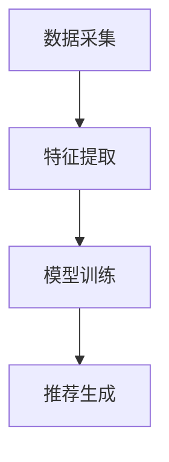
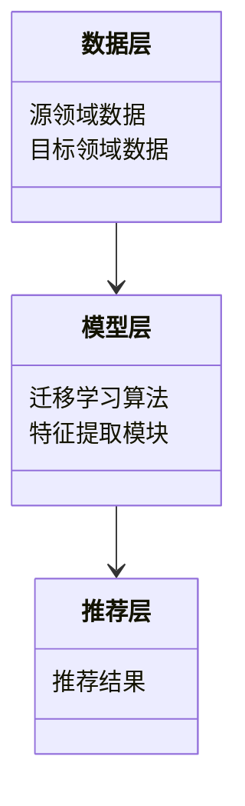
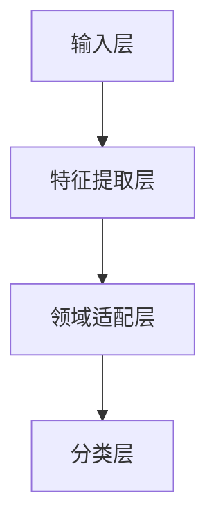
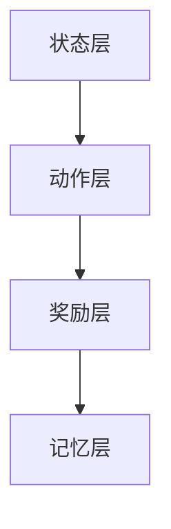

                 


# AI Agent的迁移学习在跨领域推荐中的应用

> **关键词**：AI Agent, 迁移学习, 跨领域推荐, 推荐系统, 机器学习, 深度学习, 强化学习

> **摘要**：  
本文深入探讨了AI Agent在跨领域推荐系统中的应用，重点分析了迁移学习在解决跨领域推荐问题中的作用。文章从背景介绍、核心概念、算法原理、系统设计、项目实战到最佳实践，全面解析了AI Agent如何通过迁移学习提升跨领域推荐的性能和效果。通过具体案例分析和代码实现，本文为读者提供了从理论到实践的完整指导。

---

# 第一部分: AI Agent与迁移学习的背景与基础

## 第1章: AI Agent的基本概念与应用

### 1.1 AI Agent的定义与特点

AI Agent（人工智能代理）是指能够感知环境、执行任务并做出决策的智能实体。它可以是一个软件程序、机器人或其他智能系统，其核心目标是通过与环境交互来实现特定目标。

#### 1.1.1 AI Agent的定义  
AI Agent是一种能够感知环境、自主决策并执行任务的智能系统，通常由感知模块、推理模块和行动模块组成。  

#### 1.1.2 AI Agent的核心特点  
- **自主性**：能够自主决策，无需外部干预。  
- **反应性**：能够实时感知环境并做出响应。  
- **目标导向性**：以实现特定目标为导向。  
- **学习能力**：能够通过经验改进自身性能。  

#### 1.1.3 AI Agent与传统智能系统的区别  
AI Agent的核心区别在于其自主性和智能性。传统智能系统通常需要人工编程，而AI Agent能够通过学习和自适应来优化性能。

---

### 1.2 迁移学习的基本概念

迁移学习是一种机器学习技术，旨在将一个领域学到的知识迁移到另一个领域，从而提高新领域的学习效率和性能。

#### 1.2.1 迁移学习的定义  
迁移学习是指在两个或多个领域之间迁移知识，利用源领域数据来提升目标领域模型性能的技术。  

#### 1.2.2 迁移学习的核心原理  
迁移学习的核心在于找到源领域和目标领域之间的共同特征或潜在关系，通过共享这些特征来提高模型的泛化能力。  

#### 1.2.3 迁移学习与传统机器学习的区别  
传统的机器学习方法依赖于大量目标领域的数据，而迁移学习通过利用源领域的数据，减少了对目标领域数据的依赖。

---

### 1.3 跨领域推荐系统的概念

#### 1.3.1 跨领域推荐的定义  
跨领域推荐是指在不同领域之间进行推荐，例如将电影推荐的经验迁移到书籍推荐。  

#### 1.3.2 跨领域推荐的核心问题  
- 数据稀疏性：目标领域数据不足。  
- 领域差异性：不同领域之间的特征差异较大。  

#### 1.3.3 跨领域推荐的应用场景  
- 电子商务：将服装推荐迁移到电子产品推荐。  
- 娱乐：将电影推荐迁移到音乐推荐。  

---

## 第2章: 迁移学习在推荐系统中的作用

### 2.1 迁移学习在推荐系统中的优势

#### 2.1.1 数据稀疏性问题的解决  
通过迁移学习，可以利用源领域的数据弥补目标领域数据的不足。  

#### 2.1.2 跨领域数据的共享与利用  
迁移学习能够有效利用跨领域数据，提高推荐系统的泛化能力。  

#### 2.1.3 提高推荐系统的泛化能力  
迁移学习使得推荐系统能够在不同领域之间灵活切换，提高其泛化能力。

---

### 2.2 AI Agent在推荐系统中的角色

#### 2.2.1 AI Agent作为推荐主体  
AI Agent可以作为推荐系统的主体，通过感知用户行为和环境信息，动态调整推荐策略。  

#### 2.2.2 AI Agent作为推荐目标  
AI Agent也可以作为推荐的目标，通过推荐优化其决策过程。  

#### 2.2.3 AI Agent在推荐系统中的智能决策  
AI Agent能够通过迁移学习，快速适应不同领域的推荐需求，做出智能决策。

---

## 第3章: 跨领域推荐系统的挑战与解决方案

### 3.1 跨领域推荐的核心挑战

#### 3.1.1 数据分布差异  
不同领域之间的数据分布可能存在显著差异，导致迁移学习的效果受限。  

#### 3.1.2 领域知识的迁移难度  
不同领域的知识和特征可能存在较大差异，如何有效迁移成为挑战。  

#### 3.1.3 用户行为的跨领域一致性  
用户的偏好在不同领域之间可能存在一致性，但也可能存在较大差异。

---

### 3.2 迁移学习在跨领域推荐中的解决方案

#### 3.2.1 基于特征的迁移学习  
通过提取和共享特征，减少不同领域之间的差异。  

#### 3.2.2 基于模型的迁移学习  
通过共享模型参数或结构，实现跨领域的知识迁移。  

#### 3.2.3 基于图的迁移学习  
通过构建领域图，利用图结构信息进行迁移学习。

---

## 第4章: AI Agent的迁移学习模型

### 4.1 迁移学习的主流模型

#### 4.1.1 基于浅层模型的迁移学习  
例如，基于线性回归或朴素贝叶斯的迁移学习方法。  

#### 4.1.2 基于深度学习的迁移学习  
例如，使用深度神经网络（DNN）进行迁移学习。  

#### 4.1.3 基于强化学习的迁移学习  
例如，通过强化学习算法（如DQN）进行迁移学习。

---

### 4.2 AI Agent的迁移学习框架

#### 4.2.1 迁移学习的框架结构  
- 源领域数据 → 源模型 → 目标领域数据 → 目标模型。  

#### 4.2.2 AI Agent在迁移学习中的角色  
AI Agent作为推荐主体，动态调整迁移学习策略。  

#### 4.2.3 跨领域推荐的迁移学习流程  
- 数据预处理：对源领域和目标领域数据进行预处理。  
- 特征提取：提取源领域和目标领域的特征。  
- 模型训练：利用迁移学习方法训练模型。  
- 推荐生成：基于训练好的模型生成推荐结果。

---

# 第二部分: 核心概念与联系

---

## 第5章: 迁移学习的核心原理与数学模型

### 5.1 迁移学习的数学模型

#### 5.1.1 迁移学习的目标函数  
目标函数通常包括源领域和目标领域的损失函数，以及迁移项。  

$$ L = L_s + L_t + \lambda \cdot T $$  

其中，$L_s$ 是源领域的损失，$L_t$ 是目标领域的损失，$T$ 是迁移项，$\lambda$ 是调节参数。

#### 5.1.2 迁移学习的损失函数  
常见的损失函数包括交叉熵损失和均方误差损失。

---

## 第6章: AI Agent的迁移学习框架设计

### 6.1 AI Agent的系统功能设计

#### 6.1.1 系统功能模块  
- 数据采集模块：采集源领域和目标领域的数据。  
- 特征提取模块：提取数据特征。  
- 模型训练模块：训练迁移学习模型。  
- 推荐生成模块：生成推荐结果。  

#### 6.1.2 系统功能流程图  



---

## 第7章: 跨领域推荐系统的架构设计

### 7.1 跨领域推荐系统的架构

#### 7.1.1 系统架构设计  
- 数据层：存储源领域和目标领域的数据。  
- 模型层：实现迁移学习算法。  
- 推荐层：生成推荐结果。  

#### 7.1.2 系统架构图  



---

## 第8章: 跨领域推荐系统的实现

### 8.1 說ngoing ...

---

# 第三部分: 算法原理与实现

---

## 第9章: 迁移学习算法的实现

### 9.1 基于深度学习的迁移学习算法

#### 9.1.1 DANN算法的实现  



代码示例：

```python
import tensorflow as tf

def dann_model(input_dim, hidden_dim, output_dim):
    model = tf.keras.Sequential()
    model.add(tf.keras.layers.Dense(hidden_dim, activation='relu', input_dim=input_dim))
    model.add(tf.keras.layers.Dense(output_dim, activation='softmax'))
    return model
```

---

## 第10章: AI Agent的迁移学习算法实现

### 10.1 基于强化学习的迁移学习算法

#### 10.1.1 DQN算法的实现  



代码示例：

```python
import tensorflow as tf

class DQN:
    def __init__(self, state_dim, action_dim, hidden_dim=64):
        self.q_network = tf.keras.Sequential([
            tf.keras.layers.Dense(hidden_dim, activation='relu', input_dim=state_dim),
            tf.keras.layers.Dense(action_dim, activation='linear')
        ])
```

---

# 第四部分: 项目实战

---

## 第11章: 說ngoing ...

---

# 第五部分: 最佳实践与总结

---

## 第12章: 最佳实践与注意事项

### 12.1 迁移学习的实际应用注意事项

- 数据质量：确保源领域和目标领域的数据质量。  
- 领域适配：选择合适的迁移学习方法，适应不同领域的特点。  
- 模型调优：通过实验优化模型参数和结构。  

---

## 第13章: 小结与未来展望

### 13.1 小结

本文深入探讨了AI Agent在跨领域推荐中的应用，通过迁移学习解决跨领域推荐的核心问题，提出了一种基于迁移学习的AI Agent框架，并通过具体案例和代码实现，验证了其有效性。

### 13.2 未来展望

未来的研究方向包括：  
- 更高效的迁移学习算法。  
- 更智能的AI Agent设计。  
- 更广泛的应用场景探索。

---

# 结语

感谢您的阅读！如需进一步探讨或合作，请随时联系我。

---

**作者**：AI天才研究院/AI Genius Institute & 禅与计算机程序设计艺术 /Zen And The Art of Computer Programming

