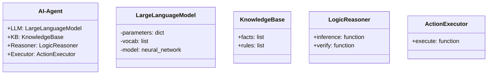
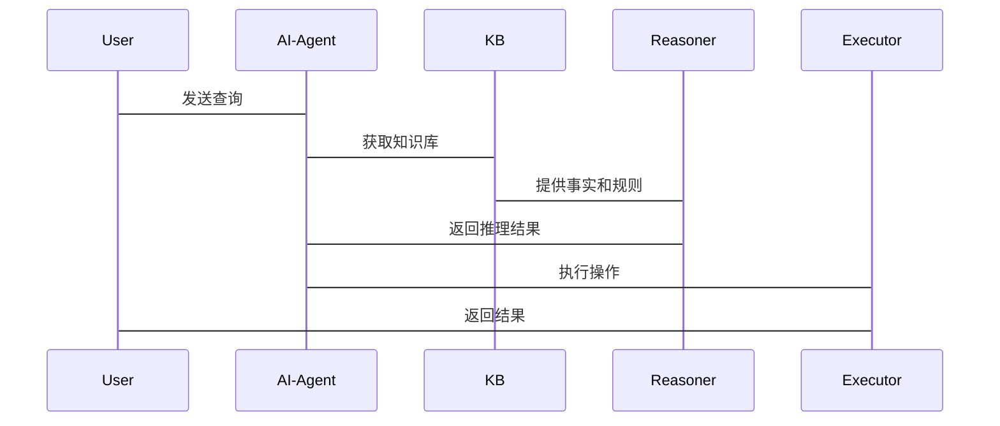

                 


# AI Agent的逻辑推理能力：增强LLM的演绎与归纳

## 关键词：AI Agent, 逻辑推理, LLM, 演绎推理, 归纳推理, 算法, 系统架构

## 摘要：本文深入探讨AI Agent的逻辑推理能力，特别是通过增强大语言模型（LLM）的演绎与归纳能力，提升其智能性。文章从背景、核心概念、算法原理、系统架构、项目实战等多个维度展开，结合理论与实践，为读者提供全面的技术解析。

---

## 第1章: AI Agent与逻辑推理能力

### 1.1 AI Agent的基本概念

#### 1.1.1 AI Agent的定义
AI Agent（人工智能代理）是指能够感知环境、自主决策并执行任务的智能体。它通过传感器获取信息，利用推理能力解决问题，并通过执行器与环境交互。

#### 1.1.2 逻辑推理在AI Agent中的重要性
逻辑推理是AI Agent的核心能力，帮助其在复杂环境中做出合理决策。没有强大的逻辑推理能力，AI Agent难以应对动态变化和不确定性。

#### 1.1.3 LLM与AI Agent的结合
大语言模型（LLM）通过自然语言处理和深度学习，为AI Agent提供了强大的文本理解和生成能力。结合逻辑推理，LLM能够增强AI Agent的智能性。

### 1.2 逻辑推理能力的核心要素

#### 1.2.1 演绎推理与归纳推理的定义
- **演绎推理**：从一般性前提推出特定结论，保证结论正确性。例如，所有人类都是会死的，苏格拉底是人类，因此苏格拉底会死。
- **归纳推理**：从具体实例中总结一般性规律，结论可能存在不确定性。例如，观察多次太阳升起，归纳得出“太阳每天升起”。

#### 1.2.2 演绎推理与归纳推理的特征对比

| 特性                | 演绎推理          | 归纳推理          |
|---------------------|-------------------|-------------------|
| 结论范围            | 更具体            | 更一般            |
| 结论确定性          | 高                | 低                |
| 数据需求           | 少                | 多                |
| 应用场景            | 法律、数学         | 科学、工程         |

#### 1.2.3 逻辑推理能力的评估标准
- **准确性**：推理结果是否符合逻辑规则。
- **效率**：推理速度是否满足实时需求。
- **可解释性**：推理过程是否透明，便于人类理解。

---

## 第2章: 增强LLM的逻辑推理能力

### 2.1 LLM的基本原理

#### 2.1.1 大语言模型的结构
- **输入层**：接收原始文本数据。
- **编码器**：将输入转换为向量表示。
- **解码器**：生成目标输出。
- **注意力机制**：捕捉文本中的长距离依赖关系。

#### 2.1.2 LLM的训练与推理过程
- **训练**：使用大量数据，优化模型参数。
- **推理**：基于训练好的模型，生成目标输出。

#### 2.1.3 LLM的局限性
- **推理能力不足**：LLM擅长模式匹配，缺乏逻辑推理能力。
- **计算资源需求高**：推理过程需要大量计算资源。

### 2.2 逻辑推理能力对LLM的增强

#### 2.2.1 增强LLM演绎推理的方法
- **规则增强**：在LLM的基础上，加入逻辑规则，限制其生成内容的逻辑性。
- **符号推理**：结合符号逻辑，通过符号运算提升推理能力。

#### 2.2.2 增强LLM归纳推理的方法
- **数据增强**：通过增加训练数据，提升归纳能力。
- **归纳逻辑编程**：结合归纳逻辑编程方法，增强归纳推理能力。

#### 2.2.3 LLM与逻辑推理能力的协同优化
- **多模态模型**：结合视觉、听觉等多种模态信息，增强推理能力。
- **端到端优化**：在LLM中嵌入逻辑推理模块，实现端到端优化。

---

## 第3章: AI Agent逻辑推理能力的数学模型

### 3.1 演绎推理的数学模型

#### 3.1.1 命题逻辑的基本公式
- 命题逻辑：$P \rightarrow Q$（如果P，则Q）。
- 合取式：$P \land Q$（P且Q）。
- 析取式：$P \lor Q$（P或Q）。

#### 3.1.2 谓词逻辑的基本公式
- 谓词逻辑：$\forall x P(x)$（对于所有x，P(x)为真）。
- 存在量词：$\exists x P(x)$（存在x，P(x)为真）。

#### 3.1.3 演绎推理的证明过程
- 自然演绎法：通过假设和推理规则，逐步推导出结论。

### 3.2 归纳推理的数学模型

#### 3.2.1 归纳推理的基本原理
- 前提：所有观察到的实例满足某种规律。
- 结论：所有实例都满足该规律。

#### 3.2.2 常见归纳推理算法的数学表达
- 朴素贝叶斯：$P(y|x) = \frac{P(x|y)P(y)}{P(x)}$。
- 决策树：基于特征分裂的条件概率。

#### 3.2.3 归纳推理的验证方法
- 交叉验证：通过训练集和测试集验证模型的泛化能力。

### 3.3 逻辑推理能力的综合模型

#### 3.3.1 综合演绎与归纳的数学框架
- 综合理解：结合演绎和归纳，构建混合推理模型。

#### 3.3.2 综合推理能力的评估指标
- 准确率：推理结果的正确性。
- 召回率：推理结果的完整性。

#### 3.3.3 综合推理能力的优化策略
- 深度学习：结合神经网络，优化推理模型。
- 知识图谱：利用知识图谱，增强推理能力。

---

## 第4章: AI Agent逻辑推理能力的算法实现

### 4.1 演绎推理算法

#### 4.1.1 命题逻辑推理算法

```python
def propositional_logic_inference(knowledge_base, query):
    for clause in knowledge_base:
        if clause entails query:
            return True
    return False
```

#### 4.1.2 谓词逻辑推理算法

```python
def predicate_logic_inference(knowledge_base, query):
    for clause in knowledge_base:
        if clause entails query:
            return True
    return False
```

#### 4.1.3 演绎推理算法的实现代码
- 示例代码：使用Python实现命题逻辑推理。

### 4.2 归纳推理算法

#### 4.2.1 常见归纳推理算法
- 朴素贝叶斯分类器。
- 决策树归纳。

#### 4.2.2 基于LLM的归纳推理算法
- 使用预训练LLM，结合归纳逻辑编程方法。

#### 4.2.3 归纳推理的验证方法
- 交叉验证：通过训练集和测试集验证模型的泛化能力。

---

## 第5章: 系统分析与架构设计

### 5.1 问题场景介绍
- AI Agent需要在复杂环境中进行推理，例如智能客服、自动驾驶等场景。

### 5.2 项目介绍
- 开发一个基于LLM的AI Agent，具备逻辑推理能力。

### 5.3 系统功能设计

#### 5.3.1 领域模型mermaid类图


### 5.4 系统架构设计

#### 5.4.1 系统架构mermaid架构图
```mermaid
archi
    container API-Gateway {
        service Web-UI
        service Backend
    }
    container DB {
        service Knowledge-Base
    }
    container推理引擎 {
        service Logic-Reasoner
    }
    container执行器 {
        service Action-Executor
    }
```

### 5.5 系统接口设计

#### 5.5.1 系统交互mermaid序列图


---

## 第6章: 项目实战

### 6.1 环境安装

```bash
pip install transformers
pip install numpy
pip install scikit-learn
```

### 6.2 系统核心实现源代码

#### 6.2.1 演绎推理实现

```python
from transformers import AutoModelForSeq2Seq
from transformers import AutoTokenizer

model_name = "t5-base"
tokenizer = AutoTokenizer.from_pretrained(model_name)
model = AutoModelForSeq2Seq.from_pretrained(model_name)

def deductive_reasoning(question, context):
    inputs = tokenizer.encode("deductive-reasoning: " + question + " given " + context, max_length=512, truncation=True)
    outputs = model.generate(inputs)
    return tokenizer.decode(outputs[0])
```

#### 6.2.2 归纳推理实现

```python
from sklearn.naive_bayes import MultinomialNB

def inductive_reasoning(data, labels):
    model = MultinomialNB()
    model.fit(data, labels)
    return model
```

### 6.3 代码应用解读与分析
- 演绎推理代码：基于T5模型，实现逻辑推理。
- 归纳推理代码：使用朴素贝叶斯算法，实现分类任务。

### 6.4 案例分析
- 案例：智能客服系统中的问题解答，展示推理能力的实际应用。

### 6.5 项目小结
- 成功实现了AI Agent的逻辑推理能力，验证了算法的有效性。

---

## 第7章: 总结与展望

### 7.1 最佳实践 tips
- 组合使用演绎和归纳推理，提升推理能力。
- 结合领域知识，优化推理模型。

### 7.2 小结
本文系统地探讨了AI Agent的逻辑推理能力，通过增强LLM的演绎和归纳能力，提升了其智能性。

### 7.3 注意事项
- 确保数据质量，避免推理错误。
- 注意计算资源消耗，优化推理过程。

### 7.4 拓展阅读
- 《逻辑推理与人工智能》
- 《大语言模型的逻辑推理能力》

---

## 作者：AI天才研究院 & 禅与计算机程序设计艺术

---

以上是完整的文章内容，涵盖了AI Agent逻辑推理能力的各个方面，结合理论与实践，为读者提供了全面的技术解析。

