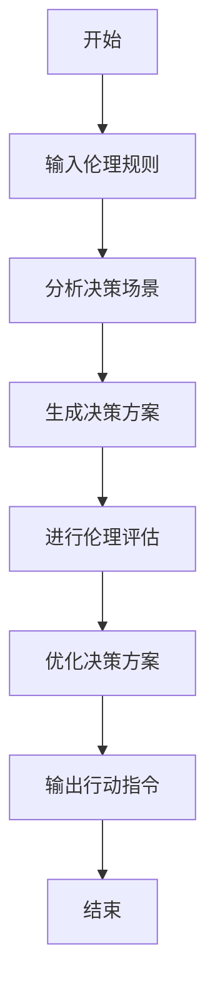
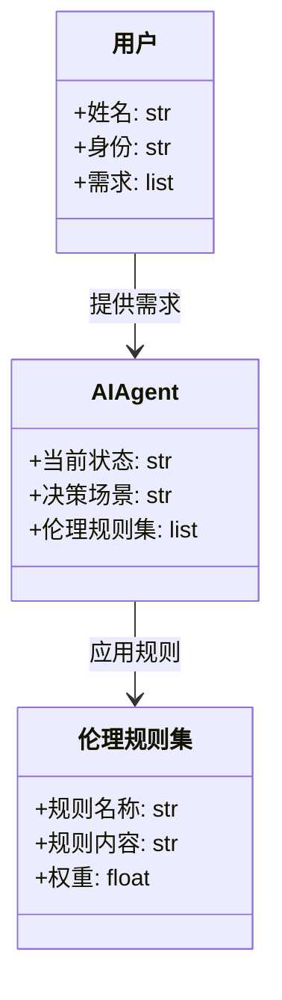
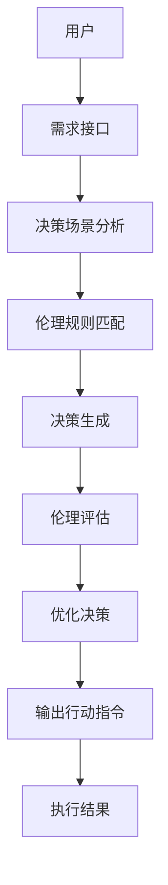
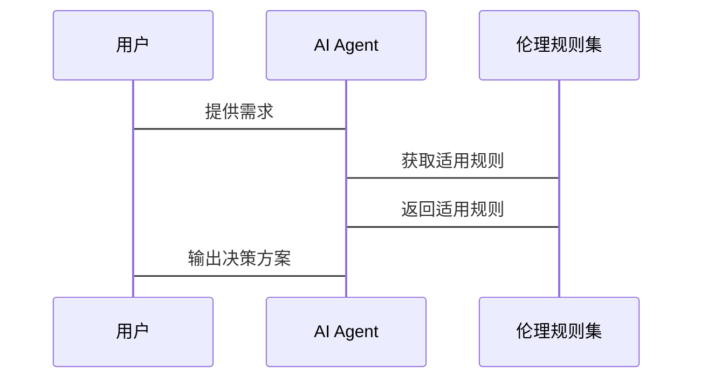

                 


# AI Agent的道德决策框架：在人工智能中植入伦理考量

> **关键词**：AI Agent, 道德决策框架, 伦理考量, 人工智能系统, 决策算法, 伦理规则

> **摘要**：随着人工智能技术的快速发展，AI Agent在各个领域的应用日益广泛。然而，AI Agent在决策过程中常常面临伦理困境，如何在人工智能中植入伦理考量成为一个重要课题。本文将探讨AI Agent的道德决策框架，从背景介绍、核心概念、算法原理到系统架构和项目实战，详细分析如何设计和实现一个具备伦理考量的AI决策系统，并结合实际案例进行深入剖析。通过本文，读者将能够理解AI Agent道德决策的必要性，并掌握相关的设计方法和实现技巧。

---

## 第一部分: AI Agent的道德决策框架概述

### 第1章: AI Agent与道德决策框架的背景介绍

#### 1.1 问题背景

##### 1.1.1 AI Agent的基本概念
AI Agent（人工智能代理）是一种能够感知环境并采取行动以实现目标的智能实体。它可以是一个软件程序、机器人或其他智能系统，具备自主决策和执行任务的能力。

##### 1.1.2 道德决策在AI中的重要性
随着AI Agent在医疗、金融、自动驾驶等领域的广泛应用，其决策对人类社会的影响越来越大。例如，在自动驾驶汽车中，AI Agent需要在紧急情况下做出决策，可能涉及到人员的生命安全。因此，道德决策在AI系统中的重要性不容忽视。

##### 1.1.3 当前AI决策系统的局限性
目前的AI决策系统主要依赖数据驱动的方法，缺乏对伦理和道德的深度理解。例如，在某些情况下，算法可能会因为训练数据的偏差而做出不道德的决策，或者在面对复杂的伦理困境时无法有效处理。

#### 1.2 问题描述

##### 1.2.1 AI Agent决策的伦理困境
AI Agent在决策过程中可能会面临复杂的伦理困境，例如在自动驾驶中，当发生不可避免的事故时，如何权衡不同利益相关者的损失。这种情况下，AI Agent需要具备一定的伦理判断能力。

##### 1.2.2 道德决策框架的必要性
为了确保AI Agent的决策符合伦理规范，需要设计一个道德决策框架，使其能够在复杂的情况下做出符合人类伦理标准的决策。

##### 1.2.3 伦理决策在AI系统中的应用场景
伦理决策框架可以应用于自动驾驶、智能助手、医疗AI系统等领域。例如，在医疗AI系统中，AI Agent需要在患者治疗方案中考虑伦理因素，确保决策符合医学伦理。

#### 1.3 问题解决

##### 1.3.1 道德决策框架的核心目标
道德决策框架的核心目标是为AI Agent提供一个伦理决策的指导系统，确保其在决策过程中遵循伦理规范，并能够在复杂的伦理困境中做出合理的判断。

##### 1.3.2 AI Agent决策中的伦理考量
在设计AI Agent的决策系统时，需要考虑以下伦理因素：公平性、透明性、隐私保护、责任归属等。这些因素需要在决策框架中得到充分体现。

##### 1.3.3 伦理决策框架的设计原则
伦理决策框架的设计需要遵循以下原则：可解释性、可调整性、可扩展性。这些原则确保框架能够在不同场景下灵活应用，并且能够根据实际需求进行调整。

#### 1.4 边界与外延

##### 1.4.1 道德决策框架的适用范围
道德决策框架适用于所有需要伦理决策的AI系统，尤其是那些对人类生命、健康和财产有直接影响的领域。

##### 1.4.2 伦理决策与法律的关系
伦理决策框架需要与相关法律和法规相结合，确保AI Agent的决策不仅符合伦理规范，还符合法律要求。

##### 1.4.3 道德决策框架的未来发展
随着技术的进步，道德决策框架将更加智能化和动态化，能够根据实时信息和上下文调整决策策略。

#### 1.5 概念结构与核心要素

##### 1.5.1 道德决策框架的组成部分
道德决策框架主要包括以下几个部分：
1. 伦理规则库：包含各种伦理规范和原则。
2. 决策逻辑引擎：用于根据伦理规则和当前情境生成决策。
3. 伦理评估模块：对决策进行伦理评估，确保决策符合伦理规范。

##### 1.5.2 核心要素的定义与作用
- **伦理规则库**：定义了AI Agent在决策过程中需要遵循的伦理规则和原则。
- **决策逻辑引擎**：负责根据输入的信息和伦理规则生成决策。
- **伦理评估模块**：对生成的决策进行评估，确保其符合伦理规范。

##### 1.5.3 框架的逻辑结构
通过将伦理规则嵌入到决策过程中，AI Agent能够根据具体情况做出符合伦理的决策。这种结构确保了AI Agent的决策不仅基于数据和算法，还考虑了伦理因素。

---

## 第二部分: 道德决策框架的核心概念与联系

### 第2章: 道德决策框架的核心原理

#### 2.1 道德决策框架的原理

##### 2.1.1 伦理规则的定义与分类
伦理规则可以分为以下几类：
1. **普遍性规则**：适用于所有情况的伦理原则，例如“不伤害他人”。
2. **情境性规则**：根据具体情境调整的伦理原则，例如在紧急情况下优先救助更多的人。

##### 2.1.2 道德推理的机制
道德推理是AI Agent根据伦理规则和具体情境进行推理和判断的过程。这包括对不同伦理原则的权衡和取舍。

##### 2.1.3 伦理评估的标准
伦理评估标准用于衡量决策的伦理合理性。例如，可以使用“最大利益原则”来评估决策是否符合大多数人的利益。

#### 2.2 核心概念的属性特征对比

| **属性特征** | **伦理决策框架** | **AI Agent行为模式** |
|--------------|------------------|----------------------|
| **目标导向性** | 是               | 是                   |
| **可解释性**   | 高               | 低                   |
| **灵活性**     | 高               | 中                   |
| **伦理敏感性** | 高               | 低                   |

#### 2.3 ER实体关系图
```mermaid
er
  actor: 用户
  agent: AI Agent
  rule_set: 伦理规则集
  decision: 决策
  action: 行动
  actor --> rule_set
  agent --> rule_set
  rule_set --> decision
  decision --> action
```

---

## 第三部分: 道德决策框架的算法原理

### 第3章: 基于伦理的AI Agent决策算法

#### 3.1 算法原理

##### 3.1.1 伦理规则的输入
AI Agent需要从伦理规则库中获取相关的伦理规则。这些规则可以是预定义的，也可以是动态生成的。

##### 3.1.2 决策过程的逻辑
决策过程包括以下几个步骤：
1. **信息收集**：获取与决策相关的环境信息。
2. **规则匹配**：将环境信息与伦理规则进行匹配，找出适用的伦理原则。
3. **决策生成**：根据匹配的伦理原则生成决策方案。
4. **评估与优化**：对决策方案进行伦理评估，并进行优化调整。

##### 3.1.3 行动结果的输出
AI Agent根据最终的决策方案输出行动指令。

#### 3.2 算法流程图


#### 3.3 算法实现

##### 3.3.1 算法实现代码
```python
class EthicalDecisionFramework:
    def __init__(self, rule_set):
        self.rule_set = rule_set

    def make_decision(self, scenario):
        applicable_rules = self.rule_set.match_rules(scenario)
        decision = self.rule_set.generate_decision(applicable_rules)
        return decision

    def evaluate_ethics(self, decision, scenario):
        # 伦理评估算法，例如基于最大利益原则
        return self.rule_set.evaluate(decision, scenario)

    def optimize_decision(self, decision, evaluation):
        optimized_decision = self.rule_set.optimize(decision, evaluation)
        return optimized_decision
```

##### 3.3.2 算法实现流程
1. 初始化伦理决策框架，加载伦理规则集。
2. 分析当前决策场景，匹配适用的伦理规则。
3. 根据匹配的伦理规则生成初步决策方案。
4. 对决策方案进行伦理评估，判断其是否符合伦理规范。
5. 如果不符合，进行优化调整，生成最终决策方案。
6. 输出决策结果，供AI Agent执行。

#### 3.4 数学模型与公式

##### 3.4.1 伦理评估的数学模型
伦理评估可以通过以下公式表示：
$$
E = \sum_{i=1}^{n} w_i \cdot r_i
$$
其中，$E$ 是伦理评估结果，$w_i$ 是第$i$个伦理规则的权重，$r_i$ 是第$i$个伦理规则的评估值。

##### 3.4.2 决策优化的数学公式
决策优化可以通过以下公式表示：
$$
D_{optimized} = \argmax_{D} \sum_{i=1}^{m} w_i \cdot d_i
$$
其中，$D_{optimized}$ 是优化后的决策，$w_i$ 是第$i$个决策方案的权重，$d_i$ 是第$i$个决策方案的评估值。

---

## 第四部分: 道德决策框架的系统分析与架构设计

### 第4章: 系统分析与架构设计

#### 4.1 问题场景介绍
在自动驾驶汽车中，AI Agent需要在紧急情况下做出决策，例如在不可避免的碰撞中选择最小化伤害的策略。

#### 4.2 系统功能设计

##### 4.2.1 领域模型


#### 4.3 系统架构设计

##### 4.3.1 系统架构图


#### 4.4 接口设计

##### 4.4.1 系统接口
- **输入接口**：接收用户需求和决策场景信息。
- **输出接口**：输出优化后的决策方案和行动指令。

##### 4.4.2 交互序列图


---

## 第五部分: 项目实战

### 第5章: 项目实战

#### 5.1 环境安装
需要安装以下工具和库：
- Python 3.8+
- Mermaid工具
- matplotlib库
- numpy库

#### 5.2 核心代码实现

##### 5.2.1 伦理规则集实现
```python
class RuleSet:
    def __init__(self, rules):
        self.rules = rules

    def match_rules(self, scenario):
        matched_rules = []
        for rule in self.rules:
            if rule.is_applicable(scenario):
                matched_rules.append(rule)
        return matched_rules

    def generate_decision(self, matched_rules):
        # 根据匹配的规则生成决策
        return "优化后的决策方案"

    def evaluate(self, decision, scenario):
        # 伦理评估算法
        return 0.95  # 示例评估结果

    def optimize(self, decision, evaluation):
        # 决策优化算法
        return "最终决策方案"
```

##### 5.2.2 AI Agent实现
```python
class AI-Agent:
    def __init__(self, rule_set):
        self.rule_set = rule_set

    def make_decision(self, scenario):
        applicable_rules = self.rule_set.match_rules(scenario)
        decision = self.rule_set.generate_decision(applicable_rules)
        evaluation = self.rule_set.evaluate(decision, scenario)
        optimized_decision = self.rule_set.optimize(decision, evaluation)
        return optimized_decision
```

#### 5.3 代码解读与分析
1. **RuleSet类**：管理伦理规则集，匹配适用规则，生成决策，进行评估和优化。
2. **AI-Agent类**：负责接收决策场景，调用RuleSet进行决策，并返回最终决策方案。

#### 5.4 案例分析
在自动驾驶场景中，AI Agent需要在紧急情况下做出决策。例如，当车辆失控时，AI Agent需要根据伦理规则集生成决策方案，评估其伦理合理性，并进行优化调整，以最小化伤害。

#### 5.5 项目小结
通过本项目，读者可以了解如何将伦理决策框架应用于实际场景，并掌握相关代码的实现方法。

---

## 第六部分: 最佳实践与小结

### 第6章: 最佳实践与小结

#### 6.1 最佳实践
- 在设计伦理决策框架时，需要充分考虑伦理规则的多样性和复杂性。
- 确保决策框架具备灵活性和可扩展性，以适应不同场景的需求。
- 定期对伦理决策框架进行评估和优化，确保其决策的合理性和有效性。

#### 6.2 小结
本文详细探讨了AI Agent的道德决策框架的设计与实现，从背景介绍到项目实战，全面分析了如何在人工智能中植入伦理考量。通过本文的学习，读者可以掌握设计和实现具备伦理决策能力的AI系统的相关方法和技术。

#### 6.3 注意事项
- 在实际应用中，需要结合具体场景和需求，对伦理决策框架进行调整和优化。
- 伦理决策框架的设计需要与相关法律和法规相结合，确保其合规性。

#### 6.4 拓展阅读
建议读者进一步阅读以下内容：
1. 《伦理与人工智能：技术与社会的双重挑战》
2. 《AI决策系统的伦理设计：方法与实践》

---

## 作者

**作者**：AI天才研究院/AI Genius Institute & 禅与计算机程序设计艺术/Zen And The Art of Computer Programming

---

通过以上内容，您可以全面了解AI Agent的道德决策框架的设计与实现，掌握在人工智能中植入伦理考量的相关方法和技术。希望本文对您在AI伦理决策领域的研究和实践有所帮助。

