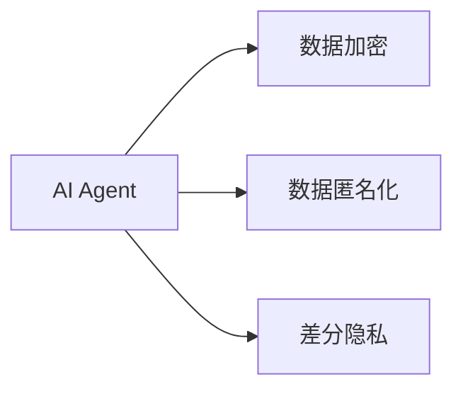
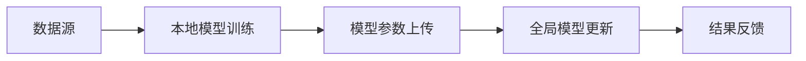
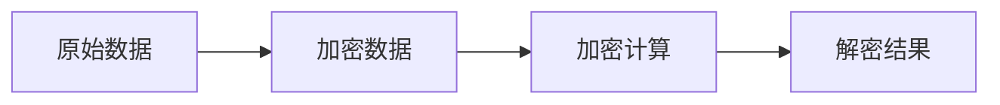
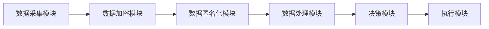
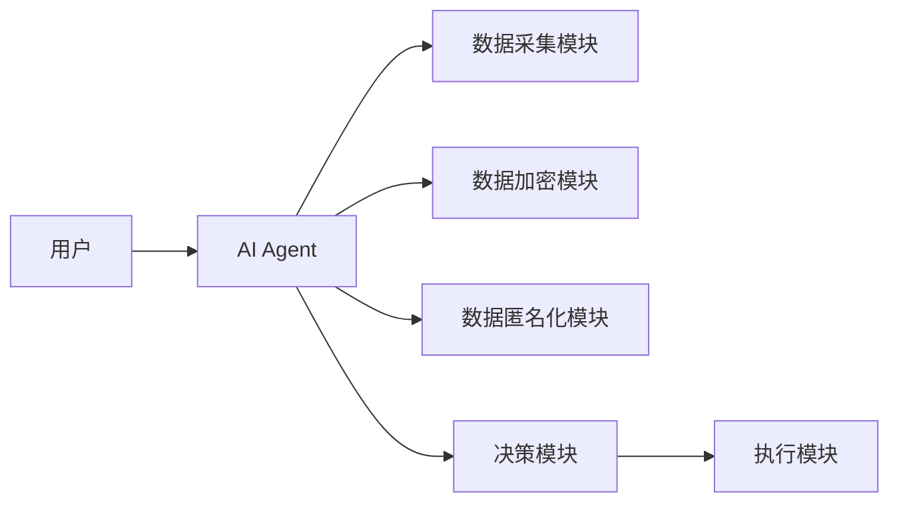
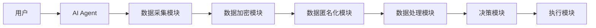

                 


# AI Agent的隐私保护机制：在智能与安全间寻找平衡

## 关键词：AI Agent, 隐私保护, 差分隐私, 同态加密, 联邦学习

## 摘要：  
在人工智能快速发展的今天，AI Agent作为一种智能化的实体，正在广泛应用于各个领域。然而，AI Agent的智能化也带来了隐私保护的挑战。本文将从AI Agent的基本概念出发，探讨其隐私保护的核心机制，分析隐私保护算法的原理，并结合实际案例，详细阐述如何在智能与安全之间找到平衡点。通过系统分析与架构设计，本文将为AI Agent的隐私保护提供切实可行的解决方案，并总结最佳实践和注意事项。

---

## 第1章: AI Agent与隐私保护的基本概念

### 1.1 AI Agent的基本概念

#### 1.1.1 AI Agent的定义与特点
AI Agent（人工智能代理）是指能够感知环境、自主决策并执行任务的智能实体。与传统的智能系统相比，AI Agent具有以下特点：
- **自主性**：能够在没有外部干预的情况下独立运行。
- **反应性**：能够实时感知环境并做出反应。
- **目标导向性**：具备明确的目标，并能够通过行为实现目标。

#### 1.1.2 AI Agent的核心功能与应用场景
AI Agent的核心功能包括数据采集、信息处理、决策制定和任务执行。其应用场景广泛，如智能助手、自动驾驶、智能客服、智能家居等。

#### 1.1.3 AI Agent与传统智能系统的区别
AI Agent的最大特点是其自主性和智能性。与传统智能系统相比，AI Agent能够主动感知环境、自主决策，并与人类或其他系统进行交互。

### 1.2 隐私保护的基本概念

#### 1.2.1 隐私保护的定义与重要性
隐私保护是指对个人或组织的敏感信息进行保护，防止未经授权的访问或泄露。在AI Agent中，隐私保护尤为重要，因为AI Agent通常需要处理大量敏感数据。

#### 1.2.2 数据隐私与隐私保护的法律框架
数据隐私是隐私保护的核心内容，涉及个人数据的收集、存储、使用和共享。隐私保护的法律框架包括《通用数据保护条例》（GDPR）等，要求组织在处理个人数据时必须遵循严格的隐私保护原则。

#### 1.2.3 隐私保护在AI系统中的挑战
AI系统的数据驱动特性使其面临隐私泄露的风险。例如，AI Agent可能收集用户的地理位置、行为习惯等敏感数据，这些数据如果被滥用，可能导致用户的隐私泄露。

### 1.3 AI Agent与隐私保护的关系

#### 1.3.1 AI Agent中隐私泄露的风险
AI Agent可能通过收集和处理用户数据，导致用户的隐私泄露。例如，智能音箱可能无意中记录用户的对话。

#### 1.3.2 隐私保护对AI Agent性能的影响
为了保护隐私，AI Agent可能需要采用加密、匿名化等技术，这些技术可能对系统的性能产生一定的影响。

#### 1.3.3 在智能与安全间寻找平衡的目标
AI Agent的隐私保护需要在智能性和安全性之间找到平衡。既要保证AI Agent的智能性，又要确保用户隐私的安全。

---

## 第2章: AI Agent隐私保护的核心概念与联系

### 2.1 隐私保护机制的原理

#### 2.1.1 数据加密与隐私保护
数据加密是保护隐私的重要手段。通过加密技术，可以确保数据在传输和存储过程中不被未经授权的第三方窃取。

#### 2.1.2 数据匿名化与脱敏技术
数据匿名化是指通过技术手段将数据中的个人身份信息去除，使其无法被重新识别。脱敏技术是一种常见的匿名化技术，例如对用户姓名进行脱敏处理，使其无法被还原。

#### 2.1.3 差分隐私与隐私预算
差分隐私是一种通过在数据中添加噪声来保护隐私的技术。隐私预算是指在差分隐私中允许的最大隐私泄露风险。

### 2.2 核心概念对比分析

#### 2.2.1 隐私保护技术对比表格
以下是一个隐私保护技术对比表格：

| 技术名称      | 优点                              | 缺点                              |
|---------------|-----------------------------------|-----------------------------------|
| 数据加密      | 高效，保护数据在传输中的安全    | 不影响数据的可用性                |
| 数据匿名化    | 保护隐私，支持数据共享          | 可能导致数据的部分不可用          |
| 差分隐私      | 高效，保护隐私的同时支持数据分析 | 需要设置隐私预算，可能影响数据精度 |

#### 2.2.2 AI Agent功能与隐私保护机制的关联
以下是一个简单的关联图：



---

## 第3章: AI Agent隐私保护的算法原理

### 3.1 隐私保护算法概述

#### 3.1.1 联邦学习算法
联邦学习是一种分布式机器学习技术，通过在数据源端进行模型训练，而不将数据集中到中央服务器。这样可以有效保护数据隐私。

#### 3.1.2 同态加密算法
同态加密是一种允许在加密数据上进行计算的技术，能够在不泄露原始数据的情况下进行数据分析。

#### 3.1.3 差分隐私算法
差分隐私是一种通过在数据中添加噪声来保护隐私的技术，确保数据在被分析时无法被还原到具体个体。

### 3.2 算法原理详细讲解

#### 3.2.1 联邦学习流程
以下是联邦学习的流程图：



#### 3.2.2 同态加密实现
以下是同态加密的实现流程：



### 3.3 数学模型与公式

#### 3.3.1 差分隐私的数学模型
差分隐私的数学模型如下：

$$P(y | x) \leq P(y | x') \cdot \epsilon$$

其中，$P(y | x)$和$P(y | x')$分别是数据在有$x$和$x'$两种情况下的概率，$\epsilon$是隐私预算。

#### 3.3.2 联邦学习的优化目标
联邦学习的优化目标如下：

$$\min_{\theta} \sum_{i=1}^{n} \mathcal{L}_i(\theta)$$

其中，$\theta$是模型参数，$\mathcal{L}_i(\theta)$是第$i$个数据源的损失函数。

---

## 第4章: 系统分析与架构设计

### 4.1 问题场景分析

#### 4.1.1 AI Agent中的数据流动
AI Agent的数据流动包括数据的采集、传输、存储和处理。数据的每个环节都可能面临隐私泄露的风险。

#### 4.1.2 系统功能需求
系统功能需求包括数据加密、匿名化处理、差分隐私应用等。

### 4.2 项目介绍

#### 4.2.1 项目目标
项目目标是设计一个支持隐私保护的AI Agent系统，确保数据安全的同时，不影响系统的智能性。

#### 4.2.2 系统功能设计
以下是系统的功能模块图：



### 4.3 系统架构设计

#### 4.3.1 系统架构图
以下是系统的架构图：



### 4.4 系统交互设计

#### 4.4.1 交互流程
以下是系统的交互流程图：



### 4.5 系统接口设计

#### 4.5.1 接口定义
以下是系统的接口定义：

- 数据采集接口：用于采集用户数据。
- 数据加密接口：用于对数据进行加密处理。
- 数据匿名化接口：用于对数据进行匿名化处理。
- 数据处理接口：用于对数据进行分析和处理。

---

## 第5章: 项目实战

### 5.1 环境安装

#### 5.1.1 安装Python环境
安装Python 3.8或更高版本。

#### 5.1.2 安装必要的库
安装以下库：
- `numpy`
- `pandas`
- `scikit-learn`
- `tensorflow`

### 5.2 核心实现

#### 5.2.1 数据加密实现
以下是数据加密的Python代码示例：

```python
import cryptography
from cryptography.fernet import Fernet

# 生成加密密钥
key = Fernet.generate_key()
cipher = Fernet(key)

# 加密数据
data = "Sensitive information"
encrypted_data = cipher.encrypt(data.encode())
print("Encrypted data:", encrypted_data)
```

#### 5.2.2 数据匿名化实现
以下是数据匿名化的Python代码示例：

```python
import pandas as pd
import numpy as np

# 创建数据集
data = pd.DataFrame({
    'id': [1, 2, 3, 4, 5],
    'name': ['Alice', 'Bob', 'Charlie', 'David', 'Eve']
})

# 数据匿名化处理
data_anonymized = data.copy()
data_anonymized['name'] = data_anonymized['name'].apply(lambda x: 'X' * len(x))
print("Anonymized data:", data_anonymized)
```

### 5.3 案例分析

#### 5.3.1 案例背景
假设我们有一个智能助手AI Agent，需要处理用户的语音指令。

#### 5.3.2 案例实现
以下是智能助手的数据处理代码：

```python
import speech_recognition as sr

# 初始化语音识别器
r = sr.Recognizer()

# 识别语音指令
with sr.Microphone() as source:
    print("Please say something:")
    audio = r.listen(source)
    try:
        text = r.recognize_google(audio)
        print("You said:", text)
    except sr.UnknownValueError:
        print("Could not understand audio")
```

### 5.4 项目小结

#### 5.4.1 项目总结
通过本项目的实践，我们可以看到，AI Agent的隐私保护需要从数据采集、处理、分析等多个环节进行考虑。

#### 5.4.2 经验与教训
在实际项目中，需要充分考虑隐私保护的需求，并在设计阶段就引入隐私保护机制。

---

## 第6章: 最佳实践与总结

### 6.1 最佳实践

#### 6.1.1 关键点总结
- 在设计AI Agent时，必须优先考虑隐私保护。
- 采用多种隐私保护技术，如数据加密、匿名化和差分隐私。
- 定期进行隐私风险评估和安全测试。

#### 6.1.2 实际应用中的注意事项
- 遵守相关法律法规，如GDPR。
- 对用户进行隐私教育，明确告知数据使用方式。
- 建立完善的隐私保护机制，确保数据安全。

### 6.2 拓展阅读

#### 6.2.1 推荐书籍
- 《数据隐私与保护》
- 《人工智能的伦理与安全》

#### 6.2.2 在线资源
- [差分隐私](https://en.wikipedia.org/wiki/Differential_privacy)
- [联邦学习](https://en.wikipedia.org/wiki/Federated_learning)

---

## 作者：AI天才研究院/AI Genius Institute & 禅与计算机程序设计艺术 /Zen And The Art of Computer Programming

