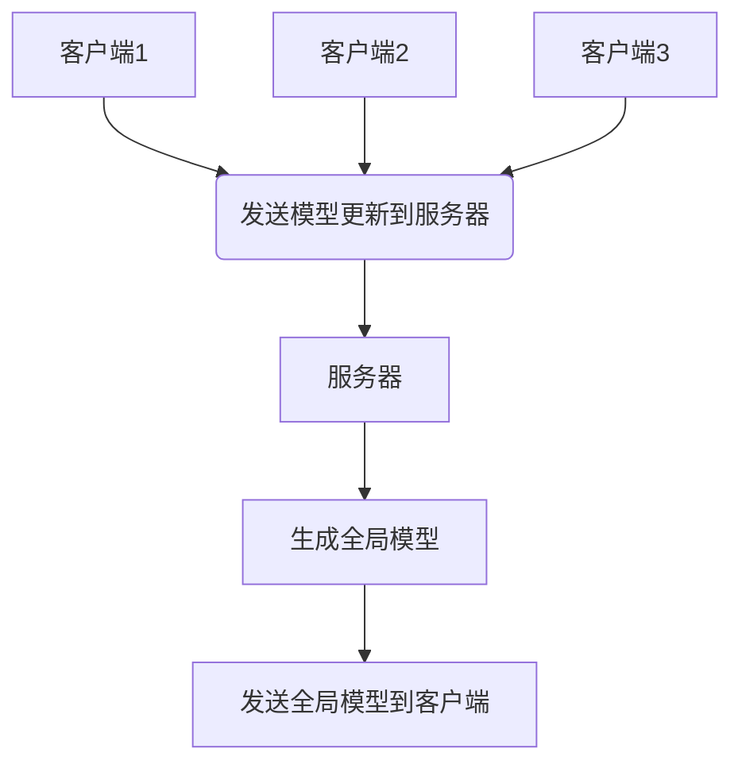
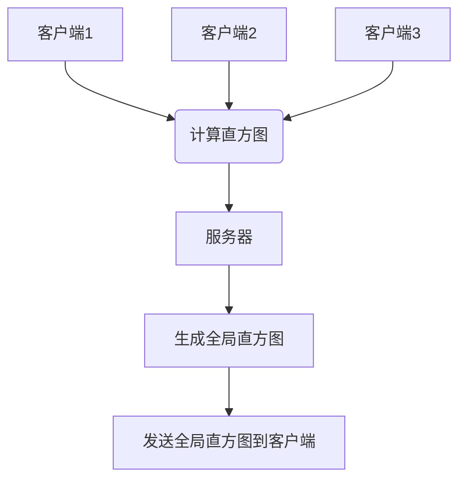
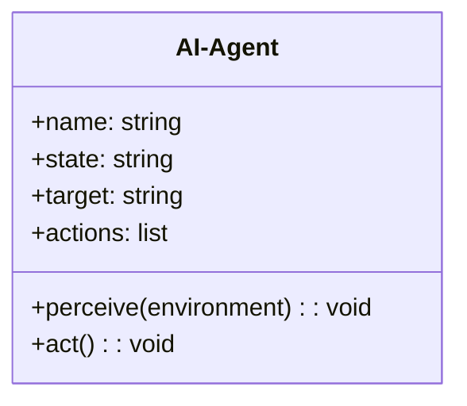

                 


# AI Agent的隐私保护计算：LLM在联邦学习中的应用

> 关键词：AI Agent，隐私保护计算，联邦学习，大语言模型，数据隐私，分布式机器学习

> 摘要：随着人工智能技术的快速发展，AI Agent在各个领域的应用越来越广泛。然而，数据隐私问题也随之凸显。本文探讨了如何在AI Agent中实现隐私保护计算，特别是利用大语言模型（LLM）在联邦学习中的应用。通过分析联邦学习的基本原理、算法实现、系统架构，以及实际案例，本文详细介绍了如何在保护数据隐私的前提下，高效地训练和部署大语言模型。文章还探讨了当前技术面临的挑战和未来的发展方向。

---

## 第1章: AI Agent与隐私保护计算概述

### 1.1 AI Agent的基本概念

#### 1.1.1 AI Agent的定义与特点
AI Agent（人工智能代理）是指能够感知环境、自主决策并执行任务的智能实体。其特点包括：
- **自主性**：能够在没有外部干预的情况下独立运作。
- **反应性**：能够根据环境变化动态调整行为。
- **目标导向**：通过优化目标函数来实现特定任务。
- **学习能力**：能够通过数据和经验不断优化自身性能。

#### 1.1.2 AI Agent的核心功能与应用场景
AI Agent的核心功能包括数据处理、决策优化和任务执行。其应用场景广泛，例如：
- 智能助手（如虚拟客服、智能家居设备）。
- 自动驾驶系统。
- 机器人控制。
- 智慧城市中的数据处理与优化。

#### 1.1.3 隐私保护在AI Agent中的重要性
随着AI Agent在各个领域中的广泛应用，数据隐私问题变得尤为重要。AI Agent通常需要处理敏感数据，例如用户的个人信息、行为数据等。如何在利用这些数据的同时保护隐私，成为设计AI Agent时必须考虑的关键问题。

---

### 1.2 隐私保护计算的背景与挑战

#### 1.2.1 数据隐私问题的现状
在数字化时代，数据成为最重要的资源之一。然而，数据泄露、滥用等问题频发，导致用户对数据隐私的担忧不断增加。

#### 1.2.2 隐私保护计算的核心目标
隐私保护计算的目标是在保证数据隐私的前提下，实现数据的共享和分析。其核心理念是通过技术手段防止未经授权的访问和数据泄露。

#### 1.2.3 隐私保护计算的主要挑战
隐私保护计算面临的主要挑战包括：
- **数据可用性**：如何在保护隐私的同时，确保数据的有效性和可用性。
- **计算效率**：隐私保护技术通常会增加计算开销，如何在效率和隐私之间找到平衡点。
- **法律合规**：不同国家和地区的数据隐私法规差异较大，如何在全球范围内实现合规是一个复杂的问题。

---

### 1.3 联邦学习的基本概念

#### 1.3.1 联邦学习的定义与特点
联邦学习（Federated Learning）是一种分布式机器学习技术，旨在在不集中收集数据的前提下，通过分布式的模型训练来实现全局模型的优化。其特点包括：
- **数据分散**：数据分布在不同的设备或服务器上，避免了数据的集中存储。
- **隐私保护**：通过局部模型更新和通信，保护原始数据的隐私。
- **可扩展性**：适用于大规模数据分布的场景。

#### 1.3.2 联邦学习的典型应用场景
联邦学习的主要应用场景包括：
- **移动设备上的AI**：例如智能手机上的语音助手。
- **医疗数据共享**：在保护患者隐私的前提下，进行医学研究。
- **金融领域的风险控制**：通过分布式数据训练模型，降低金融风险。

#### 1.3.3 联邦学习与传统数据共享的区别
传统的数据共享方式通常需要将数据集中到一个地方进行处理，这种方式容易导致数据泄露和隐私问题。而联邦学习通过分布式训练，避免了数据的集中存储，从而提高了隐私保护的水平。

---

### 1.4 LLM在联邦学习中的作用

#### 1.4.1 大语言模型的基本原理
大语言模型（Large Language Model，LLM）是一种基于深度学习的自然语言处理模型，例如GPT系列、BERT系列等。其基本原理是通过大量文本数据的训练，学习语言的规律和语义信息。

#### 1.4.2 LLM在联邦学习中的优势
将LLM应用于联邦学习中，可以充分利用分布式数据的优势，同时避免数据的集中存储。具体优势包括：
- **数据多样性**：通过分布式的训练，模型能够接触到更多样化的数据。
- **隐私保护**：避免了大规模数据的集中存储，降低了隐私泄露的风险。
- **模型泛化能力**：分布式训练可以提高模型的泛化能力，使其在不同场景下表现更优异。

#### 1.4.3 LLM与隐私保护计算的结合
通过将LLM与联邦学习结合，可以在保护数据隐私的前提下，训练出高性能的大语言模型。这种结合不仅解决了数据隐私问题，还为AI Agent的应用提供了新的可能性。

---

## 第2章: 联邦学习与大语言模型的结合

### 2.1 联邦学习的基本原理

#### 2.1.1 联邦学习的通信机制
在联邦学习中，各个设备或服务器（称为“客户端”）会通过通信机制将局部模型更新发送到中央服务器（称为“服务器”），服务器将这些更新整合，生成全局模型，并将全局模型的参数分发给客户端。

#### 2.1.2 联邦学习的模型更新流程
联邦学习的模型更新流程通常包括以下步骤：
1. **初始化**：所有客户端下载初始模型。
2. **局部训练**：每个客户端在本地数据上训练模型，生成局部更新。
3. **通信**：客户端将局部更新发送到服务器。
4. **聚合**：服务器将所有局部更新聚合，生成新的全局模型。
5. **分发**：服务器将新的全局模型分发给客户端。

#### 2.1.3 联邦学习的隐私保护措施
为了保护数据隐私，联邦学习通常采用以下隐私保护措施：
- **差分隐私**：通过在模型更新中加入噪声，防止攻击者通过模型更新推断出具体数据。
- **同态加密**：通过加密技术，确保模型更新的计算过程不泄露原始数据。

---

### 2.2 大语言模型在联邦学习中的应用

#### 2.2.1 LLM在联邦学习中的角色
在联邦学习中，大语言模型通常作为全局模型，通过分布式训练来优化模型参数。每个客户端在本地数据上训练模型，生成局部更新，然后将这些更新发送到服务器，进行全局模型的优化。

#### 2.2.2 LLM在联邦学习中的优势
将LLM应用于联邦学习中，可以充分利用分布式数据的优势，同时避免数据的集中存储。具体优势包括：
- **数据多样性**：通过分布式的训练，模型能够接触到更多样化的数据。
- **隐私保护**：避免了大规模数据的集中存储，降低了隐私泄露的风险。
- **模型泛化能力**：分布式训练可以提高模型的泛化能力，使其在不同场景下表现更优异。

#### 2.2.3 LLM在联邦学习中的挑战
尽管LLM在联邦学习中具有许多优势，但也面临一些挑战：
- **计算效率**：由于模型规模较大，分布式训练可能会导致计算效率下降。
- **通信开销**：模型更新的通信开销较大，尤其是在网络条件较差的情况下。
- **模型收敛性**：分布式训练可能导致模型收敛速度变慢，甚至出现模型不一致的问题。

---

### 2.3 联邦学习中的数据隐私保护技术

#### 2.3.1 数据加密技术
在联邦学习中，数据加密技术可以有效保护数据的隐私。常见的加密技术包括：
- **同态加密**：允许在加密数据上进行计算，同时保持数据的隐私性。
- **差分隐私**：通过在计算结果中加入噪声，防止数据被逆推出具体信息。

#### 2.3.2 数据匿名化技术
数据匿名化技术旨在通过去除或变形数据中的敏感信息，确保数据无法被追溯到具体个人。常见的数据匿名化技术包括：
- **数据脱敏**：通过替换、删除或变形敏感信息，使数据无法被还原。
- **k-anonymity**：确保数据在匿名化后，无法被唯一识别。

#### 2.3.3 数据访问控制技术
数据访问控制技术通过严格的权限管理，确保只有授权的用户或系统才能访问敏感数据。常见的数据访问控制技术包括：
- **角色基于访问控制（RBAC）**：根据用户的角色分配权限，确保用户只能访问与其角色相关的数据。
- **属性基于访问控制（ABAC）**：根据用户属性和数据属性动态分配权限。

---

### 2.4 本章小结
本章详细介绍了联邦学习的基本原理、大语言模型在联邦学习中的作用以及数据隐私保护技术。通过这些内容，我们可以看到，将大语言模型应用于联邦学习中，不仅能够提高模型的性能，还能够有效保护数据隐私。

---

## 第3章: 联邦学习中的算法原理

### 3.1 联邦学习的核心算法

#### 3.1.1 联邦平均算法（FedAvg）

##### 3.1.1.1 FedAvg的数学模型
FedAvg的数学模型如下：

$$
\theta_{\text{server}}^{(t+1)} = \frac{1}{K} \sum_{k=1}^{K} \theta_{\text{client}}^{(t+1,k)}
$$

其中，$\theta_{\text{server}}^{(t+1)}$ 表示服务器在第 $t+1$ 轮的模型参数，$K$ 表示客户端的数量，$\theta_{\text{client}}^{(t+1,k)}$ 表示第 $k$ 个客户端在第 $t+1$ 轮的模型参数。

##### 3.1.1.2 FedAvg的流程图


#### 3.1.2 联邦直方算法（FedHVADE）

##### 3.1.2.1 FedHVADE的数学模型
FedHVADE的数学模型如下：

$$
p(x) = \frac{1}{Z} \sum_{k=1}^{K} w_k p_k(x)
$$

其中，$Z$ 是归一化常数，$w_k$ 是第 $k$ 个客户端的权重，$p_k(x)$ 是第 $k$ 个客户端的分布。

##### 3.1.2.2 FedHVADE的流程图


---

## 第4章: 联邦学习中的数据隐私保护技术

### 4.1 数据加密技术

#### 4.1.1 同态加密技术
同态加密技术允许在加密数据上进行计算，同时保持数据的隐私性。例如，使用Paillier加密算法进行加法运算。

#### 4.1.2 差分隐私技术
差分隐私技术通过在计算结果中加入噪声，防止数据被逆推出具体信息。例如，使用拉普拉斯噪声进行差分隐私保护。

---

## 第5章: 联邦学习的系统分析与架构设计

### 5.1 系统功能设计

#### 5.1.1 领域模型（领域模型：AI Agent）


#### 5.1.2 系统架构（系统架构图）


---

## 第6章: 项目实战

### 6.1 环境安装
```bash
pip install -r requirements.txt
```

### 6.2 核心实现

#### 6.2.1 服务器端代码
```python
class Server:
    def __init__(self, clients):
        self.clients = clients
        self.model = initialize_model()

    def aggregate_models(self, client_models):
        return FedAvg(client_models)
```

#### 6.2.2 客户端代码
```python
class Client:
    def __init__(self, data):
        self.data = data
        self.model = initialize_model()

    def train(self):
        self.model = train_locally(self.model, self.data)
```

---

## 第7章: 总结与展望

### 7.1 本章总结
本文详细探讨了AI Agent的隐私保护计算，特别是大语言模型在联邦学习中的应用。通过分析联邦学习的基本原理、算法实现、系统架构以及实际案例，我们看到，通过联邦学习可以在保护数据隐私的前提下，高效地训练和部署大语言模型。

### 7.2 未来展望
未来，随着大语言模型的不断发展，联邦学习在隐私保护计算中的应用将更加广泛。我们需要进一步研究如何在联邦学习中优化大语言模型的训练效率，同时探索更多创新的隐私保护技术，以应对日益复杂的隐私保护挑战。

---

## 作者：AI天才研究院 & 禅与计算机程序设计艺术

---

通过以上思考，我们可以看到，撰写一篇关于《AI Agent的隐私保护计算：LLM在联邦学习中的应用》的技术博客文章需要从多个方面进行详细阐述，包括背景介绍、核心概念、算法原理、系统架构、项目实战和最佳实践等。通过逻辑清晰、结构紧凑的分析，我们可以为读者提供一篇内容丰富、深度剖析的技术博客文章。

