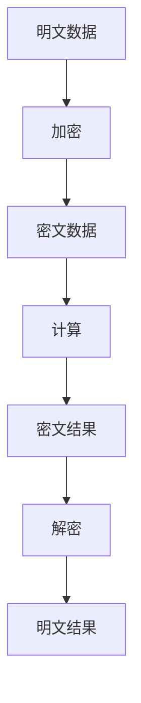
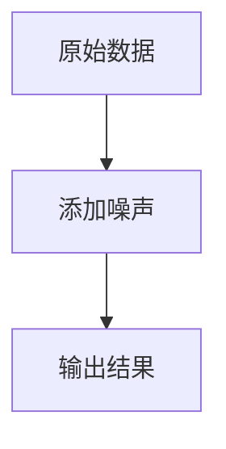
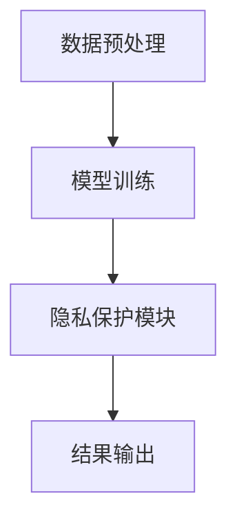
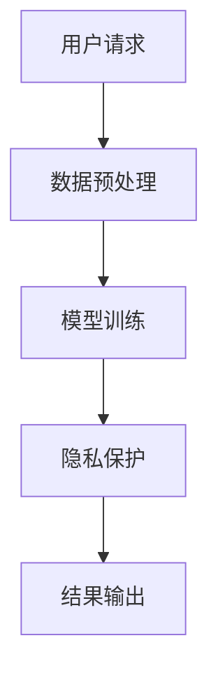

                 


# AI Agent的隐私保护：确保LLM应用的数据安全

> 关键词：AI Agent，隐私保护，LLM，数据安全，同态加密

> 摘要：本文深入探讨了AI Agent在隐私保护方面的挑战与解决方案，重点分析了如何确保大语言模型（LLM）应用中的数据安全。文章从AI Agent的基本概念出发，详细介绍了隐私保护的核心技术与算法原理，并通过实际案例展示了如何在项目中实现隐私保护。通过本篇文章，读者将能够全面理解AI Agent中的隐私保护机制，并掌握相关的技术实现方法。

---

# 第一部分: AI Agent的隐私保护基础

# 第1章: AI Agent与隐私保护概述

## 1.1 AI Agent的定义与核心概念

### 1.1.1 AI Agent的基本定义
AI Agent（人工智能代理）是一种能够感知环境、自主决策并执行任务的智能实体。它可以是一个软件程序、机器人或其他智能系统，旨在通过与环境交互来实现特定目标。AI Agent的核心能力包括感知、推理、规划和执行。

### 1.1.2 AI Agent的核心特征
AI Agent具有以下核心特征：
- **自主性**：能够在没有外部干预的情况下独立运作。
- **反应性**：能够根据环境变化实时调整行为。
- **主动性**：主动采取行动以实现目标。
- **社交能力**：能够与其他系统、用户或其他AI Agent进行交互。

### 1.1.3 AI Agent与传统AI的区别
与传统的AI系统相比，AI Agent具有更强的自主性和适应性。传统AI系统通常是在预定义的环境中执行特定任务，而AI Agent能够在动态和不确定的环境中灵活应对。

---

## 1.2 隐私保护的重要性

### 1.2.1 隐私保护的定义与原则
隐私保护是指保护个人或组织的敏感信息不被未经授权的第三方访问或滥用。隐私保护的基本原则包括：
- **最小化原则**：仅收集实现目标所需的最少数据。
- **匿名化原则**：对数据进行脱敏处理，使其无法关联到具体个体。
- **授权原则**：明确数据的使用权限和范围。

### 1.2.2 数据安全的挑战与风险
随着AI技术的广泛应用，数据安全问题日益突出。数据泄露、身份盗窃和滥用等风险不仅威胁到个人隐私，还可能对组织造成巨大的经济损失。

### 1.2.3 AI Agent在隐私保护中的角色
AI Agent作为数据处理的核心实体，必须具备保护数据隐私的能力。它需要在数据收集、存储、处理和传输的各个环节中采取有效的隐私保护措施。

---

## 1.3 LLM应用的隐私问题

### 1.3.1 LLM的定义与特点
大语言模型（LLM）是一种基于深度学习的自然语言处理模型，具有强大的文本理解和生成能力。其特点包括：
- **大规模数据训练**：通常使用海量数据进行训练。
- **上下文理解**：能够理解和生成复杂的上下文信息。
- **多任务能力**：可以应用于文本分类、问答系统、机器翻译等多种任务。

### 1.3.2 LLM应用中的隐私风险
在LLM应用中，隐私风险主要体现在以下几个方面：
- **数据泄露**：训练数据中可能包含敏感信息，可能导致隐私泄露。
- **模型滥用**：恶意攻击者可能利用模型进行非法活动。
- **数据溯源**：通过模型推理结果反推原始数据。

### 1.3.3 隐私保护的必要性与目标
为了应对上述风险，必须对LLM应用进行隐私保护。隐私保护的目标是：
- 保护用户数据不被未经授权的访问。
- 确保模型的输出不会泄露敏感信息。
- 实现数据的匿名化处理，防止数据溯源。

---

## 1.4 本章小结
本章从AI Agent的基本概念出发，阐述了隐私保护的重要性，并重点分析了LLM应用中的隐私问题。通过理解这些内容，读者可以为后续的隐私保护技术研究奠定基础。

---

# 第2章: 隐私保护的核心概念与技术

## 2.1 隐私保护的基本原则

### 2.1.1 最小化原则
最小化原则要求在数据收集和使用过程中，仅收集实现目标所需的最少数据。例如，在进行用户身份验证时，只需收集用户的唯一标识符，而不必收集其他敏感信息。

### 2.1.2 匿名化与假名化
匿名化是指将数据中的个人身份信息脱敏，使其无法关联到具体个体。假名化则是指为数据分配一个唯一的标识符，以便在需要时可以重新关联到具体个体。

### 2.1.3 数据使用授权
数据使用授权是指明确数据的使用权限和范围，确保数据仅被授权的主体访问和使用。

---

## 2.2 隐私保护的关键技术

### 2.2.1 数据匿名化技术
数据匿名化技术通过对数据进行脱敏处理，使其无法关联到具体个体。常见的数据匿名化技术包括数据替换、数据泛化和噪声注入。

### 2.2.2 同态加密技术
同态加密是一种特殊的加密技术，允许在密文状态下进行计算，而无需解密。这种技术可以用于保护敏感数据的隐私，同时支持数据的计算和分析。

### 2.2.3 差分隐私技术
差分隐私是一种通过在数据中添加噪声来保护隐私的技术。它能够防止通过大量数据分析反推出具体个体的信息。

---

## 2.3 AI Agent中的隐私保护机制

### 2.3.1 数据收集与处理
在AI Agent中，数据收集阶段需要对数据进行匿名化处理，确保敏感信息不被泄露。

### 2.3.2 模型训练与推理
在模型训练阶段，可以使用同态加密或差分隐私技术来保护训练数据的隐私。在模型推理阶段，需要确保模型输出不会泄露敏感信息。

### 2.3.3 结果输出与隐私保护
在结果输出阶段，需要对模型输出进行过滤和脱敏处理，确保输出结果不会泄露用户隐私。

---

## 2.4 核心概念对比表

| 技术       | 定义                                                                 | 优缺点                                                                 | 应用场景                   |
|------------|----------------------------------------------------------------------|--------------------------------------------------------------------------|---------------------------|
| 数据匿名化 | 对数据进行脱敏处理，使其无法关联到具体个体                     | 优点：保护隐私；缺点：可能降低数据的准确性和可用性                   | 数据共享与分析             |
| 同态加密   | 在密文状态下进行计算，无需解密                                | 优点：保护数据隐私；缺点：计算效率较低                                 | 敏感数据计算               |
| 差分隐私   | 在数据中添加噪声，防止数据溯源                                | 优点：保护隐私；缺点：可能影响数据的实用性                           | 数据发布与分析             |

---

## 2.5 ER实体关系图

```mermaid
er
actor: 用户
agent: AI Agent
data: 数据
role: 角色
rule: 隐私规则
```

---

# 第3章: 隐私保护算法详解

## 3.1 数据匿名化算法

### 3.1.1 数据脱敏技术
数据脱敏技术通过对敏感字段进行替换或变形，使其无法关联到具体个体。例如，将用户的出生日期替换为年龄范围。

### 3.1.2 数据替换技术
数据替换技术是一种简单有效的数据匿名化方法，通过将敏感数据替换为其他值来实现匿名化。

### 3.1.3 数据泛化技术
数据泛化技术通过对数据进行汇总和聚合，使其无法关联到具体个体。例如，将具体地址泛化为区域名称。

---

## 3.2 同态加密算法

### 3.2.1 同态加密的数学原理
同态加密是一种允许在密文状态下进行计算的加密技术。其数学模型如下：

$$ E(x) = x^k \mod n $$

其中，$E(x)$ 表示加密后的数据，$x$ 是明文，$k$ 是加密密钥，$n$ 是模数。

### 3.2.2 同态加密流程图



---

## 3.3 差分隐私算法

### 3.3.1 差分隐私的数学模型
差分隐私通过对数据添加噪声来实现隐私保护。其数学模型如下：

$$ y = f(x) + \text{Noise} $$

其中，$y$ 是输出结果，$f(x)$ 是真实值，$\text{Noise}$ 是添加的噪声。

### 3.3.2 差分隐私流程图



---

# 第4章: AI Agent的系统架构与隐私保护

## 4.1 系统架构设计

### 4.1.1 问题场景介绍
在AI Agent中，隐私保护贯穿整个系统架构，包括数据预处理、模型训练和结果输出等环节。

### 4.1.2 系统功能设计
系统的功能模块包括数据预处理模块、模型训练模块和隐私保护模块。

### 4.1.3 系统架构图



---

## 4.2 接口设计与交互流程图

### 4.2.1 接口设计
系统接口包括数据输入接口、模型训练接口和结果输出接口。

### 4.2.2 交互流程图



---

# 第5章: 项目实战——医疗数据分析中的隐私保护

## 5.1 环境安装
需要安装Python、TensorFlow和加密库等工具。

## 5.2 数据预处理
对医疗数据进行匿名化处理，去除敏感字段。

## 5.3 模型训练
使用差分隐私技术对模型进行训练，确保训练数据的隐私安全。

## 5.4 结果分析
对模型输出结果进行过滤和脱敏处理，确保结果不会泄露用户隐私。

---

# 第6章: 最佳实践与未来展望

## 6.1 小结
本文详细探讨了AI Agent中的隐私保护技术，并通过实际案例展示了如何在项目中实现隐私保护。

## 6.2 注意事项
在实际应用中，需要注意数据匿名化的效果、模型训练的效率和结果输出的安全性。

## 6.3 未来展望
随着技术的发展，隐私保护技术将更加成熟，AI Agent在隐私保护方面也将发挥更大的作用。

---

# 作者：AI天才研究院 & 禅与计算机程序设计艺术

---

通过本文的详细讲解，读者可以全面理解AI Agent中的隐私保护机制，并掌握相关的技术实现方法。希望本文能够为AI Agent的隐私保护研究和应用提供有价值的参考。

