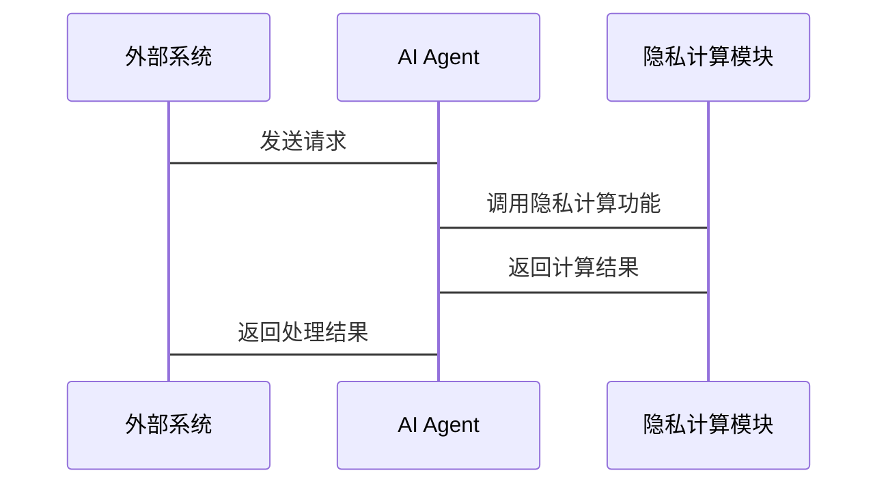

                 


# AI Agent的隐私计算：在保护数据隐私的同时应用LLM

## 关键词：AI Agent，隐私计算，LLM，数据隐私，人工智能

## 摘要：本文探讨了AI Agent在保护数据隐私的同时应用大语言模型（LLM）的核心概念、算法原理和系统架构。通过详细分析隐私计算技术如同态加密和差分隐私，结合LLM的特性，展示了如何在保护数据隐私的前提下，最大化AI Agent的智能与实用性。本文还提供了实际的系统设计和项目实现，帮助读者理解并应用于实际场景。

---

## 第一部分：AI Agent与隐私计算的背景

### 第1章：AI Agent与隐私计算的背景

#### 1.1 AI Agent的基本概念

##### 1.1.1 AI Agent的定义
AI Agent（人工智能代理）是指能够感知环境、自主决策并执行任务的智能实体。它可以是一个软件程序，也可以是一个物理设备，通过传感器和执行器与环境交互。

##### 1.1.2 AI Agent的核心特征
- **自主性**：能够在没有外部干预的情况下执行任务。
- **反应性**：能够根据环境变化动态调整行为。
- **目标导向**：具有明确的目标，并通过行为选择来实现目标。
- **社交能力**：能够与其他AI Agent或人类进行有效通信与协作。

##### 1.1.3 AI Agent的应用场景
- 智能助手（如Siri、Alexa）
- 自动驾驶系统
- 智能客服
- 智慧城市中的自动化管理

#### 1.2 隐私计算的基本概念

##### 1.2.1 隐私计算的定义
隐私计算是指在保护数据隐私的前提下，对数据进行处理和分析的技术。它确保数据在计算过程中不被泄露，同时还能得到正确的计算结果。

##### 1.2.2 隐私计算的核心原则
- **数据可用性**：数据可以在不泄露的情况下被处理。
- **数据保密性**：未经授权的第三方无法获取原始数据。
- **数据完整性**：确保计算结果的正确性。

##### 1.2.3 隐私计算的实现技术
- 同态加密
- 秘密分享
- 差分隐私

#### 1.3 AI Agent与隐私计算的结合

##### 1.3.1 问题背景
随着AI Agent的应用越来越广泛，数据隐私问题也随之而来。AI Agent需要处理大量敏感数据，如何在不泄露数据的前提下完成任务，成为一个亟待解决的问题。

##### 1.3.2 问题描述
AI Agent在处理数据时，可能会接触到用户的隐私信息，如地理位置、健康数据等。如何在保护这些隐私数据的同时，又能使AI Agent正常工作，是一个技术挑战。

##### 1.3.3 问题解决
通过隐私计算技术，AI Agent可以在不直接获取原始数据的情况下，完成任务所需的计算和分析。

##### 1.3.4 边界与外延
隐私计算的应用范围不仅限于AI Agent，还包括分布式系统、云计算等领域。AI Agent作为其中一个应用领域，可以借鉴其他领域的隐私保护技术。

##### 1.3.5 核心要素组成
- 数据处理技术：如同态加密、差分隐私。
- 数据共享机制：确保数据在共享过程中的隐私保护。
- AI Agent的行为设计：在隐私保护的前提下，优化AI Agent的决策和执行能力。

---

## 第二部分：隐私计算的核心概念与原理

### 第2章：隐私计算的核心概念

#### 2.1 隐私计算的实现技术

##### 2.1.1 同态加密
- **定义**：允许在加密数据上进行计算，而无需解密。
- **特点**：支持多种数学运算，如加法和乘法。
- **应用**：常用于保护敏感数据的计算，如加密数据库查询。

##### 2.1.2 秘密分享
- **定义**：将数据分割成多个部分，每个部分都无法单独还原原始数据，只有将所有部分组合起来才能恢复数据。
- **特点**：提供高安全性，但需要多个部分的协作。
- **应用**：用于分布式系统中的数据保护。

##### 2.1.3 差分隐私
- **定义**：通过在数据中添加噪声，确保单个数据点的隐私不被泄露。
- **特点**：适用于统计分析，能够保护个体数据。
- **应用**：常用于数据发布和共享。

#### 2.2 LLM的基本原理

##### 2.2.1 大语言模型的定义
大语言模型（LLM）是指基于大量数据训练的大型神经网络模型，具有强大的自然语言处理能力。

##### 2.2.2 大语言模型的训练过程
- **数据准备**：收集和预处理大量文本数据。
- **模型构建**：使用深度学习框架（如TensorFlow、PyTorch）构建模型。
- **训练**：使用反向传播算法优化模型参数，使其在训练数据上达到最佳性能。

##### 2.2.3 大语言模型的应用场景
- 自然语言理解
- 机器翻译
- 文本生成
- 情感分析

#### 2.3 隐私计算与LLM的关系

##### 2.3.1 隐私计算对LLM的影响
- 数据隐私保护影响模型的训练和推理过程。
- 需要设计新的隐私保护机制，以适应LLM的需求。

##### 2.3.2 LLM对隐私计算的支持
- LLM的强大能力可以辅助隐私计算技术的实现，例如通过自然语言处理来优化隐私保护策略。

#### 2.4 核心概念对比

##### 2.4.1 隐私计算与数据安全
- 隐私计算注重数据的可用性和保密性，而数据安全更关注数据的完整性和机密性。

##### 2.4.2 LLM与传统NLP模型的对比
- **参数规模**：LLM通常具有更大的参数规模。
- **训练方式**：LLM通常使用端到端的训练方法，而传统NLP模型可能依赖于特征工程。

##### 2.4.3 AI Agent与传统AI代理的差异
- **自主性**：AI Agent具有更强的自主性和目标导向性。
- **隐私保护**：AI Agent需要结合隐私计算技术，确保数据隐私。

---

## 第三部分：隐私计算的算法原理

### 第3章：隐私计算的核心算法

#### 3.1 同态加密算法

##### 3.1.1 同态加密的基本原理
- **定义**：允许在加密数据上进行计算，结果与在明文上进行相同计算的结果相同。
- **过程**：
  1. 对数据进行加密。
  2. 对加密数据进行计算。
  3. 解密计算结果。

##### 3.1.2 同态加密的实现步骤
1. 选择加密方案（如RSA、ElGamal）。
2. 对明文进行加密。
3. 在密文上执行所需的操作。
4. 解密得到最终结果。

##### 3.1.3 同态加密的优缺点
- **优点**：保护数据隐私，支持多种计算。
- **缺点**：计算效率较低，适用于特定场景。

##### 3.1.4 同态加密的数学模型
- 加密过程：$E: P \rightarrow C$
- 解密过程：$D: C \rightarrow P$
- 加密计算：$F: C \rightarrow C$

##### 3.1.5 代码示例
```python
# 使用Python库实现同态加密
from crypto import HomomorphicEncryption

# 初始化加密方案
he = HomomorphicEncryption()

# 加密数据
encrypted_data = he.encrypt(plaintext)

# 在加密数据上进行计算
result = he.compute(encrypted_data, lambda x: x + 5)

# 解密结果
plaintext_result = he.decrypt(result)
```

##### 3.1.6 实际案例
- 案例：在加密数据库中进行求和操作。

#### 3.2 秘密分享算法

##### 3.2.1 秘密分享的基本原理
- **定义**：将秘密分成多个部分，每个部分无法单独还原秘密。
- **过程**：
  1. 将秘密分割成多个部分。
  2. 分发各部分给不同的持有者。
  3. 当所有部分收集后，还原秘密。

##### 3.2.2 秘密分享的实现步骤
1. 选择分割方法（如 Shamir’s Secret Sharing）。
2. 将秘密分割成k个部分，其中k是所需的最小部分数。
3. 分发各部分给不同的持有者。
4. 收集所有部分，还原秘密。

##### 3.2.3 秘密分享的优缺点
- **优点**：提供高安全性，防止单点故障。
- **缺点**：需要所有部分协作才能还原秘密，增加复杂性。

##### 3.2.4 秘密分享的数学模型
- 分割过程：$S = S_1 \oplus S_2 \oplus ... \oplus S_k$
- 还原过程：$S = S_1 \oplus S_2 \oplus ... \oplus S_k$

##### 3.2.5 代码示例
```python
# 使用Python库实现秘密分享
from crypto import SecretSharing

# 初始化秘密分享方案
ss = SecretSharing()

# 分割秘密
shares = ss.split_secret(secret, k=3)

# 还原秘密
recovered_secret = ss.combine_shares(shares)
```

##### 3.2.6 实际案例
- 案例：分布式系统中的数据备份与恢复。

#### 3.3 差分隐私算法

##### 3.3.1 差分隐私的基本原理
- **定义**：通过在数据中添加噪声，确保单个数据点的隐私不被泄露。
- **过程**：
  1. 在数据中添加噪声。
  2. 对修改后的数据进行计算。
  3. 输出计算结果。

##### 3.3.2 差分隐私的实现步骤
1. 选择噪声添加方法（如拉普拉斯噪声）。
2. 在数据上添加噪声。
3. 对修改后的数据进行计算。
4. 输出结果。

##### 3.3.3 差分隐私的优缺点
- **优点**：适用于统计分析，保护个体隐私。
- **缺点**：可能影响计算的准确性。

##### 3.3.4 差分隐私的数学模型
- 数据发布：$x' = x + \epsilon$
- $\epsilon$：噪声参数，控制隐私保护的强度。

##### 3.3.5 代码示例
```python
# 使用Python库实现差分隐私
from crypto import DifferentialPrivacy

# 初始化差分隐私方案
dp = DifferentialPrivacy(epsilon=1.0)

# 在数据上添加噪声
noisy_data = dp.add_noise(data)

# 进行统计计算
result = dp.compute_statistic(noisy_data, lambda x: sum(x))
```

##### 3.3.6 实际案例
- 案例：在用户数据中添加噪声，保护隐私的同时进行数据分析。

---

## 第四部分：系统分析与架构设计方案

### 第4章：系统分析与架构设计方案

#### 4.1 问题场景介绍
- **场景描述**：AI Agent需要处理敏感数据，如用户的地理位置和健康数据。
- **目标**：在保护数据隐私的前提下，使AI Agent能够完成任务。

#### 4.2 系统功能设计

##### 4.2.1 功能需求
- 数据隐私保护：确保AI Agent无法直接访问原始数据。
- 数据计算：在加密数据上进行计算，确保结果的准确性。
- 任务执行：AI Agent根据计算结果执行任务。

##### 4.2.2 领域模型设计
```mermaid
classDiagram
    class AI Agent {
        +目标：完成特定任务
        +行为：感知环境，决策，执行
        +能力：数据处理，任务执行
    }
    class 隐私计算模块 {
        +数据加密：对数据进行加密处理
        +数据计算：在加密数据上进行计算
        +结果解密：将计算结果解密
    }
    AI Agent --> 隐私计算模块：调用隐私计算功能
```

#### 4.3 系统架构设计

##### 4.3.1 系统架构图


#### 4.4 系统接口设计

##### 4.4.1 接口描述
- **输入接口**：AI Agent接收外部系统的请求。
- **输出接口**：AI Agent向外部系统返回处理结果。

##### 4.4.2 接口实现
- **输入接口**：
  ```python
  def receive_request(request):
      # 处理请求
      pass
  ```
- **输出接口**：
  ```python
  def send_response(response):
      # 发送响应
      pass
  ```

#### 4.5 系统交互设计

##### 4.5.1 交互流程
1. 外部系统发送请求给AI Agent。
2. AI Agent调用隐私计算模块进行数据处理。
3. 隐私计算模块完成计算后，将结果返回给AI Agent。
4. AI Agent将结果发送给外部系统。

##### 4.5.2 交互序列图


---

## 第五部分：项目实战

### 第5章：项目实战

#### 5.1 环境安装

##### 5.1.1 安装依赖
```bash
pip install python-cryptography mermaid
```

#### 5.2 系统核心实现

##### 5.2.1 隐私计算模块实现
```python
class HomomorphicEncryption:
    def __init__(self):
        self.key = generate_key()

    def encrypt(self, plaintext):
        return encrypt(plaintext, self.key)

    def decrypt(self, ciphertext):
        return decrypt(ciphertext, self.key)

    def compute(self, ciphertext, func):
        # 在加密数据上执行函数
        pass
```

##### 5.2.2 AI Agent实现
```python
class AI_Agent:
    def __init__(self):
        self.encryption_module = HomomorphicEncryption()

    def process_request(self, request):
        # 将请求转换为加密数据
        encrypted_request = self.encryption_module.encrypt(request)
        # 在加密数据上进行计算
        result = self.encryption_module.compute(encrypted_request, lambda x: x + 5)
        # 解密结果
        plaintext_result = self.encryption_module.decrypt(result)
        return plaintext_result
```

#### 5.3 代码应用解读与分析

##### 5.3.1 隐私计算模块
- **功能**：对数据进行加密、计算和解密。
- **实现细节**：使用同态加密技术，确保数据在加密状态下进行计算。

##### 5.3.2 AI Agent实现
- **功能**：接收请求，调用隐私计算模块进行处理，返回结果。
- **实现细节**：通过封装隐私计算模块，确保数据处理过程中的隐私保护。

#### 5.4 实际案例分析

##### 5.4.1 案例描述
- **场景**：AI Agent需要处理用户的地理位置数据，计算用户所在区域的天气情况。
- **目标**：在保护用户地理位置数据的前提下，提供准确的天气信息。

##### 5.4.2 处理流程
1. AI Agent接收用户的地理位置请求。
2. 调用隐私计算模块对地理位置数据进行加密。
3. 在加密数据上进行计算，获取天气信息。
4. 将计算结果解密，返回给用户。

##### 5.4.3 代码实现
```python
# 处理地理位置数据
agent = AI_Agent()
request = "获取北京市天气"
response = agent.process_request(request)
print(response)  # 输出解密后的天气信息
```

#### 5.5 项目小结

##### 5.5.1 项目总结
- 成功实现了AI Agent在保护数据隐私的前提下，完成特定任务的能力。
- 通过隐私计算技术，确保了数据的保密性和可用性。

##### 5.5.2 经验与教训
- 隐私计算技术的应用需要仔细设计，确保在不泄露数据的前提下，完成计算任务。
- 在实际应用中，需要考虑计算效率和数据规模的平衡。

---

## 第六部分：最佳实践

### 第6章：最佳实践

#### 6.1 小结
- AI Agent的隐私计算是一个复杂但重要的课题，需要结合多种技术手段，确保数据隐私的同时，提升AI Agent的智能性和实用性。
- 通过隐私计算技术，可以有效保护数据隐私，同时支持AI Agent的正常运行。

#### 6.2 注意事项
- 在实际应用中，需要根据具体需求选择合适的隐私计算技术。
- 隐私计算技术的应用可能会带来一定的计算开销，需要在效率和安全性之间进行权衡。
- 数据隐私保护需要贯穿整个系统设计过程，而不仅仅是数据处理阶段。

#### 6.3 拓展阅读
- 《Homomorphic Encryption: Theory and Practice》
- 《Differential Privacy: A Practitioner's Guide》
- 《Decentralized Machine Learning with Privacy Protection》

---

## 作者：AI天才研究院/AI Genius Institute & 禅与计算机程序设计艺术 /Zen And The Art of Computer Programming

