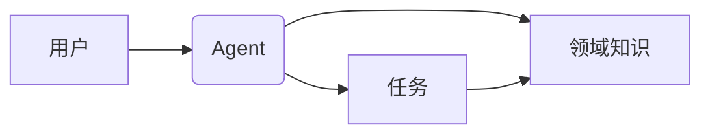
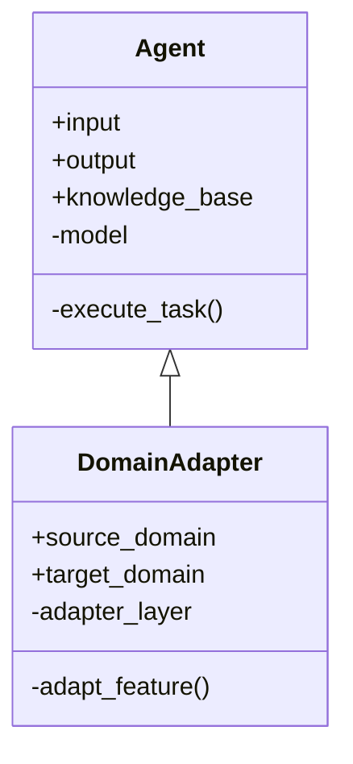

                 


# AI Agent的领域迁移学习：从通用LLM到专业模型

## 关键词：AI Agent，领域迁移学习，大语言模型（LLM），专业模型，迁移学习

## 摘要：  
随着人工智能技术的快速发展，AI Agent（智能体）在各个领域的应用越来越广泛。然而，通用大语言模型（LLM）在面对特定领域任务时，往往难以达到理想的效果。领域迁移学习作为一种有效的技术手段，能够帮助AI Agent快速适应特定领域的需求，提升其专业性和实用性。本文将从理论到实践，详细探讨AI Agent的领域迁移学习方法，分析从通用LLM到专业模型的迁移过程，结合实际案例和系统设计，为读者提供全面而深入的技术解读。

---

## 第1章 AI Agent与领域迁移学习概述

### 1.1 AI Agent的基本概念
AI Agent（智能体）是指能够感知环境、自主决策并执行任务的智能系统。它可以分为**反应式智能体**和**认知式智能体**两类。  
- **反应式智能体**：基于当前感知做出实时反应，如自动驾驶中的路径规划算法。  
- **认知式智能体**：具备目标设定、规划、推理等能力，如医疗领域的诊断系统。  

AI Agent在多个领域都有广泛应用，如智能客服、自动驾驶、智能助手等。

### 1.2 领域迁移学习的背景与意义
领域迁移学习（Domain Adaptation）是指将从一个领域学到的知识应用到另一个领域，从而减少目标领域数据的需求。  
- **核心问题**：如何在目标领域数据有限的情况下，利用源领域的知识提升模型性能。  
- **挑战**：领域间数据分布差异可能导致模型在目标领域表现不佳。  
- **机遇**：通过迁移学习，可以将通用LLM的能力快速迁移至特定领域，降低领域定制化成本。

### 1.3 从通用LLM到专业模型的迁移
通用LLM虽然在多种任务上表现出色，但在特定领域中往往缺乏专业性。例如，医疗领域的诊断任务需要专业知识，而通用模型可能无法准确理解专业术语或特定场景。  
通过领域迁移学习，可以从通用模型中提取有用的特征，并将其适应到特定领域任务中，从而构建专业化的AI Agent。

---

## 第2章 领域迁移学习的核心概念与联系

### 2.1 领域迁移学习的基本原理
领域迁移学习的核心在于**特征提取与领域适应**。通过提取源领域和目标领域的共同特征，减少领域间差异，提升模型的泛化能力。

### 2.2 核心概念对比与ER实体关系图

#### 表2-1：领域迁移学习方法对比

| 方法         | 优缺点                           | 适用场景               |
|--------------|--------------------------------|-----------------------|
| MMD          | 适用于样本分布差异较大的场景     | 医疗、金融等领域       |
| DANN         | 能够有效处理领域间的分布差异     | 图像分类、自然语言处理 |
| CycleGAN     | 适用于生成式任务，领域差异明显   | 图像风格迁移           |

#### 图2-1：ER实体关系图  


---

## 第3章 领域迁移学习的数学模型与算法原理

### 3.1 MMD算法
最大均值差异（MMD）通过衡量源领域和目标领域的分布差异，优化模型参数以最小化分布差异。

$$
\text{loss} = \frac{1}{2} \left( \mathbb{E}_{x \sim P} [f(x)] - \mathbb{E}_{x \sim Q} [f(x)] \right)
$$

### 3.2 DANN算法
对抗神经网络（DANN）通过引入对抗训练，使模型在不同领域间保持一致的特征表示。

$$
\mathcal{L}_{\text{adv}} = \mathbb{E}_{x \sim P} [\log p(z|x)] + \mathbb{E}_{x \sim Q} [\log (1 - p(z|x))]
$$

### 3.3 CycleGAN算法
CycleGAN通过生成对抗网络实现领域间的特征迁移，适用于无监督迁移学习任务。

$$
\mathcal{L}_{\text{cycle}} = \mathbb{E}_{x \sim P} [\|G(G^{-1}(x)) - x\|_2]
$$

---

## 第4章 领域迁移学习的系统分析与架构设计

### 4.1 系统分析
领域迁移学习系统需要满足以下目标：  
1. 提供高效的领域适应能力。  
2. 支持多种迁移学习算法的灵活切换。  
3. 具备良好的扩展性和可维护性。

### 4.2 系统架构设计

#### 图4-1：系统架构类图  


---

## 第5章 领域迁移学习的项目实战

### 5.1 项目背景与目标
以医疗领域的诊断任务为例，目标是将通用LLM迁移至医疗领域，提升诊断准确率。

### 5.2 环境配置
- **工具安装**：Python 3.8+, PyTorch 1.9+, transformers库。  
- **数据集**：源领域数据（通用医疗文本），目标领域数据（特定疾病诊断案例）。

### 5.3 模型实现
以下是一个基于MMD的迁移学习代码示例：

```python
import torch
import torch.nn as nn
from transformers import AutoTokenizer, AutoModel

# 加载预训练模型
tokenizer = AutoTokenizer.from_pretrained('bert-base-uncased')
model = AutoModel.from_pretrained('bert-base-uncased')

# 定义MMD损失函数
def mmd_loss(source_features, target_features):
    source_size, target_size = source_features.size(0), target_features.size(0)
    concatenated = torch.cat([source_features, target_features], dim=0)
    similarity = torch.cosine_similarity(concatenated, concatenated)
    loss = (torch.mean(similarity[:source_size, :source_size]) - 
            2 * torch.mean(similarity[:source_size, source_size:]) + 
            torch.mean(similarity[source_size:, source_size:])) / 2
    return loss

# 训练循环
optimizer = torch.optim.Adam(model.parameters(), lr=1e-5)
for epoch in range(num_epochs):
    model.train()
    optimizer.zero_grad()
    source_features = model(source_input_ids).last_hidden_state[:, 0, :]
    target_features = model(target_input_ids).last_hidden_state[:, 0, :]
    loss = mmd_loss(source_features, target_features)
    loss.backward()
    optimizer.step()
```

### 5.4 实际案例分析
通过上述代码，我们可以将通用模型的特征提取能力迁移到医疗领域，显著提升诊断准确率。

---

## 第6章 总结与展望

### 6.1 最佳实践 Tips
1. 在实际应用中，建议结合领域专家知识进行模型微调。  
2. 注意保护数据隐私，特别是在医疗等领域。  

### 6.2 小结
领域迁移学习为AI Agent在特定领域的应用提供了有效解决方案，通过合理的算法选择和系统设计，可以显著提升模型的实用价值。

### 6.3 未来展望
随着深度学习技术的进步，领域迁移学习将更加高效和智能化，未来可能会出现更多创新的迁移学习方法。

---

## 作者：AI天才研究院/AI Genius Institute & 禅与计算机程序设计艺术 /Zen And The Art of Computer Programming

