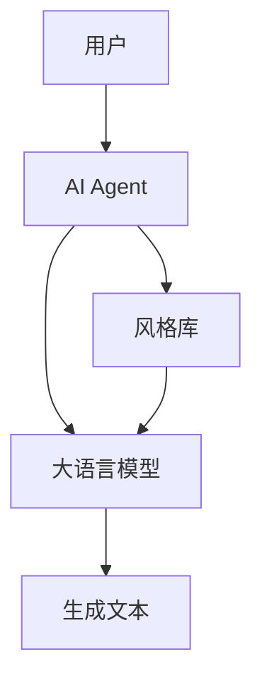
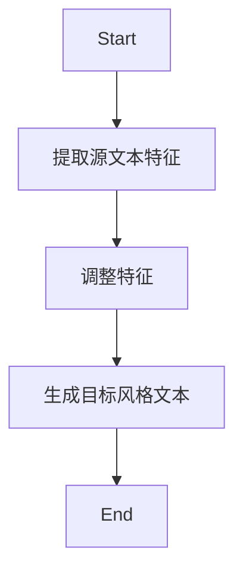
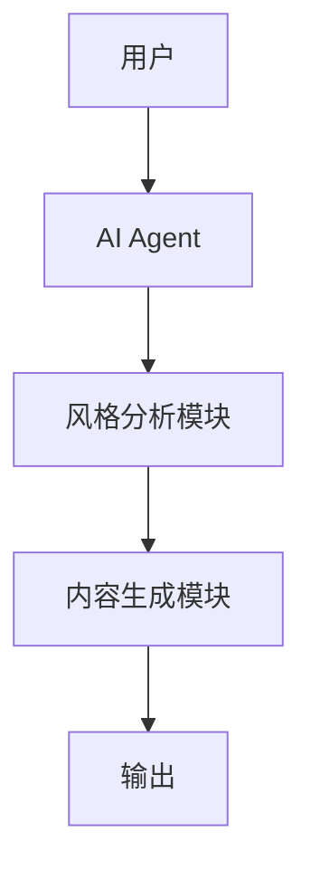

                 


# AI Agent的风格迁移：实现LLM的个性化表达

## 关键词：AI Agent，风格迁移，大语言模型（LLM），个性化表达，自然语言处理，文本生成

## 摘要：本文深入探讨了AI Agent在实现LLM个性化表达中的风格迁移技术。通过分析风格迁移的核心原理，结合算法实现和系统架构设计，展示了如何让大语言模型根据特定需求生成不同风格的文本。文章详细讲解了从背景概念到实际应用的全过程，包括算法原理、系统架构、项目实战和优化提升，为读者提供了全面的技术指导。

---

# 第一部分: AI Agent与风格迁移的背景与概念

## 第1章: AI Agent与风格迁移的概述

### 1.1 AI Agent的基本概念

#### 1.1.1 AI Agent的定义
AI Agent（人工智能代理）是指能够感知环境、自主决策并执行任务的智能实体。它可以是一个软件程序或物理设备，通过与用户或环境交互，完成特定目标。

#### 1.1.2 AI Agent的核心特征
- **自主性**：无需外部干预，自主决策。
- **反应性**：能够实时感知环境并做出反应。
- **目标导向**：所有行为都围绕特定目标展开。
- **学习能力**：通过数据和经验优化性能。

#### 1.1.3 AI Agent的应用场景
- **智能客服**：提供个性化的对话服务。
- **推荐系统**：根据用户行为推荐内容。
- **自动化系统**：自动执行特定任务，如智能家居设备。

### 1.2 大语言模型（LLM）的基本原理

#### 1.2.1 LLM的定义与特点
大语言模型是指经过大量文本数据训练的深度学习模型，能够理解和生成人类语言。其特点包括：
- **大规模训练数据**：通常使用 billions of tokens 训练。
- **多任务能力**：能够处理多种自然语言处理任务。
- **上下文理解**：能够捕捉文本中的上下文关系。

#### 1.2.2 LLM的训练机制
LLM的训练通常采用监督学习或无监督学习：
- **监督学习**：模型在标注数据上进行训练，逐步优化预测准确性。
- **无监督学习**：模型通过大量未标注数据自我学习语言规律。

#### 1.2.3 LLM在自然语言处理中的应用
- **文本生成**：生成连贯的文本内容。
- **机器翻译**：将一种语言翻译成另一种语言。
- **问答系统**：回答用户提出的问题。

### 1.3 风格迁移的定义与应用

#### 1.3.1 风格迁移的定义
风格迁移是指将一种文本的风格特征迁移到另一种文本上，生成具有目标风格的文本内容。例如，将正式的商务信函转化为更口语化的表达。

#### 1.3.2 风格迁移的核心目标
- **个性化表达**：根据需求生成不同风格的文本。
- **多样性输出**：避免生成重复或单一风格的内容。
- **语境适应**：根据上下文调整文本风格。

#### 1.3.3 风格迁移的实际应用场景
- **内容创作**：根据目标风格生成文章、广告等。
- **客户服务**：根据用户偏好生成个性化的回复。
- **教育领域**：生成适合不同学习风格的教学材料。

### 1.4 AI Agent与风格迁移的结合

#### 1.4.1 AI Agent实现风格迁移的意义
AI Agent通过风格迁移技术，能够根据用户需求生成多样化的文本内容，提升用户体验。

#### 1.4.2 风格迁移在LLM中的作用
风格迁移技术增强了LLM的灵活性和适应性，使其能够生成符合特定场景需求的文本。

#### 1.4.3 风格迁移的挑战与未来方向
- **挑战**：如何准确捕捉和迁移不同风格的特征。
- **未来方向**：研究更高效的风格迁移方法，提升迁移质量。

### 1.5 本章小结
本章介绍了AI Agent和LLM的基本概念，阐述了风格迁移的定义和应用，并分析了AI Agent与风格迁移结合的重要性和挑战。

---

# 第二部分: 风格迁移的核心概念与联系

## 第2章: 风格迁移的核心概念

### 2.1 风格迁移的核心原理

#### 2.1.1 特征提取与风格建模
风格迁移的关键在于提取文本的风格特征，并将其迁移到目标文本中。例如，可以通过词袋模型或词嵌入技术提取文本的风格特征。

#### 2.1.2 风格迁移的实现方式
- **基于特征的迁移**：直接调整文本的特征分布。
- **基于生成模型的迁移**：使用生成模型（如GPT）生成目标风格的文本。

#### 2.1.3 风格迁移的关键技术
- **预训练模型**：利用预训练的大语言模型提取风格特征。
- **微调模型**：在特定风格的数据上微调模型，增强风格适应性。

### 2.2 风格迁移的特征对比

#### 2.2.1 正式与非正式语言的特征对比
| 特性         | 正式语言         | 非正式语言       |
|--------------|------------------|------------------|
| 词汇选择     | 专业术语较多     | 通俗易懂         |
| 句式结构     | 复杂句式较多     | 简单句式为主       |
| 语气         | 客观、正式       | 主观、随意         |

#### 2.2.2 不同领域文本的风格差异
| 领域         | 特点             | 示例               |
|--------------|------------------|--------------------|
| 技术文档     | 专业术语多       | "本系统采用先进的算法..." |
| 日常对话     | 句子简短，口语化 | "这个功能挺方便的..."   |

### 2.3 风格迁移的实现流程

#### 2.3.1 流程概述
1. **提取源文本的风格特征**：通过分析源文本的词汇、句式等特征，提取风格信息。
2. **生成目标风格的文本**：根据提取的风格特征，调整目标文本的生成过程，使其符合目标风格。

### 2.4 风格迁移的实体关系图



### 2.5 本章小结
本章详细讲解了风格迁移的核心原理，对比了不同风格的特征，并通过流程图和实体关系图展示了风格迁移的实现过程。

---

# 第三部分: 风格迁移的算法原理与实现

## 第3章: 风格迁移的算法原理

### 3.1 基于特征提取的风格迁移

#### 3.1.1 特征提取方法
- **词袋模型**：统计文本中各词的出现频率。
- **词嵌入模型**：使用Word2Vec等模型提取词向量。

#### 3.1.2 特征调整方法
通过调整提取的特征向量，使得生成的文本符合目标风格。

### 3.2 基于生成模型的风格迁移

#### 3.2.1 预训练模型的风格迁移
- 使用预训练的GPT模型，通过调整生成策略，生成目标风格的文本。

#### 3.2.2 微调模型的风格迁移
- 在特定风格的数据集上微调模型，使其更好地适应目标风格。

### 3.3 风格迁移的算法流程图



### 3.4 风格迁移的数学模型

#### 3.4.1 交叉熵损失函数
用于衡量生成文本与目标风格文本的差异：
$$ L = -\sum_{i=1}^{n} y_i \log(p_i) $$

#### 3.4.2 KL散度
用于衡量两种概率分布的差异：
$$ KL(P || Q) = \sum_{i=1}^{n} P(i) \log\frac{P(i)}{Q(i)} $$

### 3.5 本章小结
本章详细讲解了风格迁移的算法原理，包括基于特征提取和生成模型的实现方法，并通过流程图和数学公式展示了风格迁移的具体实现过程。

---

# 第四部分: 系统分析与架构设计

## 第4章: 系统分析与架构设计

### 4.1 系统应用场景

#### 4.1.1 客户服务场景
AI Agent可以根据用户风格生成个性化的回复，提升用户体验。

#### 4.1.2 内容创作场景
生成符合特定风格的文章、广告等。

### 4.2 系统功能设计

#### 4.2.1 功能模块
- **用户输入处理模块**：接收用户输入并解析需求。
- **风格分析模块**：分析用户输入的风格特征。
- **内容生成模块**：根据风格特征生成目标风格的文本。

### 4.3 系统架构设计



### 4.4 系统接口设计

#### 4.4.1 输入接口
- **文本输入接口**：接收用户输入的文本内容。
- **风格参数接口**：接收目标风格的参数配置。

#### 4.4.2 输出接口
- **文本输出接口**：输出生成的文本内容。
- **反馈接口**：接收用户对生成文本的反馈，用于优化模型。

### 4.5 本章小结
本章分析了风格迁移系统的应用场景，设计了系统的功能模块和架构，并展示了系统接口的设计。

---

# 第五部分: 项目实战与优化

## 第5章: 项目实战

### 5.1 项目环境安装

#### 5.1.1 安装必要的库
- 使用Hugging Face库：
  ```bash
  pip install transformers
  ```

#### 5.1.2 下载预训练模型
- 下载GPT模型：
  ```bash
  transformers-cli download gpt2
  ```

### 5.2 核心代码实现

#### 5.2.1 特征提取代码
```python
from transformers import GPT2Tokenizer, GPT2Model

tokenizer = GPT2Tokenizer.from_pretrained('gpt2')
model = GPT2Model.from_pretrained('gpt2')

def extract_features(text):
    inputs = tokenizer(text, return_tensors='np')
    features = model(inputs.input_ids)
    return features.last_hidden_state[:, 0, :]
```

#### 5.2.2 风格迁移代码
```python
def style_transfer(source_text, target_style):
    source_features = extract_features(source_text)
    # 调整特征以匹配目标风格
    adjusted_features = source_features * target_style_factor
    # 生成目标风格文本
    generated_text = generate_from_features(adjusted_features)
    return generated_text
```

### 5.3 项目案例分析

#### 5.3.1 案例1：正式信函转化为口语化表达
- **输入**：正式商务信函内容。
- **输出**：生成更口语化的表达。

#### 5.3.2 案例2：技术文档转化为通俗易懂的解释
- **输入**：技术术语丰富的文档。
- **输出**：生成更易于理解的解释。

### 5.4 本章小结
本章通过实际案例展示了风格迁移技术的实现过程，包括环境安装、代码实现和案例分析。

---

# 第六部分: 优化与提升

## 第6章: 优化与提升

### 6.1 风格迁移的优化方法

#### 6.1.1 多任务学习
通过多任务学习优化模型，提升风格迁移的效果。

#### 6.1.2 风格库的扩展
增加更多样化的风格样本，提升模型的适应性。

### 6.2 模型的微调与优化

#### 6.2.1 微调策略
- 在特定风格的数据集上微调模型，增强风格适应性。

#### 6.2.2 超参数优化
通过调整学习率、批次大小等超参数，优化模型性能。

### 6.3 风格迁移的效果评估

#### 6.3.1 评估指标
- **BLEU分数**：衡量生成文本与目标风格文本的相似性。
- **人类评价**：通过人工评价生成文本的风格一致性。

### 6.4 本章小结
本章讨论了风格迁移的优化方法，包括多任务学习、风格库扩展和模型微调，并介绍了效果评估的指标和方法。

---

# 第七部分: 总结与展望

## 第7章: 总结与展望

### 7.1 本书总结
- 详细讲解了AI Agent和LLM的基本概念。
- 展示了风格迁移的核心原理和实现方法。
- 通过项目实战和优化方法，提供了全面的技术指导。

### 7.2 未来展望
- **更高效的风格迁移方法**：研究更高效的算法，提升风格迁移的效果。
- **多模态风格迁移**：结合图像、语音等多种模态信息，实现更丰富的风格迁移。
- **个性化风格定制**：根据用户需求定制独特的风格特征。

### 7.3 注意事项
- **数据多样性**：确保风格样本的多样性，避免模型过拟合。
- **模型适应性**：定期更新模型，保持其风格适应性。

### 7.4 拓展阅读
- **相关书籍**：《生成式人工智能：原理与应用》
- **技术博客**：Hugging Face官方博客

---

# 作者：AI天才研究院 & 禅与计算机程序设计艺术

