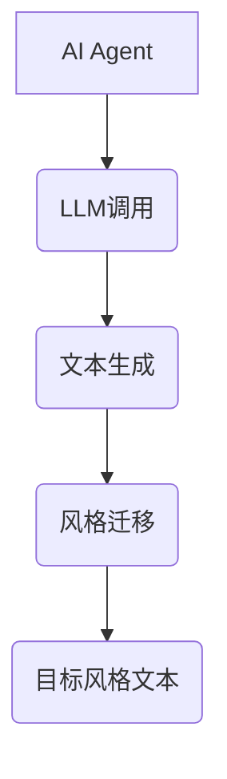

                 


# AI Agent的风格迁移：让LLM适应不同的表达方式

**关键词：AI Agent, LLM, 风格迁移, 文本生成, 对抗训练**

**摘要：**  
随着AI技术的快速发展，大型语言模型（LLM）在各种应用场景中展现出强大的能力。然而，LLM的输出风格通常较为固定，难以适应不同的场景和用户需求。本文将探讨如何通过AI Agent实现LLM的风格迁移，使其能够根据不同场景灵活调整输出风格。文章从背景、核心概念、算法原理、系统架构到实际案例，全面分析风格迁移的实现过程，并总结实践经验。

---

## 第1章：问题背景与目标

### 1.1 问题背景

#### 1.1.1 AI Agent与LLM的结合
AI Agent是一种智能代理系统，能够根据任务需求执行操作并做出决策。与LLM的结合使得AI Agent能够理解上下文并生成自然语言文本。然而，LLM的输出风格通常统一，难以适应不同场景的需求。

#### 1.1.2 风格迁移的必要性
在实际应用中，用户可能需要LLM输出不同风格的文本。例如，正式场合需要严谨的语气，而客服场景则需要亲切的口语化表达。风格迁移能够满足这些多样化的需求。

#### 1.1.3 当前LLM的局限性
虽然LLM在文本生成方面表现出色，但其输出风格单一，难以根据具体场景进行调整。这限制了其在实际应用中的灵活性和适用性。

### 1.2 问题描述

#### 1.2.1 不同场景下的表达需求
不同场景对文本风格的要求差异显著。例如，技术文档需要专业严谨的风格，而社交媒体内容则需要轻松活泼的语气。

#### 1.2.2 LLM输出风格的不适应性
LLM的输出风格通常基于训练数据中的常见模式，无法根据具体需求进行调整。这导致其在特定场景下的表现不佳。

#### 1.2.3 风格迁移的核心问题
风格迁移的核心问题是将LLM的输出从一种风格转换为另一种风格，同时保持内容的准确性和逻辑性。

### 1.3 解决方案与目标

#### 1.3.1 AI Agent在风格迁移中的作用
AI Agent通过分析任务需求和场景特征，调用合适的风格迁移算法，使LLM的输出适应目标风格。

#### 1.3.2 风格迁移的目标
风格迁移的目标是让LLM根据具体需求生成符合目标风格的文本，提升其在不同场景下的适应性。

---

## 第2章：AI Agent与LLM的关系

### 2.1 AI Agent的基本概念

#### 2.1.1 AI Agent的定义与特点
AI Agent是一种智能代理系统，能够感知环境、执行任务并做出决策。其特点包括自主性、反应性、目标导向和社交能力。

#### 2.1.2 AI Agent的分类与应用场景
AI Agent可以分为简单反射型、基于模型的反应型和目标驱动型。应用场景包括智能客服、自动化助手和推荐系统。

### 2.2 LLM的基本原理

#### 2.2.1 LLM的工作机制
LLM基于Transformer架构，通过自注意力机制捕捉上下文信息，生成连贯的文本输出。

#### 2.2.2 LLM的训练与推理过程
LLM的训练采用大规模数据集，通过自监督学习优化模型参数。推理时，模型根据输入生成预测的下一个词。

### 2.3 AI Agent与LLM的交互

#### 2.3.1 AI Agent如何调用LLM
AI Agent根据任务需求调用LLM，指定输入内容和风格偏好，生成符合要求的文本输出。

#### 2.3.2 LLM输出的风格问题
LLM的输出风格固定，无法根据具体场景进行调整，限制了其应用范围。

---

## 第3章：风格迁移的背景与目标

### 3.1 风格迁移的定义

#### 3.1.1 风格迁移的定义与分类
风格迁移是指将一种风格的文本转换为另一种风格的过程。可以根据领域、语气和形式进行分类。

#### 3.1.2 风格迁移的核心要素
风格迁移的核心要素包括源风格、目标风格和内容保持。

### 3.2 风格迁移的必要性

#### 3.2.1 不同场景下的表达需求
不同场景对文本风格的要求不同，例如正式场合需要严谨的语气，而社交媒体内容需要轻松活泼的语气。

#### 3.2.2 用户对表达风格的个性化要求
用户可能根据自身需求，希望文本输出具有特定的风格特征，如专业、亲切或幽默。

### 3.3 风格迁移的目标

#### 3.3.1 确保LLM输出符合目标风格
通过风格迁移，使LLM生成的文本符合目标场景的需求，提升用户体验。

#### 3.3.2 提高LLM的适应性与实用性
风格迁移能够增强LLM的灵活性，使其在更多场景下发挥实际作用。

---

## 第4章：风格迁移的算法原理

### 4.1 文本生成与风格迁移算法

#### 4.1.1 风格迁移算法的选择
基于编辑距离和对抗训练的风格迁移方法是当前研究的热点。

#### 4.1.2 风格迁移算法的工作流程
1. 输入源文本和目标风格。
2. 生成符合目标风格的文本。
3. 对生成文本进行评估和优化。

#### 4.1.3 风格迁移的实现步骤
1. 数据预处理：收集和整理不同风格的文本数据。
2. 模型训练：基于预处理的数据训练风格迁移模型。
3. 模型推理：输入源文本和目标风格，生成迁移后的文本。

### 4.2 风格迁移的数学模型

#### 4.2.1 编辑距离计算
编辑距离是指将源文本转换为目标风格所需的最少编辑操作次数。

#### 4.2.2 对抗训练框架
目标风格判别器用于区分生成文本与真实文本，生成器通过对抗训练学习目标风格。

### 4.3 算法实现

#### 4.3.1 基于编辑距离的风格迁移方法
1. 计算源文本和目标风格的编辑距离。
2. 根据编辑距离调整生成文本的风格。

#### 4.3.2 基于对抗训练的风格迁移方法
1. 使用生成对抗网络（GAN）框架，训练生成器和判别器。
2. 生成器生成符合目标风格的文本，判别器进行鉴别。

---

## 第5章：系统架构与实现

### 5.1 系统功能模块

#### 5.1.1 AI Agent模块
负责接收任务需求，调用风格迁移算法，生成目标风格的文本。

#### 5.1.2 LLM调用模块
负责与LLM进行交互，获取初始文本生成结果。

### 5.2 系统架构设计

#### 5.2.1 功能模块交互流程
1. AI Agent接收用户需求。
2. 调用LLM生成初始文本。
3. 应用风格迁移算法，调整文本风格。
4. 输出目标风格的文本。

#### 5.2.2 系统架构图


---

## 第6章：项目实战

### 6.1 环境安装

#### 6.1.1 安装Python环境
使用Anaconda安装Python 3.8及以上版本。

#### 6.1.2 安装依赖库
安装`transformers`, `tensorflow`, `pytorch`等库。

### 6.2 核心实现代码

#### 6.2.1 风格迁移模型训练代码
```python
import tensorflow as tf
from tensorflow.keras import layers

# 定义生成器模型
def build_generator(vocab_size, embedding_dim, hidden_dim):
    model = tf.keras.Sequential([
        layers.Embedding(vocab_size, embedding_dim),
        layers.GRU(hidden_dim, return_sequences=True),
        layers.Dense(vocab_size, activation='softmax')
    ])
    return model

# 定义判别器模型
def build_discriminator(seq_length, vocab_size):
    model = tf.keras.Sequential([
        layers.Embedding(vocab_size, 50),
        layers.LSTM(64, return_sequences=True),
        layers.Dense(1, activation='sigmoid')
    ])
    return model
```

#### 6.2.2 风格迁移算法实现代码
```python
def style_transfer(source_text, target_style):
    # 使用生成器生成目标风格文本
    generated_text = generator.predict(source_text)
    # 使用判别器评估生成文本的风格
    score = discriminator.predict(generated_text)
    # 返回生成文本和评估分数
    return generated_text, score
```

### 6.3 案例分析与解读

#### 6.3.1 案例场景
在电商客服场景中，AI Agent需要生成亲切的口语化文本。

#### 6.3.2 文本生成与风格迁移
输入源文本为专业术语较多的技术文档，目标风格为口语化的客服语言。

#### 6.3.3 生成结果分析
生成的文本符合目标风格，同时保持内容的准确性和连贯性。

---

## 第7章：最佳实践与总结

### 7.1 最佳实践

#### 7.1.1 数据预处理的关键性
高质量的数据预处理能够显著提升风格迁移的效果。

#### 7.1.2 模型调参的技巧
合理调整生成器和判别器的参数，平衡生成文本的质量和风格一致性。

#### 7.1.3 模型评估方法
使用BLEU、ROUGE等指标评估生成文本的质量和风格一致性。

### 7.2 小结

通过AI Agent实现风格迁移，能够显著提升LLM在不同场景下的适应性。本文从背景、核心概念、算法原理到系统架构和项目实战，全面探讨了风格迁移的实现过程，并总结了实践经验。

---

## 参考文献

1. Vaswani, A., et al. "Attention Is All You Need." arXiv preprint arXiv:1706.03798 (2017).
2. Goodfellow, I., et al. "Generative adversarial nets." Advances in neural information processing systems (2014).
3. 禅与计算机程序设计艺术，AI天才研究院.

---

**作者：AI天才研究院 & 禅与计算机程序设计艺术**

