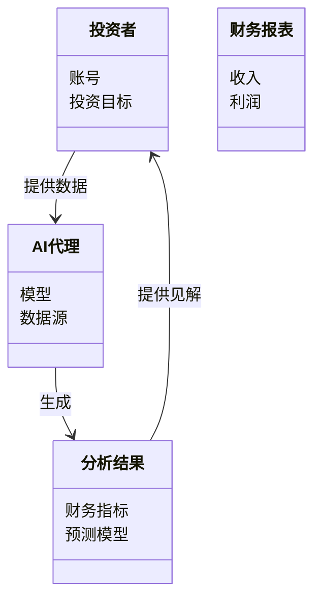

                 


# AI agents协作分析财报：提升价值投资决策效率

## 关键词
AI代理, 财务报表分析, 价值投资, 多代理协作, 自然语言处理, 机器学习, 股票预测

## 摘要
本文探讨如何利用AI代理协作分析财务报表，提升价值投资决策的效率。通过介绍AI代理的基本原理、协作机制，结合自然语言处理和机器学习算法，构建高效的财报分析系统，并通过实际案例展示其应用效果，最后总结经验和注意事项。

## 正文

## 第一部分：背景介绍

### 第1章：AI代理与价值投资的背景

#### 1.1 问题背景

- **传统财报分析的局限性**  
  财务报表分析依赖大量手动数据处理和专业判断，耗时且易受主观因素影响。

- **价值投资的基本概念**  
  价值投资强调通过深入分析企业基本面，寻找被市场低估的投资标的。

- **AI代理在金融领域的潜力**  
  AI代理能够快速处理大量数据，提供客观分析，辅助投资者做出更明智决策。

#### 1.2 问题描述

- **财报分析的复杂性**  
  包括多份财务报表的整合和复杂财务指标的计算。

- **价值投资中的信息处理挑战**  
  需要实时跟踪市场动态，处理大量非结构化数据。

- **AI代理协作的必要性**  
  通过协作提高分析效率和准确性，弥补传统方法的不足。

#### 1.3 问题解决

- **AI代理如何辅助财报分析**  
  利用NLP和机器学习技术，自动提取和分析财务数据，识别投资机会。

- **提升投资决策效率的方法**  
  通过自动化数据处理和预测模型，缩短决策周期，提高准确性。

- **技术与业务的结合点**  
  结合AI技术与财务分析，优化投资流程，提升投资回报。

#### 1.4 边界与外延

- **AI代理的适用范围**  
  主要适用于数据处理和模式识别，不涉及最终投资决策。

- **与传统投资分析的区分**  
  AI代理辅助分析，而非替代人类的判断和决策。

- **可能的局限性与挑战**  
  数据质量、模型偏差和市场波动可能影响分析结果。

#### 1.5 概念结构与核心要素

- **AI代理协作的核心要素**  
  数据采集、清洗、分析、预测和反馈。

- **财报分析的关键指标**  
  收入、利润、资产负债率等。

- **价值投资的决策链**  
  数据分析、趋势预测、投资策略制定。

---

## 第二部分：核心概念与联系

### 第2章：AI代理协作分析的原理

#### 2.1 核心概念原理

- **AI代理的工作机制**  
  通过NLP和机器学习模型处理数据，识别模式，生成见解。

- **多代理协作的基本原理**  
  各AI代理分工协作，分别处理不同任务，最终整合结果。

- **财报分析的流程与关键点**  
  数据清洗、特征提取、模型训练、结果解读。

#### 2.2 概念属性特征对比

| 概念       | 特征1：数据处理能力 | 特征2：实时性 | 特征3：准确性 |
|------------|---------------------|--------------|--------------|
| AI代理协作 | 强                | 高            | 高            |
| 传统分析    | 较弱               | 低            | 中            |

#### 2.3 ER实体关系图

```mermaid
erDiagram
    actor 投资者 {
        <属性> 账号
        <属性> 投资目标
    }
    actor 财务报表 {
        <属性> 收入
        <属性> 利润
    }
    entity AI代理 {
        <属性> 模型
        <属性> 数据源
    }
    entity 分析结果 {
        <属性> 财务指标
        <属性> 预测模型
    }
    投资者 --> AI代理 : 提供数据
    AI代理 --> 分析结果 : 生成
    分析结果 --> 投资者 : 提供见解
```

---

## 第三部分：算法原理讲解

### 第3章：算法原理与实现

#### 3.1 算法原理

- **自然语言处理（NLP）**  
  使用BERT模型分析财务报告中的文本，提取关键信息。

- **机器学习模型**  
  使用LSTM进行时间序列预测，分析财务指标的变动趋势。

#### 3.2 代码实现

```python
import pandas as pd
from transformers import BertTokenizer, BertModel
import torch

# 加载预训练模型
tokenizer = BertTokenizer.from_pretrained('bert-base-uncased')
model = BertModel.from_pretrained('bert-base-uncased')

# 示例财务文本
text = "公司今年的净利润增长了20%，营业收入达到50亿元。"
inputs = tokenizer(text, return_tensors='pt')

# 获取模型输出
outputs = model(**inputs)
last_hidden_states = outputs.last_hidden_state
```

#### 3.3 数学模型

- **财务比率计算**  
  $$ROE = \frac{\text{净利润}}{\text{股东权益}}$$

- **预测模型**  
  $$y_{t+1} = \alpha y_t + \beta x_t + \epsilon$$

---

## 第四部分：系统分析与架构设计方案

### 第4章：系统架构设计

#### 4.1 问题场景介绍

- **数据来源**  
  包括财务报表、市场新闻等多源数据。

- **系统功能设计**  
  数据采集、清洗、分析、预测、反馈。

#### 4.2 领域模型类图



#### 4.3 系统架构图


---

## 第五部分：项目实战

### 第5章：项目实战与案例分析

#### 5.1 环境安装

- **工具安装**  
  安装Python、TensorFlow、Keras、Pandas等库。

```bash
pip install python-pandas numpy tensorflow transformers
```

#### 5.2 核心代码实现

```python
import pandas as pd
import numpy as np
from sklearn.model_selection import train_test_split
from tensorflow.keras.models import Sequential
from tensorflow.keras.layers import LSTM, Dense

# 数据加载与预处理
data = pd.read_csv('financial_data.csv')
X = data[['收入', '利润']]
y = data['股价']

X_train, X_test, y_train, y_test = train_test_split(X, y, test_size=0.2)

# LSTM模型构建
model = Sequential()
model.add(LSTM(64, input_shape=(X_train.shape[1], 1)))
model.add(Dense(1))
model.compile(loss='mean_squared_error', optimizer='adam')

# 模型训练
model.fit(X_train.values.reshape(-1, X_train.shape[1], 1), y_train, epochs=10, batch_size=32)
```

#### 5.3 案例分析

- **数据预处理**  
  清洗和标准化财务数据，确保模型输入格式一致。

- **模型训练**  
  使用历史数据训练LSTM模型，预测未来股价走势。

- **结果分析**  
  对比预测结果与实际股价，评估模型准确性。

---

## 第六部分：总结与注意事项

### 第6章：总结与注意事项

#### 6.1 最佳实践

- **数据质量控制**  
  确保数据的准确性和完整性。

- **模型优化**  
  定期更新模型，适应市场变化。

#### 6.2 小结

通过AI代理协作分析财报，投资者可以更高效地进行价值投资决策，但需注意数据质量和模型局限性。

#### 6.3 注意事项

- 数据隐私保护
- 模型的可解释性
- 市场波动对模型影响

#### 6.4 拓展阅读

建议进一步学习强化学习和多模态数据处理技术，提升分析能力。

---

## 作者：AI天才研究院 & 禅与计算机程序设计艺术

---

通过以上结构，文章详细介绍了AI代理协作分析财报的方法，从理论到实践，为读者提供全面的技术指导。

