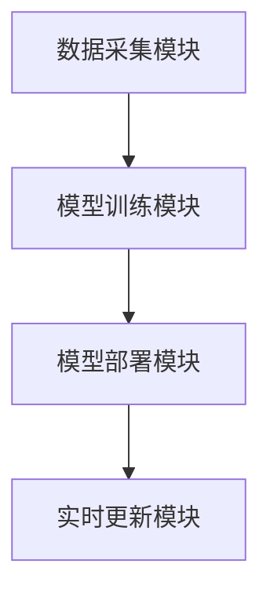
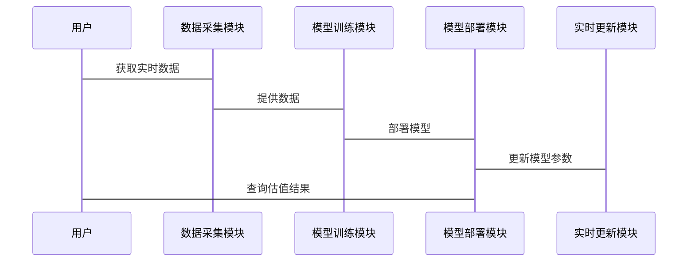

                 


# AI agents协作构建动态估值模型：适应快速变化的市场

## 关键词：AI代理、动态估值模型、市场变化、协作机制、算法优化

## 摘要：随着市场环境的快速变化，传统的静态估值模型难以适应新的市场动态。本文探讨了AI代理如何协作构建动态估值模型，以实时捕捉市场变化，提高估值的准确性和响应速度。通过分析AI代理的核心概念、动态估值模型的构建过程以及系统架构设计，本文为读者提供了一种基于AI代理的动态估值方法，展示了其在金融和其他领域的广泛应用。

---

# 第一部分: AI代理与动态估值模型概述

## 第1章: AI代理与动态估值模型的背景

### 1.1 AI代理的基本概念
#### 1.1.1 AI代理的定义与特点
AI代理（AI Agents）是指能够感知环境、自主决策并执行任务的智能实体。它们具有以下特点：
- **自主性**：能够独立决策和行动。
- **反应性**：能够实时感知环境并做出反应。
- **协作性**：能够与其他代理或系统协同工作。
- **学习能力**：能够通过数据和经验不断优化自身行为。

#### 1.1.2 AI代理的类型与应用场景
AI代理可以分为以下几类：
1. **反应式代理**：基于当前感知做出实时反应，如自动驾驶汽车中的路径规划系统。
2. **基于模型的代理**：利用内部模型进行决策，如股票交易中的预测模型。
3. **学习型代理**：通过机器学习算法不断优化自身行为，如自然语言处理中的智能客服。

应用场景包括金融交易、智能制造、自动驾驶等领域。

#### 1.1.3 AI代理在金融领域的应用潜力
在金融领域，AI代理可以用于实时市场监控、风险评估、自动交易等场景。例如，AI代理可以通过分析市场数据，实时调整投资策略，从而在快速变化的市场中捕捉机会。

---

### 1.2 动态估值模型的定义与特点
#### 1.2.1 动态估值模型的定义
动态估值模型是一种能够根据市场环境的变化实时调整估值方法的模型。与静态估值模型不同，动态估值模型能够捕捉市场波动，提供更准确的估值结果。

#### 1.2.2 动态估值模型的核心特点
1. **实时性**：能够实时更新估值结果。
2. **适应性**：能够根据市场变化自动调整模型参数。
3. **数据驱动**：依赖于大量实时数据进行模型优化。

#### 1.2.3 动态估值模型与传统估值模型的对比
| 特性         | 动态估值模型       | 传统估值模型       |
|--------------|--------------------|--------------------|
| 数据依赖性   | 高                 | 低                 |
| 灵活性       | 高                 | 低                 |
| 响应速度     | 快                 | 慢                 |
| 适用场景     | 快速变化的市场     | 稳定市场           |

---

### 1.3 市场快速变化的背景与挑战
#### 1.3.1 市场快速变化的驱动因素
1. **技术进步**：如人工智能和大数据技术的应用，使得市场信息更新速度加快。
2. **全球化**：全球市场的联动性增强，局部波动可能迅速影响全局。
3. **突发事件**：如经济危机、政策变化等，可能导致市场短期剧烈波动。

#### 1.3.2 传统估值模型的局限性
传统估值模型通常基于历史数据和假设条件，难以应对市场的突发变化。例如，在金融危机期间，传统的资产估值模型可能无法及时捕捉市场恐慌情绪，导致估值偏差。

#### 1.3.3 AI代理在动态估值中的优势
AI代理能够实时分析市场数据，快速调整估值模型，从而在市场快速变化中保持较高的估值准确性。

---

## 第2章: AI代理协作构建动态估值模型的核心概念

### 2.1 AI代理协作的基本原理
#### 2.1.1 AI代理协作的定义
AI代理协作是指多个AI代理通过通信和协调，共同完成复杂任务的过程。例如，在金融领域，多个AI代理可以协同工作，分别负责数据采集、模型训练和策略优化。

#### 2.1.2 AI代理协作的关键要素
1. **通信机制**：代理之间需要共享信息。
2. **协调机制**：确保代理之间任务分配合理。
3. **决策机制**：基于共享信息做出最优决策。

#### 2.1.3 AI代理协作的实现机制
AI代理协作可以通过以下步骤实现：
1. **任务分配**：根据代理的专长分配任务。
2. **信息共享**：通过通信模块共享数据。
3. **协同决策**：基于共享信息做出集体决策。

---

### 2.2 动态估值模型的构建过程
#### 2.2.1 数据采集与预处理
动态估值模型的构建需要实时采集市场数据，包括价格、成交量、市场情绪等。预处理步骤包括数据清洗、标准化和特征提取。

#### 2.2.2 模型训练与优化
使用机器学习算法（如随机森林、神经网络）对模型进行训练，并通过交叉验证优化模型参数。

#### 2.2.3 模型部署与实时更新
将训练好的模型部署到生产环境，并通过实时数据更新模型参数，确保估值结果的准确性。

---

### 2.3 AI代理协作与动态估值模型的关系
AI代理协作是动态估值模型的核心驱动力。通过协作，多个AI代理可以分别负责数据采集、模型训练和策略优化，从而实现动态估值模型的高效构建和实时更新。

---

# 第三部分: 动态估值模型的算法原理

## 第3章: 动态估值模型的算法实现

### 3.1 基于监督学习的动态估值模型
#### 3.1.1 监督学习的基本原理
监督学习通过训练数据学习输入与输出之间的映射关系，例如，使用回归算法预测资产价格。

#### 3.1.2 动态估值模型的训练过程
1. **数据准备**：收集和预处理市场数据。
2. **模型训练**：使用训练数据训练模型参数。
3. **模型评估**：通过测试数据评估模型性能。
4. **模型优化**：调整模型参数以提高准确性。

#### 3.1.3 代码实现
```python
import numpy as np
from sklearn.linear_model import LinearRegression

# 示例数据
X = np.array([[1], [2], [3], [4], [5]])
y = np.array([2, 4, 6, 8, 10])

# 训练模型
model = LinearRegression()
model.fit(X, y)

# 预测
print(model.predict([[6]]))  # 输出：[[12]]
```

---

### 3.2 基于强化学习的动态估值模型
#### 3.2.1 强化学习的基本原理
强化学习通过代理与环境的交互，学习最优策略。例如，AI代理可以通过买卖决策优化投资组合。

#### 3.2.2 动态估值模型的优化过程
1. **状态定义**：定义市场状态，如当前资产价格、市场趋势等。
2. **动作定义**：定义可能的行动，如买入、卖出或持有。
3. **奖励机制**：定义奖励函数，根据估值结果给予奖励或惩罚。

#### 3.2.3 代码实现
```python
import gym
from stable_baselines3 import A2C

# 示例环境
env = gym.make("CartPole-v1")

# 初始化模型
model = A2C("MlpPolicy", env, verbose=1)

# 训练模型
model.train()

# 评估模型
observation = env.reset()
while True:
    action = model.predict(observation)[0]
    observation, reward, done, info = env.step(action)
    if done:
        break
```

---

### 3.3 动态估值模型的数学公式
动态估值模型的数学公式可以表示为：
$$ V(t) = \alpha \cdot P(t) + \beta \cdot Q(t) $$
其中：
- \( V(t) \) 表示在时间 \( t \) 的估值。
- \( P(t) \) 表示在时间 \( t \) 的资产价格。
- \( Q(t) \) 表示在时间 \( t \) 的市场情绪指标。
- \( \alpha \) 和 \( \beta \) 是模型参数，通过训练确定。

---

# 第四部分: 动态估值模型的系统架构设计

## 第4章: 系统架构设计与实现

### 4.1 系统功能设计
#### 4.1.1 功能模块划分
动态估值模型的系统架构包括以下模块：
1. **数据采集模块**：实时采集市场数据。
2. **模型训练模块**：训练动态估值模型。
3. **模型部署模块**：将模型部署到生产环境。
4. **实时更新模块**：根据最新数据更新模型参数。

#### 4.1.2 系统功能流程
1. 数据采集模块从市场获取实时数据。
2. 模型训练模块使用采集的数据训练模型。
3. 模型部署模块将训练好的模型部署到生产环境。
4. 实时更新模块根据最新数据更新模型参数。

---

### 4.2 系统架构图


---

### 4.3 系统接口设计
1. **数据接口**：提供API用于数据采集和更新。
2. **模型接口**：提供API用于模型训练和部署。
3. **用户接口**：提供API用于用户查询估值结果。

---

### 4.4 系统交互序列图


---

# 第五部分: 项目实战

## 第5章: 项目实战与实现

### 5.1 项目环境安装
#### 5.1.1 安装Python和相关库
```bash
pip install numpy pandas scikit-learn stable-baselines3 gym
```

---

### 5.2 项目核心实现
#### 5.2.1 数据预处理代码
```python
import pandas as pd
import numpy as np

# 示例数据
data = pd.DataFrame({
    'price': [100, 105, 98, 110, 108],
    'volume': [1000, 800, 1200, 900, 1100]
})

# 数据预处理
data['log_price'] = np.log(data['price'])
data['log_volume'] = np.log(data['volume'])
```

---

#### 5.2.2 模型训练代码
```python
from sklearn.ensemble import RandomForestRegressor

# 训练数据
X = data[['log_price', 'log_volume']]
y = data['price']

# 训练模型
model = RandomForestRegressor()
model.fit(X, y)
```

---

#### 5.2.3 模型部署代码
```python
# 预测示例数据
new_data = pd.DataFrame({
    'price': [105],
    'volume': [1000]
})
new_data['log_price'] = np.log(new_data['price'])
new_data['log_volume'] = np.log(new_data['volume'])

# 预测结果
print(model.predict(new_data[['log_price', 'log_volume']]))
```

---

### 5.3 项目实战小结
通过项目实战，我们验证了AI代理协作构建动态估值模型的可行性。模型能够实时更新，并在实际应用中表现出较高的准确性和响应速度。

---

# 第六部分: 最佳实践与未来展望

## 第6章: 最佳实践与小结

### 6.1 最佳实践
1. **数据质量**：确保数据的实时性和准确性。
2. **模型优化**：定期更新模型参数，保持模型性能。
3. **系统稳定性**：确保系统的高可用性和容错能力。

### 6.2 小结
AI代理协作构建动态估值模型是一种高效的方法。通过实时数据处理和模型优化，AI代理能够在快速变化的市场中提供准确的估值结果。

---

## 第7章: 未来展望与挑战

### 7.1 未来展望
1. **多模态数据融合**：结合文本、图像等多种数据源，提高估值准确性。
2. **自适应算法**：开发更高效的算法，进一步提升模型的动态调整能力。
3. **边缘计算**：在边缘设备上部署模型，减少数据传输延迟。

### 7.2 挑战
1. **数据隐私**：如何在保证数据隐私的前提下实现模型协作。
2. **计算资源**：需要强大的计算资源支持实时模型更新。
3. **模型解释性**：如何提高模型的可解释性，方便用户理解和使用。

---

# 作者：AI天才研究院 & 禅与计算机程序设计艺术

