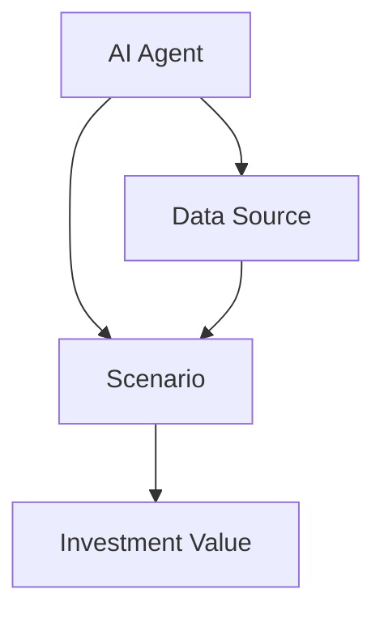
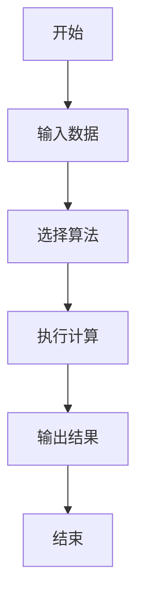
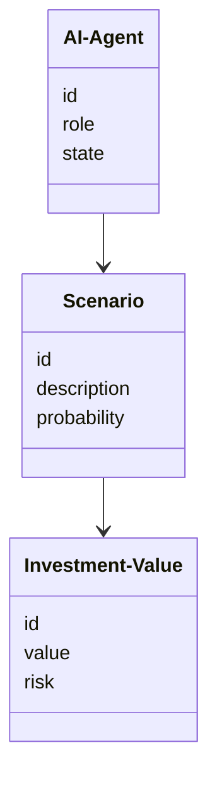
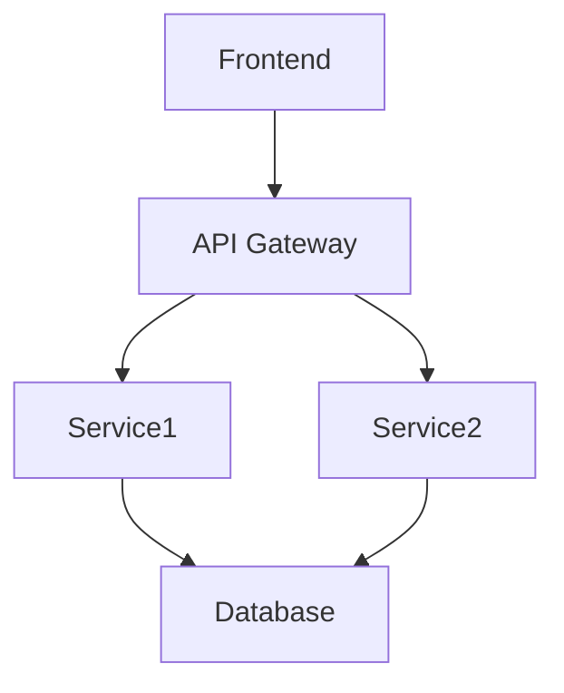
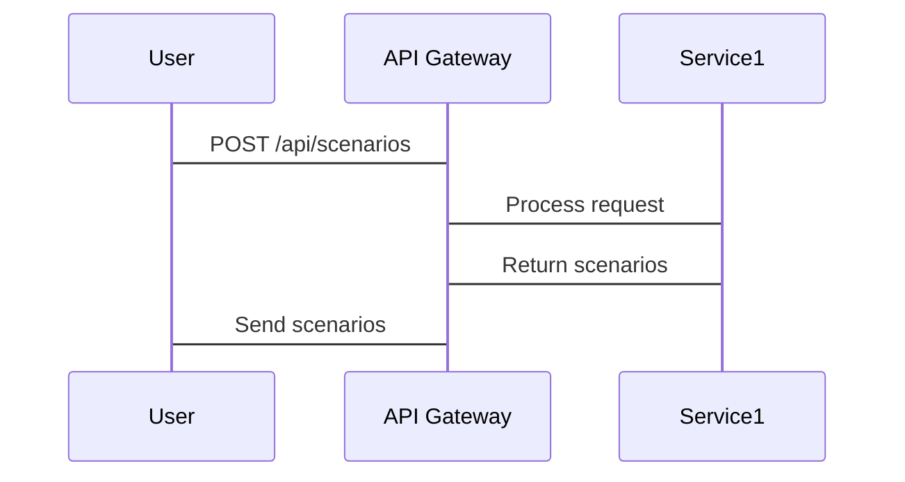

                 


```markdown
# AI agents协作进行情景分析：增强价值投资的适应性

> 关键词：AI agents, 情景分析, 价值投资, 适应性, 投资决策, 金融领域

> 摘要：本文探讨了AI代理协作在情景分析中的应用，特别是在增强价值投资适应性方面。通过详细分析核心概念、算法原理和系统架构，本文提供了从理论到实践的全面指导，帮助读者理解如何利用AI技术提升投资决策的准确性和适应性。

---

# 第一部分: AI agents协作进行情景分析的背景与概念

## 第1章: 问题背景与描述

### 1.1 问题背景
#### 1.1.1 价值投资的传统方法与局限性
- 传统价值投资依赖人工分析，效率低且主观性强。
- 数据量爆炸式增长，人工难以处理复杂场景。
- 市场变化快，传统方法难以快速适应新情况。

#### 1.1.2 AI技术在金融领域的应用现状
- AI在金融领域的应用：预测、分类、聚类等。
- AI代理在情景分析中的潜力。
- 当前应用中的不足：缺乏协作性，模型单一。

#### 1.1.3 情景分析在投资决策中的重要性
- 情景分析帮助投资者应对不确定性。
- 多种情景分析提升决策的全面性。
- 动态调整情景分析以适应市场变化。

### 1.2 问题描述
#### 1.2.1 情景分析的核心挑战
- 多因素影响下的复杂性。
- 数据实时性与准确性的平衡。
- 情景间的相互关联与影响。

#### 1.2.2 传统情景分析方法的不足
- 依赖专家经验，难以量化。
- 计算复杂，效率低下。
- 静态分析，难以动态调整。

#### 1.2.3 AI agents协作的优势
- 分布式计算能力，提高效率。
- 多维度数据处理，增强准确性。
- 动态协作，适应市场变化。

### 1.3 问题解决
#### 1.3.1 AI agents协作的解决方案
- 分布式计算架构。
- 多智能体协同学习。
- 实时数据处理与反馈。

#### 1.3.2 增强价值投资适应性的关键点
- 智能代理的动态协作机制。
- 高效的情景生成与评估方法。
- 可解释性与透明性。

#### 1.3.3 技术与业务的结合策略
- 技术落地：AI代理的实际应用。
- 业务优化：提升投资决策效率。
- 持续改进：反馈与优化机制。

### 1.4 边界与外延
#### 1.4.1 AI agents协作的适用范围
- 适用于复杂金融市场的分析。
- 适用于需要多维度数据处理的场景。
- 适用于需要动态调整的策略制定。

#### 1.4.2 与传统投资分析的区分
- 分析主体：AI代理 vs. 人工分析师。
- 方法论：数据驱动 vs. 经验驱动。
- 结果呈现：量化分析 vs. 定性分析。

#### 1.4.3 未来发展的可能性
- 更高级的协作机制。
- 更智能化的决策支持。
- 更广泛的应用场景。

### 1.5 概念结构与核心要素
#### 1.5.1 AI agents协作的基本框架
- 中心节点：协调多个AI代理。
- 分布式计算：并行处理任务。
- 反馈机制：实时调整策略。

#### 1.5.2 情景分析的核心要素
- 数据源：市场数据、财务数据等。
- 分析模型：回归分析、聚类分析等。
- 结果输出：情景描述、概率评估等。

#### 1.5.3 价值投资的适应性模型
- 输入：市场数据、公司基本面等。
- 处理：多情景分析、风险评估。
- 输出：投资建议、动态调整策略。

---

## 第2章: 核心概念与联系

### 2.1 AI agents协作的情景分析模型
#### 2.1.1 模型的组成部分
- 数据预处理模块：清洗、转换。
- 情景生成模块：基于AI代理的协作。
- 情景评估模块：多维度评估。

#### 2.1.2 各个概念之间的关系
- 数据预处理为情景生成提供基础。
- 情景生成依赖于AI代理的协作。
- 情景评估为投资决策提供依据。

#### 2.1.3 模型的数学表达式
$$
\text{情景概率} = f(\text{数据特征}, \text{模型参数})
$$

### 2.2 核心概念的属性特征对比
#### 2.2.1 对比表格展示
| 概念       | 输入特征 | 输出结果 | 算法类型 |
|------------|----------|----------|----------|
| AI代理     | 市场数据 | 情景描述 | 分布式计算 |
| 情景分析   | 数据特征 | 情景评估 | 统计模型 |
| 价值投资   | 情景结果 | 投资建议 | 优化算法 |

### 2.3 ER实体关系图


---

## 第3章: 算法原理讲解

### 3.1 概率论基础
#### 3.1.1 概率的基本概念
- 概率是度量某种现象发生可能性的数值。
- 概率空间由样本空间、事件和概率测度组成。

#### 3.1.2 条件概率与贝叶斯定理
- 贝叶斯定理：$P(A|B) = \frac{P(B|A)P(A)}{P(B)}$。
- 应用：在情景分析中更新投资概率。

### 3.2 优化算法
#### 3.2.1 基本概念
- 优化目标：最大化投资回报。
- 约束条件：风险承受能力。

#### 3.2.2 算法实现
- 使用Python的scipy.optimize模块。
- 示例代码：
  ```python
  import scipy.optimize as optimize
  
  def objective_function(x):
      return -x[0] * x[1]  # 最大化x0*x1
  
  constraints = {
      'type': 'ineq',
      'fun': lambda x: x[0] + x[1] - 1  # x0 + x1 <= 1
  }
  
  result = optimize.minimize(objective_function, [0.5, 0.5], constraints=constraints)
  ```

#### 3.2.3 应用实例
- 示例：在给定风险下，优化投资组合回报。
- 结果解读：找到最优投资分配。

### 3.3 算法流程图


---

## 第4章: 系统分析与架构设计

### 4.1 问题场景介绍
- 多个AI代理协作分析市场数据。
- 实时生成和评估多种投资情景。
- 动态调整投资策略。

### 4.2 项目介绍
#### 4.2.1 项目目标
- 实现AI代理协作的情景分析系统。
- 提供动态调整的投资策略。

#### 4.2.2 项目范围
- 数据来源：实时市场数据。
- 用户角色：投资者、数据分析师。

### 4.3 系统功能设计
#### 4.3.1 领域模型


#### 4.3.2 系统架构设计


#### 4.3.3 接口设计
- RESTful API：`/api/scenarios`。
- 输入：`POST`请求，包含数据特征。
- 输出：生成的情景列表。

#### 4.3.4 交互流程


---

## 第5章: 项目实战

### 5.1 环境安装
- 安装Python和必要的库：`scipy`, `numpy`, `pandas`, `flask`。
- 安装Mermaid CLI工具。

### 5.2 系统核心实现
#### 5.2.1 AI代理协作实现
```python
import requests

def fetch_data(api_key):
    response = requests.get(f'http://api.marketdata.com', headers={'Authorization': api_key})
    return response.json()

def analyze_scenario(data):
    # 分析逻辑
    return scenario_results

def main():
    data = fetch_data('your_api_key')
    result = analyze_scenario(data)
    print(result)

if __name__ == '__main__':
    main()
```

#### 5.2.2 算法实现
```python
import numpy as np

def calculate_probability(data_points):
    # 计算概率的逻辑
    return probabilities

data = np.array([...])
probabilities = calculate_probability(data)
print(probabilities)
```

### 5.3 代码实现与解读
- `fetch_data`函数：从API获取市场数据。
- `analyze_scenario`函数：分析数据生成情景。
- `main`函数：主程序入口。

### 5.4 案例分析与解读
- 数据输入：市场数据、公司基本面。
- 情景生成：多种投资情景。
- 投资建议：基于情景分析的结果。

### 5.5 项目小结
- 实现了AI代理协作的情景分析系统。
- 提供了动态调整的投资策略。
- 可扩展性强，支持更多数据源和分析模型。

---

## 第6章: 最佳实践与小结

### 6.1 最佳实践
#### 6.1.1 注意事项
- 数据质量：确保数据准确性和及时性。
- 模型选择：根据具体场景选择合适算法。
- 系统维护：定期更新模型和数据源。

#### 6.1.2 问题解决技巧
- 处理数据稀疏性：使用数据增强技术。
- 提高计算效率：优化算法复杂度。
- 增强可解释性：采用可解释的模型。

### 6.2 小结
- 本文详细介绍了AI代理协作在情景分析中的应用。
- 从理论到实践，系统性地讲解了核心概念、算法原理和系统架构。
- 通过项目实战，展示了如何将理论应用于实际投资决策中。

### 6.3 注意事项
- 保护数据隐私：确保数据安全。
- 遵守金融监管规定：符合相关法律法规。
- 定期评估模型性能：保持模型的有效性。

### 6.4 拓展阅读
- 推荐书籍：《机器学习实战》、《金融时间序列分析》。
- 推荐论文：关于多智能体协作的最新研究。
- 推荐工具：AI代理协作框架，如StarAI。

---

## 作者信息

作者：AI天才研究院/AI Genius Institute  
联系邮箱：contact@ai-genius.org  
GitHub地址：https://github.com/ai-genius-institute

---

# 结语

通过本文的学习，读者可以全面理解AI代理协作在情景分析中的应用，掌握核心概念、算法原理和系统架构设计。希望本文能为价值投资的适应性增强提供新的思路和方法，帮助投资者在复杂多变的市场中做出更明智的决策。

--- 

# END
```

