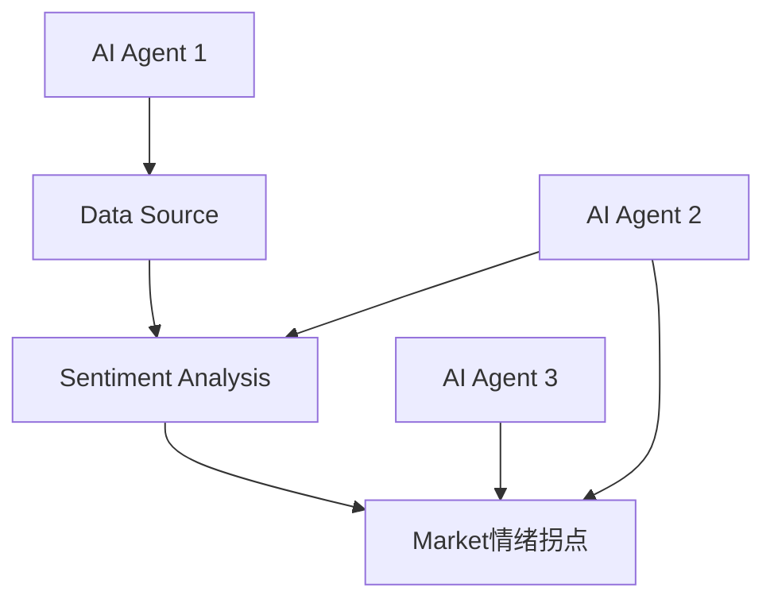
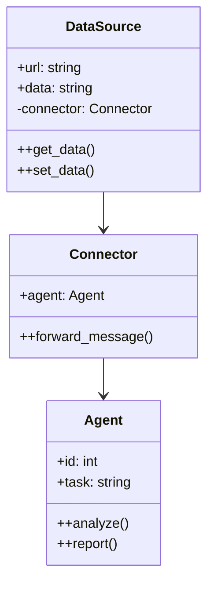
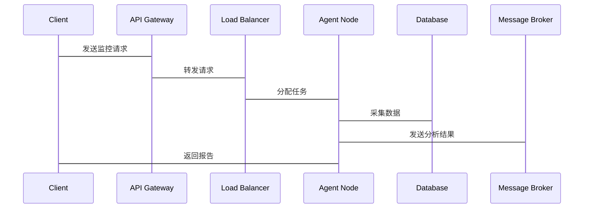

                 


# AI agents协作进行舆情分析：捕捉市场情绪拐点

## 关键词：
AI代理, 舆情分析, 市场情绪拐点, 多代理协作, 情感分析, 主题建模, 异常检测

## 摘要：
本文深入探讨AI代理协作在舆情分析中的应用，分析如何通过AI代理捕捉市场情绪拐点。文章首先介绍舆情分析和AI代理的基本概念，接着分析情感分析、主题建模和异常检测的算法原理，设计多代理协作的系统架构，最后通过实际案例展示AI代理协作的实现过程，并探讨其在市场情绪分析中的应用前景。

---

## 第一部分: 引言

### 第1章: 问题背景与目标

#### 1.1 问题背景
##### 1.1.1 舆情分析的定义与重要性
舆情分析是通过对社交媒体、新闻媒体等公开数据的分析，了解公众对特定品牌、产品或事件的态度和情绪。它帮助企业识别市场趋势、风险和机会，从而做出更明智的决策。

##### 1.1.2 AI代理在舆情分析中的作用
AI代理（AI Agents）是一种能够感知环境、执行任务并做出决策的智能实体。在舆情分析中，AI代理可以实时监控数据源、分析情感倾向、识别主题并检测异常情绪变化，从而协助人类分析师快速捕捉市场情绪拐点。

##### 1.1.3 市场情绪拐点的捕捉意义
市场情绪拐点是指市场情绪从一个状态突然转变到另一个状态的关键点。捕捉拐点可以帮助企业及时调整策略，抢占市场先机。AI代理通过协作分析，能够在海量数据中快速识别这些拐点，提供实时反馈。

#### 1.2 问题描述
##### 1.2.1 舆情数据的复杂性
舆情数据来源广泛，包括文本、图像和视频等多种形式，且数据量巨大。这些数据通常带有噪声，需要去噪处理后才能进行分析。

##### 1.2.2 市场情绪变化的动态性
市场情绪并非静态，它会随着时间变化而波动。某些突发事件可能导致情绪急剧变化，因此需要实时监控和分析。

##### 1.2.3 多代理协作的必要性
单一AI代理难以处理海量数据和复杂任务，因此需要多个AI代理协作完成数据采集、分析和决策等任务。

#### 1.3 问题解决与边界
##### 1.3.1 AI代理协作的解决方案
通过分布式计算和任务分配，多个AI代理可以协作完成舆情分析任务。每个代理负责特定子任务，如数据清洗、情感分析等。

##### 1.3.2 解决方案的边界与外延
解决方案的边界包括数据源的范围、分析的粒度和实时性要求。外延则涉及与其他系统的集成和扩展。

##### 1.3.3 核心要素与组成结构
AI代理协作系统的核心要素包括数据源、代理节点、协作机制、分析算法和结果输出。系统结构分为数据层、分析层和决策层。

### 第2章: 核心概念与联系

#### 2.1 核心概念原理
##### 2.1.1 AI代理的核心原理
AI代理通过感知环境、学习和推理，执行特定任务。在舆情分析中，代理可以自动采集数据、分析情感并生成报告。

##### 2.1.2 舆情分析的关键技术
舆情分析涉及自然语言处理（NLP）、情感分析、主题建模等技术。这些技术帮助AI代理理解数据并提取有用信息。

##### 2.1.3 多代理协作的机制
多代理协作机制包括任务分配、通信协议和结果汇总。代理之间通过消息传递进行协作，确保任务高效完成。

#### 2.2 核心概念对比
##### 2.2.1 AI代理与传统算法的对比
AI代理具有自主性和适应性，能够动态调整策略。传统算法则需要人工配置，适应性较差。

##### 2.2.2 舆情分析与市场预测的关联
舆情分析提供市场情绪数据，为市场预测提供依据。市场预测则基于舆情数据和其他经济指标，预测未来走势。

##### 2.2.3 多代理协作的优势与劣势
多代理协作的优势在于任务分配合理、处理能力强。劣势在于协作机制复杂，可能增加系统延迟。

#### 2.3 实体关系图


---

## 第二部分: 算法与模型

### 第3章: 情感分析算法

#### 3.1 情感分析原理
##### 3.1.1 基于词袋模型的情感分析
词袋模型将文本表示为词袋，不考虑词序。常用TF-IDF计算词的重要性，然后通过机器学习模型分类情感。

##### 3.1.2 基于深度学习的情感分析
深度学习模型如LSTM和Transformer能够捕捉文本的上下文关系，情感分析效果更优。

##### 3.1.3 情感分析的数学模型
$$P(y|x) = \frac{P(x|y)P(y)}{P(x)}$$
其中，$y$表示情感类别，$x$表示输入文本。

#### 3.2 主题建模
##### 3.2.1 LDA主题建模
LDA（Latent Dirichlet Allocation）是一种常用的主题建模方法，通过概率模型发现文本的主题分布。

##### 3.2.2 NMF主题建模
NMF（Non-negative Matrix Factorization）将矩阵分解为两个非负矩阵的乘积，用于主题提取。

##### 3.2.3 主题模型的优缺点
LDA和NMF各有优缺点，LDA适合主题发现，NMF适合主题降维。

#### 3.3 异常检测
##### 3.3.1 基于统计的异常检测
使用均值、标准差等统计指标发现异常值。

##### 3.3.2 基于深度学习的异常检测
使用自动编码器（Autoencoder）等模型学习正常数据分布，识别异常数据。

---

## 第三部分: 系统架构设计

### 第4章: 系统架构与设计

#### 4.1 问题场景介绍
系统需要实时监控多个数据源，分析舆情数据，捕捉市场情绪拐点。用户包括企业分析师和市场研究人员。

#### 4.2 项目介绍
项目目标是开发一个多代理协作系统，实现舆情数据的实时采集、分析和报告生成。

#### 4.3 系统功能设计
##### 4.3.1 领域模型


##### 4.3.2 系统架构设计


#### 4.4 系统接口设计
##### 4.4.1 数据接口
API接口用于数据采集和传输，支持RESTful API。

##### 4.4.2 代理间通信接口
代理间通过消息队列（如Kafka）进行通信，确保高效协作。

#### 4.5 系统交互设计
##### 4.5.1 实时监控流程


---

## 第四部分: 项目实战

### 第5章: 项目实战

#### 5.1 环境安装
##### 5.1.1 安装Python和相关库
安装Python 3.8及以上版本，安装库包括Flask、requests、nltk、transformers。

#### 5.2 系统核心实现源代码
##### 5.2.1 数据采集模块
```python
import requests
from bs4 import BeautifulSoup

def fetch_data(url):
    response = requests.get(url)
    soup = BeautifulSoup(response.text, 'html.parser')
    return soup.text
```

##### 5.2.2 情感分析模块
```python
from transformers import pipeline

sentiment_analyzer = pipeline('sentiment-analysis')
def analyze_sentiment(text):
    return sentiment_analyzer(text)
```

##### 5.2.3 异常检测模块
```python
from sklearn.ensemble import IsolationForest

def detect_anomaly(data):
    model = IsolationForest(n_estimators=100)
    model.fit(data)
    return model.predict(data)
```

#### 5.3 代码应用解读与分析
##### 5.3.1 数据采集模块解读
数据采集模块通过HTTP请求获取数据，使用BeautifulSoup解析HTML内容。

##### 5.3.2 情感分析模块解读
使用预训练的Transformers模型进行情感分析，返回情感倾向和置信度。

##### 5.3.3 异常检测模块解读
Isolation Forest算法用于无监督异常检测，返回异常标志。

#### 5.4 实际案例分析
##### 5.4.1 案例背景
分析某品牌在社交媒体上的舆情，捕捉市场情绪拐点。

##### 5.4.2 数据采集与处理
从Twitter API获取相关数据，清洗并预处理。

##### 5.4.3 分析结果解读
通过情感分析和主题建模，识别关键话题和情绪变化。

#### 5.5 项目小结
项目成功实现了AI代理协作的舆情分析系统，能够实时捕捉市场情绪拐点，为企业决策提供支持。

---

## 第五部分: 总结与展望

### 第6章: 总结与展望

#### 6.1 总结
本文详细探讨了AI代理协作在舆情分析中的应用，分析了情感分析、主题建模和异常检测的算法，设计了系统的架构，并通过实际案例展示了系统的实现过程。

#### 6.2 未来展望
未来，AI代理协作在舆情分析中的应用将更加广泛。可能的发展方向包括实时性提升、多模态分析、跨语言支持和自适应学习。

---

## 作者：
作者：AI天才研究院 & 禅与计算机程序设计艺术

