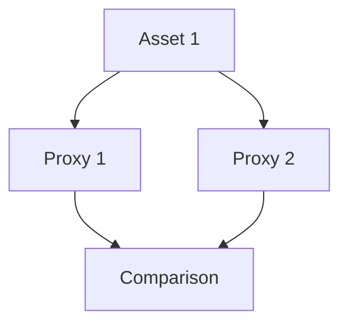
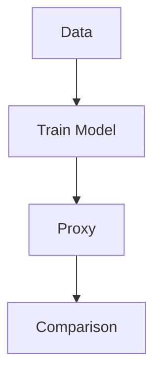
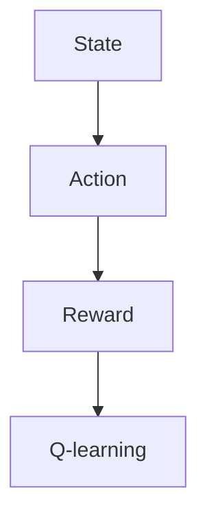
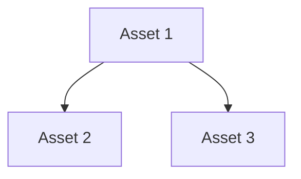
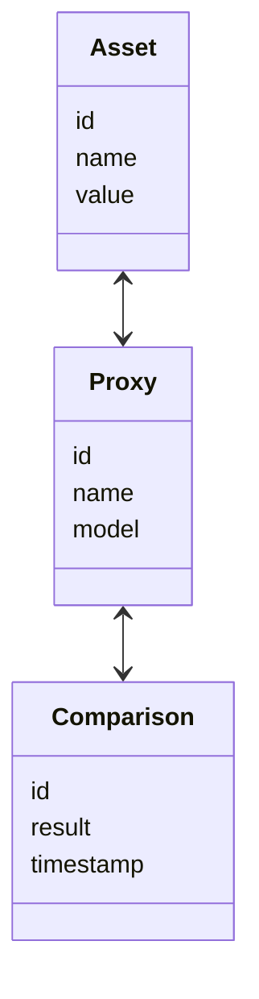
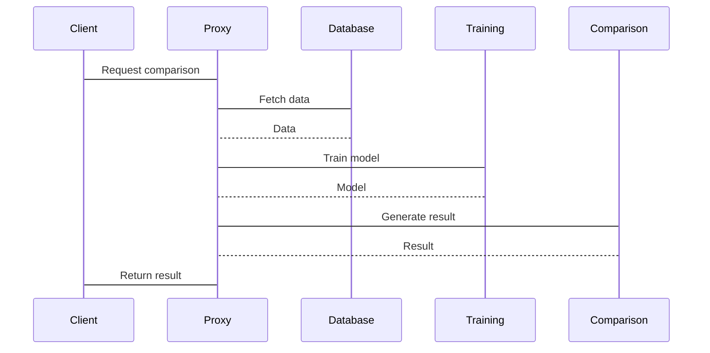

                 


# AI agents协作进行跨资产类别价值比较：优化资产配置

> 关键词：AI代理，资产配置，价值比较，机器学习，投资组合优化

> 摘要：本文探讨AI代理如何协作进行跨资产类别价值比较，优化资产配置。通过分析AI代理的核心概念、算法原理、系统架构及项目实战，揭示其在金融投资中的应用潜力。

---

## 第1章 AI代理协作与资产配置概述

### 1.1 资产配置的背景与挑战

#### 1.1.1 资产配置的基本概念
资产配置是将资金分配到不同资产类别（如股票、债券、房地产等）以实现投资目标的过程。传统方法依赖人工分析，耗时且易受主观因素影响。

#### 1.1.2 多资产类别投资的复杂性
不同资产类别具有不同的风险和回报特征，跨类别比较需考虑货币单位、时间和波动性等差异。

#### 1.1.3 传统资产配置方法的局限性
传统方法依赖经验判断，难以应对市场波动和复杂场景，且难以处理海量数据。

### 1.2 AI代理在资产配置中的作用

#### 1.2.1 AI代理的基本概念
AI代理是具有感知和决策能力的智能体，可执行复杂任务。在资产配置中，AI代理能处理海量数据，识别潜在模式。

#### 1.2.2 AI代理在金融领域的应用
AI代理用于实时数据分析、风险评估和投资决策，提升投资效率和准确性。

#### 1.2.3 AI代理协作的优势
通过协作，AI代理能综合多维度信息，提供更精准的资产配置建议。

### 1.3 跨资产类别价值比较的核心问题

#### 1.3.1 资产类别间的可比性分析
需考虑不同资产的回报率、波动性和流动性差异，构建统一比较框架。

#### 1.3.2 价值比较的数学模型
建立多维度评价指标，如夏普比率，量化资产风险调整后收益。

#### 1.3.3 跨资产类别优化的目标
在风险可控前提下，最大化投资收益。

## 第2章 AI代理协作的核心概念与原理

### 2.1 AI代理的核心概念

#### 2.1.1 定义与分类
AI代理按智能水平分为反应式和认知式代理。认知式代理具备高级推理能力，适合复杂金融任务。

#### 2.1.2 属性对比
| 属性 | 反应式代理 | 认知式代理 |
|------|------------|------------|
| 智能水平 | 低         | 高         |
| 任务复杂度 | 简单       | 复杂       |

#### 2.1.3 ER实体关系图
```mermaid
er
  root(Asset, id, name)
  root(Proxy, id, name)
  root(Comparison, id, name)
  Asset --> Comparison : has
  Proxy --> Comparison : handled_by
```

### 2.2 价值比较的数学模型

#### 2.2.1 资产回报率计算
$$ R = \frac{P_t - P_{t-1}}{P_{t-1}} $$

#### 2.2.2 风险度量
$$ \sigma^2 = \frac{1}{n-1} \sum_{i=1}^{n} (x_i - \bar{x})^2 $$

#### 2.2.3 优化目标
$$ \max \sum_{i=1}^{n} w_i R_i $$

### 2.3 AI代理协作机制

#### 2.3.1 协作流程


#### 2.3.2 协调机制
通过共识算法（如拜占庭共识）确保代理间信息同步和决策一致性。

## 第3章 AI代理协作的算法实现

### 3.1 监督学习算法

#### 3.1.1 算法流程


#### 3.1.2 代码实现
```python
def train_model(data):
    # 训练模型
    return model
```

### 3.2 强化学习算法

#### 3.2.1 算法流程


#### 3.2.2 代码实现
```python
def q_learning(state, action):
    return reward
```

### 3.3 对比学习算法

#### 3.3.1 算法流程


#### 3.3.2 代码实现
```python
def compare_assets(asset1, asset2):
    return comparison_result
```

## 第4章 系统分析与架构设计

### 4.1 系统功能设计

#### 4.1.1 领域模型


### 4.2 系统架构设计

#### 4.2.1 分层架构


#### 4.2.2 接口设计
API用于数据获取、模型训练和结果查询。

### 4.3 系统交互流程

#### 4.3.1 序列图


## 第5章 项目实战

### 5.1 环境安装

#### 5.1.1 安装依赖
使用Python和相关库（如NumPy、TensorFlow）。

### 5.2 核心实现

#### 5.2.1 数据获取
```python
import numpy as np
data = np.random.rand(100, 10)
```

#### 5.2.2 模型训练
```python
import tensorflow as tf
model = tf.keras.Sequential([...])
model.fit(data, labels)
```

#### 5.2.3 结果生成
```python
def generate_report(comparison_results):
    print("Report generated")
```

### 5.3 案例分析

#### 5.3.1 数据分析
分析股票、债券等资产的历史数据，计算夏普比率。

#### 5.3.2 投资组合优化
基于AI代理协作结果，优化投资组合。

## 第6章 最佳实践与总结

### 6.1 最佳实践

#### 6.1.1 数据质量
确保数据准确性和完整性。

#### 6.1.2 模型选择
根据任务需求选择合适的AI代理协作模型。

### 6.2 总结

AI代理协作在跨资产类别价值比较中具有巨大潜力，通过不断优化算法和系统架构，未来可实现更高效的资产配置。

---

## 作者信息

作者：AI天才研究院 & 禅与计算机程序设计艺术

