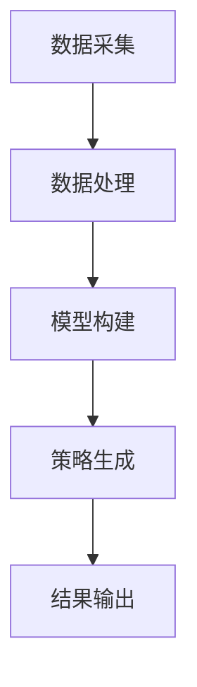
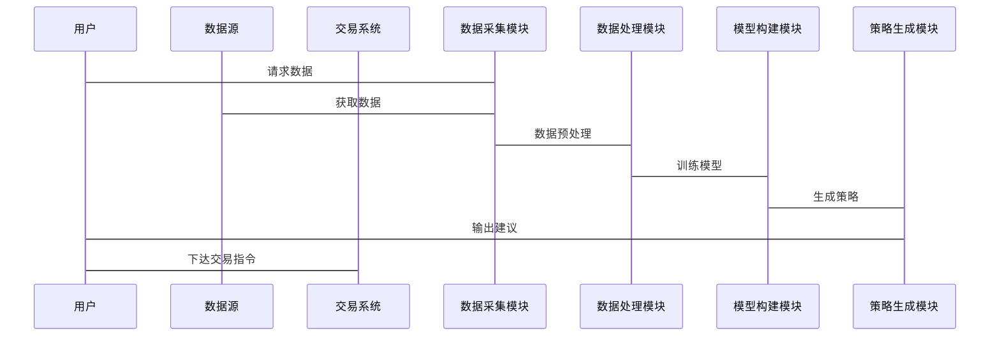

                 


```markdown
# AI agents在价值投资中的宏观经济分析应用

## 关键词：AI agents，价值投资，宏观经济分析，技术实现，投资策略，数据处理，算法优化

## 摘要：本文探讨了AI agents在价值投资中的宏观经济分析应用，从AI agents的基本概念到宏观经济分析的核心指标，再到具体的算法实现和系统架构设计，详细分析了AI agents如何帮助投资者进行宏观经济分析和投资决策优化。通过实际案例分析和代码实现，展示了AI agents在价值投资中的强大能力。

---

## 第一部分: AI agents与宏观经济分析基础

### 第1章: 价值投资的基本原理

#### 1.1 价值投资的核心理念
价值投资是一种以基本面分析为基础的投资策略，强调以低于内在价值的价格购买优质资产。其核心理念包括：
- **内在价值**：资产的内在价值是其未来现金流的现值。
- **安全边际**：买入价格应低于内在价值，以降低风险。
- **长期视角**：关注企业的长期表现，而非短期波动。

#### 1.2 AI agents的基本概念
AI agents（人工智能代理）是指能够感知环境、自主决策并执行任务的智能体。其核心特征包括：
- **自主性**：无需人工干预，自主完成任务。
- **反应性**：能够实时感知环境并做出反应。
- **学习能力**：通过数据和经验不断优化决策模型。

#### 1.3 宏观经济分析的基础知识
宏观经济分析研究整体经济体系的运行规律，包括GDP、通胀率、利率等指标。其主要目标是预测经济趋势，辅助投资决策。

#### 1.4 AI agents与宏观经济分析的关联
AI agents能够通过大数据分析和机器学习算法，帮助投资者更准确地预测宏观经济趋势，优化投资策略。

### 第2章: AI agents在宏观经济分析中的应用

#### 2.1 宏观经济分析的核心问题
- **经济周期分析**：识别经济周期，预测经济拐点。
- **经济政策评估**：分析政策对经济的影响。
- **经济风险预警**：识别潜在的经济风险。

#### 2.2 AI agents在宏观经济分析中的优势
- **数据处理能力**：能够处理海量数据，提取有效信息。
- **模型构建能力**：能够快速构建和优化预测模型。
- **实时分析能力**：能够实时监控经济指标，及时调整策略。

#### 2.3 宏观经济分析的典型场景
- **经济趋势预测**：预测GDP增长率、通胀率等关键指标。
- **市场情绪分析**：通过新闻、社交媒体等数据，分析市场情绪。
- **投资组合优化**：根据宏观经济预测，优化投资组合配置。

---

## 第二部分: 核心概念与联系

### 第3章: 宏观经济分析的核心指标

#### 3.1 宏观经济指标的分类
- **总量指标**：如GDP、失业率等。
- **价格指标**：如通胀率、利率等。
- **信心指标**：如消费者信心指数、采购经理人指数（PMI）。

#### 3.2 数据源的选择与处理
- **数据源分类**：
  - **官方数据**：如政府发布的GDP数据。
  - **市场数据**：如金融市场的交易数据。
  - **新闻数据**：如新闻媒体发布的经济相关报道。
- **数据清洗与预处理**：
  - 数据清洗：去除异常值、填补缺失值。
  - 数据转换：如标准化、归一化处理。
  - 数据存储：使用数据库或数据仓库存储结构化数据。

#### 3.3 数据特征分析
- **时间序列分析**：分析经济指标的时间变化趋势。
- **数据可视化**：通过图表展示经济指标的变化情况。
- **数据关联性分析**：分析不同经济指标之间的相关性。

### 第4章: AI agents的宏观经济分析模型

#### 4.1 时间序列分析模型
- **ARIMA模型**：用于预测未来的时间序列数据。
  - ARIMA模型的数学表达式为：ARIMA(p, d, q)，其中p为自回归阶数，d为差分阶数，q为移动平均阶数。
  - 通过模型参数的估计，可以预测未来的经济指标值。
  - 示例代码：
    ```python
    from statsmodels.tsa.arima_model import ARIMA
    model = ARIMA(train_data, order=(5,1,0))
    model_fit = model.fit()
    forecast = model_fit.forecast(steps=10)
    ```

#### 4.2 强化学习策略
- **Q-Learning算法**：通过状态-动作-奖励机制，优化投资策略。
  - 状态：当前的宏观经济指标值。
  - 动作：买入、卖出或持有资产。
  - 奖励：投资收益。
  - 示例代码：
    ```python
    import numpy as np
    from collections import defaultdict

    class QLearningAgent:
        def __init__(self, states):
            self.states = states
            self.q_table = defaultdict(dict)
        
        def choose_action(self, state):
            if not self.q_table[state]:
                return np.random.choice(['buy', 'sell', 'hold'])
            return max(self.q_table[state], key=lambda k: self.q_table[state][k])
    ```

#### 4.3 统计套利模型
- **统计套利**：通过寻找资产价格的短期偏离，进行无风险套利。
- **模型实现**：
  - 计算资产的配对收益率差。
  - 建立回归模型，预测未来的价格差。
  - 根据预测结果进行交易。

---

## 第三部分: 算法原理与系统架构

### 第5章: 算法原理

#### 5.1 时间序列分析算法
- **ARIMA模型的实现步骤**：
  1. 数据预处理：清洗和转换数据。
  2. 模型参数选择：通过网格搜索优化p、d、q参数。
  3. 模型训练：使用历史数据训练模型。
  4. 模型预测：预测未来经济指标值。
- **算法流程图**：
  ```mermaid
  graph TD
      A[数据预处理] --> B[模型参数选择]
      B --> C[模型训练]
      C --> D[模型预测]
  ```

#### 5.2 强化学习算法
- **Q-Learning算法的实现步骤**：
  1. 初始化Q表。
  2. 状态观测：获取当前宏观经济指标。
  3. 动作选择：根据Q表选择最优动作。
  4. 执行动作：进行交易操作。
  5. 奖励获取：计算投资收益。
  6. Q值更新：更新Q表中的对应值。
- **算法流程图**：
  ```mermaid
  graph TD
      A[初始化Q表] --> B[状态观测]
      B --> C[动作选择]
      C --> D[执行动作]
      D --> E[获取奖励]
      E --> F[更新Q值]
  ```

### 第6章: 系统架构设计

#### 6.1 系统功能设计
- **数据采集模块**：实时采集宏观经济数据。
- **模型构建模块**：构建和训练宏观经济预测模型。
- **策略生成模块**：根据模型预测结果生成投资策略。
- **结果输出模块**：输出投资建议和交易信号。

#### 6.2 系统架构图


#### 6.3 系统接口设计
- **数据接口**：与数据源进行数据交互。
- **交易接口**：与交易系统进行指令交互。
- **用户接口**：与用户进行交互，输出投资建议。

#### 6.4 系统交互图


---

## 第四部分: 项目实战

### 第7章: 环境安装与核心代码实现

#### 7.1 环境安装
- **Python版本**：推荐使用Python 3.8或以上版本。
- **依赖库安装**：
  ```bash
  pip install numpy pandas matplotlib statsmodels scikit-learn
  ```

#### 7.2 核心代码实现
- **ARIMA模型实现**：
  ```python
  import pandas as pd
  from statsmodels.tsa.arima_model import ARIMA
  import matplotlib.pyplot as plt

  # 加载数据
  data = pd.read_csv('macroeconomic.csv')
  train_data = data['GDP'].values
  test_data = data['GDP'].values[-10:]

  # 训练模型
  model = ARIMA(train_data, order=(5, 1, 0))
  model_fit = model.fit()

  # 预测
  forecast = model_fit.forecast(steps=10)
  forecast_values = forecast[0]

  # 可视化
  plt.plot(test_data, label='实际值')
  plt.plot(forecast_values, label='预测值')
  plt.xlabel('时间')
  plt.ylabel('GDP值')
  plt.legend()
  plt.show()
  ```

- **强化学习策略实现**：
  ```python
  import numpy as np
  from collections import defaultdict

  class QLearningAgent:
      def __init__(self, states):
          self.states = states
          self.q_table = defaultdict(dict)
      
      def choose_action(self, state):
          if not self.q_table[state]:
              return np.random.choice(['buy', 'sell', 'hold'])
          return max(self.q_table[state], key=lambda k: self.q_table[state][k])
  
      def learn(self, state, action, reward):
          current_q = self.q_table[state].get(action, 0)
          new_q = current_q + 0.1 * (reward - current_q)
          self.q_table[state][action] = new_q
  ```

### 第8章: 案例分析与结果解读

#### 8.1 案例分析
假设我们使用ARIMA模型预测未来10个季度的GDP增长率，数据来源为某国的宏观经济数据。

#### 8.2 结果解读
- **预测准确性**：计算预测值与实际值的误差，评估模型的准确性。
- **策略优化**：根据预测结果优化投资组合，降低风险，提高收益。

### 第9章: 项目小结
通过本项目，我们实现了基于AI agents的宏观经济分析系统，验证了AI agents在价值投资中的应用潜力。

---

## 第五部分: 最佳实践与总结

### 第10章: 最佳实践

#### 10.1 技术实现的注意事项
- 数据质量：确保数据的准确性和完整性。
- 模型选择：根据具体情况选择合适的模型。
- 参数调优：通过交叉验证优化模型参数。

#### 10.2 投资策略的注意事项
- 风险控制：设置止损点，避免重大损失。
- 系统性风险：关注宏观经济政策变化，避免系统性风险。
- 交易纪律：严格执行交易计划，避免情绪化交易。

### 第11章: 小结

通过本文的探讨，我们了解了AI agents在价值投资中的宏观经济分析应用，从理论到实践，从算法到系统，全面展示了AI技术在投资领域的强大能力。

---

## 作者：AI天才研究院/AI Genius Institute & 禅与计算机程序设计艺术 /Zen And The Art of Computer Programming
```

