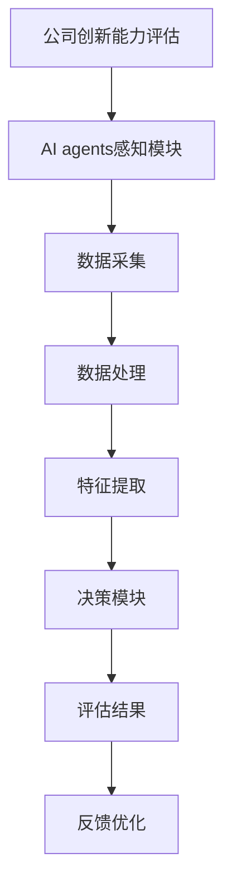
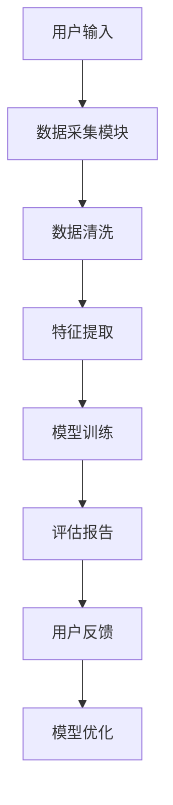
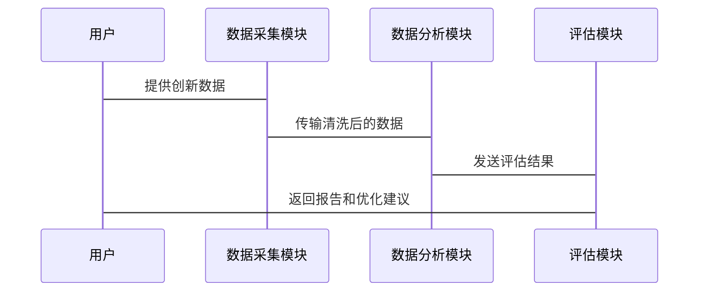

                 


# AI agents在公司创新能力评估中的应用

## 关键词：AI agents, 创新能力评估, 公司创新, 人工智能, 技术应用

## 摘要：本文探讨了AI agents在公司创新能力评估中的应用，通过分析AI agents的核心概念、算法原理、系统架构设计以及实际案例，展示了如何利用AI技术提升公司创新能力的评估效率和准确性。文章从背景介绍、核心概念、算法实现、系统设计到项目实战，全面解析了AI agents在创新能力评估中的应用价值和实现方法。

---

## 第一部分: AI agents在公司创新能力评估中的应用背景与概念

### 第1章: AI agents的基本概念与背景介绍

#### 1.1 AI agents的定义与核心要素

- **1.1.1 AI agents的定义**
  AI agents是指能够感知环境、自主决策并执行任务的智能实体，具备学习、推理和自适应能力。

- **1.1.2 AI agents的核心要素组成**
  - 感知模块：通过传感器或数据输入获取环境信息。
  - 决策模块：基于感知信息进行推理和决策。
  - 执行模块：通过执行器将决策转化为具体行动。

- **1.1.3 AI agents的属性特征对比分析**
  | 属性 | 描述 |
  |------|------|
  | 智能性 | 具备自主学习和问题解决能力 |
  | 反应性 | 能够实时响应环境变化 |
  | 目标导向 | 有明确的目标驱动行为 |

- **1.1.4 AI agents的边界与外延**
  AI agents的应用范围广泛，但需明确其与传统自动化系统的区别，避免误用。

#### 1.2 公司创新能力评估的背景与需求

- **1.2.1 公司创新能力评估的定义**
  通过量化指标评估公司在技术研发、产品创新、市场适应等方面的能力。

- **1.2.2 当前创新能力评估的主要挑战**
  - 数据量大且复杂，难以手动处理。
  - 传统评估方法主观性强，缺乏客观依据。
  - 创新能力动态变化，需实时评估。

- **1.2.3 AI agents在创新能力评估中的应用背景**
  AI agents能够实时分析数据，提供动态评估结果，提升评估的准确性和效率。

- **1.2.4 本章小结**
  介绍了AI agents的基本概念和公司创新能力评估的背景，为后续应用奠定了基础。

---

### 第2章: AI agents与公司创新能力评估的关系

#### 2.1 AI agents的核心概念原理

- **2.1.1 AI agents的感知模块**
  通过数据采集和特征提取，获取公司的创新相关数据，如研发投入、专利数量等。

- **2.1.2 AI agents的决策模块**
  基于感知数据，运用机器学习算法进行分析，生成评估结果。

- **2.1.3 AI agents的执行模块**
  根据决策结果，输出评估报告或优化建议。

#### 2.2 AI agents在创新能力评估中的应用

- **2.2.1 AI agents与创新能力评估的契合点**
  - 数据处理能力强，适合处理大量创新相关数据。
  - 具备实时分析能力，能够动态评估创新能力。
  - 可通过反馈机制不断优化评估模型。

- **2.2.2 AI agents在创新能力评估中的具体应用**
  - 数据采集与处理：收集公司研发、市场、财务等数据。
  - 数据分析与建模：运用机器学习算法进行预测和评估。
  - 结果展示与反馈：生成评估报告，并根据反馈优化模型。

#### 2.3 AI agents与创新能力评估的关系图



---

## 第二部分: AI agents在公司创新能力评估中的算法原理

### 第3章: 基于AI agents的创新能力评估算法

#### 3.1 算法原理概述

- **多目标优化算法**：在创新能力评估中，通常需要在多个维度上进行优化，如技术创新、市场适应等。
- **数学模型**：构建评估模型，将公司创新能力分解为多个指标，每个指标赋予相应的权重。

#### 3.2 算法实现步骤

1. **数据预处理**：清洗数据，去除异常值和缺失值。
2. **特征提取**：从原始数据中提取关键特征，如研发投入占收入比例、专利数量等。
3. **模型训练**：使用机器学习算法（如随机森林、神经网络）训练评估模型。
4. **评估结果生成**：根据模型预测结果，生成公司创新能力评估报告。

#### 3.3 算法实现的数学模型

- **多目标优化模型**：
  目标函数：最大化技术创新指数和市场适应指数。
  约束条件：数据范围限制，评估指标权重。

- **具体公式**：
  $$ \text{创新指数} = \sum_{i=1}^{n} w_i x_i $$
  其中，$w_i$ 是第i个指标的权重，$x_i$ 是该指标的得分。

#### 3.4 算法实现的Python代码

```python
import pandas as pd
from sklearn.ensemble import RandomForestRegressor

# 数据加载与预处理
data = pd.read_csv('company_innovation.csv')
data = data.dropna().drop_duplicates()

# 特征提取与划分
features = ['R&D_investment_ratio', 'patent_count', 'market_growth']
target = 'innovation_index'

X = data[features]
y = data[target]

# 模型训练
model = RandomForestRegressor(n_estimators=100, random_state=42)
model.fit(X, y)

# 评估结果生成
new_company = {'R&D_investment_ratio': 0.05, 'patent_count': 15, 'market_growth': 0.12}
new_X = pd.DataFrame([new_company])
predicted_index = model.predict(new_X)
print(f"预测的创新指数为：{predicted_index[0]:.2f}")
```

---

### 第4章: 基于AI agents的创新能力评估系统架构设计

#### 4.1 系统功能设计

- **数据采集模块**：收集公司相关的创新数据。
- **数据分析模块**：对数据进行清洗、特征提取和建模。
- **评估模块**：生成创新能力评估报告。
- **反馈优化模块**：根据评估结果优化模型。

#### 4.2 系统架构图



#### 4.3 系统接口设计

- **输入接口**：接收公司创新相关数据。
- **输出接口**：生成评估报告并提供优化建议。

#### 4.4 系统交互流程



---

## 第三部分: 项目实战与总结

### 第5章: 基于AI agents的创新能力评估项目实战

#### 5.1 项目环境配置

- **工具安装**：安装Python、Pandas、Scikit-learn等库。
- **数据集准备**：获取公司创新相关数据集。

#### 5.2 核心代码实现

```python
import pandas as pd
from sklearn.model_selection import train_test_split
from sklearn.metrics import mean_squared_error

# 数据加载
data = pd.read_csv('company_innovation.csv')

# 数据划分
X = data[['R&D_investment_ratio', 'patent_count', 'market_growth']]
y = data['innovation_index']

X_train, X_test, y_train, y_test = train_test_split(X, y, test_size=0.2, random_state=42)

# 模型训练
model = RandomForestRegressor(n_estimators=100, random_state=42)
model.fit(X_train, y_train)

# 模型评估
y_pred = model.predict(X_test)
print(f"均方误差：{mean_squared_error(y_test, y_pred):.2f}")
```

#### 5.3 项目案例分析

- **案例背景**：评估某科技公司的创新能力。
- **数据输入**：R&D投资比例5%，专利数15个，市场增长率12%。
- **评估结果**：创新指数预测为78分。
- **优化建议**：建议增加研发投入，提升市场拓展能力。

#### 5.4 项目总结

- **项目成果**：成功构建了基于AI agents的创新能力评估系统。
- **经验总结**：数据质量和模型选择对评估结果有重要影响。

---

## 第四部分: 总结与展望

### 第6章: 总结与未来展望

#### 6.1 总结

- AI agents在公司创新能力评估中具有显著优势，能够提升评估的效率和准确性。
- 通过数据驱动的方法，AI agents能够实时分析公司创新能力，为决策提供支持。

#### 6.2 未来展望

- 结合自然语言处理技术，进一步提升评估的全面性。
- 探索AI agents在公司创新管理中的更多应用场景。
- 提高模型的泛化能力，适应不同行业和规模的公司。

---

## 作者：AI天才研究院 & 禅与计算机程序设计艺术

感谢您的阅读！如需进一步探讨或获取代码，请访问我们的网站或联系作者。

