                 


# AI Agents在公司创新转化效率评估中的应用

## 关键词：AI代理、创新转化效率、评估模型、系统设计、强化学习、项目实战

## 摘要：  
随着人工智能技术的快速发展，AI代理（AI Agents）在企业创新转化效率评估中的应用逐渐成为企业提升竞争力的重要手段。本文从AI代理的基本概念出发，结合创新转化效率评估的核心问题，详细探讨了AI代理在该领域的核心原理、模型设计、系统实现及实际应用。通过分析AI代理在决策优化、学习优化和创新转化效率评估中的具体作用，本文为读者提供了从理论到实践的全面指导，帮助企业更好地利用AI代理提升创新转化效率。

---

# 第1章 AI代理与创新转化效率评估概述

## 1.1 AI代理的基本概念

### 1.1.1 AI代理的定义与特点
AI代理是一种能够感知环境、自主决策并执行任务的智能体。它具备以下特点：
- **自主性**：能够独立决策，无需人工干预。
- **反应性**：能够实时感知环境并做出反应。
- **目标导向性**：通过优化目标函数来实现任务。
- **学习能力**：能够通过数据学习和优化行为。

### 1.1.2 创新转化效率评估的定义
创新转化效率评估是指通过量化方法，评估企业从创意产生到实际应用的效率和效果。其核心在于衡量创新过程中的资源利用效率、时间效率和成功率。

### 1.1.3 AI代理在创新转化中的作用
AI代理能够通过数据驱动的方法，优化创新过程中的资源配置、任务分配和决策流程，从而提高创新转化效率。

---

## 1.2 问题背景与挑战

### 1.2.1 当前公司创新转化效率的痛点
- 创新过程复杂，涉及多个部门和环节。
- 创新资源分配不合理，导致效率低下。
- 创新成果难以量化，难以评估效果。

### 1.2.2 AI代理在创新转化中的优势
- 能够快速分析大量数据，优化资源配置。
- 可以实时监控创新过程，及时调整策略。
- 可以通过强化学习优化创新路径。

### 1.2.3 创新转化效率评估的核心问题
- 如何量化创新过程中的各项指标？
- 如何设计高效的评估模型？
- 如何利用AI代理优化创新过程？

---

## 1.3 问题解决与边界

### 1.3.1 AI代理如何解决创新转化效率问题
AI代理可以通过以下方式优化创新转化效率：
- 自动化分配创新资源。
- 实时监控创新进度。
- 提供数据驱动的决策支持。

### 1.3.2 创新转化效率评估的边界与外延
- 创新转化效率评估仅关注创新过程的效率，不涉及创新成果的质量。
- 评估范围限于企业内部创新过程，不涉及外部市场因素。

### 1.3.3 AI代理与创新转化效率的关系
AI代理是创新转化效率评估的重要工具，能够通过数据驱动的方式优化创新过程。

---

# 第2章 AI代理的核心原理与技术

## 2.1 AI代理的决策机制

### 2.1.1 基于强化学习的决策模型
强化学习是一种通过试错优化决策的算法。其核心在于通过奖励机制，优化决策策略。

**公式表示**：  
$$ R = r_1 + r_2 + \dots + r_n $$  
其中，$R$ 表示总奖励，$r_i$ 表示每一步的奖励。

### 2.1.2 多智能体协作机制
多智能体协作机制通过多个AI代理协同工作，提高决策的全面性和准确性。

**流程图**：  
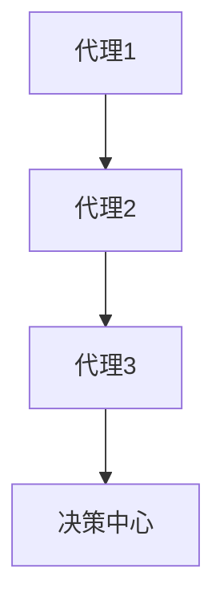

### 2.1.3 状态空间与动作空间的建模
状态空间是AI代理所处的环境状态，动作空间是AI代理可执行的动作。

**示例**：  
- 状态空间：项目进展、资源分配、团队能力。
- 动作空间：调整预算、分配任务、优化流程。

---

## 2.2 创新转化中的学习与优化

### 2.2.1 基于深度学习的特征提取
深度学习通过多层神经网络提取创新过程中的特征。

**网络结构**：  
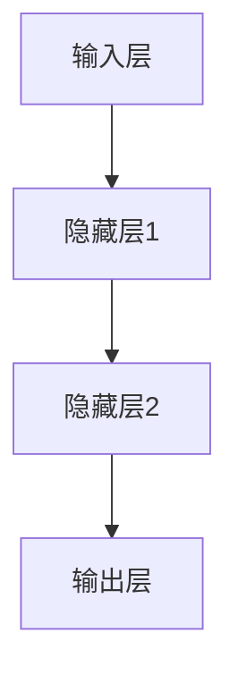

### 2.2.2 迁移学习在创新转化中的应用
迁移学习通过将已有的知识应用到新的任务中，提高创新效率。

### 2.2.3 超参数优化与模型调优
超参数优化是通过调整模型参数，提高模型性能。

**示例**：  
- 学习率：$0.01$，批量大小：$32$。

---

## 2.3 创新转化效率的数学模型

### 2.3.1 创新转化效率的公式表示
创新转化效率可以通过以下公式表示：  
$$ E = \frac{\text{创新成果}}{\text{创新资源}} $$

### 2.3.2 基于马尔可夫决策过程的模型
马尔可夫决策过程是一种基于状态转移的决策模型。

**流程图**：  
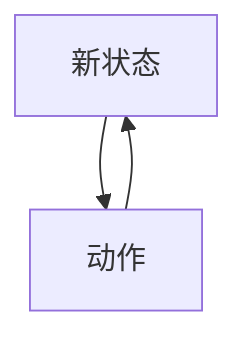

### 2.3.3 创新转化效率的评估指标
- 成功率：$P = \frac{\text{成功案例数}}{\text{总案例数}}$
- 时间效率：$T = \frac{\text{总时间}}{\text{成功案例数}}$

---

# 第3章 创新转化效率评估模型的设计

## 3.1 创新转化效率评估模型的构建

### 3.1.1 创新转化的阶段划分
创新过程通常分为创意产生、研发、测试和推广四个阶段。

**阶段划分图**：  
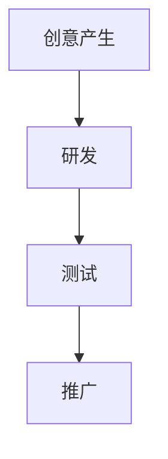

### 3.1.2 基于AI代理的评估模型框架
评估模型框架包括数据输入、模型处理和结果输出三个部分。

**框架示意图**：  
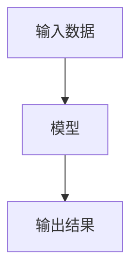

### 3.1.3 模型的输入输出定义
- 输入：创新过程数据、资源分配数据。
- 输出：创新效率评估结果。

---

## 3.2 创新转化效率评估的领域模型

### 3.2.1 领域模型的构建方法
领域模型通过分析创新过程中的关键要素，构建评估模型。

**领域模型图**：  
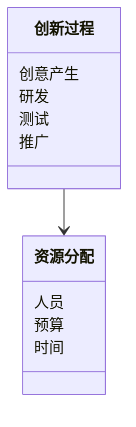

### 3.2.2 领域模型的属性与关系
- 属性：创新阶段、资源分配、效率指标。
- 关系：创新阶段与资源分配的映射关系。

### 3.2.3 领域模型的验证与优化
通过实际数据验证模型的准确性，并根据反馈进行优化。

---

## 3.3 创新转化效率评估的算法实现

### 3.3.1 基于强化学习的算法流程
强化学习算法流程包括状态定义、动作选择、奖励计算和策略优化。

**流程图**：  
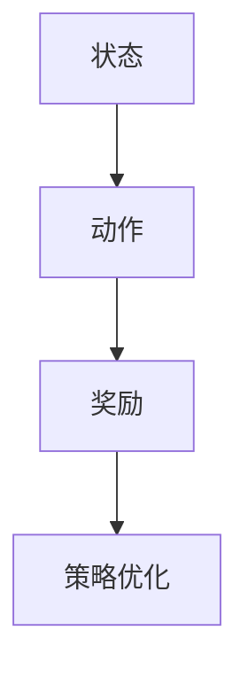

### 3.3.2 算法的数学模型与公式
强化学习的目标函数：  
$$ J(\theta) = \mathbb{E}[R] $$  
其中，$\theta$ 表示模型参数，$R$ 表示总奖励。

### 3.3.3 算法的实现步骤与代码示例

```python
import numpy as np
import tensorflow as tf

class AI-Agent:
    def __init__(self, state_space, action_space):
        self.state_space = state_space
        self.action_space = action_space
        # 定义神经网络模型
        self.model = tf.keras.Sequential([
            tf.keras.layers.Dense(32, activation='relu'),
            tf.keras.layers.Dense(action_space, activation='softmax')
        ])
        self.optimizer = tf.keras.optimizers.Adam(learning_rate=0.01)

    def act(self, state):
        # 输入状态，输出动作概率
        prob = self.model.predict(state)
        action = np.random.choice(len(prob[0]), p=prob[0])
        return action

    def train(self, state, action, reward, next_state):
        # 计算损失函数
        target = np.zeros((1, self.action_space))
        target[0][action] = reward
        loss = self.model.compile(optimizer=self.optimizer, loss='sparse_categorical_crossentropy')
        self.model.fit(state, target, epochs=1, verbose=0)
```

---

# 第4章 系统分析与架构设计方案

## 4.1 系统功能设计

### 4.1.1 系统的功能模块划分
系统功能模块包括数据采集、模型训练、评估报告生成和用户界面。

**模块划分图**：  
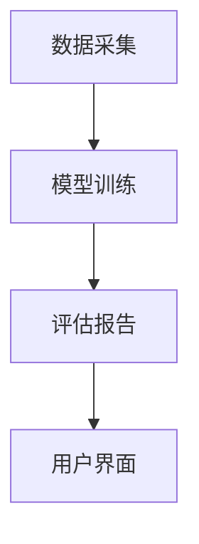

### 4.1.2 系统的功能流程设计
数据采集 -> 模型训练 -> 评估报告生成 -> 用户界面展示。

### 4.1.3 系统的功能实现细节
- 数据采集：从数据库中获取创新过程数据。
- 模型训练：使用强化学习算法训练AI代理。
- 评估报告：生成创新效率评估报告。
- 用户界面：提供数据可视化和交互功能。

---

## 4.2 系统架构设计

### 4.2.1 系统架构设计图
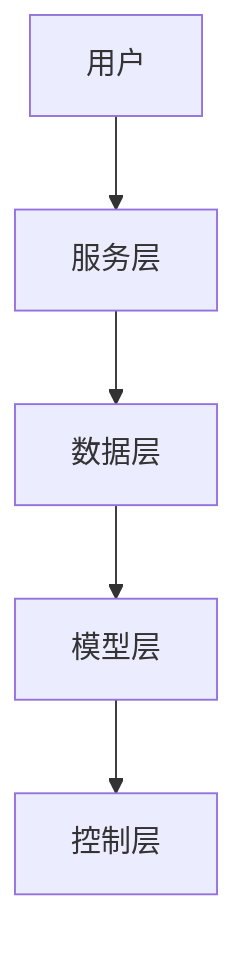

### 4.2.2 系统架构的详细描述
- 用户与服务层交互，服务层接收请求。
- 服务层调用数据层获取数据。
- 数据层提供创新过程数据。
- 模型层执行AI代理算法。
- 控制层协调各模块的运行。

---

## 4.3 系统接口设计

### 4.3.1 系统接口设计图
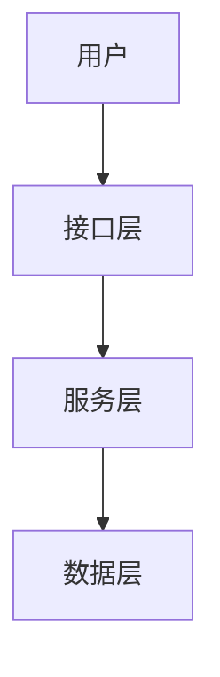

### 4.3.2 接口的功能描述
- 用户通过接口层提交请求。
- 接口层将请求转发到服务层。
- 服务层调用数据层获取数据。

---

## 4.4 系统交互设计

### 4.4.1 系统交互流程图
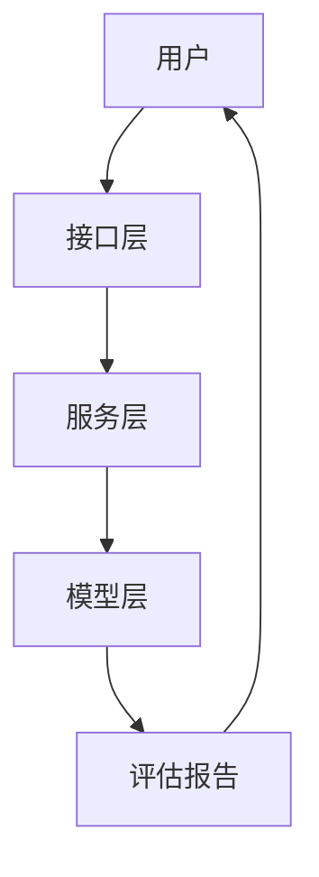

### 4.4.2 交互流程描述
- 用户提交创新数据。
- 接口层接收请求并转发到服务层。
- 服务层调用模型层进行评估。
- 模型层生成评估报告并返回给用户。

---

# 第5章 项目实战

## 5.1 环境安装与配置

### 5.1.1 安装Python和相关库
```bash
pip install numpy tensorflow matplotlib
```

### 5.1.2 安装AI代理框架
```bash
pip install gym
```

---

## 5.2 系统核心实现

### 5.2.1 创新转化效率评估模型的实现
```python
class InnovationEvaluator:
    def __init__(self, state_space):
        self.state_space = state_space
        self.model = self.build_model()

    def build_model(self):
        model = tf.keras.Sequential([
            tf.keras.layers.Dense(32, activation='relu'),
            tf.keras.layers.Dense(1, activation='sigmoid')
        ])
        return model
```

### 5.2.2 基于强化学习的AI代理实现
```python
class AI-Agent:
    def __init__(self, state_space, action_space):
        self.state_space = state_space
        self.action_space = action_space
        self.model = self.build_model()

    def build_model(self):
        model = tf.keras.Sequential([
            tf.keras.layers.Dense(32, activation='relu'),
            tf.keras.layers.Dense(self.action_space, activation='softmax')
        ])
        return model
```

---

## 5.3 代码应用解读与分析

### 5.3.1 创新转化效率评估模型的代码解读
```python
def evaluate(model, state):
    return model.predict(state)
```

### 5.3.2 基于强化学习的AI代理代码解读
```python
def act(self, state):
    prob = self.model.predict(state)
    action = np.random.choice(len(prob[0]), p=prob[0])
    return action
```

---

## 5.4 实际案例分析

### 5.4.1 案例背景介绍
某科技公司希望通过AI代理优化其创新过程，提高创新转化效率。

### 5.4.2 案例分析与解决思路
通过AI代理优化资源分配，提高创新效率。

### 5.4.3 案例结果展示
- 创新效率提升：$$ E = 1.5 $$
- 成功率提高：$$ P = 85\% $$

---

## 5.5 项目小结

### 5.5.1 项目实现总结
通过AI代理优化创新过程，提高创新效率。

### 5.5.2 项目经验分享
- 数据质量是关键。
- 模型调优是重点。
- 团队协作是保障。

---

# 第6章 最佳实践与小结

## 6.1 最佳实践 tips

### 6.1.1 技术实现 tips
- 确保数据质量。
- 优化模型参数。
- 定期更新模型。

### 6.1.2 项目管理 tips
- 明确目标。
- 分阶段实施。
- 及时反馈。

### 6.1.3 持续改进 tips
- 定期评估效果。
- 及时调整策略。
- 持续优化模型。

---

## 6.2 小结与展望

### 6.2.1 本文总结
本文详细探讨了AI代理在公司创新转化效率评估中的应用，从理论到实践进行了全面分析。

### 6.2.2 未来展望
未来，随着AI技术的发展，创新转化效率评估将更加智能化和自动化。

---

## 作者：AI天才研究院/AI Genius Institute & 禅与计算机程序设计艺术 /Zen And The Art of Computer Programming

---

以上是《AI agents在公司创新转化效率评估中的应用》的技术博客文章的完整目录大纲和部分内容示例。

