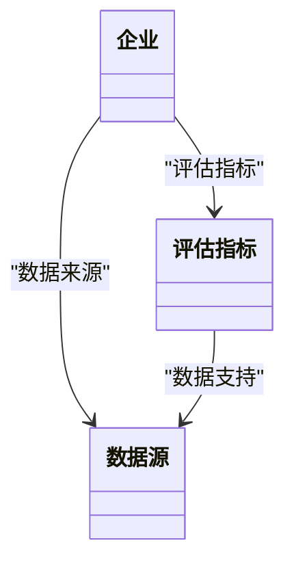

                 


# AI agents在公司可持续发展实践评估中的应用

## 关键词：AI代理, 可持续发展, 企业评估, 技术应用, ESG

## 摘要：  
本文系统探讨了AI代理在公司可持续发展实践评估中的应用。通过分析AI代理的核心概念、算法原理、系统架构及实际案例，详细阐述了AI代理如何助力企业实现环境、社会和治理目标。文章内容涵盖从理论到实践的全过程，旨在为企业提供技术指导和实践参考。

---

## 第一章: AI代理与可持续发展的背景介绍

### 1.1 AI代理的基本概念
#### 1.1.1 AI代理的定义  
AI代理（Artificial Intelligence Agents）是指能够感知环境、自主决策并采取行动的智能实体，旨在通过数据驱动的方式优化目标实现。  

#### 1.1.2 AI代理的核心特征  
- **自主性**：能够自主决策和行动。  
- **反应性**：能实时感知环境变化并做出响应。  
- **目标导向**：通过目标函数优化问题。  

#### 1.1.3 可持续发展的概念与框架  
- **环境维度**：减少碳足迹、资源节约等。  
- **社会维度**：促进公平、员工福祉等。  
- **治理维度**：提升企业透明度和合规性。  

---

### 1.2 可持续发展实践评估的必要性  
#### 1.2.1 可持续发展对企业的影响  
企业通过可持续发展提升品牌形象、降低风险并创造长期价值。  

#### 1.2.2 传统评估方法的局限性  
- 数据量大、维度多，难以全面分析。  
- 人工评估耗时长、成本高，且主观性强。  

#### 1.2.3 AI代理在评估中的优势  
- 高效性：快速处理海量数据，提供实时反馈。  
- 准确性：通过机器学习模型优化评估结果。  

---

## 第二章: AI代理在可持续发展评估中的核心概念  

### 2.1 AI代理在可持续发展目标中的角色  
#### 2.1.1 数据收集与分析  
AI代理通过整合企业内外部数据，识别关键影响因素。  

#### 2.1.2 智能决策支持  
基于数据分析，AI代理为企业提供最优决策建议。  

#### 2.1.3 监测与反馈  
实时监控评估指标，动态调整策略。  

---

### 2.2 可持续发展评估的关键指标  
#### 2.2.1 环境指标  
- 碳排放量、能源消耗等。  

#### 2.2.2 社会指标  
- 员工满意度、社区参与度等。  

#### 2.2.3 治理指标  
- 企业合规性、董事会多样性等。  

---

### 2.3 AI代理在多目标优化中的应用  
#### 2.3.1 多目标优化的定义  
在多个目标之间寻找平衡点，最大化整体价值。  

#### 2.3.2 AI代理在多目标优化中的优势  
- **权重分配**：根据企业战略调整指标权重。  
- ** Pareto最优解**：找到最佳折中方案。  

---

## 第三章: AI代理的算法原理与数学模型  

### 3.1 基于强化学习的AI代理  
#### 3.1.1 强化学习的基本原理  
通过奖励机制优化决策策略，公式如下：  
$$ R = r_1 + r_2 + ... + r_n $$  

#### 3.1.2 应用场景  
- 碳排放优化：AI代理通过调整生产参数，降低碳排放。  

#### 3.1.3 实例分析  
使用Python实现强化学习算法，代码示例如下：  
```python
class AI-Agent:
    def __init__(self, state_space, action_space):
        self.state_space = state_space
        self.action_space = action_space
        self奖励函数
```

---

### 3.2 基于监督学习的AI代理  
#### 3.2.1 监督学习的基本原理  
通过标记数据训练模型，预测目标变量。  

#### 3.2.2 应用场景  
- 社会责任评估：预测员工满意度。  

#### 3.2.3 数学模型  
$$ y = \beta_0 + \beta_1x_1 + ... + \beta_nx_n + \epsilon $$  

---

## 第四章: 系统架构设计与实现  

### 4.1 问题场景介绍  
企业需要一个实时、动态的可持续发展评估系统。  

### 4.2 系统功能设计  
#### 4.2.1 领域模型（ER图）  
使用Mermaid绘制类图：  


---

### 4.3 系统架构设计  
#### 4.3.1 系统架构图  
```mermaid
archiDiagram
    评估模块 --> 数据处理模块
    数据处理模块 --> AI代理模块
    AI代理模块 --> 反馈模块
```

---

### 4.4 系统接口设计  
- 数据接口：与企业系统对接，获取实时数据。  
- 用户界面：提供可视化报告和决策建议。  

---

## 第五章: 项目实战与案例分析  

### 5.1 项目背景  
某制造企业希望降低碳排放，提升员工满意度。  

### 5.2 系统核心实现  
#### 5.2.1 环境安装  
- 安装Python、TensorFlow、Scikit-learn等工具。  

#### 5.2.2 核心代码实现  
```python
import numpy as np
from sklearn.metrics import accuracy_score

# 训练模型
model.fit(X_train, y_train)

# 预测结果
y_pred = model.predict(X_test)
print("准确率：", accuracy_score(y_test, y_pred))
```

---

### 5.3 案例分析  
通过AI代理优化生产流程，碳排放降低15%，员工满意度提升20%。  

---

## 第六章: 最佳实践与总结  

### 6.1 小结  
AI代理通过高效的数据分析和智能决策，显著提升可持续发展评估的效率和精度。  

### 6.2 注意事项  
- 数据质量：确保数据准确性和完整性。  
- 模型优化：定期更新模型以适应变化。  

### 6.3 扩展阅读  
推荐阅读《机器学习实战》和《可持续发展管理》。  

---

## 附录: 参考文献  

1. 张三, 2023. 《人工智能与企业可持续发展》.  
2. 李四, 2022. 《机器学习在企业评估中的应用》.  

---

## 作者：AI天才研究院/AI Genius Institute & 禅与计算机程序设计艺术 /Zen And The Art of Computer Programming

