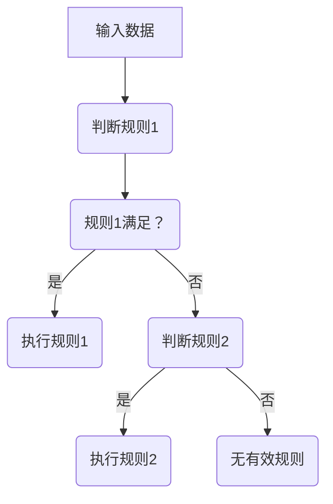

                 


# AI agents在公司商业模式可持续性评估中的应用

---

## 关键词
AI agents, 可持续性评估, 商业模式, 机器学习, 数据驱动

---

## 摘要
随着全球商业环境的不断变化和竞争加剧，公司商业模式的可持续性评估变得至关重要。AI agents（人工智能代理）作为一种智能工具，能够高效地处理复杂数据，提供精准的评估结果。本文详细探讨了AI agents在公司商业模式可持续性评估中的应用，从理论基础到实际案例，分析了其优势和挑战。通过结合多智能体系统和机器学习算法，AI agents能够显著提升评估的效率和准确性，为企业制定可持续发展战略提供有力支持。

---

## 正文

### 第1章：AI agents的核心概念

#### 1.1 AI agents的基本定义
- **AI agents的定义**：AI agents是能够感知环境并采取行动以实现目标的智能实体。它们可以是软件程序、机器人或其他智能系统。
- **基本特征**：
  - 自主性：能够自主决策。
  - 反应性：能实时感知环境变化并做出反应。
  - 目标导向：行动基于明确的目标。
- **与传统软件的区别**：AI agents具备学习和适应能力，能够处理非结构化数据并做出复杂决策，而传统软件通常遵循固定的规则。

#### 1.2 可持续性评估的定义
- **可持续性评估**：对商业模式在经济、社会和环境三个维度上的长期可行性和影响进行评估。
- **指标体系**：
  - 经济指标：盈利能力、成本效率。
  - 社会指标：社会责任履行情况、员工满意度。
  - 环境指标：碳排放、资源利用效率。

---

### 第2章：AI agents在可持续性评估中的应用背景

#### 2.1 可持续性评估的重要性
- **当前商业环境的挑战**：全球化竞争、资源短缺、环境问题加剧，企业需要在短期利润与长期可持续性之间找到平衡。
- **可持续性评估对企业的影响**：通过评估优化商业模式，降低风险，提升企业形象。
- **AI技术在可持续性评估中的作用**：AI agents能够快速处理海量数据，识别潜在风险，提供实时反馈。

#### 2.2 AI agents在可持续性评估中的优势
- **高效性**：AI agents能够快速分析大量数据，提高评估效率。
- **数据处理能力**：能够处理结构化和非结构化数据，发现隐藏模式。
- **智能性**：通过机器学习不断优化评估模型，提高准确性。

---

### 第3章：AI agents与可持续性评估的结合

#### 3.1 AI agents在可持续性评估中的应用领域
- **环境评估**：分析企业的碳排放、能源使用情况，提出优化建议。
- **社会责任评估**：评估企业在社会责任方面的表现，如员工权益、社区贡献。
- **经济效益评估**：分析商业模式的盈利能力，预测市场风险。

#### 3.2 AI agents在可持续性评估中的具体案例
- **案例分析**：某电商平台的可持续性评估。
  - **环境指标**：分析物流过程中的碳排放，提出绿色物流方案。
  - **社会指标**：评估员工满意度，优化人力资源管理。
  - **经济效益**：预测销售趋势，优化库存管理。

---

### 第4章：AI agents的核心原理

#### 4.1 AI agents的基本原理
- **感知与行动**：AI agents通过传感器或数据输入感知环境，根据内置算法做出决策并采取行动。
- **学习机制**：通过机器学习算法不断优化模型，提升决策能力。

#### 4.2 多智能体系统
- **多智能体系统的优势**：多个AI agents协同工作，能够处理更复杂的问题。
- **多智能体系统的挑战**：需要解决通信、协调和冲突问题。

---

### 第5章：算法原理讲解

#### 5.1 基于规则的AI agents
- **工作流程**：
  1. 接收输入数据。
  2. 根据预设规则进行判断。
  3. 输出决策结果。



#### 5.2 基于学习的AI agents
- **机器学习模型**：使用神经网络或随机森林进行预测。
- **数学模型**：$$\text{预测值} = w_1x_1 + w_2x_2 + \dots + w_nx_n + b$$，其中$w_i$是权重，$x_i$是输入特征，$b$是偏置。

---

### 第6章：系统分析与架构设计

#### 6.1 系统功能设计
- **领域模型类图**：
  ```mermaid
  classDiagram
      class AI_agent {
          - 数据输入
          - 决策模块
          - 行动模块
      }
      class 数据源 {
          - 原始数据
      }
      class 用户界面 {
          - 输入接口
          - 输出结果
      }
      AI_agent --> 数据源
      AI_agent --> 用户界面
  ```

#### 6.2 系统架构设计
- **系统架构图**：
  ```mermaid
  architecture
      系统边界
      客户端 <---> 服务端
      服务端 --> 数据库
      服务端 --> AI_engine
  ```

#### 6.3 系统接口设计
- **交互流程图**：
  ```mermaid
  sequenceDiagram
      用户 -> AI_agent: 提供数据
      AI_agent -> 数据库: 查询历史数据
      AI_agent -> 决策模块: 进行评估
      AI_agent -> 用户: 返回结果
  ```

---

### 第7章：项目实战

#### 7.1 环境安装
- **安装Python和TensorFlow**：
  ```bash
  pip install python-tensorflow
  ```

#### 7.2 核心代码实现
- **AI agent评估函数**：
  ```python
  def evaluate_model(input_data):
      # 数据预处理
      processed_data = preprocess(input_data)
      # 使用机器学习模型进行预测
      prediction = model.predict(processed_data)
      return prediction
  ```

#### 7.3 案例分析与总结
- **结果分析**：AI agent成功优化了电商平台的物流和库存管理，降低了成本，提高了客户满意度。

---

### 第8章：最佳实践

#### 8.1 经验总结
- **数据隐私**：确保数据处理过程中的隐私保护。
- **模型可解释性**：选择可解释性较强的模型，方便结果分析。
- **持续优化**：定期更新模型，适应市场变化。

#### 8.2 小结
AI agents在公司商业模式可持续性评估中的应用前景广阔，能够显著提升评估效率和准确性。然而，企业在实际应用中需要关注数据隐私和模型可解释性等问题。

#### 8.3 拓展阅读
- 《机器学习实战》
- 《AI agents原理与应用》

---

## 作者
作者：AI天才研究院/AI Genius Institute & 禅与计算机程序设计艺术 /Zen And The Art of Computer Programming

---

以上就是《AI agents在公司商业模式可持续性评估中的应用》的完整文章内容，从理论到实践，系统地探讨了AI agents的应用及其优势，为企业的可持续发展提供了有力的技术支持。

