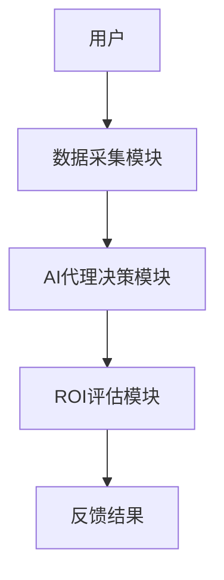

                 


# AI agents在公司数字化转型ROI评估中的应用

> 关键词：AI代理，数字化转型，ROI评估，投资回报率，人工智能，企业数字化

> 摘要：本文深入探讨了AI代理在公司数字化转型中的应用，特别是在ROI（投资回报率）评估中的重要性。文章从AI代理的核心原理、数字化转型的定义与目标、AI代理在ROI评估中的具体应用、系统架构设计、数学模型、项目实战等多个方面进行详细分析。通过结合理论与实践，本文为读者提供了一套完整的AI代理驱动的ROI评估框架，帮助企业在数字化转型中实现更高效、更精准的投资回报分析。

---

# 引言

在数字化转型的浪潮中，企业面临着前所未有的机遇与挑战。如何通过技术创新提升效率、降低成本、优化决策，成为企业在竞争中取胜的关键。AI代理作为一种新兴的技术工具，正在成为企业数字化转型的重要推动力。本文将从AI代理的核心原理、数字化转型的定义与目标、AI代理在ROI（投资回报率）评估中的具体应用、系统架构设计、数学模型、项目实战等多个方面进行详细分析。

---

# 第1章: AI代理与数字化转型概述

## 1.1 AI代理的基本概念

### 1.1.1 什么是AI代理

AI代理（Artificial Intelligence Agent，简称AI Agent）是一种能够感知环境、自主决策并执行任务的智能实体。它可以是一个软件程序、一个机器人，甚至是一个智能系统。AI代理的核心特征是其能够根据环境反馈自主调整行为，以实现预定目标。

### 1.1.2 AI代理的类型

AI代理可以根据功能和应用场景分为多种类型：

- **简单反射代理**：基于固定的规则执行任务，适用于环境简单、任务明确的场景。
- **基于模型的反射代理**：能够根据环境信息构建模型，并根据模型进行决策。
- **目标驱动代理**：具有明确的目标，能够主动规划行为以实现目标。
- **效用驱动代理**：通过最大化效用函数来优化决策。

### 1.1.3 AI代理的核心特征

AI代理的核心特征包括：

1. **自主性**：能够自主决策，无需人工干预。
2. **反应性**：能够感知环境变化并实时调整行为。
3. **目标导向性**：具有明确的目标，并能够优化行为以实现目标。
4. **学习能力**：能够通过经验或数据不断优化自身性能。

## 1.2 数字化转型的定义与目标

### 1.2.1 数字化转型的定义

数字化转型是指通过信息技术和数据的整合，优化企业业务流程、提升效率、降低成本，并实现业务模式的创新。数字化转型不仅仅是技术的升级，更是对企业战略、组织结构、文化等全方位的变革。

### 1.2.2 数字化转型的主要目标

数字化转型的主要目标包括：

1. **提升效率**：通过自动化和智能化手段，优化业务流程。
2. **降低成本**：减少人工干预，降低运营成本。
3. **增强客户体验**：通过数据分析和个性化服务，提升客户满意度。
4. **创新业务模式**：探索新的商业模式，如订阅制、共享经济等。

### 1.2.3 数字化转型的关键成功因素

成功的数字化转型需要企业在以下方面具备优势：

- **数据驱动**：企业能够充分利用数据进行决策。
- **技术创新**：具备先进的技术能力和创新精神。
- **组织文化**：企业内部具备支持数字化转型的文化和组织结构。

## 1.3 AI代理在数字化转型中的作用

### 1.3.1 AI代理如何推动数字化转型

AI代理在数字化转型中的作用主要体现在以下几个方面：

- **自动化**：通过AI代理实现业务流程的自动化，减少人工干预。
- **智能化**：AI代理能够根据环境反馈自主调整行为，提升决策效率。
- **数据驱动**：AI代理能够实时采集和分析数据，为企业提供精准的决策支持。

### 1.3.2 AI代理在企业中的应用场景

AI代理在企业中的应用场景包括：

- **客户服务**：通过智能客服代理为客户提供24/7的在线支持。
- **供应链管理**：AI代理可以实时监控供应链状态，优化库存管理。
- **市场营销**：通过AI代理进行精准营销，提升客户转化率。
- **风险管理**：AI代理可以实时监控企业运营中的风险点，提前预警。

### 1.3.3 AI代理对ROI评估的影响

AI代理对ROI（投资回报率）评估的影响主要体现在以下几个方面：

- **提升效率**：AI代理能够快速处理大量数据，缩短 ROI 计算时间。
- **优化决策**：通过AI代理提供的数据分析结果，企业能够做出更明智的投资决策。
- **降低成本**：AI代理能够减少人工干预，降低运营成本，从而提高 ROI。

---

# 第2章: AI代理的核心原理

## 2.1 AI代理的架构与工作原理

### 2.1.1 AI代理的典型架构

AI代理的典型架构包括以下几个部分：

- **感知层**：负责采集环境数据。
- **决策层**：负责根据感知数据进行决策。
- **执行层**：负责执行决策结果。

### 2.1.2 AI代理的核心工作流程

AI代理的核心工作流程如下：

1. **感知环境**：通过传感器或其他数据源采集环境数据。
2. **处理数据**：对采集到的数据进行预处理和分析。
3. **制定决策**：基于分析结果制定行动计划。
4. **执行行动**：根据决策结果执行相应的任务。
5. **反馈优化**：根据执行结果反馈优化决策模型。

### 2.1.3 AI代理与传统自动化系统的区别

AI代理与传统自动化系统的区别主要体现在以下几个方面：

- **自主性**：AI代理具有自主决策能力，而传统自动化系统需要人工干预。
- **学习能力**：AI代理能够通过经验优化性能，而传统自动化系统无法自我优化。
- **适应性**：AI代理能够根据环境变化调整行为，而传统自动化系统仅能执行预设任务。

## 2.2 AI代理的感知与决策机制

### 2.2.1 感知层：数据采集与处理

AI代理的感知层负责采集环境数据，包括：

- **数据采集**：通过传感器、API接口等方式获取数据。
- **数据预处理**：对采集到的数据进行清洗、归一化等处理。
- **数据存储**：将处理后的数据存储到数据库中。

### 2.2.2 决策层：基于AI的决策逻辑

AI代理的决策层负责根据感知数据制定行动计划，包括：

- **特征提取**：从数据中提取关键特征。
- **模型训练**：基于训练数据训练AI模型。
- **决策推理**：根据模型推理结果制定行动计划。

### 2.2.3 执行层：任务执行与反馈

AI代理的执行层负责执行决策结果，并将反馈信息传递给感知层。

## 2.3 AI代理的训练与优化

### 2.3.1 数据训练方法

AI代理的训练方法包括：

- **监督学习**：基于标注数据进行训练。
- **无监督学习**：基于未标注数据进行训练。
- **强化学习**：通过与环境互动进行训练。

### 2.3.2 算法优化策略

AI代理的优化策略包括：

- **模型调参**：通过调整模型参数优化性能。
- **算法迭代**：不断迭代算法以提升性能。
- **经验回放**：通过回放历史经验优化决策。

### 2.3.3 模型迭代与更新

AI代理的模型迭代与更新包括：

- **在线学习**：实时更新模型。
- **离线训练**：定期离线训练模型。
- **模型融合**：将多个模型的结果进行融合，提升性能。

---

# 第3章: 数字化转型中的ROI评估框架

## 3.1 ROI评估的基本概念

### 3.1.1 什么是ROI

ROI（投资回报率）是衡量投资项目盈利能力的重要指标。ROI的计算公式为：

$$ ROI = \frac{净收益}{投资成本} \times 100\% $$

其中，净收益等于总收入减去总成本。

### 3.1.2 ROI评估的常见方法

常见的ROI评估方法包括：

- **净现值法**：计算投资项目的净现值。
- **内部收益率法**：计算投资项目的内部收益率。
- **回收期法**：计算投资回收期。

### 3.1.3 ROI在企业中的重要性

ROI在企业中的重要性体现在以下几个方面：

- **投资决策**：企业可以通过ROI评估决定是否投资某个项目。
- **项目优先级**：企业可以根据ROI评估确定项目的优先级。
- **绩效考核**：企业可以通过ROI评估对项目的绩效进行考核。

## 3.2 数字化转型中的ROI评估指标

### 3.2.1 业务指标

业务指标包括：

- **收入增长**：投资项目对企业收入的贡献。
- **成本降低**：投资项目对企业成本的节约。
- **客户满意度**：投资项目对客户满意度的提升。

### 3.2.2 成本指标

成本指标包括：

- **初始投资成本**：项目的初期投入。
- **运营成本**：项目的日常运营成本。
- **维护成本**：项目的维护和升级成本。

### 3.2.3 时间效率指标

时间效率指标包括：

- **项目周期**：从投资到收回成本的时间周期。
- **决策时间**：项目决策的效率。
- **执行时间**：项目执行的速度。

## 3.3 AI代理在ROI评估中的应用

### 3.3.1 AI代理如何优化ROI计算

AI代理可以通过以下方式优化ROI计算：

- **数据采集**：实时采集投资项目的各项数据，提高计算的准确性。
- **数据分析**：通过AI算法分析数据，发现潜在的优化点。
- **预测模型**：利用AI代理建立预测模型，预测投资项目的未来表现。

### 3.3.2 AI代理在ROI预测中的作用

AI代理在ROI预测中的作用包括：

- **实时预测**：基于实时数据进行预测，提高预测的准确性。
- **动态调整**：根据环境变化动态调整预测模型，适应市场变化。
- **多维度分析**：从多个维度对投资项目进行分析，提供全面的预测结果。

### 3.3.3 AI代理对ROI提升的具体案例

一个具体的案例是某企业通过AI代理优化其供应链管理。AI代理通过实时监控供应链数据，预测库存需求，优化采购计划，从而降低了库存成本，提高了 ROI。

---

# 第4章: AI代理在数字化转型中的系统架构设计

## 4.1 系统架构概述

AI代理在数字化转型中的系统架构包括以下几个部分：

- **数据采集模块**：负责采集环境数据。
- **AI代理决策模块**：负责根据数据制定决策。
- **ROI评估模块**：负责计算投资回报率。

### 4.1.1 系统整体架构

系统整体架构如下：


## 4.2 系统功能设计

### 4.2.1 数据采集模块

数据采集模块的功能包括：

- **数据采集**：通过传感器、API接口等方式采集数据。
- **数据预处理**：对采集到的数据进行清洗、归一化等处理。
- **数据存储**：将处理后的数据存储到数据库中。

### 4.2.2 AI代理决策模块

AI代理决策模块的功能包括：

- **特征提取**：从数据中提取关键特征。
- **模型训练**：基于训练数据训练AI模型。
- **决策推理**：根据模型推理结果制定行动计划。

### 4.2.3 ROI评估模块

ROI评估模块的功能包括：

- **数据采集**：采集投资项目的各项数据。
- **数据分析**：通过AI算法分析数据，计算投资回报率。
- **结果输出**：输出ROI评估结果。

## 4.3 系统交互流程

### 4.3.1 用户请求处理流程

用户请求处理流程如下：

1. 用户向系统提交投资项目的各项数据。
2. 系统通过数据采集模块采集环境数据。
3. 系统通过AI代理决策模块进行决策。
4. 系统通过ROI评估模块计算投资回报率。
5. 系统将结果反馈给用户。

### 4.3.2 决策模块工作流程

决策模块工作流程如下：

1. 数据采集模块采集环境数据。
2. 数据预处理模块对数据进行处理。
3. 模型训练模块基于处理后的数据训练AI模型。
4. 决策推理模块根据模型推理结果制定行动计划。

### 4.3.3 ROI评估与反馈流程

ROI评估与反馈流程如下：

1. 投资项目数据采集模块采集投资项目的各项数据。
2. 数据分析模块通过AI算法分析数据。
3. ROI评估模块计算投资回报率。
4. 系统将结果反馈给用户。

## 4.4 系统架构图（Mermaid）



---

# 第5章: AI代理与ROI评估的数学模型

## 5.1 ROI计算的基本公式

ROI的基本计算公式为：

$$ ROI = \frac{净收益}{投资成本} \times 100\% $$

其中，净收益等于总收入减去总成本。

## 5.2 AI代理对ROI的影响模型

AI代理对ROI的影响模型可以通过以下公式表示：

$$ E = \frac{传统方法效率}{AI代理效率} $$

其中，E表示效率提升倍数。

## 5.3 基于AI代理的ROI预测模型

基于AI代理的ROI预测模型可以通过以下步骤建立：

1. **数据采集**：采集投资项目的各项数据。
2. **数据预处理**：对数据进行清洗和归一化处理。
3. **模型训练**：基于训练数据训练AI模型。
4. **模型推理**：根据模型预测投资项目的未来表现。
5. **ROI计算**：根据预测结果计算投资回报率。

---

# 第6章: 项目实战

## 6.1 环境安装

项目实战需要以下环境：

- **Python**：3.6+
- **深度学习框架**：TensorFlow或PyTorch
- **AI代理框架**：如OpenAI的Python库
- **数据处理工具**：Pandas、NumPy

## 6.2 核心实现源代码

以下是AI代理在ROI评估中的核心实现代码：

```python
import numpy as np
import pandas as pd
import tensorflow as tf

# 数据预处理
def preprocess_data(data):
    # 数据清洗
    data = data.dropna()
    # 数据归一化
    data = (data - data.min()) / (data.max() - data.min())
    return data

# 模型训练
def train_model(X_train, y_train):
    model = tf.keras.Sequential([
        tf.keras.layers.Dense(64, activation='relu'),
        tf.keras.layers.Dense(1, activation='sigmoid')
    ])
    model.compile(optimizer='adam', loss='binary_crossentropy', metrics=['accuracy'])
    model.fit(X_train, y_train, epochs=10, batch_size=32)
    return model

# 模型推理
def predictROI(model, X_test):
    predictions = model.predict(X_test)
    return predictions

# ROI计算
def calculate_ROI(predictions, cost):
    ROI = (predictions * 100) - cost
    return ROI

# 主函数
def main():
    # 数据加载
    data = pd.read_csv('investment_data.csv')
    # 数据预处理
    processed_data = preprocess_data(data)
    # 数据分割
    X_train = processed_data.iloc[:700, :-1]
    y_train = processed_data.iloc[:700, -1]
    X_test = processed_data.iloc[700:, :-1]
    y_test = processed_data.iloc[700:, -1]
    # 模型训练
    model = train_model(X_train, y_train)
    # 模型推理
    predictions = predictROI(model, X_test)
    # ROI计算
    ROI = calculate_ROI(predictions, 50)
    print("预测的ROI为：", ROI)

if __name__ == "__main__":
    main()
```

---

# 第7章: 总结与展望

## 7.1 本章小结

本文深入探讨了AI代理在公司数字化转型中的应用，特别是在ROI评估中的重要性。通过分析AI代理的核心原理、数字化转型的定义与目标、AI代理在ROI评估中的具体应用、系统架构设计、数学模型、项目实战等多个方面，本文为读者提供了一套完整的AI代理驱动的ROI评估框架。

## 7.2 未来展望

未来，随着AI技术的不断发展，AI代理在数字化转型中的应用将更加广泛。以下是未来的发展方向：

1. **强化学习**：通过强化学习进一步优化AI代理的决策能力。
2. **多代理协作**：研究多代理协作机制，提升系统的整体性能。
3. **边缘计算**：将AI代理部署到边缘设备，实现更高效的实时计算。
4. **人机协作**：研究人机协作模式，提升AI代理的可解释性和透明度。

---

# 作者

作者：AI天才研究院（AI Genius Institute） & 禅与计算机程序设计艺术（Zen And The Art of Computer Programming）

---

# 结语

通过本文的详细分析，读者可以全面了解AI代理在公司数字化转型中的应用，并掌握如何利用AI代理优化ROI评估。希望本文能够为企业的数字化转型提供有价值的参考和指导。

