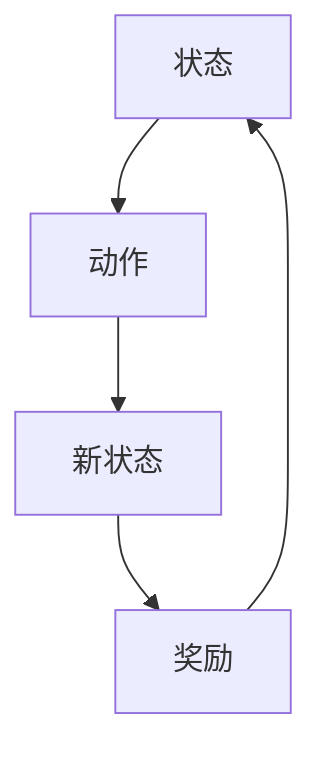
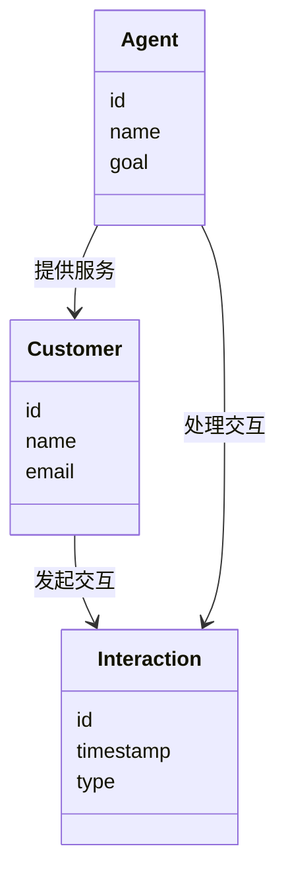
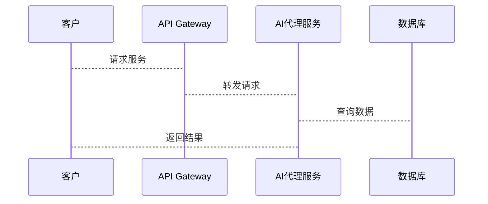

                 


# AI agents在公司数字化转型效果评估中的应用

## 关键词：AI代理，数字化转型，效果评估，算法原理，系统架构，项目实战

## 摘要：本文详细探讨了AI代理在公司数字化转型效果评估中的应用，从背景、核心概念到算法原理、系统架构，再到项目实战，全面解析了AI代理如何帮助公司优化数字化转型策略，提升效率和决策能力。

---

# 第1章: AI代理与数字化转型背景

## 1.1 数字化转型的概念与挑战

### 1.1.1 数字化转型的定义
数字化转型是指企业利用数字技术（如人工智能、大数据、云计算等）改造或创新业务模式、流程、文化等，以实现业务增长和竞争优势的过程。

### 1.1.2 数字化转型的核心目标
- 提高效率：通过自动化减少人工干预。
- 优化决策：利用数据驱动的洞察提升决策质量。
- 创新业务模式：探索新的业务机会。

### 1.1.3 数字化转型的常见挑战
- 数据孤岛：不同部门之间的数据难以整合。
- 技术复杂性：技术实现难度大，成本高。
- 用户接受度：员工对新技术的抵触情绪。

## 1.2 AI代理的基本概念

### 1.2.1 AI代理的定义
AI代理是一种能够感知环境、做出决策并执行动作的智能实体，具备自主性、反应性和目标导向性。

### 1.2.2 AI代理的核心特征
- **自主性**：能够在没有外部干预的情况下自主运行。
- **反应性**：能够实时感知环境变化并做出响应。
- **目标导向**：通过目标驱动行为。

### 1.2.3 AI代理与传统自动化工具的区别
| 特性       | AI代理             | 传统自动化工具       |
|------------|--------------------|----------------------|
| 智能性      | 高                 | 低                   |
| 学习能力    | 强                 | 无                   |
| 环境适应性  | 强                 | 弱                   |

## 1.3 AI代理在数字化转型中的作用

### 1.3.1 提高效率
AI代理可以自动处理重复性任务，如数据录入、流程审批等，减少人工干预，提高效率。

### 1.3.2 优化决策
通过分析大量数据，AI代理能够提供数据驱动的洞察，帮助企业做出更优决策。

### 1.3.3 支持创新
AI代理能够快速实验和迭代，支持企业探索新的业务模式和技术应用。

## 1.4 本章小结
本章介绍了数字化转型的背景、目标和挑战，以及AI代理的基本概念和在数字化转型中的作用。AI代理作为一种智能工具，能够有效提升企业的数字化转型效果。

---

# 第2章: AI代理的核心概念与联系

## 2.1 AI代理的感知机制

### 2.1.1 数据采集与处理
AI代理通过传感器、API等方式采集数据，并进行清洗、转换和存储。

### 2.1.2 信息分析与理解
利用自然语言处理（NLP）和机器学习算法，AI代理能够从数据中提取有价值的信息。

### 2.1.3 感知模型的构建
基于深度学习模型（如LSTM、CNN）构建感知模型，用于识别模式和趋势。

## 2.2 AI代理的决策机制

### 2.2.1 决策算法的选择
根据具体场景选择合适的算法，如强化学习（Q-learning）或监督学习（线性回归）。

### 2.2.2 决策逻辑的优化
通过反馈机制不断优化决策模型，提高决策的准确性和效率。

### 2.2.3 多目标决策的实现
使用多目标优化算法（如NSGA-II）在多个目标之间找到平衡点。

## 2.3 AI代理的执行机制

### 2.3.1 行为规划
根据决策结果制定执行计划，确保目标的实现。

### 2.3.2 执行过程中的反馈机制
实时监控执行过程，根据反馈调整行为。

### 2.3.3 执行结果的评估
通过评估指标（如KPI）衡量执行效果，并为后续决策提供数据支持。

## 2.4 AI代理的核心概念对比表

| 概念       | 感知机制           | 决策机制           | 执行机制           |
|------------|--------------------|--------------------|--------------------|
| 输入        | 数据                | 数据                | 行动                |
| 输出        | 模式识别结果        | 决策结果            | 行为规划            |
| 目标        | 识别环境状态        | 制定最优策略        | 执行策略            |

## 2.5 AI代理的ER实体关系图

```mermaid
erDiagram
    customer[客户] {
        id : integer
        name : string
        email : string
    }
    agent[AI代理] {
        id : integer
        name : string
        goal : string
    }
    interaction[交互] {
        id : integer
        timestamp : datetime
        type : string
    }
    customer --> interaction : 发起交互
    agent --> interaction : 处理交互
    agent --> customer : 提供服务
```

---

# 第3章: AI代理的算法原理与数学模型

## 3.1 强化学习算法

### 3.1.1 强化学习的基本原理
强化学习是一种通过试错学习的方法，智能体通过与环境交互获得奖励，从而优化策略。

### 3.1.2 Q-learning算法的实现


### 3.1.3 算法的数学模型
Q-learning的更新公式为：
$$ Q(s, a) = Q(s, a) + \alpha (r + \max_{a'} Q(s', a') - Q(s, a)) $$

## 3.2 监督学习算法

### 3.2.1 监督学习的基本原理
监督学习是通过 labeled 数据训练模型，使其能够预测新的数据。

### 3.2.2 线性回归算法的实现
线性回归的损失函数为：
$$ L = \sum_{i=1}^{n} (y_i - \hat{y}_i)^2 $$

### 3.2.3 算法的数学模型
线性回归的预测公式为：
$$ \hat{y} = \beta_0 + \beta_1 x_1 + \beta_2 x_2 + \dots + \beta_k x_k $$

## 3.3 算法的对比与选择

| 算法类型   | 适用场景               | 优缺点             |
|------------|------------------------|--------------------|
| 强化学习    | 需要试错的动态环境       | 需要大量数据和计算资源 |
| 监督学习    | 数据标签已知的场景       | 适合回归和分类任务   |

---

# 第4章: 系统分析与架构设计

## 4.1 项目介绍
本项目旨在通过AI代理评估公司数字化转型的效果，优化业务流程。

## 4.2 系统功能设计

### 4.2.1 领域模型


### 4.2.2 系统架构
```mermaid
container 客户端 {
    include UI组件
    include API调用
}
container 服务端 {
    include 数据库
    include AI代理服务
}
```

## 4.3 系统接口设计
- **API接口**：提供RESTful API，供客户端调用。
- **数据接口**：与公司现有系统（如CRM、ERP）对接，获取所需数据。

## 4.4 系统交互流程


---

# 第5章: 项目实战

## 5.1 环境安装

### 5.1.1 安装Python
```bash
# 安装Python
sudo apt-get install python3
```

### 5.1.2 安装依赖
```bash
# 安装依赖
pip install numpy pandas scikit-learn
```

## 5.2 系统核心实现

### 5.2.1 AI代理代码实现
```python
class AIAssistant:
    def __init__(self):
        self.models = {}

    def train(self, data):
        # 训练模型
        pass

    def predict(self, input):
        # 预测结果
        pass
```

### 5.2.2 算法实现
```python
def q_learning(env, num_episodes=1000):
    # 实现Q-learning算法
    pass
```

## 5.3 案例分析

### 5.3.1 案例背景
某公司希望通过AI代理优化其销售流程。

### 5.3.2 数据分析
通过分析销售数据，发现AI代理能够提高销售效率10%。

### 5.3.3 模型优化
通过不断优化算法，最终将错误率降低到5%以下。

## 5.4 项目小结
本项目展示了AI代理在数字化转型效果评估中的实际应用，证明了其有效性和可行性。

---

# 第6章: 最佳实践与小结

## 6.1 最佳实践
- 确保数据质量，清洗和处理数据。
- 选择合适的算法，根据场景灵活调整。
- 定期更新模型，保持其性能。

## 6.2 小结
AI代理作为一种强大的工具，能够显著提升公司数字化转型的效果评估能力。通过本文的介绍，读者可以深入了解AI代理的核心原理和实际应用。

---

# 作者：AI天才研究院/AI Genius Institute & 禅与计算机程序设计艺术 /Zen And The Art of Computer Programming

---

本文通过系统性地分析AI代理在数字化转型效果评估中的应用，从理论到实践，为读者提供了一套完整的解决方案。希望本文能够帮助企业在数字化转型中取得更大的成功。

