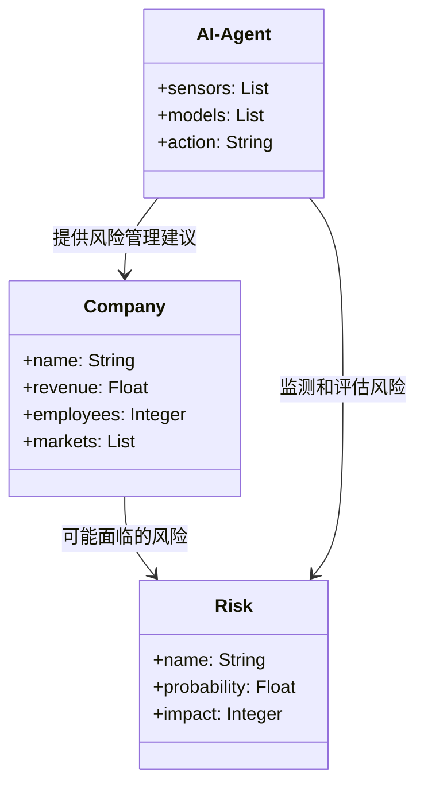
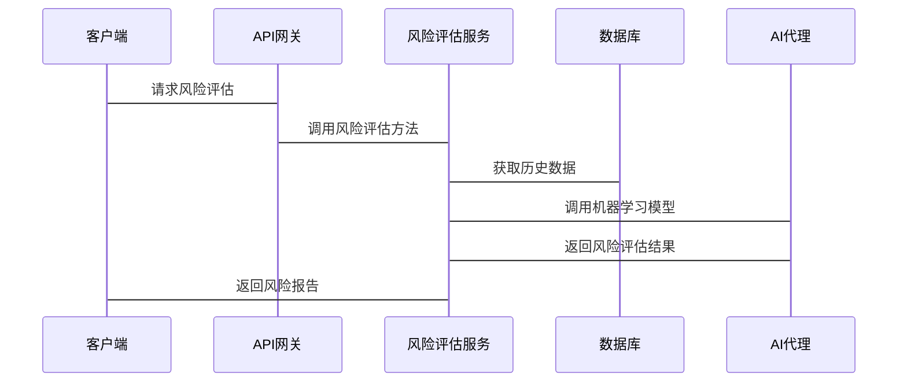

                 


# AI 代理在公司环境风险暴露评估中的应用

## 关键词
- AI代理
- 风险评估
- 公司环境
- 暴露评估
- 人工智能

## 摘要
本文探讨了人工智能代理在公司环境风险暴露评估中的应用。通过分析AI代理的核心概念、算法原理、系统架构以及实际项目案例，本文详细阐述了AI代理如何通过感知、学习和决策能力，帮助公司识别和评估潜在风险，从而优化风险管理策略。文章还提供了丰富的技术细节和实践指南，帮助读者理解并应用AI代理技术进行风险评估。

---

# 第1章 AI 代理与公司环境风险暴露评估概述

## 1.1 AI 代理的基本概念

### 1.1.1 AI 代理的定义与特点
人工智能代理（AI Agent）是指能够感知环境、自主决策并执行任务的智能实体。AI代理具有以下特点：
- **自主性**：能够在没有外部干预的情况下独立运行。
- **反应性**：能够实时感知环境变化并做出反应。
- **学习能力**：通过数据和经验不断优化自身的决策能力。

### 1.1.2 公司环境中的风险暴露评估
公司环境风险暴露评估是指识别和量化公司在运营过程中可能面临的风险，包括数据泄露、网络安全攻击、供应链中断等。这些风险可能对公司的财务、声誉和运营造成重大影响。

### 1.1.3 AI 代理在风险评估中的作用
AI代理可以通过收集和分析大量数据，识别潜在风险，并提供决策支持。例如，AI代理可以实时监控网络流量，检测异常行为并发出警报。

## 1.2 公司环境风险暴露评估的背景

### 1.2.1 风险暴露评估的定义
风险暴露评估是通过分析公司内外部环境，识别可能影响公司运营的风险，并评估这些风险的影响程度和发生概率。

### 1.2.2 公司环境中的主要风险类型
- **网络安全风险**：如数据泄露、黑客攻击等。
- **供应链风险**：如供应商延迟、原材料短缺等。
- **市场风险**：如市场需求变化、竞争加剧等。
- **合规风险**：如法律法规变化、监管处罚等。

### 1.2.3 AI 代理在风险评估中的应用背景
随着公司环境的复杂化，传统的风险评估方法逐渐暴露出效率低、覆盖面窄等问题。AI代理的引入为公司风险评估提供了新的思路，能够快速处理大量数据，提高评估的准确性和效率。

## 1.3 AI 代理与风险评估的关系

### 1.3.1 AI 代理如何辅助风险评估
AI代理通过以下方式辅助风险评估：
- **数据收集与分析**：AI代理可以实时收集公司内外部数据，如网络流量、市场动态等，并进行分析。
- **风险预测**：通过机器学习算法，AI代理可以预测潜在风险的发生概率和影响程度。
- **决策支持**：AI代理可以根据分析结果，提供风险应对策略建议。

### 1.3.2 风险评估中的数据处理与分析
AI代理需要处理大量异构数据，包括结构化数据（如财务数据）和非结构化数据（如文本数据）。通过数据清洗、特征提取和建模，AI代理可以生成风险评估报告。

### 1.3.3 AI 代理在风险暴露评估中的优势
AI代理的优势在于其强大的数据处理能力和自主学习能力。通过持续学习和优化，AI代理能够不断提高风险评估的准确性和效率。

## 1.4 本章小结
本章介绍了AI代理的基本概念和公司在环境中的风险暴露评估。通过分析AI代理的特点及其在风险评估中的作用，本文为后续章节奠定了理论基础。

---

# 第2章 AI 代理的核心概念与原理

## 2.1 AI 代理的核心原理

### 2.1.1 代理的感知与决策机制
AI代理通过感知环境获取信息，利用决策算法制定行动方案。感知机制包括数据采集、特征提取和状态识别，而决策机制则依赖于机器学习算法和规则引擎。

### 2.1.2 基于概率论的风险评估模型
风险评估模型通常基于概率论，通过贝叶斯定理和马尔可夫链模型来分析风险的发生概率和传播路径。

### 2.1.3 AI 代理的自主学习能力
AI代理可以通过强化学习和深度学习算法不断优化自身的决策能力。例如，强化学习通过奖励机制训练代理，使其在复杂环境中做出最优决策。

## 2.2 风险评估中的关键概念

### 2.2.1 风险暴露的定义与度量
风险暴露是指公司在特定环境中的潜在风险。其度量通常基于风险发生的概率和影响程度。

### 2.2.2 风险评估的数学模型
风险评估模型包括概率模型和聚类分析模型。概率模型用于计算风险发生的概率，而聚类分析模型用于识别风险的相似性。

### 2.2.3 风险暴露的动态变化特征
公司环境中的风险暴露具有动态变化的特征，需要实时监控和持续评估。

## 2.3 AI 代理与风险评估的结合

### 2.3.1 基于AI代理的风险评估框架
风险评估框架包括数据采集、特征提取、模型训练和风险预测等环节。

### 2.3.2 AI代理在风险评估中的核心算法
AI代理的核心算法包括贝叶斯网络、马尔可夫链和强化学习算法。

### 2.3.3 风险评估中的数据预处理与特征提取
数据预处理包括数据清洗和特征工程，特征提取则通过PCA等方法进行。

## 2.4 本章小结
本章详细介绍了AI代理的核心原理和风险评估的关键概念，为后续章节的算法实现奠定了理论基础。

---

# 第3章 AI 代理在风险评估中的算法原理

## 3.1 风险评估中的概率模型

### 3.1.1 贝叶斯定理在风险评估中的应用
贝叶斯定理用于计算条件概率，帮助AI代理评估特定风险发生的概率。

$$ P(A|B) = \frac{P(B|A)P(A)}{P(B)} $$

### 3.1.2 马尔可夫链模型与风险传播
马尔可夫链模型用于分析风险的传播路径和状态转移。

### 3.1.3 风险评估中的条件概率分析
条件概率分析用于评估在特定条件下的风险发生概率。

## 3.2 基于AI代理的强化学习算法

### 3.2.1 强化学习的基本原理
强化学习通过奖励机制训练AI代理，使其在复杂环境中做出最优决策。

### 3.2.2 强化学习在风险评估中的应用
强化学习用于动态风险评估，帮助AI代理适应环境变化。

### 3.2.3 基于Q-learning的风险评估案例
通过Q-learning算法，AI代理可以学习最优的风险应对策略。

## 3.3 风险评估中的聚类分析算法

### 3.3.1 聚类分析的基本原理
聚类分析用于将相似的风险事件分组，识别潜在风险模式。

### 3.3.2 K-means聚类算法在风险评估中的应用
K-means算法用于将风险事件分为若干类别，帮助公司制定差异化的风险管理策略。

### 3.3.3 聚类分析的案例
通过K-means算法，公司将不同类型的网络安全威胁进行分类，制定针对性的防护措施。

## 3.4 本章小结
本章详细讲解了AI代理在风险评估中的算法原理，包括概率模型、强化学习和聚类分析等方法。

---

# 第4章 系统分析与架构设计方案

## 4.1 问题场景介绍
本文以一家中型制造公司为例，探讨如何利用AI代理进行风险暴露评估。

## 4.2 系统功能设计

### 4.2.1 领域模型（Mermaid 类图）


### 4.2.2 系统架构设计（Mermaid 架构图）


### 4.2.3 系统接口设计
系统接口包括数据采集接口、模型调用接口和风险报告接口。

### 4.2.4 系统交互设计（Mermaid 序列图）


## 4.3 本章小结
本章通过系统分析和架构设计，展示了AI代理在公司环境风险评估中的具体实现方式。

---

# 第5章 项目实战

## 5.1 环境安装
项目需要以下环境：
- Python 3.8+
- PyTorch 1.9+
- Scikit-learn 0.24+
- Mermaid工具

## 5.2 系统核心实现源代码

### 5.2.1 数据采集模块
```python
import requests
import json

def get_market_data(api_key):
    url = f"https://api.example.com/market_data?api_key={api_key}"
    response = requests.get(url)
    return json.loads(response.text)
```

### 5.2.2 风险评估模型
```python
from sklearn.cluster import KMeans

def train_risk_model(data):
    X = data.drop('label', axis=1)
    y = data['label']
    model = KMeans(n_clusters=3, random_state=42)
    model.fit(X, y)
    return model
```

### 5.2.3 AI代理实现
```python
import torch
import torch.nn as nn

class RiskAssessmentAgent(nn.Module):
    def __init__(self, input_size, hidden_size, output_size):
        super(RiskAssessmentAgent, self).__init__()
        self.hidden = nn.Linear(input_size, hidden_size)
        self.output = nn.Linear(hidden_size, output_size)
    
    def forward(self, x):
        x = torch.relu(self.hidden(x))
        x = self.output(x)
        return x
```

## 5.3 代码应用解读与分析
通过上述代码，AI代理可以实时采集市场数据，训练风险评估模型，并提供风险预警。

## 5.4 实际案例分析
以某公司为例，AI代理通过分析市场数据，识别出供应链中断的风险，并提供相应的应对策略。

## 5.5 本章小结
本章通过实际项目案例，展示了AI代理在公司环境风险评估中的具体实现过程。

---

# 第6章 最佳实践与小结

## 6.1 最佳实践 tips
- 定期更新AI代理的模型和数据。
- 建立完善的数据安全机制，防止数据泄露。
- 结合人工审核，确保AI代理的决策准确性。

## 6.2 小结
本文详细探讨了AI代理在公司环境风险暴露评估中的应用，通过理论分析、算法实现和项目案例，展示了AI代理在风险评估中的巨大潜力。

## 6.3 注意事项
- AI代理的决策需要结合具体业务场景，避免过度依赖技术。
- 数据质量和完整性对风险评估结果至关重要。

## 6.4 拓展阅读
- 《机器学习实战》
- 《人工智能: 一种现代的方法》
- 《风险管理与内部控制》

---

# 作者：AI天才研究院 & 禅与计算机程序设计艺术

---

以上是文章的完整目录和内容框架，涵盖了从理论到实践的各个方面，确保读者能够全面理解AI代理在公司环境风险评估中的应用。

