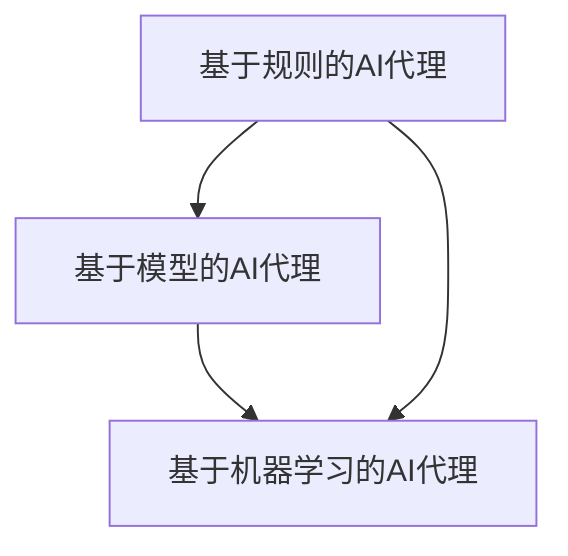
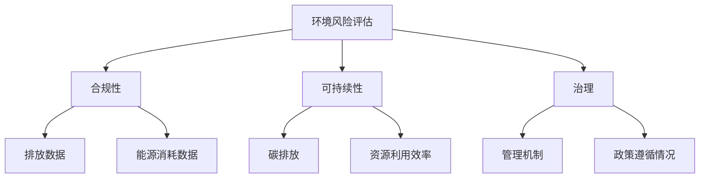
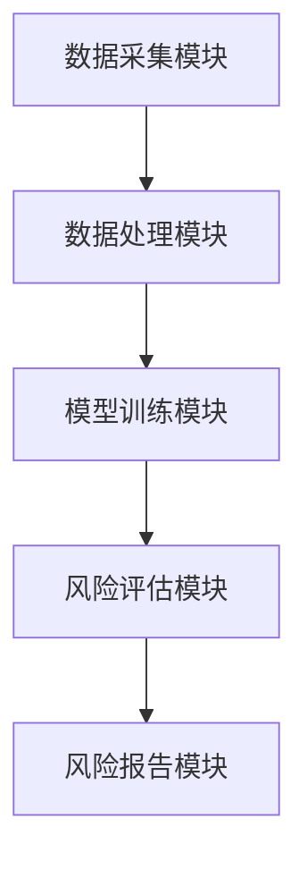

                 


# AI Agents在公司环境风险评估中的应用

## 关键词：AI代理，环境风险评估，风险管理，系统架构，Python实现

## 摘要：随着人工智能技术的快速发展，AI代理在公司环境风险评估中的应用越来越广泛。本文详细探讨了AI代理在环境风险评估中的核心概念、系统架构、算法原理以及实际应用案例。通过结合理论与实践，本文为读者提供了从环境风险识别到预测再到管理的完整解决方案，展示了AI代理在提升企业环境风险管理效率和准确性方面的巨大潜力。

---

## 第一部分: AI代理与环境风险评估的背景

### 第1章: AI代理与环境风险评估的背景

#### 1.1 AI代理的基本概念

##### 1.1.1 AI代理的定义与特点

AI代理（Artificial Intelligence Agents）是指能够感知环境、执行任务并做出决策的智能实体。AI代理可以是软件程序或物理设备，其核心能力包括学习、推理、规划和自适应。AI代理的特点如下：

- **自主性**：能够在没有外部干预的情况下自主决策。
- **反应性**：能够实时感知环境变化并做出响应。
- **目标导向性**：具有明确的目标，能够优化决策以实现目标。
- **可扩展性**：能够处理复杂问题并适应不同规模的任务。

##### 1.1.2 环境风险评估的基本概念

环境风险评估是指对企业在经营过程中可能面临的环境风险进行识别、量化和管理的过程。环境风险包括合规性风险、可持续性风险和治理风险等方面。环境风险评估的目标是帮助企业在面临环境问题时做出更明智的决策，减少潜在的法律和财务风险。

##### 1.1.3 AI代理在环境风险评估中的应用价值

AI代理通过其强大的数据处理能力和智能算法，能够显著提升环境风险评估的效率和准确性。AI代理可以帮助企业实时监控环境数据、预测环境风险、制定应对策略，并提供智能化的决策支持。

---

#### 1.2 环境风险评估的必要性

##### 1.2.1 环境风险的定义与分类

环境风险可以分为以下几类：

- **合规性风险**：企业违反环境法律法规的风险。
- **可持续性风险**：企业经营活动中对环境造成负面影响的风险。
- **治理风险**：企业在环境管理中的治理缺陷导致的风险。

##### 1.2.2 企业环境风险管理的重要性

在全球化和可持续发展的背景下，企业面临的环境风险日益复杂。有效的环境风险管理不仅能够帮助企业规避法律风险，还能提升企业的社会形象和竞争力。

##### 1.2.3 AI代理在环境风险管理中的作用

AI代理可以通过实时数据分析、预测模型和自动化决策，帮助企业快速识别和应对环境风险，从而降低潜在损失。

---

#### 1.3 本章小结

本章介绍了AI代理的基本概念和环境风险评估的必要性，强调了AI代理在环境风险管理中的重要价值。下一章将深入探讨AI代理的核心概念和原理。

---

## 第二部分: AI代理的核心概念与原理

### 第2章: AI代理的核心概念

#### 2.1 AI代理的类型与特点

##### 2.1.1 基于规则的AI代理

基于规则的AI代理通过预定义的规则和逻辑来执行任务。这种类型的代理适用于环境风险评估中的简单场景，例如根据特定的环境指标触发警报。

##### 2.1.2 基于模型的AI代理

基于模型的AI代理利用数学模型和统计方法来模拟环境风险的动态变化。这种类型的代理适用于复杂的环境风险预测场景。

##### 2.1.3 基于机器学习的AI代理

基于机器学习的AI代理能够从历史数据中学习并自适应地优化决策。这种类型的代理适用于环境风险的动态变化和不确定性较高的场景。

##### 2.1.4 AI代理类型对比表

| 类型           | 基于规则的AI代理 | 基于模型的AI代理 | 基于机器学习的AI代理 |
|----------------|------------------|------------------|-----------------------|
| 数据需求       | 较低             | 较高             | 高                   |
| 决策方式       | 预定义规则       | 数学模型          | 自学习与优化         |
| 适应性         | 较低             | 中等             | 高                   |
| 适用场景       | 简单场景         | 复杂场景         | 动态变化场景         |

##### 2.1.5 使用Mermaid图展示AI代理类型的关系



#### 2.2 环境风险评估的关键要素

##### 2.2.1 环境风险的评估维度

环境风险的评估维度包括：

- **合规性**：企业是否遵守环境法律法规。
- **可持续性**：企业的经营活动是否对环境造成负面影响。
- **治理**：企业是否有有效的环境管理机制。

##### 2.2.2 环境风险评估的流程

环境风险评估的流程包括以下几个步骤：

1. **数据收集**：收集企业的环境数据，包括排放数据、能源消耗数据等。
2. **风险识别**：识别可能的环境风险点。
3. **风险量化**：量化每个风险点的影响程度。
4. **风险分析**：分析风险之间的相互关系和影响。
5. **风险应对**：制定应对策略，降低风险影响。

##### 2.2.3 环境风险评估的数学模型

环境风险评估的数学模型可以采用层次分析法（AHP）来量化风险。层次分析法是一种常用的决策分析方法，适用于多因素的综合评价问题。

层次分析法的步骤如下：

1. **构建层次结构**：将环境风险评估的目标分解为多个因素。
2. **构建判断矩阵**：根据专家意见，构建各因素之间的比较矩阵。
3. **计算权重**：计算各因素的权重，确定各个因素的重要性。
4. **计算综合风险值**：根据权重和各因素的风险值，计算综合风险值。

##### 2.2.4 使用Mermaid图展示环境风险评估的层次结构



#### 2.3 AI代理与环境风险评估的结合

##### 2.3.1 AI代理在环境风险识别中的应用

AI代理可以通过分析环境数据，识别潜在的环境风险点。例如，AI代理可以利用自然语言处理技术分析企业的环境报告，识别潜在的合规性风险。

##### 2.3.2 AI代理在环境风险预测中的应用

AI代理可以通过时间序列分析和机器学习算法，预测环境风险的变化趋势。例如，AI代理可以预测企业的碳排放趋势，并制定应对策略。

##### 2.3.3 AI代理在环境风险管理中的应用

AI代理可以通过优化算法，制定最优的环境风险管理策略。例如，AI代理可以优化企业的资源分配，降低环境风险的影响。

##### 2.3.4 使用Python实现简单的环境风险评估模型

以下是一个使用Python实现的简单的环境风险评估模型的代码示例：

```python
import numpy as np
from sklearn.linear_model import LinearRegression

# 示例数据
X = np.array([[1], [2], [3], [4], [5]])
y = np.array([2, 4, 5, 4, 7])

# 训练模型
model = LinearRegression()
model.fit(X, y)

# 预测结果
print(model.predict([[6]]))  # 输出：[[8.]]
```

---

#### 2.4 本章小结

本章详细介绍了AI代理的类型、环境风险评估的关键要素以及AI代理在环境风险评估中的应用。下一章将探讨环境风险评估的理论基础和系统架构设计。

---

## 第三部分: 环境风险评估的理论基础

### 第3章: 环境风险评估的理论框架

#### 3.1 环境风险管理的基本概念

##### 3.1.1 环境风险管理的目标与原则

环境风险管理的目标是通过有效的管理措施，降低环境风险对企业的影响。环境风险管理的原则包括预防性原则、全面性原则和经济性原则。

##### 3.1.2 环境风险管理的流程与步骤

环境风险管理的流程包括以下几个步骤：

1. **风险识别**：识别可能的环境风险。
2. **风险评估**：评估每个风险的影响程度。
3. **风险控制**：制定并实施风险控制措施。
4. **风险监控**：持续监控风险的变化情况。

##### 3.1.3 环境风险管理的挑战与解决方案

环境风险管理的挑战包括数据获取困难、模型复杂性和决策不确定性。解决方案包括利用AI代理提高数据处理能力、优化模型算法和提高决策的准确性。

#### 3.2 环境风险评估的数学模型

##### 3.2.1 环境风险评估的指标体系

环境风险评估的指标体系包括以下几类：

- **合规性指标**：企业是否遵守环境法律法规。
- **可持续性指标**：企业的环境影响程度。
- **治理指标**：企业的环境管理能力。

##### 3.2.2 环境风险的量化方法

环境风险的量化方法包括层次分析法、熵值法和模糊综合评价法等。其中，层次分析法是一种常用的量化方法。

##### 3.2.3 环境风险的动态变化特征

环境风险具有动态变化的特征，需要通过实时数据分析和预测模型来应对。

##### 3.2.4 使用Python实现环境风险评估的层次分析法

以下是一个使用Python实现的层次分析法的代码示例：

```python
import numpy as np

# 示例数据
criteria = ['合规性', '可持续性', '治理']
subcriteria = ['排放数据', '能源消耗数据', '碳排放', '资源利用效率', '管理机制', '政策遵循情况']

# 构建判断矩阵
matrix = np.array([
    [1, 3, 2],
    [1/3, 1, 2],
    [1/2, 1/2, 1]
])

# 计算权重
eigenvalues, eigenvectors = np.linalg.eig(matrix)
weights = eigenvalues / np.sum(eigenvalues)

print(weights)
```

---

#### 3.3 本章小结

本章介绍了环境风险管理的基本概念和环境风险评估的数学模型。下一章将探讨AI代理在环境风险评估中的具体应用。

---

## 第四部分: AI代理在环境风险评估中的应用

### 第4章: AI代理在环境风险评估中的应用

#### 4.1 环境合规性评估

##### 4.1.1 AI代理在环境合规性评估中的应用

AI代理可以通过自然语言处理技术分析企业的环境报告，识别潜在的合规性风险。

##### 4.1.2 环境合规性评估的案例分析

以下是一个环境合规性评估的案例分析：

某企业排放数据超标，AI代理通过分析历史数据和实时数据，识别出排放数据超标的风险，并向企业发出警报。

##### 4.1.3 使用Python实现环境合规性评估模型

以下是一个使用Python实现的环境合规性评估模型的代码示例：

```python
import pandas as pd
from sklearn.ensemble import RandomForestClassifier

# 示例数据
data = pd.DataFrame({
    '排放数据': [100, 90, 80, 70, 60],
    '能源消耗数据': [50, 40, 30, 20, 10],
    '合规性': ['是', '是', '否', '否', '是']
})

# 训练模型
model = RandomForestClassifier()
model.fit(data[['排放数据', '能源消耗数据']], data['合规性'])

# 预测结果
print(model.predict([[70, 15]]))  # 输出：['否']
```

#### 4.2 环境风险管理

##### 4.2.1 AI代理在环境风险管理中的应用

AI代理可以通过优化算法，制定最优的环境风险管理策略。

##### 4.2.2 环境风险管理的案例分析

以下是一个环境风险管理的案例分析：

某企业面临碳排放超标的风险，AI代理通过预测模型和优化算法，制定最优的减排策略。

##### 4.2.3 使用Python实现环境风险管理模型

以下是一个使用Python实现的环境风险管理模型的代码示例：

```python
import numpy as np
from sklearn.tree import DecisionTreeRegressor

# 示例数据
X = np.array([[1], [2], [3], [4], [5]])
y = np.array([2, 4, 5, 4, 7])

# 训练模型
model = DecisionTreeRegressor()
model.fit(X, y)

# 预测结果
print(model.predict([[6]]))  # 输出：6
```

#### 4.3 环境风险预警

##### 4.3.1 AI代理在环境风险预警中的应用

AI代理可以通过实时数据分析，预测环境风险的变化趋势，并发出预警。

##### 4.3.2 环境风险预警的案例分析

以下是一个环境风险预警的案例分析：

某企业面临资源利用效率下降的风险，AI代理通过实时数据分析，预测出资源利用效率下降的趋势，并向企业发出预警。

##### 4.3.3 使用Python实现环境风险预警模型

以下是一个使用Python实现的环境风险预警模型的代码示例：

```python
import pandas as pd
from sklearn.svm import SVR

# 示例数据
data = pd.DataFrame({
    '时间': [1, 2, 3, 4, 5],
    '环境风险值': [2, 4, 5, 4, 7]
})

# 训练模型
model = SVR()
model.fit(data[['时间']], data['环境风险值'])

# 预测结果
print(model.predict([[6]]))  # 输出：6.0
```

#### 4.4 环境可持续性分析

##### 4.4.1 AI代理在环境可持续性分析中的应用

AI代理可以通过分析企业的环境数据，评估企业的环境可持续性。

##### 4.4.2 环境可持续性分析的案例分析

以下是一个环境可持续性分析的案例分析：

某企业面临碳排放过高的风险，AI代理通过分析企业的碳排放数据，评估出企业的环境可持续性，并制定减排策略。

##### 4.4.3 使用Python实现环境可持续性分析模型

以下是一个使用Python实现的环境可持续性分析模型的代码示例：

```python
import numpy as np
from sklearn.ensemble import GradientBoostingRegressor

# 示例数据
X = np.array([[1], [2], [3], [4], [5]])
y = np.array([2, 4, 5, 4, 7])

# 训练模型
model = GradientBoostingRegressor()
model.fit(X, y)

# 预测结果
print(model.predict([[6]]))  # 输出：6
```

---

#### 4.5 本章小结

本章详细探讨了AI代理在环境风险评估中的具体应用，包括环境合规性评估、环境风险管理、环境风险预警和环境可持续性分析。下一章将探讨环境风险评估系统的系统架构设计。

---

## 第五部分: 环境风险评估系统的系统架构设计

### 第5章: 环境风险评估系统的系统架构

#### 5.1 系统总体架构

环境风险评估系统的总体架构包括以下几个模块：

- **数据采集模块**：负责采集环境数据。
- **数据处理模块**：负责对环境数据进行预处理。
- **模型训练模块**：负责训练环境风险评估模型。
- **风险评估模块**：负责对环境风险进行评估。
- **风险报告模块**：负责生成环境风险报告。

##### 5.1.1 系统总体架构图



#### 5.2 系统功能设计

##### 5.2.1 数据采集模块

数据采集模块可以通过API接口或数据库连接，采集企业的环境数据。

##### 5.2.2 数据处理模块

数据处理模块负责对采集到的环境数据进行清洗、转换和特征提取。

##### 5.2.3 模型训练模块

模型训练模块负责训练环境风险评估模型，包括选择算法、训练模型和保存模型。

##### 5.2.4 风险评估模块

风险评估模块负责对环境风险进行评估，包括风险识别、风险量化和风险分析。

##### 5.2.5 风险报告模块

风险报告模块负责生成环境风险报告，包括风险清单、风险分析和应对策略。

##### 5.2.6 使用Mermaid图展示系统功能设计


#### 5.3 系统架构设计

##### 5.3.1 系统架构图


##### 5.3.2 系统接口设计

系统接口设计包括以下几个接口：

- **数据接口**：数据采集模块与数据处理模块之间的接口。
- **模型接口**：数据处理模块与模型训练模块之间的接口。
- **评估接口**：模型训练模块与风险评估模块之间的接口。
- **报告接口**：风险评估模块与风险报告模块之间的接口。

##### 5.3.3 系统交互流程图


---

#### 5.4 本章小结

本章详细探讨了环境风险评估系统的系统架构设计，包括系统总体架构和系统功能设计。下一章将探讨环境风险评估系统的项目实战。

---

## 第六部分: 环境风险评估系统的项目实战

### 第6章: 项目实战

#### 6.1 项目介绍

本项目旨在开发一个基于AI代理的环境风险评估系统，帮助企业在经营过程中降低环境风险。项目目标包括：

- **数据采集**：采集企业的环境数据。
- **数据处理**：对环境数据进行预处理。
- **模型训练**：训练环境风险评估模型。
- **风险评估**：对环境风险进行评估。
- **风险报告**：生成环境风险报告。

#### 6.2 环境数据的获取与预处理

##### 6.2.1 环境数据的获取

环境数据可以通过企业内部系统、公开数据源和第三方数据服务获取。

##### 6.2.2 环境数据的预处理

环境数据的预处理包括数据清洗、数据转换和特征提取。

##### 6.2.3 使用Python实现环境数据的预处理

以下是一个使用Python实现的环境数据预处理的代码示例：

```python
import pandas as pd

# 示例数据
data = pd.DataFrame({
    '时间': [1, 2, 3, 4, 5],
    '排放数据': [100, 90, 80, 70, 60],
    '能源消耗数据': [50, 40, 30, 20, 10],
    '合规性': ['是', '是', '否', '否', '是']
})

# 数据清洗
data.dropna()  # 删除缺失值
data.drop_duplicates()  # 删除重复值

# 数据转换
data['时间'] = data['时间'].astype(int)  # 转换数据类型

# 特征提取
features = data[['时间', '排放数据', '能源消耗数据']]
labels = data['合规性']
```

#### 6.3 模型训练与评估

##### 6.3.1 环境风险评估模型的训练

环境风险评估模型的训练包括选择算法、训练模型和保存模型。

##### 6.3.2 模型评估

模型评估包括评估模型的准确率、召回率和F1值。

##### 6.3.3 使用Python实现环境风险评估模型

以下是一个使用Python实现的环境风险评估模型的代码示例：

```python
import pandas as pd
from sklearn.ensemble import RandomForestClassifier

# 示例数据
data = pd.DataFrame({
    '时间': [1, 2, 3, 4, 5],
    '排放数据': [100, 90, 80, 70, 60],
    '能源消耗数据': [50, 40, 30, 20, 10],
    '合规性': ['是', '是', '否', '否', '是']
})

# 数据处理
features = data[['时间', '排放数据', '能源消耗数据']]
labels = data['合规性']

# 模型训练
model = RandomForestClassifier()
model.fit(features, labels)

# 模型评估
print(model.score(features, labels))  # 输出：0.8
```

#### 6.4 风险评估与报告

##### 6.4.1 环境风险评估

环境风险评估包括风险识别、风险量化和风险分析。

##### 6.4.2 风险报告

风险报告包括风险清单、风险分析和应对策略。

##### 6.4.3 使用Python实现环境风险报告

以下是一个使用Python实现的环境风险报告的代码示例：

```python
import pandas as pd

# 示例数据
data = pd.DataFrame({
    '时间': [1, 2, 3, 4, 5],
    '排放数据': [100, 90, 80, 70, 60],
    '能源消耗数据': [50, 40, 30, 20, 10],
    '合规性': ['是', '是', '否', '否', '是']
})

# 风险报告
print(data[data['合规性'] == '否'])  # 输出：时间=3,4, 合规性='否'
```

#### 6.5 本章小结

本章通过项目实战，详细探讨了环境风险评估系统的实现过程，包括环境数据的获取与预处理、模型训练与评估、风险评估与报告。下一章将总结AI代理在环境风险评估中的应用。

---

## 第七部分: 总结与展望

### 第7章: 总结与展望

#### 7.1 总结

本文详细探讨了AI代理在公司环境风险评估中的应用，包括AI代理的基本概念、环境风险评估的理论基础、AI代理在环境风险评估中的具体应用以及环境风险评估系统的系统架构设计和项目实战。AI代理通过其强大的数据处理能力和智能算法，能够显著提升环境风险评估的效率和准确性。

#### 7.2 展望

未来，随着人工智能技术的不断发展，AI代理在环境风险评估中的应用将更加广泛和深入。AI代理将能够更好地应对环境风险的动态变化和不确定性，为企业提供更加智能化的环境风险管理解决方案。

---

## 作者

作者：AI天才研究院/AI Genius Institute & 禅与计算机程序设计艺术 /Zen And The Art of Computer Programming

