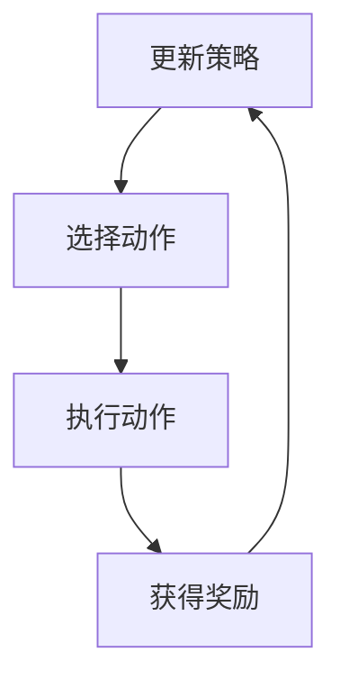
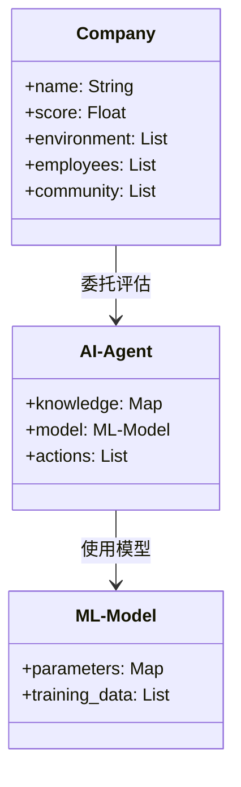
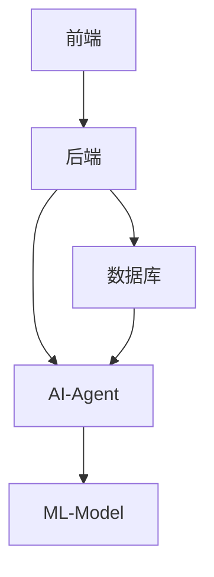
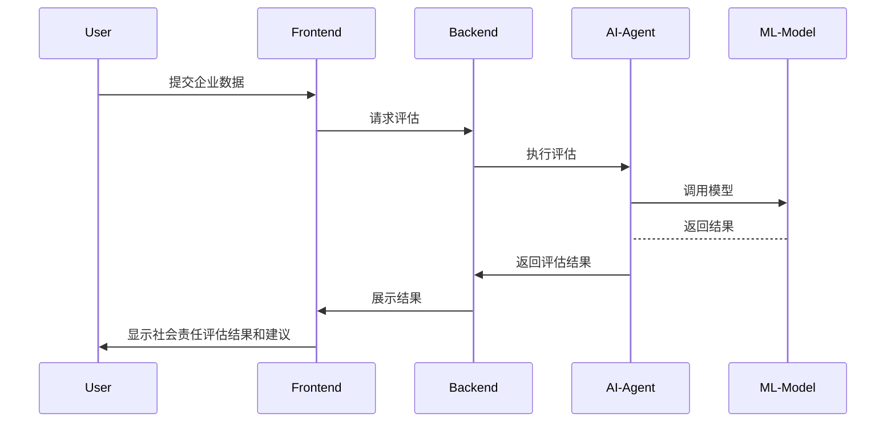

                 


# AI agents在公司社会责任评估中的应用

> 关键词：AI agents，公司社会责任，评估模型，算法原理，系统架构

> 摘要：本文详细探讨了AI agents在公司社会责任评估中的应用，从核心概念、算法原理到系统架构，再到项目实战，全面分析了AI agents如何赋能公司社会责任评估，提升评估的效率和准确性。

---

## 第1章 AI agents与公司社会责任评估概述

### 1.1 AI agents的基本概念与原理

#### 1.1.1 AI agents的定义与分类
AI agents（人工智能代理）是指能够感知环境、自主决策并执行任务的智能实体。根据功能和智能水平，AI agents可以分为以下几类：
- **反应式AI agents**：基于当前感知做出反应，适用于简单的任务。
- **认知式AI agents**：具备推理、规划和学习能力，适用于复杂任务。
- **协作式AI agents**：能够与其他agent或人类协作完成任务。

#### 1.1.2 AI agents的核心属性与特征
- **自主性**：能够在没有外部干预的情况下自主运作。
- **反应性**：能够感知环境并实时调整行为。
- **学习性**：通过数据和经验不断优化性能。
- **社交能力**：能够与其他agent或人类进行有效沟通与协作。

#### 1.1.3 AI agents在企业中的应用场景
- **自动化决策**：如供应链优化、客户关系管理。
- **风险管理**：如预测市场波动、识别潜在风险。
- **知识管理**：如自动化文档处理、知识库构建。

### 1.2 公司社会责任的定义与框架

#### 1.2.1 公司社会责任的定义
公司社会责任（Corporate Social Responsibility, CSR）是指企业在追求经济效益的同时，还需关注环境保护、员工福祉、社会公益等方面的社会责任。

#### 1.2.2 公司社会责任评估的框架与指标
- **环境责任**：碳排放、资源消耗。
- **员工责任**：员工待遇、工作条件。
- **社会责任**：公益投入、社区参与。

#### 1.2.3 公司社会责任评估的挑战与现状
- **数据复杂性**：涉及多维度数据，难以量化。
- **主观性**：不同利益相关者对CSR的评价标准不同。
- **动态性**：社会对企业的期望随时间变化。

### 1.3 AI agents在公司社会责任评估中的结合

#### 1.3.1 AI agents如何赋能公司社会责任评估
- **数据处理**：AI agents可以快速处理大量非结构化数据，提取关键信息。
- **决策支持**：通过分析历史数据和实时信息，AI agents可以为企业提供最优决策建议。
- **实时监控**：AI agents可以实时跟踪企业的社会责任履行情况，及时发现潜在问题。

#### 1.3.2 AI agents在公司社会责任评估中的优势
- **高效性**：AI agents可以快速处理大量数据，提高评估效率。
- **准确性**：通过机器学习模型，AI agents可以提高评估结果的准确性。
- **动态适应性**：AI agents可以根据环境变化实时调整评估策略。

#### 1.3.3 AI agents在公司社会责任评估中的潜在问题
- **数据隐私**：处理敏感数据可能引发隐私问题。
- **算法偏见**：AI模型可能因为训练数据中的偏见导致评估结果不公。
- **技术复杂性**：AI agents的部署和维护需要专业技能。

## 第2章 AI agents与公司社会责任评估的核心概念

### 2.1 AI agents的核心概念与原理

#### 2.1.1 AI agents的决策机制
AI agents的决策机制可以分为以下几种：
- **基于规则的决策**：通过预定义的规则做出决策。
- **基于逻辑推理的决策**：通过逻辑推理得出最优解。
- **基于机器学习的决策**：通过训练模型进行预测和决策。

#### 2.1.2 AI agents的自主性与智能性
- **自主性**：AI agents能够自主感知环境并采取行动。
- **智能性**：AI agents具备一定的推理和学习能力，能够适应复杂环境。

#### 2.1.3 AI agents的学习与优化能力
AI agents可以通过监督学习、无监督学习和强化学习不断优化自身的性能。例如，强化学习可以通过奖励机制训练AI agents在特定环境中做出最优决策。

### 2.2 公司社会责任评估的核心要素

#### 2.2.1 公司社会责任的伦理维度
- **公平性**：企业在经营过程中是否公平对待员工、客户和合作伙伴。
- **透明性**：企业是否公开其经营信息，接受社会监督。

#### 2.2.2 公司社会责任的经济维度
- **经济效益**：企业在追求利润的同时，是否考虑其对社会和环境的影响。
- **成本控制**：企业在实现社会责任目标的过程中，是否注重成本效益。

#### 2.2.3 公司社会责任的社会维度
- **社区参与**：企业是否积极参与社区建设，支持公益活动。
- **社会影响**：企业的产品或服务是否对社会产生积极或消极的影响。

### 2.3 AI agents与公司社会责任评估的关联性

#### 2.3.1 AI agents在公司社会责任评估中的角色
- **数据收集与处理**：AI agents可以实时收集企业运营中的各种数据，包括环境数据、员工反馈等。
- **评估与分析**：AI agents可以通过机器学习模型对收集到的数据进行分析，评估企业的社会责任履行情况。
- **决策支持**：AI agents可以为企业提供改进建议，帮助企业在社会责任方面做出更优决策。

#### 2.3.2 AI agents如何影响公司社会责任的实现
- **提高效率**：AI agents可以快速处理大量数据，提高评估效率。
- **增强透明度**：通过AI agents的实时监控，企业可以更透明地向公众展示其社会责任履行情况。
- **促进创新**：AI agents可以通过数据分析发现新的社会责任实践方式，推动企业社会责任的创新。

#### 2.3.3 AI agents在公司社会责任评估中的创新点
- **实时监控**：AI agents可以实时跟踪企业的社会责任履行情况，及时发现问题。
- **预测性评估**：通过分析历史数据和趋势，AI agents可以预测未来可能的社会责任问题，并提前制定解决方案。
- **个性化建议**：AI agents可以根据企业的具体情况，提供个性化的社会责任改进建议。

## 第3章 AI agents在公司社会责任评估中的算法原理

### 3.1 AI agents的核心算法概述

#### 3.1.1 基于强化学习的AI agents算法
强化学习是一种通过试错机制来优化决策的算法。AI agents在公司社会责任评估中可以使用强化学习来优化其决策过程。例如，AI agents可以通过模拟不同的情景，选择最优的行动方案，以实现最佳的社会责任评估结果。



#### 3.1.2 基于监督学习的AI agents算法
监督学习是一种通过标注数据训练模型的算法。在公司社会责任评估中，AI agents可以使用监督学习来分类企业社会责任的表现。例如，AI agents可以通过训练数据学习如何将企业分为高社会责任表现和低社会责任表现两类。

#### 3.1.3 基于无监督学习的AI agents算法
无监督学习是一种通过发现数据中的结构来训练模型的算法。在公司社会责任评估中，AI agents可以使用无监督学习来发现企业社会责任数据中的潜在模式。例如，AI agents可以通过聚类分析将企业分成不同的社会责任表现群体。

### 3.2 公司社会责任评估的算法实现

#### 3.2.1 公司社会责任评估的特征提取
在公司社会责任评估中，特征提取是关键步骤。例如，AI agents可以从企业的财务数据、环境数据、员工反馈等多方面提取特征，用于评估企业的社会责任表现。

#### 3.2.2 公司社会责任评估的模型训练
AI agents可以通过机器学习模型对提取的特征进行训练。例如，可以使用随机森林、支持向量机（SVM）或深度学习模型（如神经网络）进行训练。

#### 3.2.3 公司社会责任评估的预测与优化
训练好的模型可以用于预测企业的社会责任表现，并提出改进建议。例如，AI agents可以预测企业在未来一年内的社会责任表现，并提出优化建议。

### 3.3 AI agents算法与公司社会责任评估的结合

#### 3.3.1 AI agents算法在公司社会责任评估中的应用
- **实时监控**：AI agents可以实时监控企业的社会责任履行情况。
- **预测性评估**：AI agents可以预测未来可能的社会责任问题。
- **个性化建议**：AI agents可以根据企业的具体情况提供个性化的改进建议。

#### 3.3.2 AI agents算法在公司社会责任评估中的优化
- **模型优化**：通过不断优化机器学习模型，提高评估的准确性。
- **数据优化**：通过优化数据收集和处理流程，提高评估效率。
- **算法优化**：通过改进算法，提高AI agents的决策能力。

#### 3.3.3 AI agents算法在公司社会责任评估中的挑战
- **数据隐私**：处理敏感数据可能引发隐私问题。
- **算法偏见**：AI模型可能因为训练数据中的偏见导致评估结果不公。
- **技术复杂性**：AI agents的部署和维护需要专业技能。

## 第4章 公司社会责任评估的数学模型与公式

### 4.1 公司社会责任评估的数学模型

#### 4.1.1 公司社会责任评估的基本模型
$$
\text{社会责任评分} = \alpha \times \text{环境指标} + \beta \times \text{员工指标} + \gamma \times \text{社会指标}
$$
其中，$\alpha + \beta + \gamma = 1$，且$\alpha, \beta, \gamma \geq 0$。

#### 4.1.2 公司社会责任评估的优化模型
$$
\max \sum_{i=1}^{n} w_i \times x_i
$$
其中，$w_i$是特征$x_i$的权重，且$\sum_{i=1}^{n} w_i = 1$。

#### 4.1.3 公司社会责任评估的预测模型
$$
P(y|x) = \frac{e^{\beta x}}{1 + e^{\beta x}}
$$
其中，$y$是社会责任评估结果，$x$是特征向量，$\beta$是模型参数。

### 4.2 AI agents算法与公司社会责任评估的数学表达

#### 4.2.1 强化学习算法
$$
Q(s, a) = Q(s, a) + \alpha (r + \gamma \max Q(s', a') - Q(s, a))
$$
其中，$s$是当前状态，$a$是动作，$r$是奖励，$\gamma$是折扣因子，$\alpha$是学习率。

#### 4.2.2 监督学习算法
$$
\text{损失函数} = \frac{1}{n} \sum_{i=1}^{n} (y_i - \hat{y}_i)^2
$$
其中，$y_i$是真实标签，$\hat{y}_i$是预测标签。

#### 4.2.3 无监督学习算法
$$
\text{相似度} = \frac{\sum_{i=1}^{n} \min(x_i, y_i)}{\sum_{i=1}^{n} (x_i + y_i)}
$$
其中，$x_i$和$y_i$是两个样本的特征向量。

## 第5章 系统分析与架构设计方案

### 5.1 问题场景介绍

#### 5.1.1 项目介绍
本项目旨在开发一个基于AI agents的公司社会责任评估系统，帮助企业自动评估和优化其社会责任表现。

#### 5.1.2 项目目标
- 实现对公司社会责任的自动化评估。
- 提供个性化的社会责任改进建议。
- 实时监控企业的社会责任履行情况。

### 5.2 系统功能设计

#### 5.2.1 领域模型


#### 5.2.2 系统架构设计


#### 5.2.3 系统接口设计
- **前端接口**：提供用户界面，展示社会责任评估结果和改进建议。
- **后端接口**：接收前端请求，调用AI-Agent进行评估。
- **数据库接口**：存储企业数据和评估结果。

#### 5.2.4 系统交互设计


### 5.3 项目实战

#### 5.3.1 环境安装
- **Python**：安装Python 3.8或更高版本。
- **机器学习库**：安装TensorFlow、Keras、scikit-learn。
- **可视化工具**：安装Matplotlib、Seaborn。
- **其他依赖**：安装Jupyter Notebook、Pandas。

#### 5.3.2 系统核心实现源代码

##### 5.3.2.1 数据预处理
```python
import pandas as pd
import numpy as np

def preprocess_data(data):
    # 数据清洗
    data = data.dropna()
    data = pd.get_dummies(data)
    return data
```

##### 5.3.2.2 模型训练
```python
from sklearn.ensemble import RandomForestClassifier
from sklearn.metrics import accuracy_score

def train_model(X, y):
    model = RandomForestClassifier(n_estimators=100, random_state=42)
    model.fit(X, y)
    return model

# 示例数据
X_train = ...
y_train = ...
model = train_model(X_train, y_train)
```

##### 5.3.2.3 模型预测
```python
def predict_score(model, X_test):
    y_pred = model.predict(X_test)
    return y_pred

# 示例测试数据
X_test = ...
y_pred = predict_score(model, X_test)
print(y_pred)
```

#### 5.3.3 代码应用解读与分析
- **数据预处理**：通过`preprocess_data`函数，对数据进行清洗和特征工程，为模型训练做好准备。
- **模型训练**：使用随机森林算法训练模型，评估模型的准确率。
- **模型预测**：使用训练好的模型对测试数据进行预测，输出社会责任评分。

#### 5.3.4 案例分析
假设我们有一个企业数据集，包含环境、员工、社区等方面的数据。我们可以通过上述代码对数据进行预处理，训练随机森林模型，并预测企业的社会责任评分。

##### 5.3.4.1 数据预处理
```python
data = pd.read_csv('company社会责任.csv')
data_processed = preprocess_data(data)
```

##### 5.3.4.2 模型训练
```python
X_train = data_processed.drop('score', axis=1)
y_train = data_processed['score']
model = train_model(X_train, y_train)
```

##### 5.3.4.3 模型预测
```python
X_test = pd.read_csv('test.csv')
y_pred = predict_score(model, X_test)
print("预测的社会责任评分为：", y_pred)
```

#### 5.3.5 项目小结
通过上述代码，我们可以实现一个基于AI agents的公司社会责任评估系统。该系统能够自动处理企业数据，训练模型，并预测社会责任评分，为企业提供改进建议。

## 第6章 最佳实践、小结、注意事项与拓展阅读

### 6.1 最佳实践
- **数据质量管理**：确保数据的准确性和完整性，避免因数据问题导致评估结果不准确。
- **模型优化**：通过交叉验证和超参数调优，提高模型的性能。
- **持续学习**：定期更新模型，以适应环境的变化和新的数据。

### 6.2 小结
本文详细探讨了AI agents在公司社会责任评估中的应用，从核心概念、算法原理到系统架构，再到项目实战，全面分析了AI agents如何赋能公司社会责任评估，提升评估的效率和准确性。

### 6.3 注意事项
- **数据隐私**：在处理企业数据时，需要注意数据隐私问题，确保数据的安全性和合规性。
- **算法偏见**：AI agents的决策可能受到训练数据的影响，需要定期检查和优化模型，避免偏见。
- **技术复杂性**：AI agents的部署和维护需要专业技能，企业可能需要投入更多的资源。

### 6.4 拓展阅读
- **《机器学习实战》**：学习机器学习的基本概念和算法。
- **《深度学习》**：深入理解深度学习的原理和应用。
- **《企业社会责任》**：了解公司社会责任的理论和实践。

---

作者：AI天才研究院/AI Genius Institute & 禅与计算机程序设计艺术/Zen And The Art of Computer Programming

