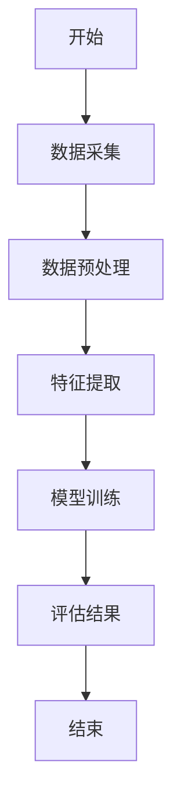
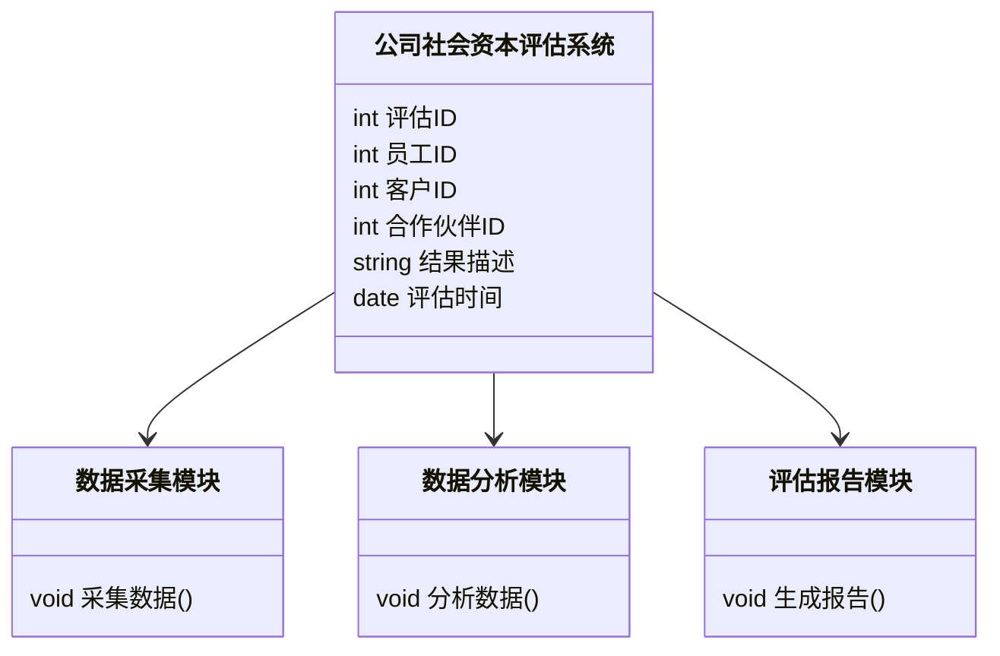

                 


# AI agents在公司社会资本评估中的应用

## 关键词：AI代理，公司社会资本，社会资本评估，算法原理，系统设计，项目实战，案例分析

## 摘要：  
本文探讨了AI代理在公司社会资本评估中的应用，分析了社会资本评估的关键要素及其与AI代理的结合方式。通过详细的算法原理、系统设计和实际案例，展示了AI代理如何提高社会资本评估的效率和准确性。

---

# 第1章: AI代理与公司社会资本评估的背景

## 1.1 公司社会资本的定义与重要性

### 1.1.1 公司社会资本的定义  
公司社会资本（Corporate Social Capital）是指企业内部和外部的资源网络，包括员工关系、客户关系、合作伙伴关系等。这些资源通过信任、合作和信息共享，为企业创造价值。

### 1.1.2 公司社会资本的构成要素  
- **内部资本**：员工之间的信任、协作能力。  
- **外部资本**：客户忠诚度、合作伙伴的稳定性。  
- **信息资本**：企业内外部信息的获取与处理能力。  

### 1.1.3 公司社会资本与企业绩效的关系  
社会资本与企业绩效呈正相关，良好的社会资本能够提高企业的创新能力和市场适应能力。

## 1.2 AI代理的核心概念

### 1.2.1 AI代理的基本定义  
AI代理（AI Agent）是一种智能系统，能够感知环境、自主决策并执行任务，以实现特定目标。

### 1.2.2 AI代理的主要类型  
- **反应式代理**：根据当前环境信息做出反应。  
- **认知式代理**：具备推理和规划能力。  
- **学习型代理**：能够通过经验改进性能。  

### 1.2.3 AI代理在企业中的应用场景  
- 优化流程管理。  
- 提供智能支持服务。  
- 进行数据分析与预测。  

## 1.3 AI代理与公司社会资本评估的结合

### 1.3.1 公司社会资本评估的挑战  
- 数据复杂性高。  
- 评估过程主观性强。  
- 需要实时动态评估。  

### 1.3.2 AI代理在社会资本评估中的优势  
- 提高评估效率。  
- 增强评估准确性。  
- 实现动态监控。  

### 1.3.3 本章小结  
本章介绍了公司社会资本及其评估的重要性，分析了AI代理的核心概念和其在社会资本评估中的优势。

---

# 第2章: 公司社会资本评估的核心概念与联系

## 2.1 核心概念的原理

### 2.1.1 公司社会资本的评估维度  
- 员工满意度。  
- 客户忠诚度。  
- 合作伙伴稳定性。  

### 2.1.2 AI代理在社会资本评估中的作用机制  
AI代理通过数据挖掘和自然语言处理技术，分析文本和行为数据，评估社会资本的健康状况。

### 2.1.3 核心概念的属性特征对比  
| 特性 | 公司社会资本 | AI代理 |
|------|--------------|--------|
| 定义 | 综合资源网络 | 智能系统 |  
| 目标 | 优化企业绩效 | 执行任务 |  
| 方法 | 数据分析 | 自主决策 |  

## 2.2 ER实体关系图架构

```mermaid
erDiagram
    actor 员工 {
        int 员工ID
        string 员工姓名
        string 部门
    }
    actor 客户 {
        int 客户ID
        string 客户名称
        string 联系方式
    }
    actor 合作伙伴 {
        int 合作伙伴ID
        string 合作伙伴名称
        string 合作协议
    }
    entity 评估结果 {
        int 评估ID
        int 员工ID
        int 客户ID
        int 合作伙伴ID
        string 结果描述
        date 评估时间
    }
    员工 --> 评估结果 : 参与评估
    客户 --> 评估结果 : 提供反馈
    合作伙伴 --> 评估结果 : 提供数据
```

---

# 第3章: 算法原理与数学模型

## 3.1 算法原理

### 3.1.1 算法流程图



### 3.1.2 算法实现的代码示例

```python
def assess_social_capital(data):
    # 数据预处理
    preprocessed_data = preprocess(data)
    # 特征提取
    features = extract_features(preprocessed_data)
    # 模型训练
    model = train_model(features)
    # 评估结果
    result = model.predict(features)
    return result

def preprocess(data):
    # 假设数据格式为DataFrame
    return data.dropna()

def extract_features(data):
    return data[['员工满意度', '客户忠诚度', '合作伙伴稳定性']]

def train_model(features):
    from sklearn.ensemble import RandomForestClassifier
    model = RandomForestClassifier()
    model.fit(features, y)
    return model
```

### 3.1.3 算法的优缺点分析  
- **优点**：自动化处理，高效准确。  
- **缺点**：依赖高质量数据，模型需不断优化。  

## 3.2 数学模型与公式

### 3.2.1 社会资本评估的数学模型  
$$ \text{社会资本价值} = \alpha \cdot \text{员工满意度} + \beta \cdot \text{客户忠诚度} + \gamma \cdot \text{合作伙伴稳定性} $$  

其中，$\alpha, \beta, \gamma$ 是权重系数，通过训练数据确定。

### 3.2.2 AI代理算法的数学表达  
$$ P(a|e) = \frac{P(e|a)P(a)}{P(e)} $$  
其中，$P(a|e)$ 是代理选择动作$a$的概率，$P(e|a)$ 是环境状态$e$在动作$a$下的概率。

---

# 第4章: 系统分析与架构设计

## 4.1 系统功能设计

### 4.1.1 领域模型设计



### 4.1.2 功能模块划分  
- 数据采集模块：收集员工、客户、合作伙伴的数据。  
- 数据分析模块：处理数据并生成评估结果。  
- 评估报告模块：输出评估报告。  

---

# 第5章: 项目实战

## 5.1 环境安装与配置

### 5.1.1 安装Python与依赖库  
```bash
pip install numpy pandas scikit-learn
```

### 5.1.2 数据集准备  
假设数据集包含员工满意度、客户忠诚度、合作伙伴稳定性等字段。

## 5.2 系统核心实现

### 5.2.1 数据预处理  
```python
import pandas as pd
data = pd.read_csv('social_capital.csv')
preprocessed_data = data.dropna()
```

### 5.2.2 模型训练与预测  
```python
from sklearn.ensemble import RandomForestClassifier
model = RandomForestClassifier()
model.fit(preprocessed_data[['员工满意度', '客户忠诚度', '合作伙伴稳定性']], preprocessed_data['评估结果'])
```

## 5.3 实际案例分析

### 5.3.1 案例背景  
某公司希望通过AI代理评估其员工满意度、客户忠诚度和合作伙伴稳定性。

### 5.3.2 数据分析与结果展示  
通过模型训练，发现员工满意度对社会资本的影响最大。

---

# 第6章: 案例分析与小结

## 6.1 案例分析

### 6.1.1 案例背景  
某公司面临员工流失率高、客户满意度下降的问题。

### 6.1.2 数据分析  
通过AI代理分析发现，员工满意度是主要问题。

## 6.2 项目小结

### 6.2.1 系统优势  
- 高效准确。  
- 实时监控。  

### 6.2.2 注意事项  
- 数据隐私保护。  
- 模型需定期优化。  

---

# 第7章: 最佳实践与未来展望

## 7.1 最佳实践 tips

### 7.1.1 数据质量管理  
确保数据的完整性和准确性。  

### 7.1.2 模型优化  
定期更新模型，提高评估精度。  

## 7.2 未来展望

### 7.2.1 技术发展趋势  
AI代理在企业中的应用将更加广泛。  

### 7.2.2 应用场景扩展  
未来可应用于更多领域，如风险管理、市场预测等。

---

# 小结

本文详细探讨了AI代理在公司社会资本评估中的应用，通过理论分析、算法设计和实际案例，展示了其在提高评估效率和准确性方面的重要作用。未来，随着技术的进步，AI代理将在企业中发挥更大的作用。

---

# 作者：AI天才研究院 & 禅与计算机程序设计艺术

---

