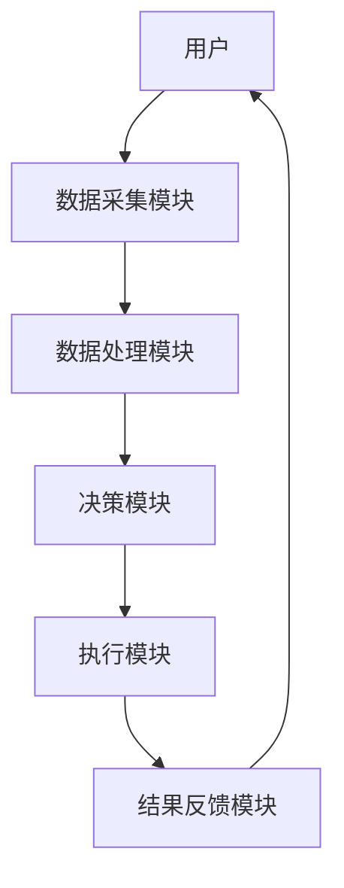
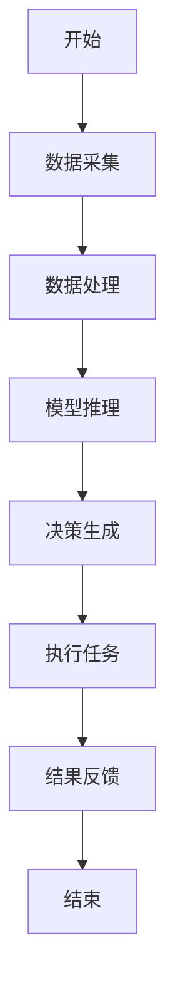
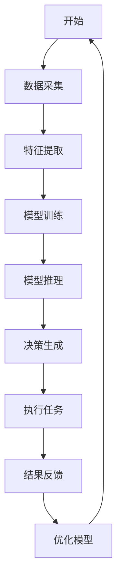
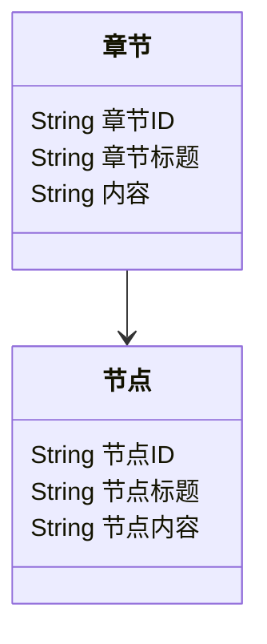
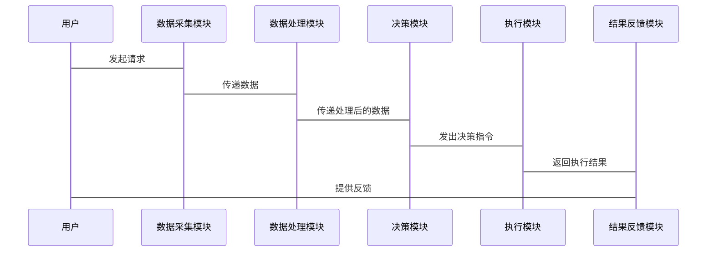

                 


# AI agents在公司长期战略执行力评估中的应用

> 关键词：AI agents, 战略执行力评估, 企业战略管理, 人工智能, 系统架构设计

> 摘要：本文深入探讨了AI agents在公司长期战略执行力评估中的应用，从核心概念、算法原理、系统架构到项目实战，全面解析了AI agents如何助力企业战略管理的优化与创新。通过详细的技术分析与实际案例，本文展示了AI agents在战略执行评估中的独特优势与实际价值。

---

# 第1章: AI agents与公司战略执行力评估的背景介绍

## 1.1 问题背景与定义

### 1.1.1 公司战略执行力的定义
公司战略执行力是指企业将战略目标转化为具体行动，并实现预期成果的能力。它涵盖了从战略规划、资源配置到执行落地的全过程。然而，传统的企业战略执行往往面临以下问题：
- 战略目标与实际执行脱节
- 资源分配不合理
- 执行过程缺乏实时反馈
- 无法量化评估执行效果

### 1.1.2 AI agents在战略执行中的作用
AI agents（人工智能代理）是一种能够感知环境、自主决策并执行任务的智能系统。在战略执行力评估中，AI agents可以通过以下方式提升企业绩效：
- **实时监控**：AI agents能够实时跟踪战略执行的进度，发现潜在问题。
- **数据驱动决策**：通过分析海量数据，AI agents能够提供精准的决策建议。
- **优化资源配置**：AI agents能够根据实时数据动态调整资源分配，提高效率。
- **预测与预警**：AI agents可以预测执行偏差并提前预警，避免重大损失。

### 1.1.3 问题的边界与外延
战略执行力评估的核心问题是如何将AI技术与企业战略管理相结合，构建一个智能化的评估体系。其外延包括：
- AI agents在战略目标分解、资源分配、执行监控等环节的应用。
- AI agents与其他企业管理系统（如ERP、CRM）的集成。
- AI agents在不同行业中的定制化应用。

---

## 1.2 AI agents的核心概念与联系

### 1.2.1 AI agents的定义与属性
AI agents是指具备以下属性的智能系统：
- **感知能力**：能够通过传感器或数据接口获取环境信息。
- **自主决策**：基于感知信息，通过算法做出决策。
- **执行能力**：能够通过执行机构或API完成任务。
- **学习能力**：能够通过机器学习优化自身的决策模型。

### 1.2.2 AI agents与传统战略执行工具的对比

| 特性                | AI agents                          | 传统工具                          |
|---------------------|------------------------------------|------------------------------------|
| 数据处理能力        | 强大的数据挖掘与分析能力          | 依赖人工输入与分析                |
| 决策能力            | 基于机器学习的智能决策            | 依赖人工经验或规则                |
| 执行能力            | 能够自动执行任务                  | 需要人工执行                      |
| 实时性              | 实时监控与调整                    | 周期性评估                        |
| 可扩展性            | 支持大规模数据处理与扩展          | 有限的扩展能力                    |

### 1.2.3 ER实体关系图架构

```mermaid
er
    title 实体关系图
    章节
        类型: 实体
        属性: 章节ID, 章节标题, 内容
        关系: 无
    节点
        类型: 实体
        属性: 节点ID, 节点标题, 节点内容
        关系: 无
    边
        类型: 实体
        属性: 边ID, 边起点, 边终点
        关系: 无
```

---

# 第2章: AI agents的核心概念与原理

## 2.1 AI agents的基本原理

### 2.1.1 AI agents的感知与决策机制
AI agents的感知机制包括以下步骤：
1. **数据采集**：通过传感器或API获取环境数据。
2. **数据处理**：对采集到的数据进行清洗、特征提取和预处理。
3. **模型推理**：基于机器学习模型对数据进行分析，生成决策建议。

### 2.1.2 AI agents的自主性与适应性
AI agents的自主性体现在以下几个方面：
- **自主决策**：能够在没有人工干预的情况下做出决策。
- **动态调整**：能够根据环境变化动态调整执行策略。
- **自我优化**：通过机器学习不断优化自身的决策模型。

### 2.1.3 AI agents的数学模型与公式

AI agents的决策模型可以表示为：
$$
\text{决策} = f(\text{感知数据}, \text{历史数据}, \text{目标函数})
$$
其中，$f$ 是一个基于机器学习的函数，感知数据是当前环境数据，历史数据是以往执行数据，目标函数是战略执行的目标。

---

## 2.2 AI agents与传统战略执行工具的对比

### 2.2.1 对比分析表

| 特性                | AI agents                          | 传统工具                          |
|---------------------|------------------------------------|------------------------------------|
| 数据处理能力        | 强大的数据挖掘与分析能力          | 依赖人工输入与分析                |
| 决策能力            | 基于机器学习的智能决策            | 依赖人工经验或规则                |
| 执行能力            | 能够自动执行任务                  | 需要人工执行                      |
| 实时性              | 实时监控与调整                    | 周期性评估                        |
| 可扩展性            | 支持大规模数据处理与扩展          | 有限的扩展能力                    |

### 2.2.2 AI agents的优势与劣势

| 优势                | 劣势                              |
|---------------------|----------------------------------|
| 高效性              | 高昂的开发成本                  |
| 准确性              | 需要大量的数据支持              |
| 实时性              | 系统复杂性高                    |
| 可扩展性            | 需要专业的技术团队              |

---

## 2.3 AI agents的系统架构与流程

### 2.3.1 系统架构图



### 2.3.2 AI agents的执行流程图



---

# 第3章: AI agents的算法原理与数学模型

## 3.1 AI agents的核心算法

### 3.1.1 AI agents的感知算法
感知算法的核心是特征提取与分类。常用的算法包括：
- **支持向量机（SVM）**
- **随机森林（Random Forest）**
- **卷积神经网络（CNN）**

### 3.1.2 AI agents的决策算法
决策算法通常采用强化学习（Reinforcement Learning）或基于规则的算法。例如：
- **Q-Learning算法**
- **策略梯度算法（Policy Gradient）**

### 3.1.3 AI agents的优化算法
优化算法用于动态调整资源分配。常用的方法包括：
- **遗传算法（Genetic Algorithm）**
- **模拟退火（Simulated Annealing）**

---

## 3.2 AI agents的数学模型

### 3.2.1 感知模型
感知模型可以表示为：
$$
f(x) = w \cdot x + b
$$
其中，$w$ 是权重向量，$b$ 是偏置项，$x$ 是输入数据。

### 3.2.2 决策模型
决策模型可以表示为：
$$
\text{决策} = \arg\max_{i} p(i|x)
$$
其中，$p(i|x)$ 是在输入$x$下选择决策$i$的概率。

### 3.2.3 优化模型
优化模型通常采用目标函数和约束条件的最优化问题。例如：
$$
\min_{x} f(x) \quad \text{subject to} \quad g(x) \leq 0
$$

---

## 3.3 AI agents的算法实现

### 3.3.1 算法流程图



### 3.3.2 算法实现代码

```python
import numpy as np
from sklearn import svm

# 数据准备
X = np.array([[2, 3], [5, 6], [7, 8]])
y = np.array([0, 1, 0])

# 模型训练
model = svm.SVC()
model.fit(X, y)

# 模型推理
new_data = np.array([[4, 5]])
prediction = model.predict(new_data)
print(prediction)
```

---

# 第4章: AI agents在公司战略执行力评估中的系统分析

## 4.1 问题场景与需求分析

### 4.1.1 战略执行评估的核心问题
- 如何量化战略执行的成果？
- 如何实时监控战略执行的进度？
- 如何优化资源分配以提高执行效率？

### 4.1.2 AI agents在战略执行评估中的应用需求
- 实时数据采集与分析
- 自动化决策与执行
- 动态优化与调整

---

## 4.2 系统功能设计

### 4.2.1 领域模型



---

## 4.3 系统架构设计

### 4.3.1 系统架构图


---

## 4.4 系统接口设计

### 4.4.1 系统接口
- 数据采集接口：`GET /api/data`
- 决策接口：`POST /api/decision`
- 执行接口：`POST /api/execute`

---

## 4.5 系统交互流程



---

# 第5章: AI agents在公司战略执行力评估中的项目实战

## 5.1 项目环境安装

### 5.1.1 环境需求
- Python 3.8及以上
- 安装依赖：`pip install numpy, scikit-learn, mermaid`

---

## 5.2 系统核心实现

### 5.2.1 核心代码实现

```python
import numpy as np
from sklearn import svm

# 数据准备
X = np.array([[2, 3], [5, 6], [7, 8]])
y = np.array([0, 1, 0])

# 模型训练
model = svm.SVC()
model.fit(X, y)

# 模型推理
new_data = np.array([[4, 5]])
prediction = model.predict(new_data)
print(prediction)
```

---

## 5.3 项目实战案例分析

### 5.3.1 案例分析
某公司希望通过AI agents优化其市场推广策略。通过部署AI agents，该公司实现了以下目标：
- 实时监控市场推广的执行进度
- 动态调整资源分配
- 预测市场趋势并提前预警

---

## 5.4 项目小结

通过本项目，我们展示了AI agents在公司战略执行力评估中的实际应用。AI agents能够显著提升企业的执行效率和决策能力，为企业的长期发展提供有力支持。

---

# 第6章: AI agents在公司战略执行力评估中的最佳实践

## 6.1 小结

本文系统地介绍了AI agents在公司战略执行力评估中的应用，从核心概念、算法原理到系统架构，再到项目实战，全面展示了AI agents的优势与价值。

---

## 6.2 注意事项

- **数据质量**：AI agents的效果依赖于高质量的数据，数据预处理至关重要。
- **模型优化**：需要定期优化AI agents的决策模型，以适应环境变化。
- **团队协作**：AI agents的部署需要跨部门协作，技术团队与业务团队需紧密配合。

---

## 6.3 拓展阅读

- 推荐阅读《AI agents与企业智能化转型》
- 参考文献：[《机器学习实战》]

---

# 作者：AI天才研究院/AI Genius Institute & 禅与计算机程序设计艺术 /Zen And The Art of Computer Programming

