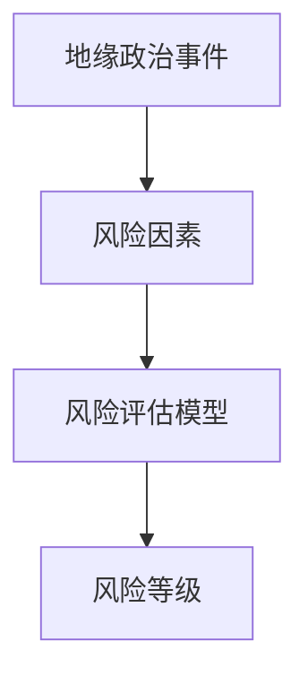
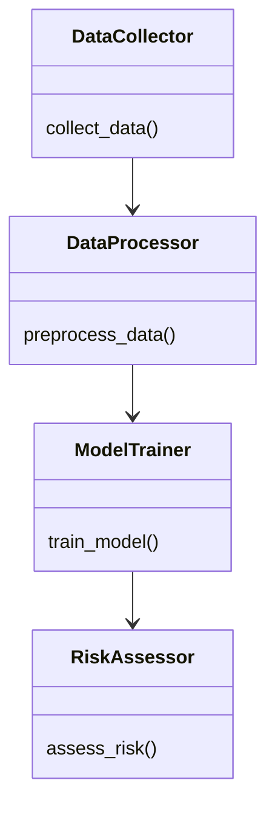
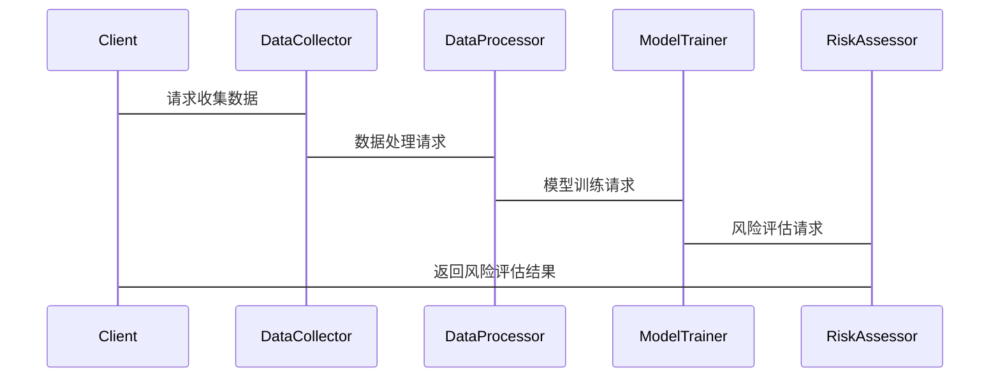

                 


# AI agents增强价值投资的地缘政治风险评估

> 关键词：AI代理，价值投资，地缘政治风险，金融模型，风险管理，系统架构

> 摘要：本文深入探讨了AI代理在价值投资中的应用，特别是如何利用AI技术进行地缘政治风险评估。文章从背景、核心概念、算法原理到系统架构和项目实战，详细阐述了AI代理在地缘政治风险评估中的作用，旨在为投资者和相关从业者提供理论和实践指导。

---

## 第1章：背景介绍

### 1.1 地缘政治风险的定义与重要性

地缘政治风险是指由于政治、经济、文化、军事等多方面因素引发的国际关系紧张，从而对国家或地区的经济活动产生负面影响。在价值投资中，地缘政治风险是投资者必须考虑的重要因素，因为它可以直接影响资产价格波动和投资回报。例如，贸易摩擦、政治动荡或国际关系紧张可能导致市场波动加剧，影响投资决策。

#### 1.1.1 地缘政治风险的核心概念
- **定义**：地缘政治风险是由于国家间关系紧张或内部政治不稳定导致的经济风险。
- **影响**：可能引发市场波动、资产贬值、贸易限制等。
- **分类**：包括贸易摩擦、政治动荡、国际制裁等。

#### 1.1.2 地缘政治风险在价值投资中的作用
- **影响投资决策**：投资者需要考虑地缘政治风险对资产价格的影响。
- **风险管理**：通过评估地缘政治风险，投资者可以制定更稳健的投资策略。

#### 1.1.3 地缘政治风险的特征
- **复杂性**：涉及多方面的政治、经济因素。
- **不确定性**：难以预测，但可以通过数据分析降低不确定性。

### 1.2 AI代理在金融投资中的应用现状

AI代理是一种能够自动执行任务的智能系统，广泛应用于金融领域。AI代理可以通过大数据分析、机器学习等技术，帮助投资者进行风险评估、市场预测和投资决策。

#### 1.2.1 AI代理的基本概念
- **定义**：AI代理是利用人工智能技术构建的智能系统，能够执行复杂任务。
- **优势**：高效、准确、实时性强。

#### 1.2.2 AI代理在金融领域的应用案例
- **股票交易**：AI代理可以实时分析市场数据，做出买卖决策。
- **风险管理**：AI代理可以预测市场波动，评估投资风险。

#### 1.2.3 AI代理在地缘政治风险评估中的优势
- **数据处理能力**：AI代理可以快速处理大量数据，发现潜在风险。
- **预测能力**：通过机器学习模型，AI代理可以预测地缘政治事件对市场的影响。

### 1.3 本书的目标与读者群体

本书旨在探讨AI代理在地缘政治风险评估中的应用，为投资者和相关从业者提供理论和实践指导。目标读者包括金融从业者、数据科学家、技术爱好者等。

---

## 第2章：地缘政治风险与AI代理的核心概念

### 2.1 地缘政治风险评估模型

地缘政治风险评估模型是用于量化地缘政治风险的工具，可以帮助投资者做出决策。

#### 2.1.1 模型的输入与输出
- **输入**：地缘政治事件数据、经济指标、市场数据等。
- **输出**：风险等级、市场影响预测等。

#### 2.1.2 模型的核心要素与属性对比表
| 要素       | 属性       |
|------------|------------|
| 数据来源   | 政治、经济、军事等 |
| 数据类型   | 结构化、非结构化 |
| 风险指标   | 风险概率、风险影响 |

#### 2.1.3 地缘政治风险评估的ER实体关系图（Mermaid流程图）



### 2.2 AI代理的工作原理

AI代理通过数据处理、模型训练和决策优化，帮助投资者进行风险评估。

#### 2.2.1 AI代理的基本原理
- **数据处理**：收集和清洗数据，提取特征。
- **模型训练**：使用机器学习算法训练模型。
- **决策优化**：根据模型输出优化投资策略。

#### 2.2.2 AI代理的核心算法与模型
- **监督学习**：如随机森林、支持向量机。
- **无监督学习**：如聚类分析。

#### 2.2.3 AI代理与地缘政治风险评估的结合方式
- **数据驱动**：利用历史数据预测未来风险。
- **实时监控**：实时跟踪地缘政治事件，动态调整投资策略。

### 2.3 地缘政治风险与AI代理的关系

地缘政治风险与AI代理相互作用，共同影响投资决策。

#### 2.3.1 地缘政治风险对AI代理的影响
- **数据丰富性**：地缘政治事件提供了丰富的数据来源。
- **模型优化**：地缘政治风险数据可以优化AI模型。

#### 2.3.2 AI代理对地缘政治风险评估的优化作用
- **提高效率**：AI代理可以快速处理大量数据。
- **增强准确性**：通过机器学习模型提高风险评估的准确性。

---

## 第3章：算法原理

### 3.1 算法原理的数学模型和公式

地缘政治风险评估的算法可以使用逻辑回归模型。

#### 3.1.1 算法原理的数学模型
- **逻辑回归公式**：$$ P(y=1|x) = \frac{e^{\beta x}}{1 + e^{\beta x}} $$
- **损失函数**：$$ L = -\sum_{i=1}^n [y_i \ln(p_i) + (1 - y_i)\ln(1 - p_i)] $$

#### 3.1.2 算法步骤
1. 数据预处理：清洗数据，提取特征。
2. 模型训练：使用逻辑回归训练模型。
3. 模型优化：调整参数，提高准确率。

### 3.2 使用Python实现地缘政治风险评估算法

以下是使用Python实现逻辑回归模型的代码示例：

```python
import pandas as pd
from sklearn.linear_model import LogisticRegression
from sklearn.metrics import accuracy_score

# 数据加载
data = pd.read_csv('geopolitical_risk.csv')

# 特征提取
X = data[['trade_volume', 'political_stability']]
y = data['risk_flag']

# 模型训练
model = LogisticRegression()
model.fit(X, y)

# 模型预测
y_pred = model.predict(X)

# 模型评估
print("Accuracy:", accuracy_score(y, y_pred))
```

---

## 第4章：系统分析与架构设计

### 4.1 系统功能设计

系统包括数据采集模块、数据处理模块、模型训练模块和风险评估模块。

#### 4.1.1 领域模型（Mermaid类图）



### 4.2 系统架构设计

系统采用微服务架构，包括数据采集、数据处理、模型训练和风险评估模块。

#### 4.2.1 系统架构（Mermaid架构图）

```mermaid
dockerfile
server {
    service DataCollector {
        URL: /collect
    }
    service DataProcessor {
        URL: /process
    }
    service ModelTrainer {
        URL: /train
    }
    service RiskAssessor {
        URL: /assess
    }
}
```

### 4.3 系统接口设计

系统接口包括数据采集接口、数据处理接口、模型训练接口和风险评估接口。

#### 4.3.1 系统交互（Mermaid序列图）



---

## 第5章：项目实战

### 5.1 项目环境搭建

#### 5.1.1 安装依赖
- Python 3.8+
- Scikit-learn
- Pandas
- Jupyter Notebook

### 5.2 项目核心实现

#### 5.2.1 数据采集与预处理

```python
import requests
import pandas as pd

# 数据采集
url = 'https://example.com/geopolitical_data.csv'
data = pd.read_csv(url)

# 数据清洗
data.dropna(inplace=True)
data['risk_flag'] = data['risk_flag'].astype(int)
```

#### 5.2.2 模型训练与优化

```python
from sklearn.model_selection import train_test_split
from sklearn.metrics import classification_report

# 数据分割
X_train, X_test, y_train, y_test = train_test_split(X, y, test_size=0.2)

# 模型训练
model = LogisticRegression()
model.fit(X_train, y_train)

# 模型评估
y_pred = model.predict(X_test)
print(classification_report(y_test, y_pred))
```

#### 5.2.3 系统实现与部署

使用Docker部署模型服务。

```dockerfile
FROM python:3.8-slim
WORKDIR /app
COPY requirements.txt .
RUN pip install -r requirements.txt
COPY . .
CMD ["python", "app.py"]
```

---

## 第6章：最佳实践与总结

### 6.1 最佳实践

- **数据质量**：确保数据的准确性和完整性。
- **模型优化**：定期更新模型，提高预测精度。
- **风险管理**：结合AI代理和人工判断，制定全面的风险管理策略。

### 6.2 小结

通过本文的探讨，我们可以看到AI代理在地缘政治风险评估中的巨大潜力。AI代理可以帮助投资者更准确地预测和应对地缘政治风险，从而提高投资收益。

### 6.3 注意事项

- **数据隐私**：确保数据处理符合隐私保护法规。
- **模型解释性**：提高模型的可解释性，便于投资者理解和使用。

### 6.4 拓展阅读

- 《机器学习实战》
- 《风险管理与投资组合优化》
- 《地缘政治学入门》

---

## 作者信息

作者：AI天才研究院/AI Genius Institute & 禅与计算机程序设计艺术 /Zen And The Art of Computer Programming

---

以上是《AI agents增强价值投资的地缘政治风险评估》的技术博客文章的详细目录和内容框架，涵盖了从背景介绍到项目实战的各个方面，为读者提供了全面的理论和实践指导。

